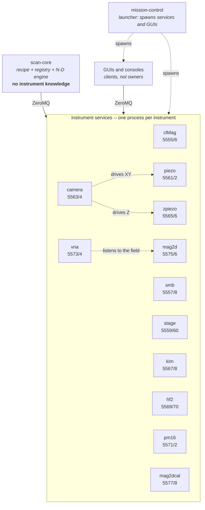
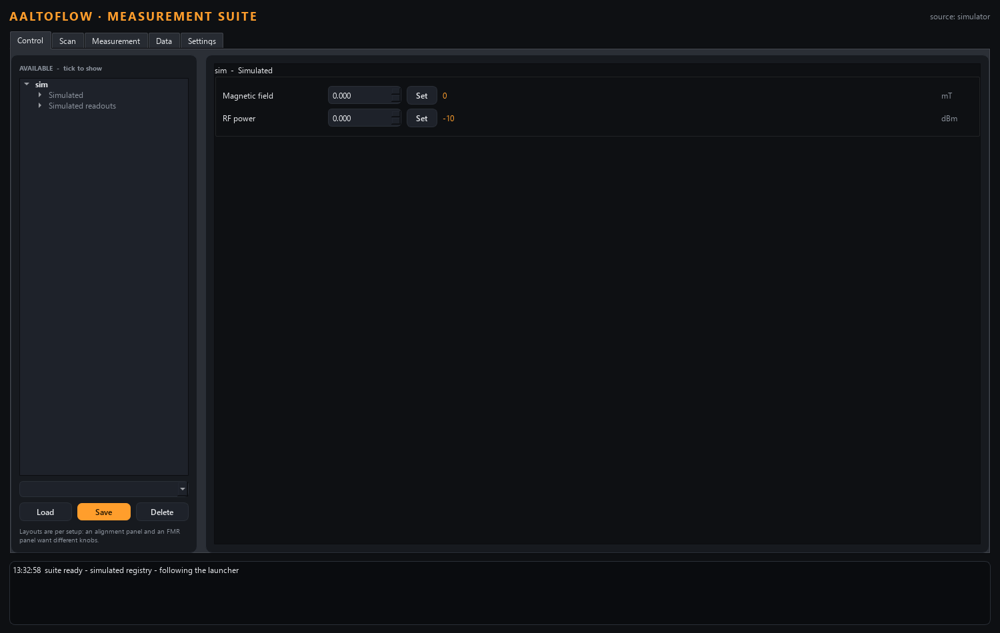
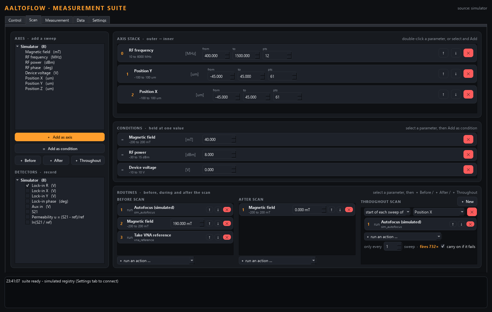
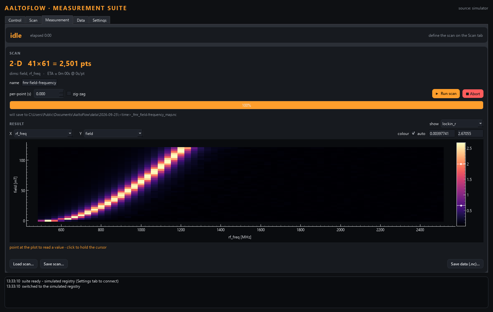
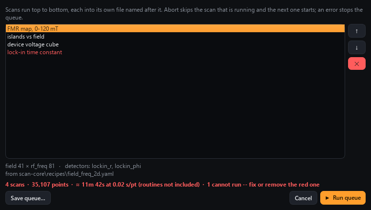
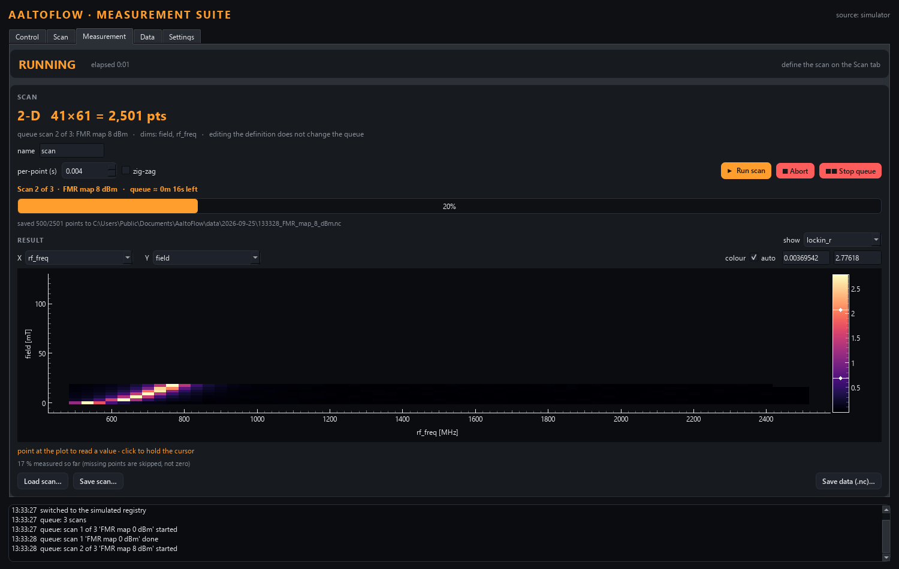
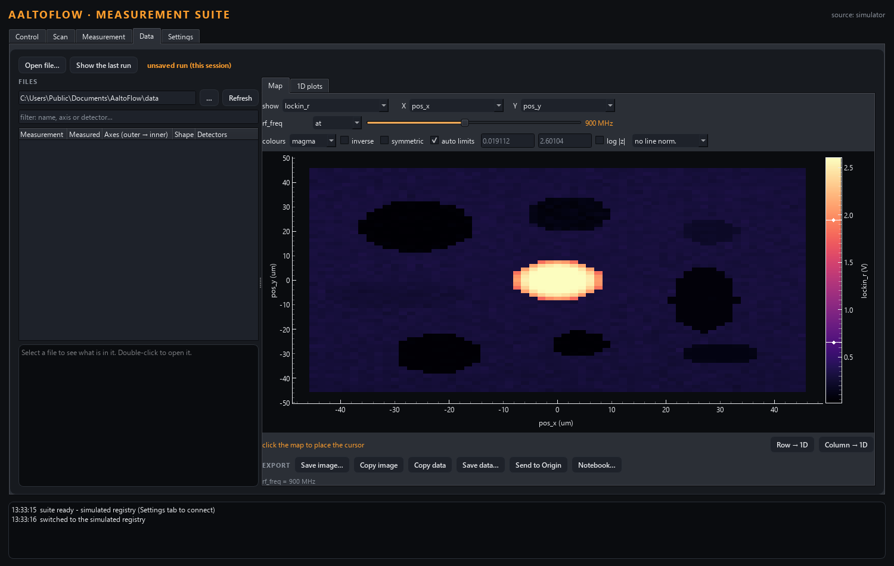
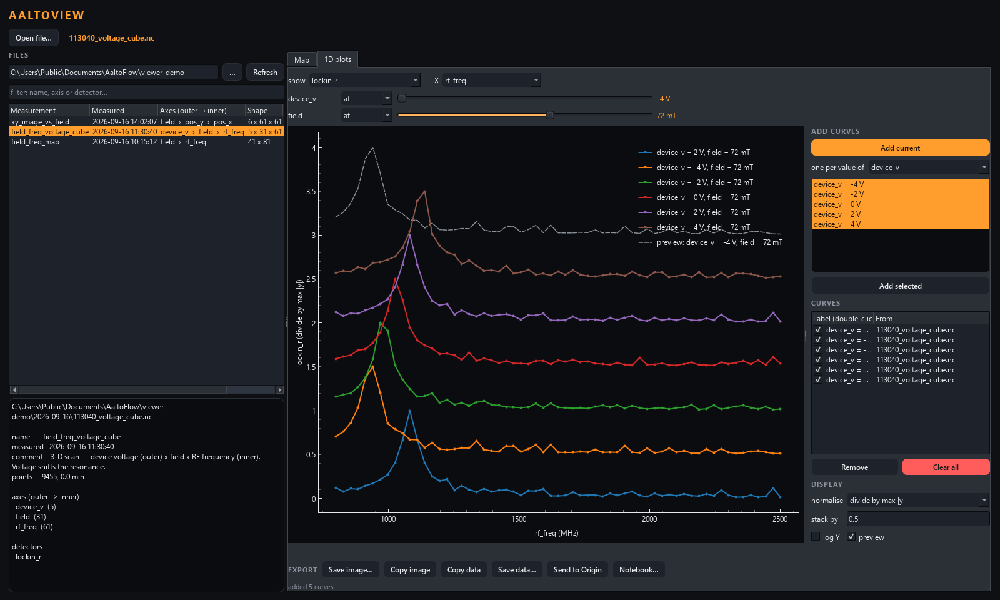
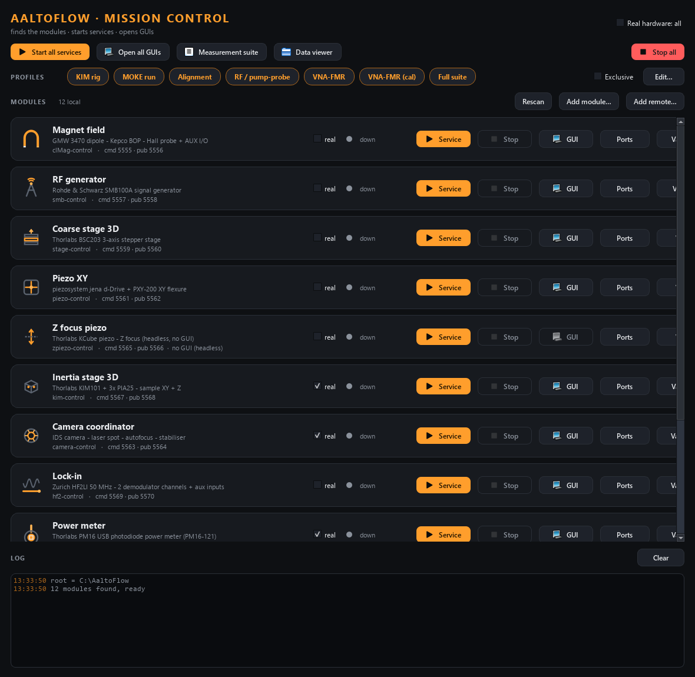
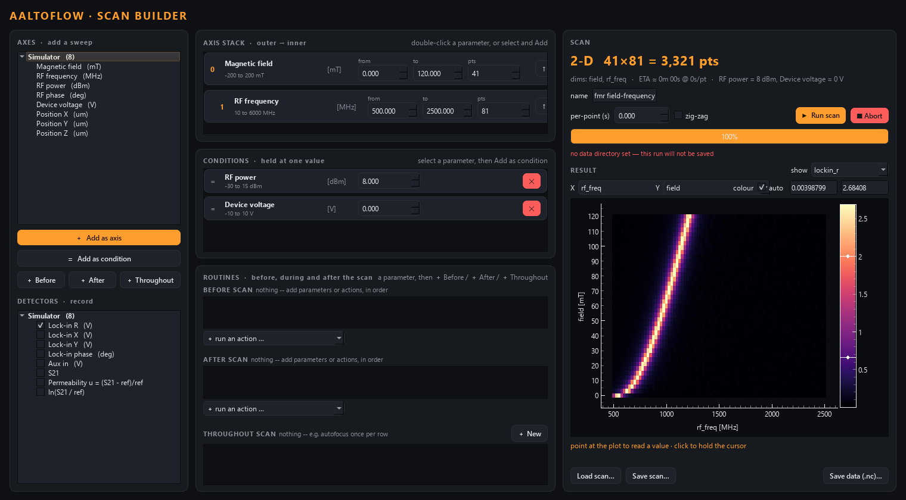

# AaltoFlow

[](https://doi.org/10.5281/zenodo.22959230)

**Lab automation built from independent instrument modules.** Every instrument
runs as its own small service with its own GUI; a launcher starts them, and one
scan engine drives any combination of them through N-dimensional measurements.
Nothing in the engine knows what a magnet or a lock-in is -- a new instrument is
a new folder, and it appears in the launcher, the control panel and the scan
builder by itself. The companion data viewer is
[AaltoView](https://github.com/FlashLukas/AaltoView).

*Aalto* is Finnish for "wave". AaltoFlow was born as the Python replacement of
the LabVIEW software of the TR-MOKE (time-resolved magneto-optical Kerr effect)
setup of the NanoSpin group, Aalto University, and was called TRMOKE until
2026-09-24. An installation can still say which setup it drives: Setup asks for a
**setup name** (e.g. "TR-MOKE"), and every window title leads with it.

The point of the rewrite is not a one-for-one port. It is to separate **the
measurement engine from the instruments**, so that arbitrary N-dimensional
acquisition is a generic capability rather than something hardcoded for one
experiment. The old `ControlTRMOKEV21setparam.vi` had a hard two-loop ceiling and
a fixed parameter set; adding one knob meant editing seven places. Here, adding a
knob means registering one `Parameter`.

> **Status: mostly simulation.** Every module runs, is tested and has a GUI.
> Hardware passes are under way on the lab PC: `pm16-control` (Thorlabs PM16
> power meter) was verified end to end on the real instrument on 2026-09-15.
> Elsewhere, every unverified hardware call is marked `# VERIFY`; each module's
> README records its own hardware status. See [Hardware passes](#hardware-passes).

## Architecture

Three layers, each of which can be run, tested and replaced on its own.



**1. Instrument services.** One process per instrument, and that process is the
single source of truth for it. Each speaks the same wire contract: ZeroMQ,
REQ/REP JSON for commands, PUB/SUB for telemetry. Commands are
*fire-and-forget* — a reply of `{"ok": true}` means *accepted*, not *done*; the
caller polls `status` for the effect. Every module has the same universal verbs
(`status`, `info`, `get_config`, `set_config`, `describe`, `shutdown`) plus one
verb per setter.

Because the transport is the network, a client does not care whether it runs on
the same PC or across the lab Ethernet — only the host changes. `camera-control`
demonstrates this: it owns no motion hardware at all and drives XY through
`piezo-control` and Z through `zpiezo-control` as an ordinary client.

**2. scan-core — the coordinator.** This is the generic part, and it contains no
TR-MOKE physics:

- **A scan is data.** A *recipe* is YAML: `fixed` values, an ordered list of
  `axes` (outer → inner, no length limit), `detectors`, and `hooks`. You can
  save it, diff it, version it and re-run it headless.
- **Every knob is a registered Parameter.** A `Settable` has limits, a blocking
  `set` and a `get`; a `Gettable` has a `get`. Adding an instrument means adding
  Parameters — they then appear in the builder and the engine with no other
  edits.
- **The engine is an odometer** over the compiled dimensions. It sets only the
  axes whose index changed, fires hooks, reads every detector, and returns an
  `xarray.Dataset` with named coordinates, units and the full recipe in its
  metadata, written to netCDF. 1-D and 5-D are the same code path.

Nothing in `recipe.py`, `registry.py` or `engine.py` knows what a magnet is, and
scan-core imports no instrument package at all: it reaches the services through
one generic ZeroMQ client, because they all speak the same contract. Connecting
an instrument is a declaration in `scan_core/lab.py` — which verb sets the knob,
which status field reads it back, and how you know it has arrived — not new
engine code.

**3. mission-control.** The launcher. It *finds* the modules (every folder with a
`module.toml`), starts their services, opens their GUIs, lets you change ports and
add services running on other PCs, and shows each module's variables as the
service reports them. It never imports the instrument packages; it only spawns
their scripts, so there is no version coupling. The measurement suite follows
what the launcher has.

## Adding a module

Nothing lists modules by hand. A folder with a `module.toml` (name, description,
icon, default ports, scripts) *is* a module, and the launcher, scan-core and the
tools all find it. The module's controls and measured variables are not in that
file: the running service reports them itself through `describe`.

```powershell
python tools/new_module.py vna --like smb --name "Network analyser" --description "R&S ZNB"
cd vna-control
uv sync --extra gui
uv run pytest -q                      # passes as generated
python ../tools/check_modules.py vna --live
```

`new_module.py` copies a working template under the new name and takes the next
free port pair. Then you replace its insides. Contract and walkthrough:
[INSTRUMENT_MODULE_GUIDE.md](INSTRUMENT_MODULE_GUIDE.md), sections 10 and 11.

## What it looks like

Everything below runs with no hardware attached -- against the simulator, or
against services running in simulation mode. The data in the screenshots is
simulated FMR from a **patterned sample**: discs and bars of different sizes,
each resonating at its own frequency because its shape anisotropy differs, on a
continuous film between them. That is not decoration -- a spatial map that
*changes* with frequency and field is what makes the difference between a viewer
that shows one picture and one that lets you move through a cube.

The **measurement suite** is the operator application: one window, five tabs.
Its Control tab is built entirely from what each module reports about itself,
so it knows nothing about magnets or piezo stages -- it asks, and lays out what
it is told:



Define a scan on the Scan tab: axes stacked outer to inner (indented by loop
depth, so which one is the slow one is visible rather than deduced), and
underneath them the **conditions** -- parameters held at a single value for the
whole run -- and the **routines** that run before, during and after it (set the
magnet to a reference field, take a VNA reference; autofocus at the start of
every row, or every 100 points; field back to 0 at the end). All of
it is saved with the definition and inside the measurement file, so a file says
what it was taken *under* and *how*, not only what was swept:



Then watch it run on the Measurement tab. Defining takes a minute; running takes
an hour, and they want different screens:



Several scans can run one after another. Select more than one definition in
**Load scan…** (recipes, measurement files, or a saved queue) and a dialog lets
you name them, put them in order and drop the ones you do not want. Every entry
is checked against the connected instruments first; one that names a module
that is not running is shown in red and the queue will not start until it is
fixed or removed:



While it runs the Measurement tab says which scan it is on and how long the rest
will take. Each scan goes into its own file. **Abort** skips to the next scan,
**Stop queue** ends the whole queue, and an error stops it too, since a module
that died would fail the next scan the same way:



A finished scan is a cube, and the Data tab shows it two dimensions at a time:
choose which dims are the image axes, and every dimension left over gets a
control of its own -- hold it at one value, or average over it. Below is a
frequency x Y x X scan of the array, held at 900 MHz: the film between the
elements is near its own resonance, so the pattern reads as dark elements on a
lit background, and the one element whose resonance sits at that frequency is
lit right through. Drag the frequency slider and a different element lights up.
The controls are built from the data, so a five-dimensional scan needs no new
code:



```bash
cd scan-core
uv run python apps/suite.py                          # simulator
uv run python apps/suite.py --modules clMag,smb      # live services
```

The Data tab is also a program of its own, the **data viewer** (the successor
of the LabVIEW AaltoView). It needs no instruments: it lists the data folder
newest first, draws maps with a cursor and row/column cuts, overlays 1-D curves
(from one file or several, normalised and stacked), and exports what is on
screen as a figure (PNG/PDF/SVG), as data (.dat/.csv, or the clipboard), into a
running **Origin** (worksheet or matrix, with a graph), or as a **Jupyter
notebook** that recomputes the view from the measurement files:



```bash
cd scan-core
uv sync --extra gui --extra origin                   # origin = the optional Origin push
uv run python apps/viewer.py [file.nc] [--folder D:\data]
```

The viewer is its own (private) repository,
[FlashLukas/AaltoView](https://github.com/FlashLukas/AaltoView), so
colleagues who only analyse data can install it without the instrument suite.
scan-core installs it as a dependency.

Mission Control starts every service and opens every GUI from one place:



The Scan Builder stacks axes outer-to-inner with no length limit, and runs the
engine against whichever registry it was given -- simulated here, real
instruments on the bench:



Each instrument has its own panel, shown in its own README:
[clMag](clMag-control/README.md) ·
[smb](smb-control/README.md) ·
[stage](stage-control/README.md) ·
[piezo](piezo-control/README.md) ·
[camera](camera-control/README.md) ·
[kim](kim-control/README.md) ·
[hf2](hf2-control/README.md) ·
[pm16](pm16-control/README.md) ·
[vna](vna-control/README.md) ·
[mag2d](mag2d-control/README.md) ·
[mag2dcal](mag2dcal-control/README.md) ·
[zpiezo](zpiezo-control/README.md) (headless -- a console, not a window).

They are rendered offscreen and reproducibly, so they do not go stale:

```bash
python tools/render_all.py            # refresh every panel in front-panels/
python tools/render_all.py clMag       # or just one
```

## The instruments

| # | project | package | cmd/pub | hardware |
|---|---------|---------|---------|----------|
| 0 | `clMag-control` | `clMag` | 5555/5556 | Kepco BOP + GMW 3470 dipole, Hall probe on NI USB-6259, plus AUX analog/digital I/O |
| 1 | `smb-control` | `smb` | 5557/5558 | Rohde & Schwarz SMB100A RF generator |
| 2 | `stage-control` | `stage` | 5559/5560 | Thorlabs BSC203, 3-axis coarse stepper stage |
| 3 | `piezo-control` | `piezo` | 5561/5562 | piezosystem jena d-Drive + PXY-200 XY flexure |
| 4 | `camera-control` | `camera` | 5563/5564 | IDS uEye+ U3-38J0XCP — spot/pattern tracking, stabilisation, autofocus |
| 5 | `zpiezo-control` | `zpiezo` | 5565/5566 | Thorlabs KCube piezo, Z focus (headless) |
| 6 | `kim-control` | `kim` | 5567/5568 | Thorlabs KIM101 + 3× PIA25 piezo-inertia stage |
| 7 | `hf2-control` | `hf2` | 5569/5570 | Zurich Instruments HF2LI 50 MHz lock-in — 2 demodulator channels + aux inputs |
| 8 | `pm16-control` | `pm16` | 5571/5572 | Thorlabs PM16 USB power meter (PM16-121) — **verified on hardware** |
| 9 | `vna-control` | `vna` | 5573/5574 | Keysight PNA-X N5222A (untested) **or** a simulated YIG film: S-parameters, reference, permeability u and ln(S/S_ref) |
| 10 | `mag2d-control` | `mag2d` | 5575/5576 | 2-axis vector electromagnet on an NI DAQ: field + angle, PI in mT, water-cooling interlock |
| 11 | `mag2dcal-control` | `mag2dcal` | 5577/5578 | the same magnet, controlled the way the 1-axis one is: measured B(V) calibration, PI trim, freeze, long-term stabilizer |

Instrument *n* gets `cmd = 5555 + 2n` and `pub = cmd + 1` by default, declared in
its `module.toml`; the launcher can change a module's ports on one PC.

## Quick start

Requires [uv](https://docs.astral.sh/uv/) and Python ≥ 3.11. Everything runs in
simulation, so you need no hardware and no vendor drivers.

```powershell
# the whole suite from one dashboard
cd mission-control
uv run python mission_control.py
```

Or drive one instrument on its own:

```powershell
cd clMag-control
uv sync --extra gui
uv run scripts/run_service.py                      # add --real for hardware
uv run scripts/run_gui.py --connect localhost      # add --theme light
uv run scripts/magnet_console.py --connect localhost
```

A GUI started **without** `--connect` runs its own private local simulation. To
see the state shared with the service, start the service and connect to it.

And the scan engine:

```powershell
cd scan-core
uv sync --extra gui
uv run python run_demo.py            # 2-D, 3-D and XY-raster scans -> out/*.nc
uv run python apps/scan_builder.py
```

## Installing on a lab PC

The quick start above assumes a developer's machine — git, `uv`, a terminal. For
a PC that only has to *run* the experiment there is a `Setup.exe`, built from
[`installer/`](installer/README.md):

```powershell
powershell -ExecutionPolicy Bypass -File installer\build_installer.ps1
```

Out comes `installer\dist\AaltoFlow-Setup-<date>-<commit>.exe`. Whoever runs it
ticks the modules that PC needs; each lands as a folder with its own `.venv`,
built from that module's committed `uv.lock`, plus a private `uv.exe` — so the
target machine needs neither Python nor uv beforehand. It installs per user, so
no admin rights.

Two things keep the installer from drifting away from the suite:

- **The checkbox list is generated from the `module.toml` files**, not written by
  hand — the same manifests the launcher discovers modules from. Adding a module
  needs no change in `installer/`.
- **It builds from `git archive HEAD`**, not the working tree, so a Setup.exe
  names the commit it carries. Commit first; the script warns if you did not.

Copying files works offline, but building the environments does not (`uv sync`
fetches the interpreter and the packages). On a PC where that is blocked, untick
*"Build the Python environments now"* and run **Start menu ▸ AaltoFlow ▸ Rebuild
Python environments** later from a network that works.

## Tests

All 875 tests run offline — no hardware, no network beyond localhost, GUI tests
rendered offscreen.

```powershell
cd <project>
uv run pytest -q
```

| project | tests | | project | tests |
|---|---|---|---|---|
| clMag-control | 22 | | hf2-control | 52 |
| smb-control | 29 | | pm16-control | 44 |
| stage-control | 50 | | vna-control | 96 |
| piezo-control | 37 | | scan-core | 180 |
| camera-control | 97 | | mission-control | 8 |
| zpiezo-control | 14 | | suite-common | 19 |
| kim-control | 85 | | mag2d-control | 46 |
| | | | mag2dcal-control | 96 |
| | | | **total** | **875** |

Beyond unit tests, `python tools/check_modules.py --live` starts every module's
service on scratch ports and checks it against the module contract. The data
viewer's 42 tests live in its own repository.

`scan-core` is tested against a fake service that speaks the wire contract, so it
needs no instrument package installed.

## Hardware passes

Per module, on the lab PC: uncomment the
vendor dependency in `pyproject.toml`, `uv sync`, run the service with `--real`,
exercise it from the console before the GUI, and work through every `# VERIFY`.
Keep the simulation path working. The per-module checklists are in
[`docs/DEVELOPER_NOTES.md`](docs/DEVELOPER_NOTES.md) section 11.

## Repository layout

```
docs/DEVELOPER_NOTES.md      architecture, wire contract, conventions, gotchas
INSTRUMENT_MODULE_GUIDE.md   the blueprint for building a new instrument module
<instrument>-control/        eight instrument modules, one uv project each (each with module.toml)
suite-common/                module discovery, shared by the launcher, scan-core and the tools
scan-core/                   the N-D scan engine, Scan Builder and measurement suite
                             (the data viewer comes from the aaltoview repo)
mission-control/             the launcher
installer/                   Setup.exe: the wizard, the component generator, the post-install step
front-panels/                reference renders of each GUI
spikes/                      earlier QCoDeS experiments, kept as reference
tools/                       new_module, check_modules, panel renderer, lab deploy script
suite_local.json             THIS PC's ports / real flags / remote services (not in git)
```

Each project's own README describes its verbs, configuration and hardware status.

## Note on virtual environments

`uv` and OneDrive fight over `.venv`, which shows up as
`Access is denied (os error 5)`. Use `dev.ps1` (in `clMag-control`, copyable
anywhere) to put the environment in `%LOCALAPPDATA%\uv-venvs\<project>` for that
shell only. Never set `UV_PROJECT_ENVIRONMENT` globally to a single path — every
project then shares and corrupts one environment.

## How to cite

If you publish scientific work with data measured or processed using AaltoFlow,
we would be grateful for a citation. The repository's [`CITATION.cff`](CITATION.cff)
has the details (GitHub's "Cite this repository" button gives it as BibTeX or
APA); in short:

> L. Flajšman, *AaltoFlow: lab automation built from independent instrument
> modules*, NanoSpin group, Aalto University, https://github.com/FlashLukas/AaltoFlow,
> doi:10.5281/zenodo.22959230

DOI: [10.5281/zenodo.22959230](https://doi.org/10.5281/zenodo.22959230) (always the latest version; Zenodo lists the DOI of each
release too). We are also happy to
hear what AaltoFlow was used for -- open an issue and tell us.

## Credits and license

AaltoFlow was developed by Lukáš Flajšman in the NanoSpin group, Aalto
University. The copyright is held by Aalto University.

MIT — see [LICENSE](LICENSE). One optional dependency is GPL-3.0: kim-control's
hardware driver uses [pylablib](https://github.com/AlexShkarin/pyLabLib), so
kim-control as distributed together with pylablib falls under the GPL-3.0; the
rest of the suite does not depend on it.
