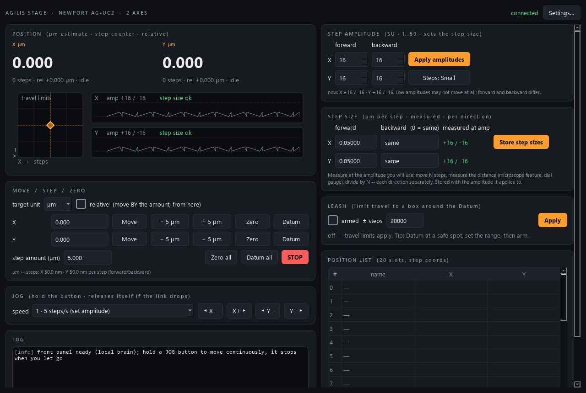

# agilis-control

Control module for a **Newport Agilis** 2-axis stage — two slip-stick
(stick-slip) piezo actuators driven by one **AG-UC2** controller over USB —
built to the AaltoFlow instrument blueprint (`INSTRUMENT_MODULE_GUIDE.md`). It
is a *set-and-forget* module: you ask for N steps and the AG-UC2 makes them;
there is no control loop.

It uses **command port 5595** and **status port 5596** (declared in
`module.toml`; the launcher can override them per PC).



*The simulator at its start state. Left: the position estimate, the XY step map
and the two drive waveforms (tooth height = step amplitude). Right: the step
amplitude per direction, the measured step size with the amplitude it was
measured at, the leash and the position list.*

## The one idea to understand: steps are counted, micrometres are measured

An Agilis actuator moves in discrete **steps**: the AG-UC2 sends a sawtooth,
the slow ramp drags the stage along by friction, the fast edge lets the piezo
snap back while the stage stays. There is no encoder, so the only position the
controller knows is its **step counter** (forward minus backward steps).

How far one step goes is set by the **step amplitude** (1–50, power-up default
16), and the manual is explicit that the relation is **not linear**, that too
small an amplitude does not move at all, and that **forward and backward steps
differ**. So this module:

- keeps a **measured step size per axis and per direction**, and records the
  amplitude it was measured at. Change the amplitude and status says
  `cal_valid: false` (the front panel turns the tag amber) until you measure
  again — the µm readings are then approximate, not silently wrong;
- books every counter change as forward or backward steps, so the position
  estimate is `forward steps × forward size − backward steps × backward size`.
  1000 steps out and 1000 back is counter 0, but not position 0.
- counts the steps made at an amplitude the step size was NOT measured at --
  after an amplitude change, or during a jog at speed 2 or 3, which always
  steps at the maximum amplitude 50. Those errors stay in the estimate, so
  status says `estimate_ok: false` (and `uncal_steps`) until the next Datum.

Default step size: 0.05 µm (the AG-LS25 datasheet's minimum incremental
motion) at amplitude 16. **Measure your own**: move N steps, measure the
distance, divide by N — each direction separately.

## What it does

- Drive 2 axes (X, Y) = the AG-UC2's axis 1 and 2 (swappable in Settings).
- Move in **steps** (`move_to_step`, `move_steps`) or **micrometres**
  (`move_to_um`, `move_relative_um`), each direction with its own step size.
- **Continuous jog** at one of the controller's four speeds (5 / 100 / 666 /
  1700 steps/s; 100 and 1700 at maximum amplitude). Hold the button: the jog
  is a **dead-man** — it ends by itself 1.5 s after the last jog command, so a
  crashed client cannot leave the stage driving into its end stop.
- **Step amplitude** per axis and direction, and a **Steps: Large / Small**
  preset (all to 50 / all to 16).
- Two zeros: **Datum** resets the controller's step counter (`ZP`); **Zero**
  sets a display origin for the relative read-out only.
- A **travel leash** (± steps around the datum) that replaces the travel limits
  when armed; the brain also **stops a jog** that reaches it.
- **Limit-switch** indicator (stages that have one, e.g. AG-LS25).
- A 20-slot **position list** in step coordinates, save/load JSON.
- **Fly-scan stream** of both positions for scan-core (`stream_*` verbs).
- Safe by construction: on start the controller is put in remote mode and
  **both axes are stopped** (a jog left by a crashed session ends); on
  shutdown both axes stop and the push buttons are handed back (`ML`).

## Architecture (same as every module in the suite)

```
backends/  base.py (Protocol) · sim.py (default, no hardware) · ag_uc2.py (real, lazy pyserial)
agilis.py  the "brain": poll thread, step tallies -> um estimate, clamps, jog dead-man
net/       protocol.py · service.py · client.py · describe.py
apps/      theme.py · gui.py (MainWindow + StickSlipIndicator) · settings_dialog.py
scripts/   run_service.py · run_gui.py · agilis_console.py · smoke_test.py
```

The brain's **poll thread** reads the counters, axis states and limit switches
(20 Hz) and rebuilds the status snapshot; `status()` never touches the
hardware. Every serial exchange happens under one lock.

## Install and run

From `agilis-control\` in PowerShell (`dev.ps1` keeps the venv outside OneDrive):

```powershell
.\dev.ps1 sync --extra gui --extra real      # `real` = pyserial, for the AG-UC2
.\dev.ps1 run pytest -q
.\dev.ps1 run python scripts\smoke_test.py

.\dev.ps1 run python scripts\run_service.py                 # simulator
.\dev.ps1 run python scripts\run_service.py --real --com COM5   # the AG-UC2
.\dev.ps1 run python scripts\run_gui.py --connect localhost
.\dev.ps1 run python scripts\agilis_console.py
```

## Remote-control quick reference

JSON over REQ/REP on 5595; every reply is `{"ok": true, ...}` or
`{"ok": false, "error": ...}` and means *accepted*, not *done* — watch
`moving` in status. Axes are `"X"/"Y"` or `0/1`.

| intent | command |
|---|---|
| read all state | `{"cmd":"status"}` → `position_steps`, `position_um`, `target_um`, `moving`, `amplitude_fwd`, `cal_valid`, `estimate_ok`, … |
| absolute step target | `{"cmd":"move_to_step","axis":"X","position":5000}` |
| step by N from here | `{"cmd":"move_steps","axis":"X","delta":200}` |
| absolute µm (estimate) | `{"cmd":"move_to_um","axis":"X","position":120.0}` |
| relative µm | `{"cmd":"move_relative_um","axis":"X","delta":10.0}` |
| continuous jog (repeat to keep alive) | `{"cmd":"jog","axis":"Y","speed":-1}` (−4…4, 0 = stop) |
| step amplitude | `{"cmd":"set_amplitude","axis":"X","value":30,"direction":-1}` (0 = both) |
| amplitude preset | `{"cmd":"set_step_size","large":true}` |
| store a measured step size | `{"cmd":"set_calibration","axis":"X","value":0.048,"direction":1}` |
| leash | `{"cmd":"set_leash","enabled":true,"leash_steps":20000}` |
| datum / display zero | `{"cmd":"zero_counter","axis":"X"}` · `set_zero` · `clear_zero` |
| stop | `{"cmd":"stop"}` (all) or `{"axis":"Y"}` |
| position list | `store_position` / `goto_position` / `save_positions` / `load_positions` |
| fly-scan stream | `stream_start` / `stream_read` / `stream_stop` → `{t, values: {x, y}}` |

`describe` offers `position_x/y` (µm, settle `adopt_then_flag` on `target_um`),
the four amplitudes, the Large/Small preset, step-size and limit indicators, and
the actions `datum_x`, `datum_y`, `stop` (usable in scan routines).

## Hardware notes (before the first real run)

`backends/ag_uc2.py` is the **only** file that talks to the controller
(pyserial, imported inside `open()`), written from the Newport Agilis manual
A824E. Every command is marked `# VERIFY`. On the lab PC:

1. Install Newport's AG-UC2 software (it brings the USB driver), find the COM
   port in Device Manager, set `hardware.port` (Settings) or pass `--com`.
2. Check the reply formats of `TP`, `TS`, `TE`, `PH`, `SU+?` in a terminal
   (921600 baud, CR LF) — the driver parses the last integer in each line.
3. Time a 2000-step `PR` to learn the stepping rate (the simulator assumes 666
   steps/s) and check `TS` reports 1 right after `PR`.
4. Measure the step size of each axis and direction at the amplitude you will
   use, and store it (STEP SIZE card or `set_calibration`).
