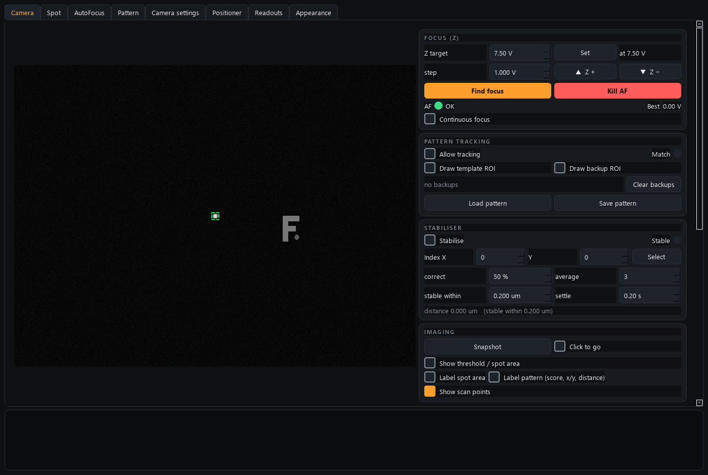

# camera-control

The **vision brain + coordinator** of the AaltoFlow instrument suite — the
Python port of the LabVIEW `CameraTRMOKEV3p6.vi`.

Where the other modules each control one instrument, this one reads a microscope
camera and *ties the rig together*. Every frame it locates a **fixed laser spot**
(threshold + centre of mass) and a **template pattern** (pattern matching), pins a
grid of **scanning points** to the template, and then closes two feedback loops by
**moving the sample**:



*The simulated scene: the laser spot (red crosshair), the tracked template, and the scan-area rectangle pinned to it. Focus (Z) is driven through zpiezo-control and XY through piezo-control -- this module owns no motion hardware.*

- **Stabiliser** — nulls the distance between the laser spot and a chosen scanning
  point by nudging the XY stage (drift compensation / "put this scan point under
  the laser"). Ports `Stabilization_StableAtPixelOrCorrectV2.vi`.
- **Autofocus / continuous focus** — sweeps Z, scores focus (spot area / edge
  sharpness / FFT), and parks Z at best focus; can also hold focus continuously.

It is a **client of the piezo-control service** for XY motion (ports 5561/5562) and
**owns the Z focus piezo** directly. As the 5th instrument it serves its own
commands on **5563** and status on **5564**, with the same ZeroMQ protocol as every
other module, so a coordinator can drive it too.

Templates save/load as annotated PNGs (the image *plus* embedded JSON metadata:
scanning geometry, pixel size, objective, template↔array offset). Pixel size is
calibrated per microscope objective from `objectives.ini`.

## Architecture (same shape as the other modules)

```
camera/
  vision.py       pure OpenCV/NumPy/SciPy engine (spot, match, focus, geometry)
  camera.py       the brain: engine thread + stabiliser + autofocus + verbs
  config.py       dataclass config groups + INI (mirrors the LabVIEW tabs)
  objectives.py   objective -> pixel-size table
  template_io.py  save/load pattern PNG with metadata
  backends/       base.py Protocols; sim.py (closed-loop scene); genicam.py,
                  kcube.py, remote_xy.py (real drivers, lazy-imported)
  net/            protocol.py (ports/helpers), service.py, client.py
  apps/           gui.py (6-tab window) + camera_view.py (live view + overlays)
scripts/          run_service.py, run_gui.py, camera_console.py, smoke_test.py
tests/            config, vision, template_io, camera, net, gui
```

The **simulator** renders a synthetic scene that *responds to motion* (the sample +
template move with the stage, the spot blurs off-focus), so the full stabiliser +
autofocus loop runs and is tested with **no hardware**.

## Running (with `uv`)

```powershell
uv sync --extra gui         # install deps incl. PySide6 for the GUI

# Terminal 1 — the service (simulated closed-loop scene by default)
uv run scripts/run_service.py

# Terminal 2 — the GUI (local sim, or --connect HOST for a remote service)
uv run scripts/run_gui.py
# or drive the running service:
uv run scripts/run_gui.py --connect 127.0.0.1

# Poke the wire by hand (no package import needed):
uv run scripts/camera_console.py status
uv run scripts/camera_console.py autofocus

# Instant offline confidence check:
uv run scripts/smoke_test.py
uv run pytest -q
```

Run the GUI *without* a separate service (`run_gui.py` with no `--connect`) and it
builds the simulated brain in-process.

## Using it (typical flow)

1. Pick your objective (Camera settings tab) so the pixel size is right.
2. Tick **Draw template ROI** and drag a box round the feature to track → the
   scanning array is pinned to it (its centre defaults onto the laser spot).
3. Tick **Allow tracking** — the template box + array follow the sample live.
4. Define the scanning grid (Define scanning tab: points, pitch, angle) and pick a
   **selected index**.
5. Tick **Stabilise** → the stage moves so the selected scan point sits under the
   laser and the **Stable?** light goes green.
6. **Find focus** runs an autofocus sweep; **Continuous focus** holds it.
7. **Save pattern** writes the annotated PNG; **Load pattern** restores everything.

## External control (from another program / coordinator)

Every action is a ZeroMQ command (see `scripts/camera_console.py` for the verbs):
`snapshot`, `autofocus`, `set_tracking`, `set_stabilize`, `set_selected_index`,
`move_xy` / `read_xy`, `set_z` / `read_z`, `read_position_px` / `set_position_px`,
`load_pattern` / `save_pattern`, `set_objective`, `get_frame`, plus the universal
`status` / `info` / `get_config` / `set_config`.

## Hardware pass (at the lab PC — later session)

The simulator needs no hardware. To go live:

1. **Camera (IDS U3-38J0XCP)** — install **IDS peak**, then
   `pip install ids-peak ids-peak-ipl` (uncomment in `pyproject.toml`). Confirm
   the camera in IDS peak Cockpit first. `camera.driver = "ids"` (default) uses
   `backends/ids.py`; run the service with `--real`. The GUI's **Camera settings
   → Camera parameters (live)** panel then lists the camera's node-map features
   (exposure, gain, gamma, frame rate, pixel format, ROI, …) to control live.
   (Alternatively `camera.driver = "genicam"` uses the generic Harvester path —
   `pip install harvesters` and set the GenTL `.cti` in `backends/genicam.py`.)
2. **Z focus** — install Thorlabs Kinesis + `pip install pylablib` (uncomment),
   set the KCube serial in config, verify the volt↔device-unit mapping in
   `backends/kcube.py`.
3. **XY** — start the **piezo-control** service; set `hardware.use_remote_xy = true`
   and the piezo host/port in config. `backends/remote_xy.py` drives it over ZeroMQ.

## Troubleshooting

**OneDrive `.venv` gotcha** (this project lives in OneDrive): OneDrive locks files
inside `.venv` as it syncs and `uv` dies with *"Access is denied (os error 5)"*.
Put the venv OFF OneDrive, once per machine:

```powershell
[Environment]::SetEnvironmentVariable('UV_PROJECT_ENVIRONMENT', "$env:LOCALAPPDATA\uv-venvs\camera-control", 'User')
$env:UV_PROJECT_ENVIRONMENT = "$env:LOCALAPPDATA\uv-venvs\camera-control"
uv sync --extra gui
```
