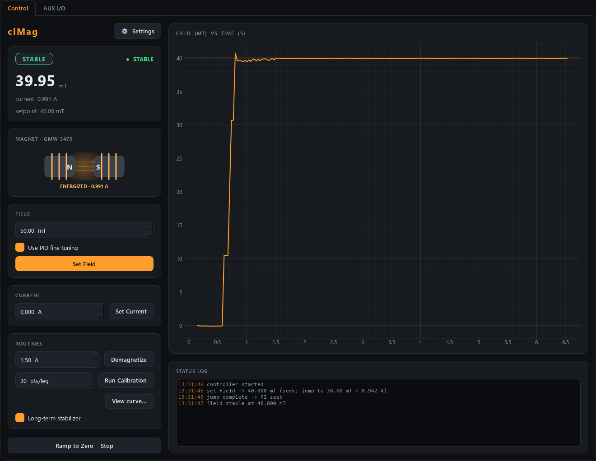

# clMag-control

Python port of a LabVIEW magnetic-field controller: a **Kepco BOP** power
supply (constant-current, over GPIB) drives an electromagnet, and an
**NI USB-6259** DAQ card reads a **Hall probe** to measure the field.



*Seeking +40 mT on the simulator: the live plot shows the calibration jump followed by the one-directional PI seek, the lamp reads STABLE, and the GMW 3470 indicator is energised at 0.991 A.*

It runs entirely against a **simulator** by default, so you can develop and
test on any machine; the real hardware path is written but not yet exercised.
(This paragraph used to say the module was headless with no GUI and no
networking -- that has not been true since the GUI, the ZeroMQ service and the
AUX I/O subsystem landed.)

## What's here so far (Sessions 2-3)

```
clMag-control/
  pyproject.toml            # project + dependency manifest
  src/clMag/
    config.py               # all tunable parameters, save/load to a .ini file
    calibration.py          # the measured B(I) curve: build, average, interpolate
    ramp.py                 # the ramper: current never jumps, moves in steps
    pid.py                  # parallel-form PI seek engine (one-direction clamp)
    acquisition.py          # free-running measurement thread (fast/precise profiles)
    controller.py           # the state machine: IDLE/RAMPING/SEEK/STABLE/HOLD/DEMAG/CALIBRATE
    sim_system.py           # build a controller wired to the simulator (no Qt)
    apps/
      theme.py              # dark theme (amber accent): palette + Qt stylesheet
      gui.py                # PySide6 + pyqtgraph control window (+ magnet indicator)
      settings_dialog.py    # tabbed settings: hardware, Hall probe, control, files
    net/
      protocol.py           # the wire protocol (shared by service + client)
      service.py            # expose the controller over ZeroMQ (PUB status + REP cmd)
      client.py             # ClMagClient: a Controller-compatible remote facade
    backends/
      base.py               # the hardware interface (CurrentSource / FieldSensor)
      sim.py                # a simulated Kepco + Hall probe (realistic physics)
  scripts/
    smoke_test.py           # Session 2: proves config + calibration fit together
    session3_demo.py        # Session 3: full controller drives a headless "experiment"
    run_gui.py              # Session 4: launch the dark-theme GUI (local or --connect)
    run_service.py          # Session 5: run the control service
    client_demo.py          # Session 5: drive the service over the network, headless
    magnet_console.py       # external test console (raw protocol, pyzmq only)
  tests/                    # pytest unit + integration tests
```

## Running it (first time on a new machine)

You need **uv**, a fast Python project/enviroment manager. Install it once:

```powershell
powershell -ExecutionPolicy ByPass -c "irm https://astral.sh/uv/install.ps1 | iex"
```

Close and reopen PowerShell so it picks up `uv`. Then, from this folder:

```powershell
uv sync                       # creates a private .venv and installs deps
uv run scripts/smoke_test.py  # runs the smoke test inside that .venv
```

You should see four checks pass and end with `SMOKE TEST PASSED`. Then try the
Session 3 controller and the test suite:

```powershell
uv run scripts/session3_demo.py    # watch it seek to +50 mT, -20 mT, then demag
uv run pytest                      # 9 tests: ramp, PI, and the full controller
```

In the demo, watch the state column move IDLE -> RAMPING -> SEEK -> STABLE and
the field lock in within 0.1 mT. The seek "freezes" the current once close, so
the magnet's hysteresis stops wobbling the reading -- that is why it can hold a
tolerance tighter than the noise.

### The GUI (Session 4)

```powershell
uv sync --extra gui        # one-time: installs PySide6 + pyqtgraph (~100 MB)
uv run scripts/run_gui.py
```

Two tabs. **Control** — a live field plot with the setpoint and its tolerance
band, big readouts (state, field, current, a STABLE lamp), a **GMW 3470 magnet
indicator that glows amber when the coil is energized** (with N/S polarity and
current), and the full control surface -- set field (with PID
toggle), set current, demagnetise, run a calibration, and toggle the long-term
stabilizer -- plus a status log that flags over-limit faults in red. **AUX I/O** —
the DAQ's other BNCs: 4 analog outputs (±10 V), 3 single-value analog inputs
(±10 V, RSE, ai1–ai3; ai0 is the Hall probe), and 3 digital outputs, all live
and remote-controllable. The gear button opens **Settings** (Kepco address + DAQ, Hall-probe calibration, ramp /
PID / limits, config + calibration file load/save, and an **Appearance** tab to pick a
**light or dark** theme). The theme applies on the next launch (saved to config), or
override it once with `uv run scripts/run_gui.py --theme light`. Closing the window
ramps the supply to zero.

### Running over the network (Session 5)

The controller can run as a **service** that other machines drive over ZeroMQ --
identical code on localhost or across the lab Ethernet, because the service
binds to `0.0.0.0` and only the client's address changes.

```powershell
# on the PC wired to the magnet:
uv run scripts/run_service.py                       # commands :5555, status :5556

# from anywhere (same PC, or another machine on the network):
uv run scripts/run_gui.py --connect 192.168.1.42    # the GUI, driving the remote magnet
uv run scripts/client_demo.py --connect 192.168.1.42 # or headless
```

The service PUBlishes status at 10 Hz and forwards controller events; the client
SUBscribes and sends commands on a REQ/REP socket. In `--connect` mode the GUI is
a full client: Settings (Hall calibration, PID, hardware, limits) and the
calibration curve are fetched from and pushed to the service over the socket via
`get_config`/`set_config` and `get_calibration`/`set_calibration`, so you can
retune and view the remote magnet from anywhere.

**Testing the link by hand.** `magnet_console.py` is a tiny console that speaks
the raw protocol (only `pyzmq`, no `clMag` imports -- copy it anywhere):

```powershell
uv run scripts/magnet_console.py --connect localhost
    magnet> field 50
    magnet> watch 5          # stream the live status + events
    magnet> status
    magnet> ao 0 2.5         # analog out ao0 -> 2.5 V
    magnet> ai 1             # read analog in ai1
    magnet> do 0 on          # digital out line0 high
    magnet> current 0
    magnet> quit
```

Or one command at a time for scripting: `uv run scripts/magnet_console.py field 50`.

- `uv sync` reads `pyproject.toml`, builds a hidden `.venv/` folder (a private
  Python + libraries just for this project), and installs everything into it.
- `uv run <cmd>` runs a command *inside* that environment, so you never touch
  your system Python. This is the whole "virtual environment" idea from the
  LabVIEW-vs-Python transition: one isolated toolbox per project.

## Hardware dependencies (later)

`pyvisa` (Kepco) and `nidaqmx` (DAQ) are listed but **commented out** in
`pyproject.toml` so the project installs anywhere. Uncomment them on the lab PC
when you connect real instruments.

## Troubleshooting

### "Access is denied … failed to remove directory …\.venv\…dist-info" (Windows + OneDrive)

The project lives in a OneDrive folder, and by default `uv` puts the virtual
environment (`.venv`) right next to the code. OneDrive then tries to sync the
venv and locks its files; when `uv` rebuilds the package after a code change it
can't replace the locked files and stops with `Access is denied (os error 5)`.

Fix — keep the environment **outside** OneDrive. Once, in PowerShell (close any
open clMag window first, since a running app also locks the venv):

```powershell
[Environment]::SetEnvironmentVariable('UV_PROJECT_ENVIRONMENT', "$env:LOCALAPPDATA\uv-venvs\clMag-control", 'User')
$env:UV_PROJECT_ENVIRONMENT = "$env:LOCALAPPDATA\uv-venvs\clMag-control"
uv sync --extra gui
uv run scripts/run_gui.py
```

The venv now lives under `AppData\Local` (never synced). Delete the old one to
reclaim space (pause OneDrive / close apps first): `Remove-Item -Recurse -Force .\.venv`.
This variable points every uv project at that one folder — fine while
clMag-control is your only uv project; give a second project its own path.

## Note on PID gains

The PID defaults in `config.py` (Kc 0.002 A/mT, Ti 5 s) are the starting point
carried over from the LabVIEW system. The demo and tests use sim-tuned values
(Kc 0.01, Ti 0.15) that suit the *simulated* magnet. Any PI must be re-tuned
against the real plant -- these are not magic numbers.

## Roadmap

- Session 2 (done): config, calibration, simulated hardware, smoke test.
- Session 3 (done): ramper, PI, acquisition thread, state machine. Still headless.
- Session 4 (done): dark GUI + Settings dialog + GMW 3470 magnet indicator.
- Session 5 (done): ZeroMQ service + client; GUI drives it locally or remotely.
- **Session 6 (next):** a second instrument + the synchronization contract
  between modules.
- Session 7: build a Windows .exe with PyInstaller. Session 8: real hardware
  backends (pyvisa / nidaqmx) and two-machine deployment.
