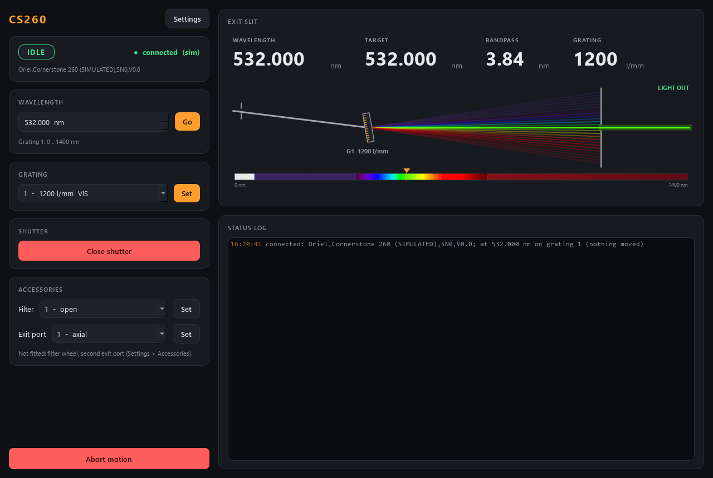

# cs260-control

Control for a **Newport (Oriel) Cornerstone 260** 1/4 m motorised grating
monochromator: set the **wavelength** (the scan axis), swap **gratings**, open
and close the built-in **shutter**, and -- when fitted -- move the **filter
wheel** (order sorting) and flip the **exit port** mirror. Over GPIB, or fully
simulated with no hardware.



*Simulator at 532 nm on the 1200 l/mm grating, shutter open. The dispersion
indicator: white light enters, the grating fans it out, and only the selected
colour passes the exit slit; the ruler below is the grating's whole range.*

It has the shape of every AaltoFlow module: a thin hardware backend behind a
`Protocol` interface, a dataclass `Config` with plain-text save/load, and a
ZeroMQ service + client so a GUI, a console or scan-core can drive it over
localhost or the lab network.

The one thing that makes it more than set-and-forget: **moves take time**. The
drive slews at ~200 nm/s, a grating swap takes seconds. A reply means
*accepted*, not *arrived*; the status publishes `target_nm` together with
`moving`, and a scan waits until the service shows **its** target and
`moving` is false (`adopt_then_flag` in `describe`).

## Ports

| service            | commands (REP) | status (PUB) |
|--------------------|----------------|--------------|
| **monochromator**  | **5601**       | **5602**     |

## Layout

```
src/cs260/
  config.py              gratings / accessories / shutter / motion / optics / limits / hardware / sim / ui
  backends/
    base.py              MonochromatorBackend Protocol + MonoState -- the interface
    sim.py               SimulatedCS260 -- moves take slew time, grating swap parks like the real one
    cornerstone.py       CornerstoneGPIB -- the real box over GPIB (lazy pyvisa import, # VERIFY)
  monochromator.py       Monochromator -- clamps, sequences, decides "arrived"; one worker thread
  sim_system.py          build_sim_system(cfg) -- the simulator wired into a Monochromator
  net/
    protocol.py          wire shapes + default ports (5601/5602)
    describe.py          the self-description (live wavelength range per grating)
    service.py           Cs260Service -- owns the brain, serves it over ZeroMQ
    client.py            Cs260Client -- Monochromator-compatible facade over the socket
  apps/                  gui.py (DispersionIndicator), settings_dialog.py, theme.py
scripts/
  run_service.py         start the service (simulated by default, --real for GPIB)
  run_gui.py             the GUI (local simulator, or --connect HOST)
  mono_console.py        standalone raw-protocol console (only needs pyzmq)
  smoke_test.py          quick offline check
tests/                   pytest: config, brain (fake clock), describe, network, GUI, real backend vs a fake VISA
```

## Verbs

`set_wavelength{wavelength_nm}` (reply carries the accepted, possibly clamped
`target_nm`), `set_grating{grating}`, `set_shutter{open}`, `set_filter{filter}`,
`set_port{port}`, `step{steps}`, `abort`, `calibrate{wavelength_nm}` (danger:
rewrites the stored offset) + the universal `status`, `info`, `get_config`,
`set_config`, `describe`, `shutdown`.

What a grating change does: close the shutter (the drive sweeps past zero
order -- white light), `GRAT n`, go back to the wavelength you had (clamped to
the new grating's range), re-open the shutter. The wavelength range in
`describe` follows the grating, and `describe_rev` in the status says so.

`set_shutter` and `abort` jump the move queue: they are accepted at once and
sent at the worker's next poll, so they never wait behind a slow GPIB read.
Watch `shutter_open` / `moving` in the status for the effect.

## Commands used (real backend, Cornerstone 260 manual ch. 16)

| function      | command            | query                     |
|---------------|--------------------|---------------------------|
| wavelength    | `GOWAVE <nm>`      | `WAVE?`                   |
| grating       | `GRAT <n>`         | `GRAT?` -> `1,1200,LABEL` |
| shutter       | `SHUTTER O` / `C`  | `SHUTTER?`                |
| filter wheel  | `FILTER <n>`       | `FILTER?`                 |
| exit port     | `OUTPORT <n>`      | `OUTPORT?`                |
| motor steps   | `STEP <n>`         | `STEP?`                   |
| stop          | `ABORT`            |                           |
| errors        |                    | `STB?` (non-zero = error), `ERROR?` |

On connect: `HANDSHAKE 0`, `UNITS NM`, `STB?` + `ERROR?` (clear old errors), `INFO?`.
Nothing is moved. Factory GPIB address is 4 (`GPIB0::4::INSTR`). The hand
controller must be off (LOCAL), or the instrument ignores the PC.

## Setup and run

```powershell
cd cs260-control
.\dev.ps1 sync --extra gui                  # add --extra real on the lab PC (pyvisa)
.\dev.ps1 run pytest -q
.\dev.ps1 run python scripts/smoke_test.py
.\dev.ps1 run python scripts/run_service.py              # simulated
.\dev.ps1 run python scripts/run_gui.py --connect localhost
.\dev.ps1 run python scripts/mono_console.py wave 632.8
```

`dev.ps1` keeps the virtual environment in `%LOCALAPPDATA%\uv-venvs\cs260-control`,
off OneDrive (which locks files inside a `.venv`).

Real hardware (lab PC, NI-VISA + NI-488.2 installed):

```powershell
.\dev.ps1 sync --extra gui --extra real
.\dev.ps1 run python scripts/run_service.py --real                     # GPIB0::4::INSTR
.\dev.ps1 run python scripts/run_service.py --real --visa GPIB0::5::INSTR
```

Describe the instrument once in `cs260.ini` next to this README (gratings
fitted, filter wheel, second port, slit width); the service loads it
automatically. Every hardware call not yet checked on the instrument is marked
`# VERIFY` in `backends/cornerstone.py`.
