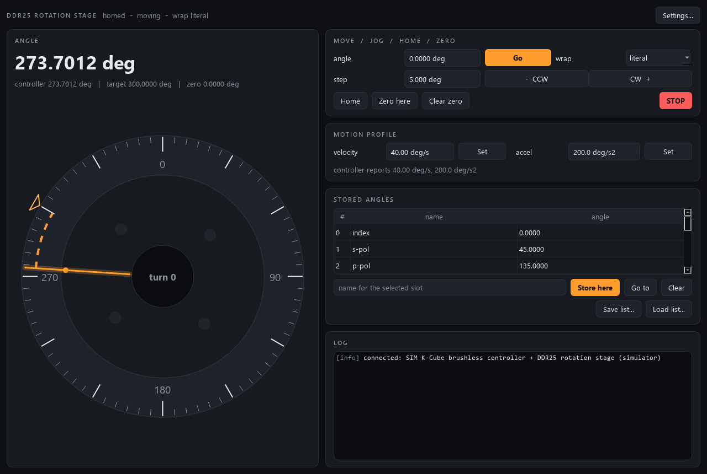

# ddr25-control

Control module for a **Thorlabs DDR25/M direct-drive rotation stage** on a
**K-Cube brushless servo controller** (KBD101), built to the AaltoFlow
instrument blueprint (`INSTRUMENT_MODULE_GUIDE.md`). One continuous rotary axis
in degrees -- a sample or polariser angle that scan-core can sweep, step or fly.

It is a *set-and-forget* instrument: you command an angle and the K-Cube's
servo drives the stage there on its own. Ports **5605** (commands) / **5606**
(status), declared in `module.toml`.



*The simulator, homed, part-way through a slow move from 135 deg to 300 deg: the
dashed arc on the dial runs from the pointer to the target marker the way the
stage is turning. Light theme: `../front-panels/ddr25-light.png`.*

## What it does

- **Absolute angle** with a **wrap policy**, because a stage that can turn
  forever makes "go to 10 deg" ambiguous:
  - `literal` (default) -- the angle is a linear coordinate inside a travel box
    (default -360 ... +720 deg); 350 -> 10 turns *back* 340 deg. Safe with
    cables or fibres on the stage; the only mode for fly scans across 0/360.
  - `shortest` -- modulo 360, the shorter way round (350 -> 10 is +20).
  - `positive` / `negative` -- modulo 360, always turning one way.
- **Relative moves** (jog), allowed even before homing.
- **Homing** to the encoder index. Absolute moves are **refused until the stage
  is homed** (`homed` in status): before that the controller counts from
  wherever it was switched on.
- **Velocity** and **acceleration**, clamped to a safety envelope and read back
  from the controller.
- **Adopt on start**: starting the service only READS the controller --
  position, homed, and its stored velocity/acceleration (which become the
  config's values). Nothing is written at start: no profile push, no homing,
  no channel enable (a disabled channel is enabled by the first move or home
  you command). Config values reach the controller only when you apply them.
- **STOP** (profiled, or immediate), a **display zero** ("Zero here"), and
  **10 stored orientations** with save/load to JSON.
- **Fly-scan stream** of the encoder angle (`stream_start/read/stop`).
- A front panel with the **rotary dial** indicator, and a **Settings** window
  for limits, wrap default and hardware.

## Architecture (same as every module in the suite)

```
backends/  base.py (Protocol) · sim.py (default) · kinesis.py (real, lazy pylablib)
angles.py  wrap arithmetic + the stored-angle list (pure Python, tested)
rotator.py the brain: poll thread, homing rule, clamps, honest `moving` flag
stream.py  fly-scan recorder (the suite's shared copy)
net/       protocol.py · service.py · client.py · describe.py
apps/      theme.py · gui.py (MainWindow + RotaryDial) · settings_dialog.py
scripts/   run_service.py · run_gui.py · ddr25_console.py · smoke_test.py
```

## Install and run

The tree lives in OneDrive, so the environment lives outside it (`dev.ps1`,
gotcha #8):

```powershell
cd ddr25-control
.\dev.ps1 sync --extra gui                 # simulator + GUI
.\dev.ps1 sync --extra gui --extra real    # on the lab PC: adds pylablib (gotcha #29)
.\dev.ps1 run pytest -q
.\dev.ps1 run python scripts\smoke_test.py

.\dev.ps1 run python scripts\run_service.py            # simulator; --real for the stage
.\dev.ps1 run python scripts\run_gui.py --connect localhost
.\dev.ps1 run python scripts\ddr25_console.py status
```

A GUI started without `--connect` runs its own private simulator.

## Wire contract

Universal verbs `status, info, get_config, set_config, describe, shutdown`, plus
`move_to{angle}`, `move_by{delta}` (both reply `target` + `move_id`), `home` (replies `home_id`), `stop{immediate}`,
`set_velocity{value}`, `set_acceleration{value}`, `set_wrap{wrap}`, `set_zero`,
`clear_zero`, `store_angle{slot,name}`, `clear_angle{slot}`, `goto_angle{slot}` (replies `move_id`),
`get_angles`, `save_angles{path}`, `load_angles{path}`, `stream_start{rate_hz}`,
`stream_read`, `stream_stop`.

Status keys: `angle_deg, raw_deg, target_deg, moving, homed, homing, home_id,
move_id, velocity, acceleration, zero_deg, wrap, streaming, connected, hw_error,
describe_rev`.

**For scan-core**, `angle` settles with `adopt_then_flag(target_deg, moving,
invert)`: `target_deg` echoes the angle exactly as commanded and is published
in the same critical section as the "move pending" latch, so a status frame
from before the move cannot pass for an arrival. The angle's range in
`describe` follows the wrap policy (travel box vs 0...360), so switching it
changes `describe_rev`. `home`, `move_by` and `goto_angle` carry `wait` blocks
and can run in scan routines. `home` waits on its `home_id`; the two move
actions wait on the `move_id` their reply carries, not on the angle, because in
a modulo mode `move_by 360` keeps the same target number and a frame from
before the command would otherwise look like the arrival.

## Hardware notes

Real driver: `backends/kinesis.py`, pylablib `KinesisMotor(serial,
scale="DDR25")` -- the KBD101 cannot report its stage, so the scale must be
named. Never run on the instrument yet; every unconfirmed call is marked
`# VERIFY` (see `CLAUDE.local.md`).
