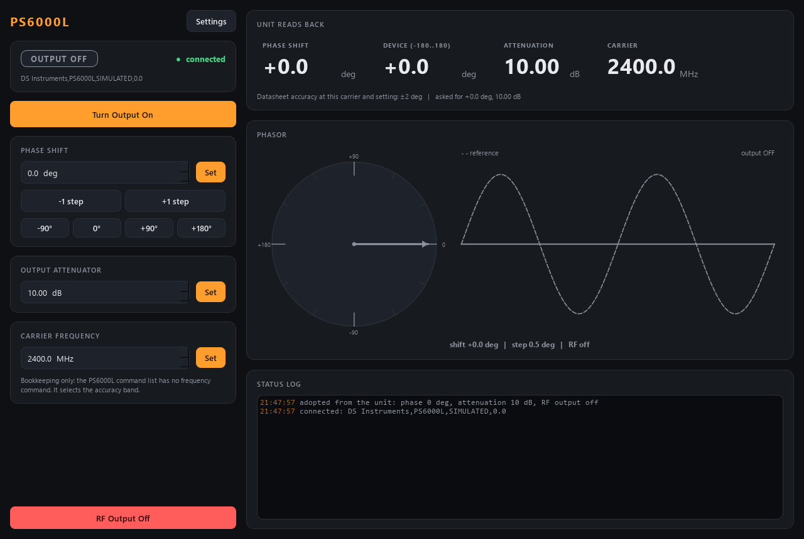

# dsphase-control -- DS Instruments RF phase shifter



Control for the **DS Instruments PS6000L**, a 400-6000 MHz *active* digital RF
phase shifter (I/Q modulator core + amplifier + a 30 dB output step attenuator):
phase -180..+180 deg in 0.5 deg steps, over a USB virtual COM port with short
SCPI-like text commands. It runs as a standalone ZeroMQ **service** with a GUI
client, like every AaltoFlow module, and it runs in **simulation** by default.

Ports **5589 / 5590**.

| What | How |
|---|---|
| Phase | `set_phase{phase_deg}` -- rounded to the device step, wrapped into -180..+180, reported back in *your* branch (ask 270, the unit holds -90, status says 270) |
| Output attenuator | `set_attenuation{attenuation_dB}` -- 0..30 dB, 0.25 dB steps |
| RF output | `set_output{on}` -- left as found at start (read, never written), OFF on shutdown |
| Carrier | `set_frequency{frequency_MHz}` -- bookkeeping (the V3 command list has no frequency command); selects the datasheet accuracy band |

**Start-up reads, never writes.** When the service starts it only asks the
unit (`*PING?`, `*IDN?`, `PHASE?`, `ATT?`, `OUTP:STAT?`) and adopts what it
holds as its setpoints -- phase, attenuation and RF on/off (ON included, with a
warning in the log). Nothing is sent until you set something, so restarting the
service never disturbs the RF path. The carrier frequency has no query; it
starts from `signal.frequency_MHz` in the config and is not sent at start.

Everything in status is a **readback** from the unit, taken by a worker thread,
so a scan-core "echoes" settle on `phase_deg` really means "the unit holds it".
The phase is a scan axis: sweep `dsphase.phase` from 0 to 360.

## Run it

```powershell
cd dsphase-control
.\dev.ps1 sync --extra gui                  # add --extra real on the lab PC (pyserial)
.\dev.ps1 run pytest -q
.\dev.ps1 run scripts/run_service.py        # simulated unit
.\dev.ps1 run scripts/run_service.py --real --port COM5
.\dev.ps1 run scripts/run_gui.py --connect localhost [--theme light]
.\dev.ps1 run scripts/dsphase_console.py phase 90
.\dev.ps1 run scripts/smoke_test.py
```

A GUI started without `--connect` runs its own private simulator.

The launcher starts the service with no arguments, so this PC's settings (the
COM port above all) go in `dsphase.ini` next to `pyproject.toml`: the service
loads it when it exists (`--config` names another file). Settings > Save writes
one; the file is gitignored and kept by the installer across upgrades.

## Layout

```
src/dsphase/  config.py  phasemath.py  shifter.py (the brain)  sim_system.py
              backends/{base, sim, ps6000l}.py      net/{protocol, service, client, describe}.py
              apps/{gui, settings_dialog, theme}.py
scripts/      run_service.py  run_gui.py  dsphase_console.py  smoke_test.py
```

`backends/ps6000l.py` is the only file that talks to the hardware (pyserial,
imported inside `open()`); every call not confirmed on a real unit is marked
`# VERIFY`. Sources: the PS6000L R3 datasheet V3.1 and "Phase Shifter SCPI
Command List (V3)" from dsinstruments.com.

The indicator is the **PhaseDial**: the reference and shifted phasors with the
swept arc, next to the reference and shifted waveforms (the shifted one scaled
by the attenuator, flat when the output is off).
