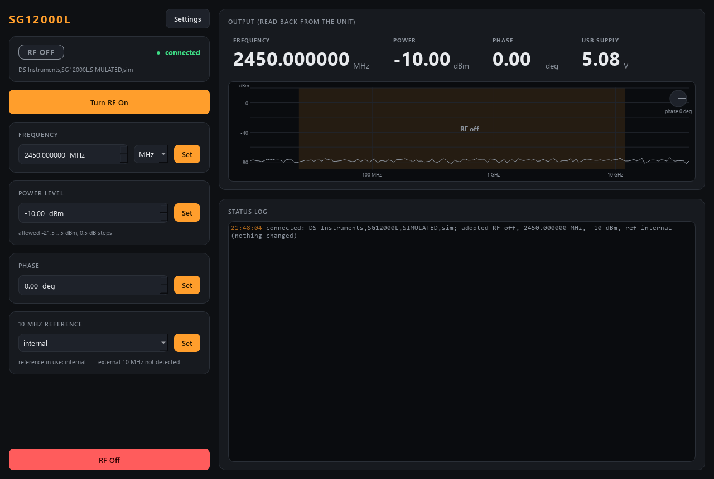

# dssg-control

Control for a **DS Instruments SG12000L** microwave signal generator
(25 MHz - 12 GHz, USB powered): RF output on/off, **frequency**, **power**,
**phase** and the **10 MHz reference** -- over USB (a virtual COM port) or the
Ethernet option (a TCP socket), or fully simulated with no hardware.



*The simulator as the service starts it: it adopts the simulated box's own state
(RF off, 2.45 GHz at -10 dBm, internal reference -- `[sim] state_*`). The spectrum
screen shades the band this unit can reach; with RF on the carrier stands up out
of the noise floor at its frequency and power, with its 2nd and 3rd harmonics
below it, and the dial in the corner shows the phase.*

A **set-and-forget** instrument: no control loop, no ramp, no state machine. The
`Synthesizer` brain holds the desired signal, clamps it, pushes it to the unit,
and a poll thread reads the unit BACK, so what the status reports (and what a
scan waits for) is the instrument's own answer, not our memory of the request.

## Two envelopes

The SG12000L reports its own range (`FREQ:MIN?`/`FREQ:MAX?`,
`POWER:MIN?`/`POWER:MAX?`). The `[limits]` in the config are your safety
envelope on top of it. Every setpoint is clamped to the **intersection**, with a
warning event when it clamps. The default power ceiling is +5 dBm, below the
unit's calibrated +10 dBm: raise it on purpose.

`describe` publishes that intersection, so its revision changes when the service
connects and learns the unit's real range, and again when you edit the limits.

## Ports

| service         | commands (REP) | status (PUB) |
|-----------------|----------------|--------------|
| **dssg**        | **5591**       | **5592**     |

## Layout

```
src/dssg/
  config.py              Signal / Limits / Hardware / Sim / UI + .ini save/load
  backends/
    base.py              MicrowaveSource Protocol -- the interface everything depends on
    sim.py               SimulatedSG12000L -- 0.5 dB attenuator steps, USB sag, ext-ref jack
    dsi_scpi.py          DsiSG12000L -- the real unit, USB serial (pyserial) or TCP (stdlib)
  synthesizer.py         Synthesizer -- clamps, pushes, and a read-back poll thread
  sim_system.py          build_sim_system(cfg) / build_real_backend(cfg)
  net/
    protocol.py          wire shapes + default ports (5591/5592)
    describe.py          the parameter manifest (limits live, settle = echoes)
    service.py           DssgService -- owns the brain, serves it over ZeroMQ
    client.py            DssgClient -- Synthesizer-compatible facade over the socket
  apps/                  gui.py (SpectrumIndicator), settings_dialog.py, theme.py
scripts/
  run_service.py         start the service (simulated by default, --real for the unit)
  run_gui.py             the GUI, local sim or --connect HOST
  dssg_console.py        standalone raw-protocol console (only needs pyzmq)
  smoke_test.py          quick offline check
tests/                   pytest: config, brain, real backend vs a fake link, net, describe, GUI
```

## Verbs

`set_rf{on}`, `set_frequency{frequency_Hz}`, `set_power{power_dBm}`,
`set_phase{phase_deg}`, `set_reference{mode: internal|external|auto}`, plus the
universal `status`, `info`, `get_config`, `set_config`, `describe`, `shutdown`.
A reply means *accepted*; the read-back in `status` means *done*.

Status keys: `rf_on, frequency_Hz, power_dBm, phase_deg, reference,
ext_ref_detected, usb_volts, connected, has_phase, idn, hw_error,
freq_min_Hz, freq_max_Hz, power_min_dBm, power_max_dBm, polls, describe_rev`.

## SCPI used (real backend)

From the DSI "SG6000L & SG12000L SCPI Command List" v2.1 (2022) and the DSI
"Ethernet Remote Operation Programming Guide" V1.2. Items marked VERIFY have not
been checked against the unit.

| function      | set                          | query                         |
|---------------|------------------------------|-------------------------------|
| RF output     | `OUTP:STAT ON` / `OFF`       | `OUTP:STAT?` (format VERIFY)  |
| frequency     | `FREQ:CW 2450.000000MHZ`     | `FREQ:CW?` (format VERIFY)    |
| power         | `POWER -12.50`               | `POWER?`                      |
| phase         | `PHASE 90.00` (VERIFY)       | `PHASE?` (VERIFY)             |
| reference     | `*INTERNALREF 1/0/A` + `*REFUPDATE` | `*REFMODE?`, `*EXTREF?` |
| range         |                              | `FREQ:MIN?/MAX?`, `POWER:MIN?/MAX?` |
| health        |                              | `*SYSVOLTS?`, `SYST:ERR?`     |

On connect the module ADOPTS the unit's state and changes nothing (rule of
2026-09-27): `*CLS` (empties the error queue only), `*IDN?`, the range queries,
`OUTP:STAT?`, `FREQ:CW?`, `POWER?`, `PHASE?`, `*REFMODE?`. The config's
`[signal]` preset and `mute_buzzer` / `display_off` are sent only when you CHANGE
them. RF is switched OFF when the service stops. There is also a `PHASE?`
probe -- the 2022 SG12000L list has no phase command, the shop page advertises 0-360 deg phase control, so the module asks the firmware. A unit
without it simply has no phase control in `describe`, and `set_phase` is refused.

USB: 115200 baud, 8N1, linefeed terminator. Ethernet: TCP port 10001 (fixed for
all DSI models); the unit uses DHCP unless given a static address.

## Run it

Uses [uv](https://docs.astral.sh/uv/). The tree lives in OneDrive, so keep the
venv outside it with `dev.ps1` (gotcha #8):

```powershell
cd dssg-control
.\dev.ps1 sync --extra gui                  # add --extra real on the lab PC (pyserial)
.\dev.ps1 run pytest -q
.\dev.ps1 run python scripts/smoke_test.py
.\dev.ps1 run scripts/run_service.py                          # simulated
.\dev.ps1 run scripts/run_service.py --real --com COM7        # the unit over USB
.\dev.ps1 run scripts/run_service.py --real --ip 10.0.0.23    # the unit over Ethernet
.\dev.ps1 run scripts/run_gui.py --connect localhost
.\dev.ps1 run scripts/dssg_console.py status
```

Sync `--extra gui --extra real` together: a later sync naming only `gui` removes
pyserial again (gotcha #29). A `dssg.ini` in this folder is loaded automatically
by the service.

Without `--connect` the GUI runs its own PRIVATE simulator, not the service.
