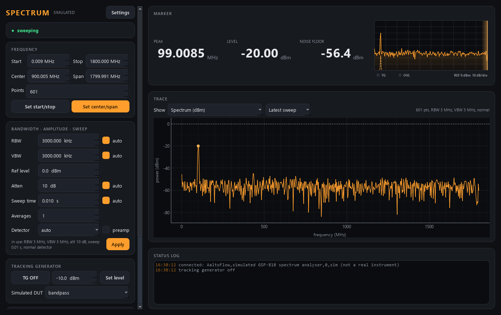

# gsp818-control -- GW Instek GSP-818 spectrum analyser (or a simulator)

A swept **spectrum analyser**, 9 kHz - 1.8 GHz, with its **tracking generator**
(option TG). Two measurements:

- the **spectrum**: power in dBm against frequency, with the front-panel knobs
  (start/stop or centre/span, points, RBW, VBW, reference level, input
  attenuation, sweep time, detector, preamp) and their **auto** couplings;
- **scalar network analysis**: the tracking generator drives a device under
  test, and the trace is read **relative to a thru reference**,

      norm_dB = trace_dBm - reference_dBm

  which is the device's transmission |S21| in dB with the generator's ripple
  and the cables' loss divided out.

It drives the real **GSP-818** over VISA (USBTMC, `--real`) or simulates one:
a noise floor that follows RBW, VBW, attenuation and the preamp, a few carriers
on the input, and a bandpass / lowpass / thru / open device behind the
tracking generator.



*(simulator, full span: the 100 MHz / -20 dBm carrier stands out of a -57 dBm
floor at 3 MHz RBW; the SweepScope at the top right shows the sweep beam, the
RBW bell to scale, and the TG / OVL lamps.)*

Ports **5585 / 5586**.

> **The real backend has not run on the instrument yet.** Every command that
> the programming manual does not settle beyond doubt is marked `# VERIFY` in
> `src/gsp818/backends/gsp.py`.

## Run

```powershell
cd gsp818-control
uv sync --extra gui                              # simulator only
uv sync --extra gui --extra real                 # + pyvisa, for the real GSP-818
uv run scripts/run_service.py                    # simulator
uv run scripts/run_service.py --real             # the GSP-818, found on USB
uv run scripts/run_gui.py --connect localhost
uv run scripts/gsp818_console.py acquire
```

**`uv sync` removes extras you do not name.** On the PC with the analyser always
sync with `--extra gui --extra real`.

### The real GSP-818

- **Interface:** the data sheet says USB **TMC** and LAN. On Windows, USBTMC
  needs a VISA with a USB driver -- install **NI-VISA** (or Keysight IO
  Libraries) and check that NI MAX lists the analyser. With `hardware.resource`
  empty the backend opens the first USB instrument of GW Instek whose `*IDN?`
  says GSP-818. Over LAN, put `TCPIP0::<ip>::inst0::INSTR` in `gsp818.ini`
  (which LAN protocol the unit answers on is still to be checked).
- **A PC's own settings** live in `gsp818-control\gsp818.ini` (not in git), read
  by `run_service.py` when present -- the launcher only passes `--real`:

  ```ini
  [hardware]
  resource = USB0::0x2184::0x....::INSTR
  sweep_mode = wait
  ```

- **How a fresh trace is obtained.** The manual has `:INIT:CONT ON|OFF` but no
  documented "sweep once now" command. So by default (`sweep_mode = wait`) the
  instrument sweeps continuously and, after a trigger, the brain waits **two**
  sweep times before reading `:TRAC? TRACE1` -- the sweep that was running when
  the trigger came is not trusted. `sweep_mode = single` uses the usual SCPI
  `:INIT:IMM` instead (one sweep per trace, faster) once it has been verified.
- **Safety:** the tracking generator is switched **OFF** when the module
  connects, when it disconnects (also on the launcher's Stop), and at every
  start whatever the `.ini` says. It is flagged `danger` in `describe`.

## The thru reference and norm

1. Tracking generator on (GUI TRACKING GENERATOR card, console `tg on`, verb
   `set_tg`), set its level (-30 ... 0 dBm).
2. Connect a **thru** where the device goes and **Take reference** (THRU
   REFERENCE card, console `ref`, verb `take_reference`): an acquisition exactly
   like `acquire`, whose result is also kept as the reference.
3. Put the device in and show **Normalised** (or detector `norm` in a scan).

`norm` is **refused** -- with a message saying what differs -- when there is no
reference, the tracking generator was off for either trace, or start, stop,
point count or TG level differ. Aborting a reference also clears the old one,
so a scan never divides by a stale reference by accident.

In a scan (scan-core), `take_reference` and `clear_reference` are **actions** a
routine can run, and the detectors are:

| detector | what |
|---|---|
| `gsp818.power` | the spectrum in dBm, dim `gsp818.freq` in MHz |
| `gsp818.norm` | trace - thru reference in dB, same dim |
| `gsp818.peak_freq`, `gsp818.peak_level` | the highest point (peak-search marker) |
| `gsp818.noise_floor` | the median of the trace |
| `gsp818.overload` | the mixer was compressed: the levels are wrong |

All from ONE acquisition per scan point (one acquire group). An acquisition
averages `averages` sweeps **in linear power** (averaging dB values would put a
noise floor 2.5 dB too low).

## The simulator's physics

- Noise floor: DANL -130 dBm/Hz above 1 MHz (-117 below; -150 / -140 with the
  20 dB preamp) + 10 log10(RBW) + the input attenuation. The noise is Rayleigh;
  VBW << RBW averages it smooth; the detector decides what a display point shows
  (pos/neg peak = max/min of the RBW-wide chunks in the bin, sample = one,
  normal = alternating, auto = normal above 1 MHz span).
- Carriers (`bench.carriers`, default 100 MHz -20 dBm, 433.92 MHz -45, 915 MHz
  -62, 1575.42 MHz -80) are drawn with a Gaussian RBW shape. A peak detector sees
  a carrier anywhere in the bin; the **sample detector can miss** one narrower
  than a bin -- try it.
- Mixer compression at +2 dBm (0 dB attenuation, 20 dB earlier with the preamp)
  -> `overload`.
- Tracking generator: 100 kHz - 1.8 GHz, +-1 dB ripple, through `bench.dut`
  (Butterworth bandpass 900 MHz / 120 MHz / order 3 / 1.5 dB loss by default)
  and cables losing 1 dB at 1 GHz (as sqrt f).
- The auto sweep time is k * span / (RBW * min(RBW, VBW)): 1 kHz RBW over a
  wide span is slow on the simulator exactly as on the instrument.

## Tests

```powershell
uv run pytest -q          # 57 tests, offline (the real backend against a fake GSP-818)
uv run scripts/smoke_test.py
python ../tools/check_modules.py gsp818 --live
```
