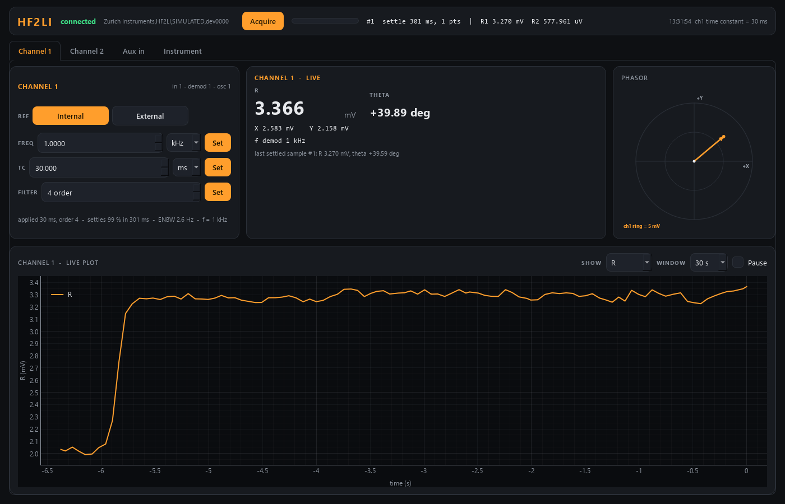
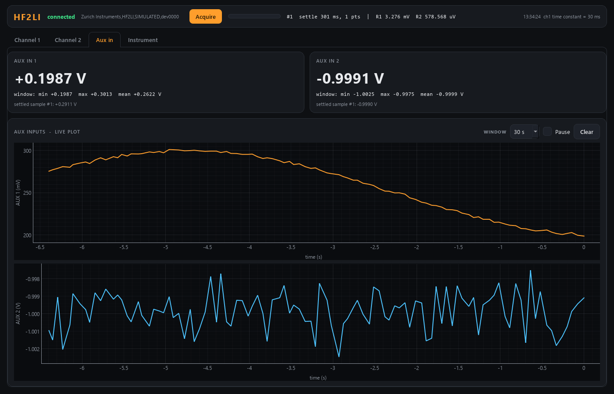

# hf2-control — Zurich Instruments HF2LI lock-in

Two-channel lock-in module of the TR-MOKE suite. The HF2LI is Zurich's
50 MHz, two-signal-input lock-in; this module uses two of its demodulators as
**channel 1** and **channel 2**, and also reads **AUX IN 1 / 2**.



The window has four tabs under a shared strip (connection, **Acquire** and the
last settled sample, the latest message):

| tab | what is on it |
|---|---|
| **Channel 1** / **Channel 2** | that channel's reference, frequency, time constant and order; live R, θ, X, Y; its phasor dial; a live plot of R, X & Y or θ |
| **Aux in** | AUX IN 1 and 2: live values, min/max/mean over the plot window, the settled sample, and a live plot each |
| **Instrument** | connection and signal routing, every setting (Apply / Revert / Load / Save), the log |

Every live plot has a window (10 s … 5 min) and Pause; recording continues
while paused, and a tab you open later already shows the recent past.



| per channel | |
|---|---|
| reference | **internal** (default: you set the frequency, and can scan it) or **external** (a PLL locks to a reference input; frequency is measured) |
| time constant, filter order | set here; the panel shows what the instrument applied and the resulting settling time |
| X, Y, R, θ, frequency | measured |

Service ports **5569 / 5570** (instrument #7). Runs in **simulation** by default.

## Run it

```powershell
cd hf2-control
uv sync --extra gui
uv run scripts/run_gui.py                     # GUI with its own simulated lock-in
uv run scripts/run_service.py                 # the service (simulated)
uv run scripts/run_gui.py --connect localhost # GUI on the running service
uv run scripts/hf2_console.py                 # raw-protocol console: tc 1 30 ms, acquire, status
uv run scripts/smoke_test.py
uv run pytest -q
```

## Live reading vs. acquired sample — the one idea to understand

A lock-in output is low-pass filtered, so after anything changes (field,
position, the time constant itself) it needs several time constants to settle:
99 % takes 4.6 τ for a 1st-order filter but 10 τ for 4th order.

* **live** values update continuously — right for watching the panel, **wrong for a scan point**.
* **`acquire`** returns an id at once, waits the settling time computed from each
  channel's τ and order, optionally averages over `average_tc` time constants,
  and latches a **sample**. Scan detectors (`r1`, `theta1`, `aux1`, …) read that
  sample; scan-core triggers and waits automatically.

The wait checks the acquisition **id** before the "done" flag, because right
after the trigger the status can still describe the previous sample.

Note that `settle_percent` is relative to the **step**, not the final value:
stepping from 2 mV down to 0.2 mV, 99 % leaves 18 µV — 9 % of the new
reading. Use 99.9 % (or `extra_wait_s`) when signals change by large factors.

## Commands (wire verbs)

`set_time_constant{channel, time_constant_s}` · `set_order{channel, order}` ·
`set_reference{channel, mode}` · `set_frequency{channel, frequency_Hz}`
(internal only; refused on external) · `acquire` → `{acq_id}` · `get_sample` ·
plus the universal `status`, `info`, `describe`, `get_config`, `set_config`.
Channels are 1 and 2.

## Real hardware (not yet tested)

1. Install LabOne (brings the HF2 data server `ziServer` and the USB driver);
   check the HF2LI appears in the LabOne UI and note its id (`devNNNN`).
2. Uncomment `zhinst-core` in `pyproject.toml` (same release as LabOne) and `uv sync`.
3. `uv run scripts/run_service.py --real --device devNNNN`
4. Exercise it from `hf2_console.py`, comparing with LabOne side by side, and
   resolve every `# VERIFY` in `src/hf2/backends/zhinst_hf2.py` — above all
   the external-reference (PLL) nodes and the aux fields of the demod sample.

The HF2 series uses port **8005** and API level **1** (the newer MFLI/UHFLI use
8004 / 6). This module never enables a signal output.

## Troubleshooting

* Venv in OneDrive → `Access is denied`: see the `docs/DEVELOPER_NOTES.md` section 2.
* Panel shows a red hardware error: the polling thread's last read failed; the
  message is the vendor exception.
