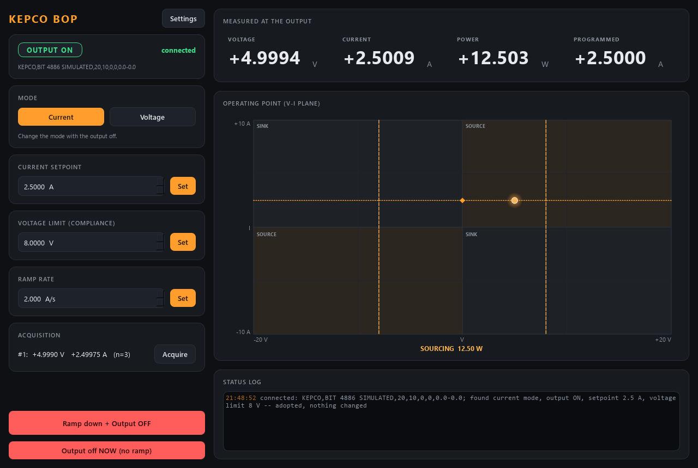

# kepco-control

Control for a **Kepco BOP 20-10** bipolar operational power supply
(+-20 V, +-10 A, four quadrants) with the BIT 4886 GPIB card: choose **current
or voltage mode**, set the **setpoint** and the complementary **limit**, switch
the **output** on and off, and read back the **measured voltage and current** --
over GPIB (SCPI), or fully simulated with a coil on the output.



*Current mode, 2.5 A into the simulated coil (2 ohm, 0.1 H) with an 8 V
compliance -- a BOP FOUND live at start and adopted without a single write
(the log line says so). The V-I plane shows the four quadrants of a bipolar
supply; the dot is the measured operating point (after a ramp, its trail runs
up the coil's load line V = I R). Dashed: the voltage limit. Dotted: the
target.*

This is the supply **on its own**: a safe, scannable source of amps or volts.
`clMag-control` drives a Kepco too, as the actuator inside a magnetic-field
loop; nothing here knows about fields or calibrations.

> **Same unit as clMag-control.** On the rig this BOP is the SAME physical
> supply clMag-control drives (GPIB0::6::INSTR, the default here too).
> **Never run kepco-control and clMag-control at the same time**: two services
> would program one output against each other. Stop one before starting the
> other; kepco adopts whatever clMag left on the output (and vice versa, clMag
> has its own start-up rules).

## What it does for you

- **Ramps every change.** A setpoint is never applied as a step: the brain
  walks the output at `ramp.rate_A_per_s` (or `rate_V_per_s`), 20 times a
  second. With a coil on the output V = L dI/dt, so a step would slam the
  supply into its limit.
- **Ramps to zero before the output goes off.** The BOP's own `OUTP OFF`
  drops the output to 0 in one step, so "Output off" here means: ramp to 0,
  wait `ramp.off_hold_s` for the load current to follow, then `OUTP OFF`.
  The same happens when the service stops (Ctrl-C, the launcher's Stop, the
  `shutdown` verb) -- sped up to finish within `safety.shutdown_ramp_s` --
  and, if you enable it, when no client has spoken for `safety.watchdog_s`.
- **Changes nothing at start.** The service READS the BOP -- mode, setpoint,
  limit, output on/off (`FUNC:MODE?`, `VOLT?`, `CURR?`, `OUTP?`) -- and adopts
  it; the only write is `*CLS` (clears the error queue). A live output stays
  live at the value it has, and the ramp continues from there when you set a
  new value. The `[output]` values of a loaded .ini are NOT pushed at start;
  they reach the supply only when you set them.
- **Clamps** every setpoint to the envelope in `[limits]` and says so.
- **Honest scan values.** `measured_voltage` / `measured_current` come from
  `acquire`: wait for the readback to settle (the BIT 4886 averages its last
  16 conversions, ~320 ms), then average fresh readings.

## The two modes (how the BOP thinks)

The BOP has a **main** channel (what the mode regulates) and a **limit**
channel (the other quantity, as an absolute value in both polarities):

| mode    | you set (ramped)  | limit (applied at once)       |
|---------|-------------------|-------------------------------|
| current | `set_current` A   | `set_voltage_limit` V (compliance) |
| voltage | `set_voltage` V   | `set_current_limit` A         |

The mode can only be changed with the output off. `describe` offers only the
knobs of the active mode, so its revision changes with the mode.

## Layout

```
src/kepco/
  config.py              Output / Ramp / Limits / Safety / Acquisition / Hardware / Sim / UI + .ini
  backends/
    base.py              BipolarSupplyBackend Protocol -- the interface everything depends on
    sim.py               SimulatedBOP -- a BOP driving an R-L coil, runs offline
    bop_gpib.py          VisaBOP -- the real unit over GPIB (SCPI, lazy pyvisa import)
  supply.py              BipolarSupply -- clamps, ramps, safety, measures, acquires (one worker thread)
  sim_system.py          build_sim_system(cfg) -- wire the simulator into a BipolarSupply
  net/
    protocol.py          wire shapes + default ports (5581/5582)
    describe.py          the self-description (mode-dependent)
    service.py           KepcoService -- owns the supply, serves it over ZeroMQ
    client.py            KepcoClient -- BipolarSupply-compatible facade over the socket
  apps/                  gui.py (QuadrantIndicator), settings_dialog.py, theme.py
scripts/
  run_service.py         start the service (simulated by default, --real for GPIB)
  run_gui.py             the GUI (local simulator, or --connect HOST)
  kepco_console.py       standalone raw-protocol console (only needs pyzmq)
  smoke_test.py          quick offline check
tests/                   pytest: config, brain (ramp/safety/clamps/threads), describe, net, GUI
```

## SCPI used (real backend, BIT 4886 manual)

| function                     | command                        | manual |
|------------------------------|--------------------------------|--------|
| mode                         | `FUNC:MODE VOLT` / `CURR`      | B.22   |
| voltage (or voltage limit)   | `VOLT <v>`                     | B.57   |
| current (or current limit)   | `CURR <a>`                     | B.48   |
| full-scale range (no 1/4-scale transient) | `CURR:RANG 1` / `VOLT:RANG 1` (per mode) | B.52 / B.61 |
| output                       | `OUTP ON` / `OFF`              | B.20   |
| measure                      | `MEAS:VOLT?` / `MEAS:CURR?`    | B.18/19 |
| identity / errors            | `*IDN?` / `SYST:ERR?`          | A.6 / B.80 |

There is **no** separate limit or protection command on GPIB (manual
4.1.1.1): the limit is programmed with the other quantity's own command. The
front-panel screwdriver limits still apply on top. Nothing has been run on the
instrument yet: every call is marked `# VERIFY` in `bop_gpib.py`. Default
address `GPIB0::6::INSTR` (the BIT 4886 factory setting) -- change it in the
`.ini` or with `--visa`.

## Setup and run

The tree lives in OneDrive, so keep the environment outside it with `dev.ps1`
(it points uv at `%LOCALAPPDATA%\uv-venvs\kepco-control`):

```powershell
cd kepco-control
.\dev.ps1 sync --extra gui                  # add --extra real on the lab PC (pyvisa)
.\dev.ps1 run pytest -q
.\dev.ps1 run python scripts\smoke_test.py
.\dev.ps1 run python scripts\run_service.py              # simulated
.\dev.ps1 run python scripts\run_service.py --real       # the BOP over GPIB
.\dev.ps1 run python scripts\run_gui.py --connect localhost
.\dev.ps1 run python scripts\run_gui.py --demo           # local sim, output on at 2.5 A
```

Console (raw protocol, only pyzmq):

```
.\dev.ps1 run python scripts\kepco_console.py
    bop> vlim 5
    bop> i 1.5
    bop> out on
    bop> acquire
    bop> out off
```

## In a scan

`kepco.current` (current mode) or `kepco.voltage` (voltage mode) is the axis;
it settles when the service has adopted the new target AND the ramp is over.
`kepco.measured_current` / `kepco.measured_voltage` are the detectors (one
acquisition serves both). A setpoint changed while the output is OFF settles
at once -- nothing moves -- so switch the output on in a routine before the scan.

## Using it from Python

```python
from kepco.net.client import KepcoClient

bop = KepcoClient(host="localhost")
bop.start()
bop.set_voltage_limit(5.0)
bop.set_current(1.5)
bop.set_output(True)                 # ramps from 0 to 1.5 A
print(bop.status().ramping)
bop.set_output(False)                # ramps to 0, then OUTP OFF
bop.shutdown()                       # closes the client, not the service
```
