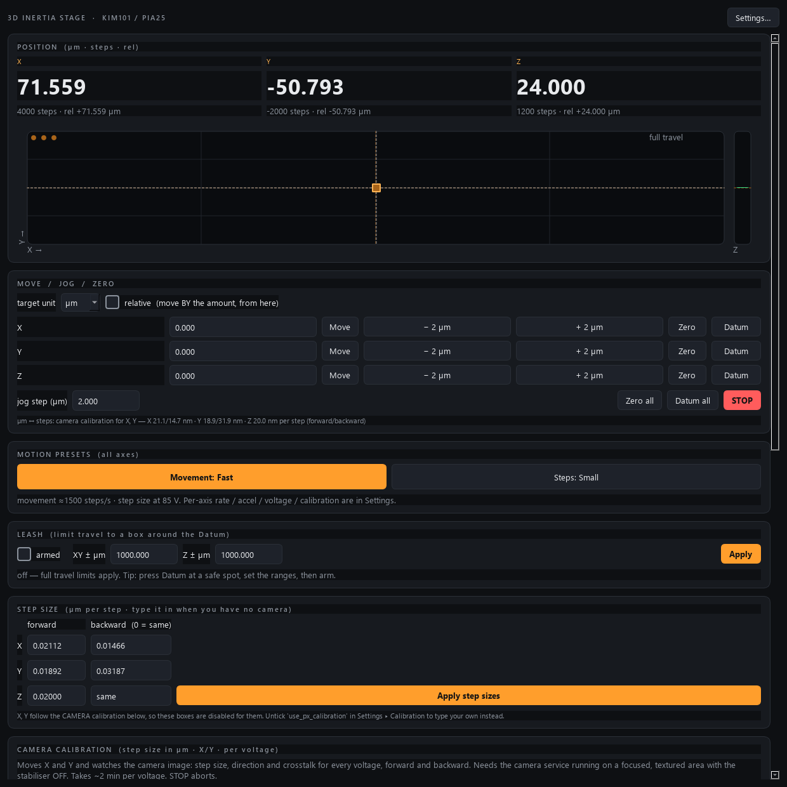

# kim-control

Control module for a **3D piezo-inertia stage** — three Thorlabs **PIA25**
piezo-inertia (slip-stick) actuators on **all three axes**, driven by one
**KIM101** K-Cube controller — built to the AaltoFlow instrument
blueprint (`INSTRUMENT_MODULE_GUIDE.md`). It is the *set-and-forget* sibling of
`stage-control` and `piezo-control`: you command a target and the KIM101 steps
the actuator there; there is no control loop.

It is instrument **#7** in the suite, so it uses **command port 5567** and
**status port 5568** (rule: `cmd = 5555 + 2n`, `pub = cmd + 1`).



*At (80, -40, 24) um -- shown in both languages, micrometres and steps, bridged by the per-axis calibration. The travel map centres the datum, because on an open-loop stage you must be able to move either side of it.*

## The one idea to understand: two languages, one calibration

A KIM101 drives its actuators in tiny discrete **steps** (no encoder — position
is the accumulated step count). So the controller's native language is *steps*.
But you think in **micrometres**. Every axis therefore carries a calibration
constant `um_per_step`, and the module lets you drive it in **either** language:

```
steps       = round(micrometres / um_per_step)
micrometres = steps × um_per_step
step_rate   = round(velocity_µm_per_s / um_per_step)   (steps/s, clamped ≤ 2000)
```

The physical **size** of one step is set by the **drive voltage** (85–125 V on a
KIM101, which changes the step by up to ~30 %). Change the voltage and you have
re-calibrated the actuator — so re-measure `um_per_step` afterwards. Datasheet
starting point for a PIA25: ~**20 nm/step** (0.02 µm), which is the default.
**Measure your own** and put the real number in the config.

## What it does

- Drive 3 axes (X, Y, Z), each a PIA25 on a KIM101 channel (default CH 1/2/3).
- Move in **steps**: absolute (`move_to_step`) or incremental (`move_steps`).
- Move in **micrometres**: absolute (`move_to_um`) or **relative from here**
  (`move_relative_um`) — converted to steps through the per-axis calibration.
- Two front-panel **motion presets** (one click, all axes): **Movement:
  Fast / Slow** applies a fast or slow step-rate + acceleration preset (the
  fast/slow values are set in Settings); **Steps: Large / Small** sets every
  axis to the highest / lowest drive voltage (bigger voltage = physically larger
  step). The per-axis knobs behind these — **step rate** (steps/s), **step
  acceleration** (steps/s²), **drive voltage** (V), **µm/step calibration**, and
  **velocity in µm/s** — all live in the **Settings** window.
- Two distinct zeros: **Datum** resets the hardware step counter to 0 at the
  current position (the closest thing to "home"); **Zero** sets a software
  display origin for the relative read-out only (a bench-DRO zero — moves
  nothing).
- A **travel leash** (runout guard): arm it from the home screen and each axis
  may only move within **± a set number of steps of the datum** — X and Y share
  one range, Z has its own. This is the recommended protection for an open-loop
  inertial stage, because once you Datum mid-travel the absolute step limits are
  in the wrong frame; the leash is referenced to the datum you just set. When
  armed it replaces the absolute limits, the indicator border turns amber, and
  the graph rescales to the leash box.
- A **20-slot position list** (stored in *step* coordinates so "go to" is
  deterministic regardless of calibration), with save/load to JSON.
- A **visual front panel** (PySide6) with live read-outs (µm + steps + relative)
  and a top-down XY step-space map (symmetric — the datum sits at the centre)
  with a discrete "stepping" animation and a centre-zero Z bar.
- **Settings live in a separate window** (a "Settings…" button), including the
  travel limits (in steps) and the calibration; changes are pushed on OK.
- **Remote control** over ZeroMQ: everything the GUI can do.
- A **light / dark theme**, chosen at startup (Settings → Appearance, or
  `run_gui.py --theme {dark,light}`). It persists in the config; there is no live
  toggle. All GUI colours come from one `COLORS` palette in `apps/theme.py`.

## Architecture (same as every module in the suite)

One **service** process owns the stage (or its simulator) and is the single
source of truth. GUIs, the console, and a coordinator are **clients** that talk
to it over ZeroMQ — identical code whether local or across the lab Ethernet.

```
backends/  base.py (Protocol) · sim.py (default, no hardware) · kinesis_kim.py (real, lazy pylablib)
kim.py     the "brain": steps⇄µm bridge, clamps to limits, position list
net/       protocol.py (ports/topics/serialisation) · service.py · client.py
apps/      theme.py · gui.py (MainWindow + InertiaIndicator) · settings_dialog.py
scripts/   run_service.py · run_gui.py · kim_console.py · smoke_test.py
```

## Install

Uses **uv** + the **src layout**.

```bash
uv sync                 # core (pyzmq)
uv sync --extra gui     # add PySide6 for the front panel
```

The Thorlabs driver (`pylablib`) is **commented out** in `pyproject.toml` until
you are on the lab PC — the simulator needs none of it. Uncomment it there and
`uv sync` again.

## Run

```bash
# 1) start the service (simulator by default)
uv run python scripts/run_service.py            # --real for the KIM101

# 2) open the front panel
uv run python scripts/run_gui.py                # local sim brain, no service needed
uv run python scripts/run_gui.py --connect 127.0.0.1   # attach to the service
uv run python scripts/run_gui.py --real         # local, drive the real KIM101
uv run python scripts/run_gui.py --theme light  # start in light mode (or dark)

# 3) poke it by hand
uv run python scripts/kim_console.py
kim> move_to_um X 120
kim> move_relative_um X 10
kim> set_velocity_um X 50
```

## Remote-control quick reference

Commands are JSON over a REQ/REP socket on port 5567; every reply is
`{"ok": true, ...}` or `{"ok": false, "error": ...}`. Status is published on
5568 at ~8 Hz.

| intent                          | command |
|---------------------------------|---------|
| read all state                  | `{"cmd":"status"}` → `position_steps`, `position_um`, `rel_um`, … |
| move to an absolute step target | `{"cmd":"move_to_step","axis":"X","position":5000}` |
| step by N from here             | `{"cmd":"move_steps","axis":"X","delta":200}` |
| move to an absolute µm target   | `{"cmd":"move_to_um","axis":"X","position":120.0}` |
| relative move in µm (from here) | `{"cmd":"move_relative_um","axis":"X","delta":10.0}` |
| movement preset (all axes)      | `{"cmd":"set_speed","fast":true}` (false = slow) |
| step-size preset (all axes)     | `{"cmd":"set_step_size","large":true}` (false = small) |
| set step rate / acceleration    | `set_step_rate` / `set_acceleration` (each `{axis,value}`) |
| set velocity in µm/s            | `{"cmd":"set_velocity_um","axis":"X","value":50.0}` |
| set drive voltage (step size)   | `{"cmd":"set_voltage","axis":"X","value":115.0}` |
| set µm/step calibration         | `{"cmd":"set_calibration","axis":"X","value":0.021}` |
| arm/resize the travel leash     | `{"cmd":"set_leash","enabled":true,"leash_xy":50000,"leash_z":50000}` |
| datum (zero the counter here)   | `{"cmd":"zero_counter"}` (all) or `{"axis":"X"}` |
| display zero / clear            | `{"cmd":"set_zero"}` · `{"cmd":"clear_zero"}` |
| stop                            | `{"cmd":"stop"}` (all) or `{"axis":"Y"}` |
| position list                   | `store_position` / `goto_position` / `save_positions` / `load_positions` |

Axes accept `"X"/"Y"/"Z"` or `0/1/2`.

## Tests

All offline — no hardware, no display needed.

```bash
uv run --extra gui pytest -q
uv run python scripts/smoke_test.py
```

## Hardware notes (read before first real run)

`backends/kinesis_kim.py` is the **only** file that touches pylablib, and it
imports it lazily inside `open()`. The KIM101 is exposed by pylablib as
`Thorlabs.KinesisPiezoMotor`. Because method/argument spellings have shifted
across pylablib versions, every hardware call in that file is marked `# VERIFY`
— confirm each against your installed pylablib (`help(Thorlabs.KinesisPiezoMotor)`)
before the first real run. Specifically:

1. **Serial + channels.** Set `Hardware.serial` to your KIM101's Kinesis serial
   (`97…`) and map `ch_x/ch_y/ch_z` to the channels (1–4). Note a KIM101 drives
   one channel at a time (or two paired), so moves here are issued per axis.
2. **Drive parameters.** Confirm `setup_drive(...)` / `get_drive_parameters()`
   field names — `velocity` is the **step rate** (steps/s), `acceleration` is
   steps/s², `max_voltage` is the drive volts.
3. **Datum.** `set_position_reference(0, channel=…)` is used to zero the step
   counter — confirm the name.
4. **Calibration.** Re-measure `um_per_step` per axis (and re-derive the travel
   limits in steps, `max_steps ≈ 25000 µm / um_per_step`).

## Troubleshooting

**OneDrive venv gotcha.** This project lives in OneDrive, which locks files
inside `.venv` as it syncs and makes `uv` die with *"Access is denied (os error
5)"*. Fix once per machine by putting the venv **off** OneDrive:

```powershell
[Environment]::SetEnvironmentVariable('UV_PROJECT_ENVIRONMENT', "$env:LOCALAPPDATA\uv-venvs\kim-control", 'User')
$env:UV_PROJECT_ENVIRONMENT = "$env:LOCALAPPDATA\uv-venvs\kim-control"
uv sync
```
