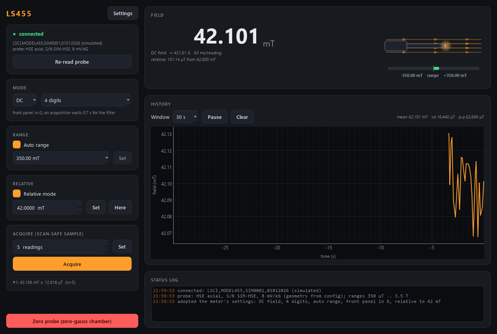

# ls455-control — Lake Shore 455 DSP gaussmeter

Gaussmeter module of the AaltoFlow suite, for the Lake Shore **Model 455** with a
single-axis Hall probe (the lab's is an **axial** probe: it measures the field
component along the probe's own axis). **Not yet run on the instrument** —
simulation plus a pyvisa driver written from the 455 manual, every unconfirmed
call marked `# VERIFY`.



| control / reading | |
|---|---|
| mode | **DC** (static field) or **RMS** (the AC part, wide band to 20 kHz or narrow to 1 kHz) |
| DC resolution | 3 / 4 / 5 digits — this *is* the 455's filter: 100 Hz / 10 Hz / 1 Hz bandwidth |
| auto range / manual range | decade ranges that depend on the probe (HSE 0.35 mT … 3.5 T, HST 3.5 mT … 35 T, UHS 3.5 µT … 3.5 mT); manual snaps **up** |
| relative | B − setpoint, with a "relative to the present field" button |
| field | live, in **mT** whatever the front panel shows (G / T / Oe / A/m) |
| acquire | the scan-safe sample: mean ± sd of N readings that all **started after** the trigger *and* after the filter's settling time |
| zero probe | **only with the probe in the zero-gauss chamber** |

Service ports **5615 / 5616**. Runs in simulation unless `--real`.

## Run it

```powershell
cd ls455-control
.\dev.ps1 sync --extra gui --extra real        # inside OneDrive; else: uv sync --extra gui --extra real
uv run scripts/list_devices.py                 # which VISA instruments answer *IDN? (changes nothing)
uv run scripts/run_gui.py                      # GUI on the simulator
uv run scripts/run_gui.py --real               # GUI on the real meter, no service
uv run scripts/run_service.py --real --resource GPIB0::12::INSTR
uv run scripts/run_gui.py --connect localhost  # GUI on the running service
uv run scripts/ls455_console.py                # raw-protocol console: field, acquire, digits 5
uv run pytest -q
```

Name **both** extras when syncing: `uv sync` removes every extra you do not
name, and `--real` then fails with "pyvisa is not installed".

## How it talks to the meter

Through **pyvisa** (extra `real`: pyvisa, pyvisa-py, pyserial). The interface is
not decided yet, and both work with the same code:

- **GPIB** — `hardware.resource = "GPIB0::12::INSTR"` (12 is the factory address);
- **RS-232** — `"ASRL3::INSTR"` for COM3. The 455's serial frame is fixed at
  **7 data bits, odd parity, 1 stop bit**, CR LF; only the baud rate (default
  9600) can be changed, and `hardware.baud_rate` must match it.

The manual asks for at most 20 messages per second and 50 ms of silence after a
command; the driver paces itself, and the default poll rate (8 Hz, one field
query plus one status query each) stays under that.

Every reading is converted to **mT** in the driver (1 G = 0.1 mT; Oe and A/m
are H, converted with B = µ0 H as in air). The front-panel unit is only what the
meter's own display shows.

At start the module **only reads** the meter and adopts what it finds --
probe (type HSE/HST/UHS, serial, sensitivity), mode (DC, RMS **or peak**),
resolution, band, range, front-panel unit and relative setpoint. It writes
nothing: a measurement set up on the front panel is never changed by starting
the service. The config values are applied only when you ask (a setter, or
Settings > Apply). The probe's geometry (axial / transverse) is not reported
by the 455 and comes from `hardware.probe_geometry` (default axial). After
swapping the probe, **Re-read probe** (verb `reread_probe`) makes the ranges
follow it; a probe that was unplugged and comes back is re-read automatically.
In peak mode the readings are the peak the meter's peak display selects, and
the detectors' labels say so. The front panel stays in charge while the
service runs: unit, mode and range mode are re-read every 5 s and before each
acquisition, so a setting changed by hand is adopted (and logged) instead of
silently mis-scaling the readings.

## Why an acquisition waits

The 455's DC filter lags a field step. The manual gives its time constant as
0.01 s / 0.1 s / 1 s at 3 / 4 / 5 digits, so `acquire` only counts readings that
start `settle_time_constants` (7, i.e. 0.1 % of a step) time constants after the
trigger — 0.07 s at 3 digits, **0.7 s at 4, 7 s at 5**. The status shows it as
`settle_s`. A scan that steps a magnet and then acquires gets the new field,
not a blend of old and new.

## Commands (wire verbs)

`set_mode{mode}` · `set_dc_digits{digits}` · `set_rms_band{band}` ·
`set_auto_range{on}` · `set_range{range_mT}` (switches auto off) ·
`set_display_unit{unit}` · `set_relative{on?, setpoint_mT?}` · `relative_here` ·
`set_acquisition{readings}` · `acquire` → `{acq_id}` · `get_sample` · `zero` ·
`clear_zero` · `reread_probe` · `shutdown` · plus the universal `status`, `info`, `describe`,
`get_config`, `set_config`.

In scan-core: settables `mode`, `dc_digits` (DC) / `rms_band` (RMS),
`auto_range`, `range` (when auto-range is off), `display_unit`, `relative`,
`rel_setpoint`; detectors `field` / `field_std` (mT, acquired) and
`live_field`; routine action `relative_here`.

The status frame carries **`measured_field_mT`** (the live DC field; empty in
RMS mode), the same key the magnet modules publish, so a subscriber such as
the VNA could later take its field from the gaussmeter.
