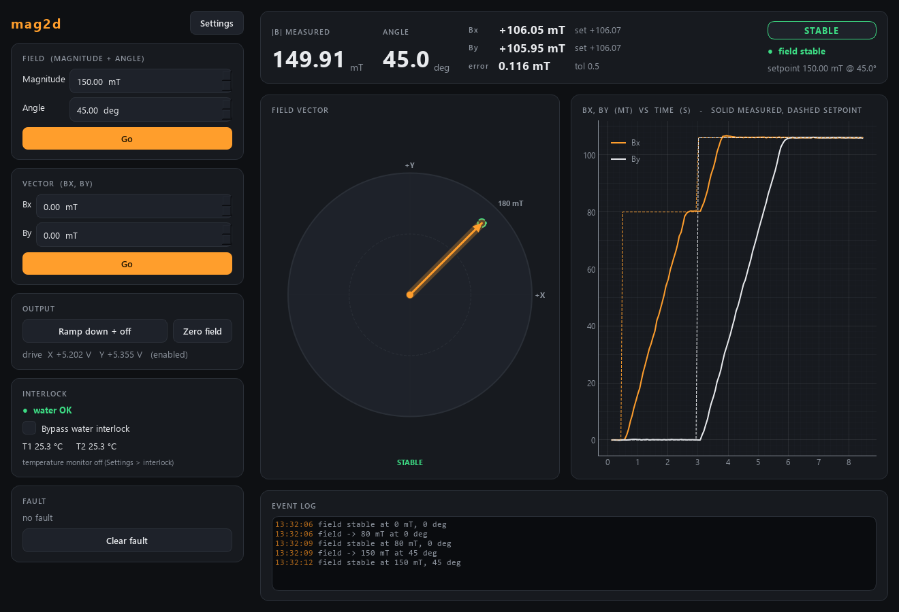

# mag2d-control -- 2D vector magnet

A two-axis electromagnet on an NI DAQ: set the field as **magnitude + angle** or
as **Bx, By**, and a PI loop per axis holds it in **calibrated millitesla**, all
the time the output is on. Cooling water is interlocked. Successor of the
LabVIEW program *RotSampleInVNA*.



*Simulated magnet: 80 mT along +X, then 150 mT at 45 deg. The dial shows the
setpoint (dim), the measured field (amber) and the tolerance ring (green =
stable); the chart shows both axes slewing at 2 V/s and settling.*

Ports **5575** (commands) / **5576** (status). Everything runs on a **simulator**
by default; the NI backend is written but has **not run on the magnet yet**.

## Run it

```powershell
cd mag2d-control
uv sync --extra gui
uv run pytest -q                                  # 46 tests, ~6 s
uv run scripts/smoke_test.py                      # the sim magnet end to end, in simulated time

uv run scripts/run_service.py                     # the service (simulated magnet)
uv run scripts/run_gui.py --connect localhost     # a GUI on that service
uv run scripts/mag2d_console.py field 150 45      # or poke it by hand
```

`run_gui.py` WITHOUT `--connect` runs its own private simulated magnet, not the
service's.

### The water interlock at start

If the cooling water is off (and not bypassed) the service prints why and exits
with **code 3**, before it opens a socket. Start the water, or -- knowing the
coils are then unprotected -- run with `--bypass-water`.

### Stopping

Ctrl+C, the launcher's Stop, or `mag2d_console.py shutdown` all **ramp the output
to 0 V at the slew rate** and release the enable line. A hard kill cannot: the
DAQ keeps its last output. Do not taskkill a running magnet.

## Commands (REQ/REP, JSON; fire-and-forget)

| verb | args | |
|---|---|---|
| `set_field` | `field_mT`, `angle_deg` (optional) | signed magnitude; no angle = keep it |
| `set_angle` | `angle_deg` | rotate, keep the magnitude |
| `set_vector` | `bx_mT`, `by_mT` | |
| `set_bx` / `set_by` | `bx_mT` / `by_mT` | set one component, keep the other |
| `zero` | | field 0 mT, angle kept |
| `set_output` | `enabled` | on = regulate; off = ramp to 0 V, then disable |
| `set_water_bypass` | `enabled` | DANGER |
| `clear_fault` | | refused while the cause is still there |

plus `status`, `info`, `get_config`, `set_config`, `describe`, `shutdown`.
A refused command (a setpoint during a FAULT) replies `{"ok": false, "error": "..."}`.

A setpoint is stored **exactly as sent**; `field_stable` goes False in the same
instant, and True again once every axis has been within `control.tolerance_mT`
for `control.stable_time_s`. Wait for both "my setpoint is in the status" and
`field_stable` (the client's `set_field_blocking` does).

## Files

```
src/mag2d/
  config.py            every tunable number (+ .ini save/load)
  pid.py               one axis: feed-forward + PI, clamp, slew, anti-windup
  controller.py        the brain: setpoints, states, interlocks, the loop thread
  sim_system.py        a controller on the simulated magnet
  backends/base.py     the hardware Protocol (volts in, volts out)
  backends/sim.py      the simulated magnet (+ FakeClock for tests)
  backends/nidaq.py    the NI DAQ (nidaqmx, lazy import) -- untested on hardware
  net/                 protocol, service, client, describe
  apps/                GUI (VectorDial), settings dialog, theme
scripts/               run_service, run_gui, mag2d_console (pyzmq only), smoke_test
```

## Hardware pass (not done yet)

1. Install NI-DAQmx, uncomment `nidaqmx` in `pyproject.toml`, `uv sync`.
2. Check the channel names in NI MAX against `config.Hardware`.
3. Start with a low `limits.field_max_mT`. Check the sign first: set a small field
   along +X and watch that `measured_bx_mT` moves the same way (if it runs away,
   `output` off at once and flip `hardware.ao_sign_x`; same for Y). Once it
   regulates, read `output_V` and the measured field from `status`: mT per volt
   = B / V at a steady point; put that in `control.ff_mT_per_V`.
4. Retune `kp`/`ki` (they are sim-tuned). Check the temperature scale (the VI's
   10e3 C/V is suspicious).
5. Every `# VERIFY` in `backends/nidaq.py`.

## Troubleshooting

**"Access is denied (os error 5)" from uv** in a OneDrive folder: keep the venv
off OneDrive -- copy `dev.ps1` usage from clMag-control (`.\dev.ps1 sync --extra gui`).
