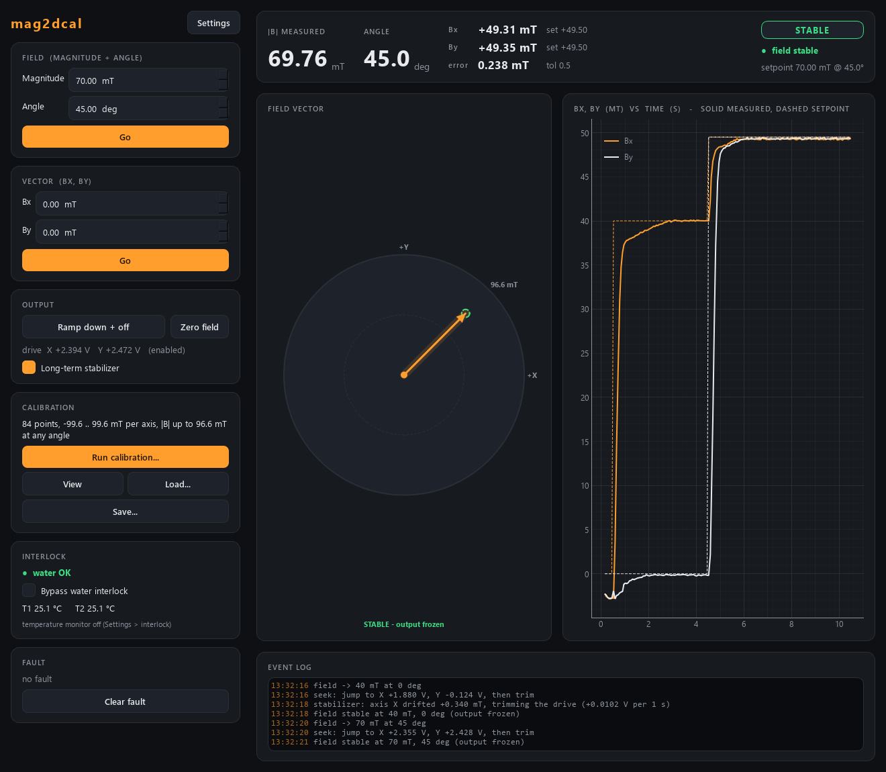

# mag2dcal-control -- 2D vector magnet, calibrated (clMag philosophy)

A **second, parallel** controller for the two-axis electromagnet, next to
[`mag2d-control`](../mag2d-control). Both are usable, both speak the **same wire
contract**, and they can be compared on the real magnet; keep whichever behaves
better.

| | `mag2d-control` | `mag2dcal-control` (this one) |
|---|---|---|
| how a setpoint is reached | a PI that runs continuously | a jump onto a **measured** B(V) curve, then a short one-way trim |
| at the setpoint | the PI keeps correcting | the output **freezes** |
| drift | the PI answers it | a slow, deadbanded **stabilizer** answers it |
| knows the magnet | `ff_mT_per_V`, one number | a measured curve per axis, **per hysteresis leg** |
| ports | 5575 / 5576 | **5577 / 5578** |

The design is clMag-control's, one dimension up: measure the plant, let the
measurement do the coarse work, approach from one side so you know which
hysteresis branch you are on, and then **stop touching the output**.



## Run it

```powershell
cd mag2dcal-control
uv sync --extra gui

uv run scripts/run_service.py                 # simulated magnet, ports 5577/5578
uv run scripts/run_gui.py --connect localhost
uv run scripts/mag2dcal_console.py --connect localhost
uv run scripts/smoke_test.py                  # the whole story in a few seconds
uv run pytest -q
```

A GUI started **without** `--connect` runs its own private simulation; to see
the shared magnet, start the service and connect to it.

## Calibrating

```
mag2dcal> calibrate 21 0.5 5     # points per leg, dwell (s), sweep to +-5 V
mag2dcal> watch 60               # progress
mag2dcal> cal                    # what was measured
```

or the GUI's **Calibration** card (Run / View / Load / Save). Each axis is swept
to `+-v_max` and back with the other axis at 0 V, measuring the **up** and
**down** legs separately; the result is auto-saved as JSON in `Calibrations\`
and reloaded at the next start. The measured range then **becomes the field
limit**, and `describe`'s revision changes so every client re-fetches its bounds.

With no calibration the module still runs -- the jump uses the straight line
`B / control.ff_mT_per_V` -- and says so in the log, in `describe` and on the
front panel.

## The one number that matters

`tests/test_freeze.py` holds a field for ten seconds on a simulated magnet with
realistic hysteresis, with the freeze on and off. Same plant, same gains, one
boolean apart:

| | drive travel | setpoint crossings | field wander (peak to peak) |
|---|---|---|---|
| freeze **on** | **0.000 V** | 0 | **0.02 mT** |
| freeze **off** (an always-on PI) | 0.66 V | ~215 | 0.5 mT |

Details, and why it is not a gain problem, in that file's docstring.

## More

The suite's shared rules -- wire contract, conventions, gotchas -- are in
`..\docs\DEVELOPER_NOTES.md`; the hardware `# VERIFY` list is in the source.
