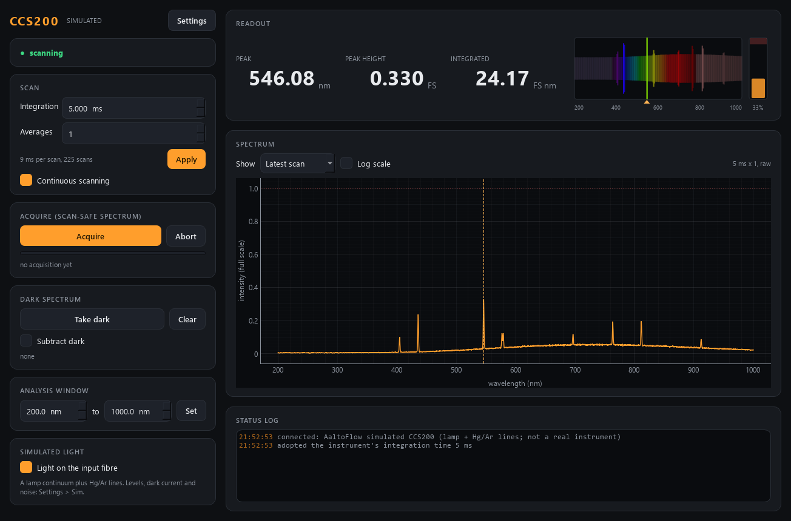

# ccs200-control -- Thorlabs CCS200/M compact spectrometer (or a simulator)

Spectrometer module of the AaltoFlow suite, for the Thorlabs **CCS200/M**:
a compact grating spectrometer with a 3648-pixel linear CCD covering
**200 - 1000 nm** (< 2 nm FWHM), on USB. Without `--real` it runs a simulator
that looks like one: a lamp continuum plus Hg/Ar emission lines, read through a
CCD with offset, dark current, noise and saturation.



| control / reading | |
|---|---|
| integration time | 10 us - 60 s (the driver's own range); signal **and** dark current scale with it |
| averages | scans averaged per acquisition |
| subtract dark | spectrum minus the latched dark; with it on, `acquire` is **refused** unless a dark at the same integration time exists |
| analysis window | the nm range the scalar detectors look at |
| acquire | the scan-safe spectrum: the mean of N scans that all **started after** the trigger |
| take dark | the same acquisition, kept as the dark -- **block the light first** |
| spectrum | array detector: intensity per pixel vs wavelength (nm) |
| peak wavelength / peak intensity / integrated intensity / saturated | scalars from the same acquisition |

Intensities are in **fractions of full scale** (1.0 = the pixel saturated), the
unit the CCS driver itself uses, so "0.6" means the same thing on the simulator
and on the instrument.

Service ports **5603 / 5604**. Runs in simulation unless `--real`.

## Run

```powershell
cd modules\detector\ccs200-control
.\dev.ps1 sync --extra gui                      # or: uv sync --extra gui (off OneDrive)
.\dev.ps1 run pytest -q
.\dev.ps1 run scripts/run_service.py            # simulator; add --real for the CCS200
.\dev.ps1 run scripts/run_gui.py --connect localhost
.\dev.ps1 run scripts/run_gui.py                # GUI with its own private simulator
.\dev.ps1 run scripts/ccs200_console.py         # raw-protocol console: acquire, int 20, dark
.\dev.ps1 run scripts/smoke_test.py
```

Close **ThorSpectra** before `--real`: while it runs it holds the spectrometer.

A PC's own settings (the resource string of its unit, a user wavelength
calibration) go in `ccs200.ini` next to `pyproject.toml` (gitignored), which
`run_service.py` loads when it exists:

```ini
[hardware]
resource = USB0::0x1313::0x8089::M<serial>::RAW
calibration = factory
```

## How it talks to the instrument

Through **TLCCS**, Thorlabs' C driver library (`TLCCS_64.dll`, installed with the
Thorlabs CCS / ThorSpectra software into
`C:\Program Files\IVI Foundation\VISA\Win64\Bin`), called with Python's built-in
`ctypes` -- the same pattern as the PM16's TLPMX backend, so there is **no pip
dependency** for `--real`. At start the module only READS the instrument --
identity, wavelength calibration and `tlccs_getIntegrationTime` -- and adopts
the integration time it finds (the `.ini` value is used only when you set a
time yourself); init is done with reset OFF. One scan is: `tlccs_setIntegrationTime` (only when it
changed), `tlccs_startScan`, poll `tlccs_getDeviceStatus` for the
"transfer ready" bit, `tlccs_getScanData` (3648 doubles). The wavelength of each
pixel comes from the instrument's own calibration (`tlccs_getWavelengthData`).

**Not yet run on the instrument.** Every vendor call is marked `# VERIFY` in
`src/ccs200/backends/tlccs.py`; the list is in `CLAUDE.local.md`.

## Commands (wire verbs)

| verb | args | |
|---|---|---|
| `set_integration_time` | `integration_time_s` | clamped to 1e-5 .. 60 s |
| `set_averages` | `averages` | 1 .. 1000 |
| `set_dark_subtract` / `set_continuous` | `on` | |
| `set_window_min` / `set_window_max` | `nm` | each end bounds the other (1 nm minimum) |
| `set_window` | `min_nm`, `max_nm` | both at once |
| `acquire` / `take_dark` | | reply `{"acq_id": n}`; wait for status `acq_id == n` and not `acquiring` |
| `clear_dark` / `abort` | | |
| `get_trace` | `which`: sample / last / dark | `{"spectrum": [...], ...conditions}` |
| `get_wavelengths` | | `{"values": [...]}` nm per pixel |
| `set_light` / `set_sim` | `on` / `name`, `value` | simulator only |

plus the universal `status`, `info`, `get_config`, `set_config`, `describe`,
`shutdown`.

## In a scan

`describe` declares `spectrum` as an **array detector** with a hardware
dimension `wavelength` (coordinate from `get_wavelengths`, read once per scan)
and an `acquire` block keyed on `acq_id`, so scan-core triggers fresh scans at
every point and waits for *that* acquisition. The scalar detectors share the
acquire group: one exposure, several reads. `take_dark` carries a `wait` block,
so a routine can take the dark before a scan (with a shutter closed).

## Tests

```powershell
.\dev.ps1 run pytest -q          # 54 tests, all offline; network tests on ports 17260/17261
```

The real backend is tested against a fake DLL (`tests/fake_tlccs.py`) for its
call sequence and buffers -- not for the instrument's behaviour.
