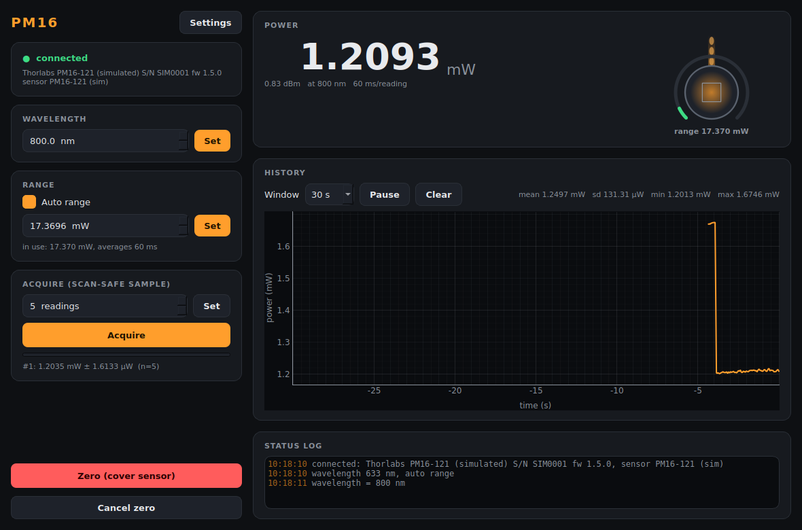

# pm16-control — Thorlabs PM16 USB power meter

Optical power meter module of the TR-MOKE suite, for the Thorlabs **PM16**
series (the lab's unit: **PM16-121**, Si photodiode, 400–1100 nm). The first
module in the suite **tested on real hardware** (2026-09-15).



| control / reading | |
|---|---|
| wavelength | sets the responsivity the meter uses; a wrong wavelength gives a wrong power, not an error |
| auto range / manual range | manual range snaps **up** to the meter's next range (0.174 mW, 17.4 mW, 1.74 W on the PM16-121) |
| power | live, ~17 readings/s (each a fixed 60 ms average) |
| acquire | the scan-safe sample: mean ± sd of N readings that all **started after** the trigger |
| zero | dark adjustment — **cover the sensor first** |

Service ports **5571 / 5572** (instrument #8). Runs in simulation unless `--real`.

## Run it

```powershell
cd modules\detector\pm16-control
uv sync --extra gui
uv run scripts/list_devices.py                 # which meters this PC sees (changes nothing)
uv run scripts/run_gui.py --real               # GUI on the real meter, no service
uv run scripts/run_service.py --real           # the service on the real meter
uv run scripts/run_gui.py --connect localhost  # GUI on the running service
uv run scripts/pm16_console.py                 # raw-protocol console: power, acquire, wl 633
uv run pytest -q
```

Close **Thorlabs OPM** first: while it runs it holds the meter.

Stop the service with Ctrl+C, the launcher's Stop, or the `shutdown` verb —
**never taskkill it**: a killed service can leave the PM16 answering "I/O error"
until it is unplugged and plugged back in.

## How it talks to the meter

Through **TLPMX**, Thorlabs' C driver library (`TLPMX_64.dll`, installed with
OPM), called with Python's built-in `ctypes`, so there is no extra package to
install. Why not pyvisa/SCPI like smb: Thorlabs gives the PM16 its own USB
driver by default, and NI-VISA cannot see a device on it; TLPMX works with
either driver.

At start the module **only reads** the meter: it adopts the stored wavelength,
auto/manual range and range in use (the meter remembers them across power
cycles) and writes nothing. The config's sensor values reach the meter only when
you set them (a setter, `set_config`, or Settings > Apply). The old
`hardware.push_on_start` option is gone; an old .ini that has it is fine.

## Commands (wire verbs)

`set_wavelength{wavelength_nm}` · `set_auto_range{on}` · `set_range{range_W}`
(switches auto off) · `set_acquisition{readings}` · `acquire` → `{acq_id}` ·
`get_sample` · `zero` · `cancel_zero` · `shutdown{keep_outputs?}` (close the meter and exit; the flag changes nothing, a meter has no output) · plus the universal `status`, `info`,
`describe`, `get_config`, `set_config`.

In scan-core: settable `wavelength` (and `range` when auto-range is off),
detectors `power` / `power_std` (mW, acquired) and `live_power`.

**Fly scans:** `stream_start` / `stream_read` / `stream_stop` record every
reading (~16 per second, in W) with its time stamp while a scan-core fly scan
moves the stage; scan-core bins them by the stage's measured position. Each
reading is stamped at the middle of its 60 ms averaging window, so no lag
correction is needed, but anything finer than speed × 60 ms is smeared. An
overrange reading is recorded as a gap, not as a clipped value.
