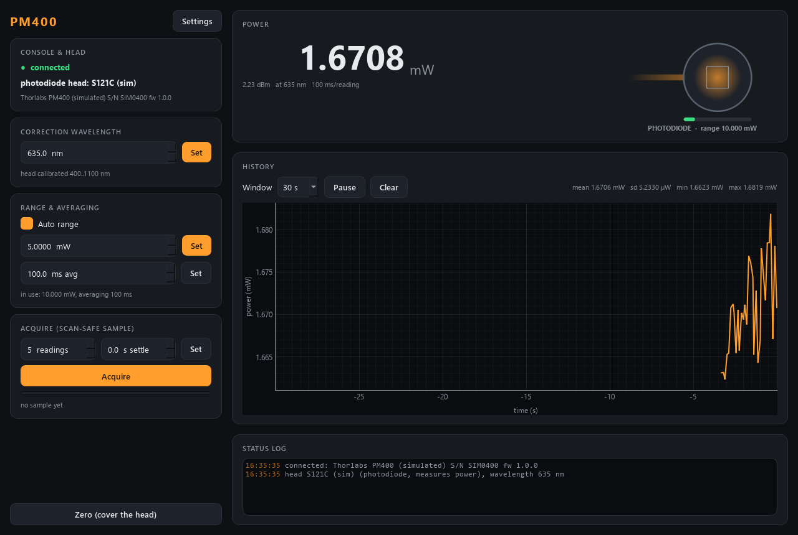

# pm400-control — Thorlabs PM400 power / energy meter

Power and energy meter module of the AaltoFlow suite, for the Thorlabs **PM400**
handheld console. The console takes interchangeable C-series sensor heads, and
the module follows whichever head is plugged in:

| head | measures | notes |
|---|---|---|
| photodiode (S12xC) | power, W | fast; the wavelength setting changes the reading a lot |
| thermal (S30xC) | power, W | flat spectrum, but **slow** (~1 s): use the acquire settle time |
| pyroelectric (ES1xxC) | energy per pulse, J | manual energy range only, no zero |
| none | — | controls grey out, acquire is refused |



| control / reading | |
|---|---|
| wavelength | the correction wavelength; limits come from the head |
| auto range / range | power heads; manual range snaps **up** to the console's next range |
| energy range | pyro heads (always manual) |
| averaging time | power heads: each reading averages over this time (kept ≤ 1 s on purpose) |
| power / energy | live readings |
| acquire | the scan-safe sample: mean ± sd of N readings that all **started after** the trigger (+ an optional settle time) |
| zero | zero adjustment — **cover the head first**; usable in scan routines |

Service ports **5617 / 5618**. Runs in simulation unless `--real`; the simulated
head is chosen in Settings ▸ Simulation (`sim.head`), and changing it is like
plugging in another head.

## Run it

```powershell
cd modules\detector\pm400-control
.\dev.ps1 sync --extra gui
.\dev.ps1 run scripts/list_devices.py             # which consoles this PC sees (changes nothing)
.\dev.ps1 run scripts/run_gui.py                  # GUI on the simulator
.\dev.ps1 run scripts/run_gui.py --real           # GUI on the real console, no service
.\dev.ps1 run scripts/run_service.py --real       # the service on the real console
.\dev.ps1 run scripts/run_gui.py --connect localhost
.\dev.ps1 run scripts/pm400_console.py            # raw-protocol console: read, head, acquire, wl 633
.\dev.ps1 run pytest -q
```

Close **Thorlabs OPM** first: while it runs it holds the console.

Stop the service with Ctrl+C, the launcher's Stop, or the `shutdown` verb —
**never taskkill it**: a TLPMX session killed mid-read can leave a Thorlabs meter
answering "I/O error" until it is unplugged (suite gotcha #25).

## How it talks to the console

Through **TLPMX**, Thorlabs' C driver library (`TLPMX_64.dll`, installed with
OPM), called with Python's built-in `ctypes` — the same route pm16-control
verified on real hardware, so there is no extra package to install. Thorlabs
gives its meters their own USB driver by default, and NI-VISA cannot see a
device on it; TLPMX works with either driver.

At start, and whenever a new head is plugged in, the module **adopts** the
console's settings for that head: start-up only READS the console (wavelength,
auto range / range, averaging time, dark offset) and writes nothing, so starting
the service never changes a measurement someone set up by hand. The config's
`[sensor]` values reach the console only when you set them explicitly (a Set
button, Settings > Apply, or `set_config`). The old `hardware.push_on_start`
option was removed on 2026-09-27; an .ini that still has it loads fine.

## Commands (wire verbs)

`set_wavelength{wavelength_nm}` · `set_auto_range{on}` · `set_range{range}`
(W or J, whichever the head measures; switches auto off) ·
`set_avg_time{avg_time_s}` · `set_acquisition{readings}` · `set_settle{settle_s}` ·
`acquire` → `{acq_id}` · `get_sample` · `zero` → `{zero_id}` · `cancel_zero` ·
`shutdown` · plus the universal `status`, `info`, `describe`, `get_config`,
`set_config`.

In scan-core: settables `wavelength`, `avg_time`, `range` (when manual),
`acq_readings`, `acq_settle`; detectors `power` / `power_std` (mW) with a power
head or `energy` / `energy_std` (mJ) with a pyro head, all acquired; routine
action `zero`. The manifest changes when the head does (`describe_rev`).
