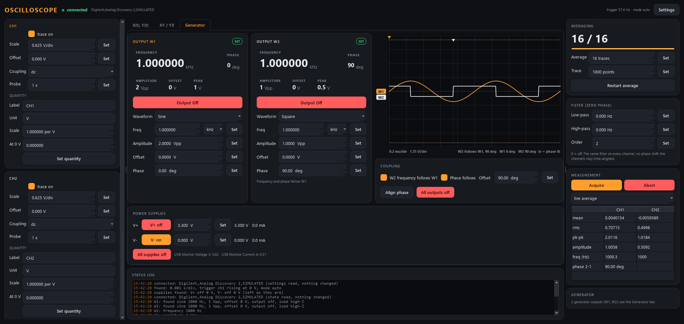

# scope-control -- Oscilloscope (Siglent SDS1000CML+ / RS PRO RSDS1102CML+, Digilent Analog Discovery)

A two-channel oscilloscope as an AaltoFlow detector: averaged, triggered
traces of both channels in physical units, with per-channel numbers, so a scan
can record a waveform (or two, and their XY relation) at every point --
against position, temperature, a drive amplitude, anything else the suite
sweeps.

It is a SCOPE, deliberately nothing more: what the recorded signals mean for
an experiment (a hysteresis loop and its coercive field, a resonance, ...)
is analysed in the AaltoView processing module, from the traces this module
records (Lukas, 2026-10-07).


**First contact with the instrument on 2026-10-06** (lab PC, firmware
6.01.01.25): the replies and three bugs it showed are written up at the top of
`backends/siglent.py` and fixed (a 0x0A byte inside the binary waveform cut the
read and put every later reply out of step; SI prefixes such as "500.0KSa" and
"0.00us" were dropped). Not yet re-run on the instrument after the fix; the
other unconfirmed commands are `# VERIFY`, and
[First run on the instrument](#first-run-on-the-instrument) is the checklist.
The module is generic over the backend's capabilities: the second backend is
the **Digilent Analog Discovery 2 / 3** (see [Analog Discovery](#analog-discovery)),
which adds a generator (W1/W2) and power supplies (V+/V-).

Ports 5633 / 5634.

## What it does with every trace

1. The scope triggers; the module notices the new record (it never changes
   the scope's run mode) and reads both channels.
2. Volts -> the channel's **physical quantity** (`quantity = scale x V +
   offset`, e.g. 10 A/V for a current probe that gives 0.1 V/A), recorded
   with the data.
3. The record is reduced to `points` samples (neighbours averaged).
4. **Running average** of the last N traces ("312 / 500"; Restart average
   empties it). A change of any setting that shapes a trace empties it too.
5. **Zero-phase filter** (low/high-pass, Butterworth magnitude squared) --
   identical on every channel, so the channels stay time-aligned with each
   other (an ordinary filter would shift one against the other).
6. Numbers: per channel mean, rms, peak-to-peak, amplitude, frequency; and
   the phase of CH2 against CH1 (`src/scope/analysis.py`).

## The window

Two tabs, each the full height: **X(t), Y(t)** (the channels against time,
CH2 on its own axis) and **XY / YX** (the scope's XY mode: CH2 against
CH1; "YX" swaps them). A cursor readout under each plot, in that plot's axis units. The
columns sit in a splitter -- drag the borders. Tab, XY/YX and the column
widths are remembered on this PC (QSettings).

The module's own settings -- the QUANTITY of each channel (label, unit, scale
per volt, value at 0 V: e.g. a probe's calibration), averaging, points,
filter -- are saved to `scope.ini` next to the project at every change
(atomically), so a restart keeps them. The scope's own settings are read from
the scope at start, as always.


## Scan use: `acquire`

`acquire` restarts the average and completes when N FRESH triggered traces
are in -- the first trace after the trigger is skipped, because it may have
been recorded before the thing the scan just changed, and so is every record
that may have BEGUN before the trigger (its pre-trigger part included).

`acquisition.freshness` (Settings > Acquisition) relaxes that for the FIRST
record: `strict` (default) = the whole record was recorded after the request;
`trigger` = its trigger came after it, so the part after the trigger is new
but the part BEFORE the trigger may be older than the request. Faster at a
slow time/div (about half a record sooner with delay 0); with a positive delay
the older part is small.

At a slow time/div consecutive records overlap: the scope re-arms once the
part AFTER the trigger is recorded, and the next record's pre-trigger part
comes from the buffer that kept running (lab bench, 0.5 s/div, delay 0: a
16.4 s record every ~8 s). An average of N records there shares samples
between neighbours -- it is not N independent records. Use a delay that puts
the trigger near the start of the record if that matters. 500 averages at 30 Hz
are ~17 s per point; the scan's wait and its timeout know that (the timeout
grows with the averages AND the record length). One acquisition feeds every
detector: the two traces (arrays with their own `time` dimension), the
per-channel numbers and the phase. A trace that hit the screen edge is reported as CLIPPED.

Refused, with the reason, when the scope cannot deliver: trigger mode STOP,
SINGLE with more than one trace to average, or AUTO at a slow time base
(>= `hardware.roll_tdiv_s`, 50 ms/div): there the scope free-runs / rolls and
makes no triggered records (lab PC: one in 120 s). In NORMAL mode triggered
records come at any time/div, one per record length (measured: ~8 s at
0.1 - 0.5 s/div) -- an acquisition there just takes long, and its timeout
knows it. The scope snaps some time/div values (the lab's: 20 ms -> 10 ms,
200 ms -> 100 ms); a warn event says when it did.

The trace length, the time base and the units must not change during a scan
(scan-core refuses ragged data); sweep them only as an outer axis, if at all.

## Rules it keeps

- **Start changes nothing.** The scope's settings (V/div, offset, coupling,
  probe, time/div, delay, trigger) are READ and shown; they are written only
  when someone changes one. The scope snaps V/div and time/div to its steps:
  status shows what was asked (`*_set`) next to what it holds.
- A change at the scope's front panel is noticed (settings re-read every
  3 s), shown in the log and adopted.
- The one write the module makes on its own is `WFSU` -- how the next
  waveform TRANSFER is thinned (a 1.4 Mpts record would take seconds to move).
  It changes nothing about the acquisition or the screen.
- Safety verbs `abort` / `stop` (cancel an acquisition) work for a viewer too.
  A scope drives nothing; the AD3 backend will add `generator_off`.
- `shutdown{keep_outputs: true}` (Mission Control's Restart) closes exactly as
  a plain stop does -- a scope's shutdown writes nothing either way -- and
  replies `kept_outputs`.

## Analog Discovery

`hardware.driver = dwf` (or `--driver dwf`): a Digilent Analog Discovery 2 or
3 through the WaveForms runtime's `dwf` library (`backends/dwf.py`, ctypes, the
only file that loads it; every unconfirmed call `# VERIFY`). ONE device, ONE
service, three parts sharing one connection:

* **Scope** (CH1/CH2): DC-coupled; V/div follows the device's ranges (AD2: 5
  or 50 V over 8 divisions); time/div = record / 10, the record is the
  device's buffer (AD2: 8192 points) at the rate the time/div needs; no
  "roll". Trigger sources: `ch1`/`ch2` (level + slope), `ext1`/`ext2` (the T1
  / T2 pins: slope only), `w1`/`w2` (the generator starting a period: neither).
  The GUI and describe show level / slope only where they mean something.
* **Generator** W1/W2: afg-control's generator brain, COPIED
  (`src/scope/generator/`, same rules: read-only start, clamps to lab limits,
  settled = pushed and read back, W2 follows W1 with a phase offset). Verbs
  `gen_set_output|waveform|frequency|amplitude|offset|phase|duty|symmetry
  {channel: w1|w2, ...}`, `gen_set_follow`, `gen_set_phase_follow`,
  `gen_set_phase_offset`, `gen_align_phase`, `gen_outputs_off` (safety);
  describe ids `w1_frequency`, `gen_follow`, ... Its settings (coupling,
  limits) are saved in `scope-generator.ini`. No load setting on the AD.
* **Supplies** V+/V- (Lukas 2026-10-08: controlled): `set_supply {supply:
  vplus|vminus, on?, volts?}`, `supplies_off` (safety). Never switched on at
  start; clamped to `supplies.vplus_max_V` / `vminus_min_V` and the device's
  range (AD2: 0..+5 / -5..0 V) with a warn; describe marks "on" as `danger`;
  off when the service stops. Status: setpoint, measured V and A, and the
  device's other monitors (USB voltage / current).

Outputs and supplies are switched off on the way out. A restart
(`shutdown {keep_outputs: true}`) does NOT keep them on the Analog Discovery:
the device resets when it is opened again (measured on the lab AD2,
2026-10-08), so the next start finds them off -- the service says so.

On the AD2 (measured 2026-10-08): changing a setting of a RUNNING output
stopped it (dwf auto-configure 1, the default). The device is opened in
DYNAMIC auto-configure (3): changes apply without stopping; after every change
the output's status is read, and a running output found stopped is started
again (Configure 3 "succeeded" but did not restart it). A phase between W1 and W2 needs a
common start: setting a phase, or switching an output on while the other
runs, restarts both together (W2 slaved to W1). The CH1/CH2 trigger has a
hysteresis (`hardware.dwf_trigger_hysteresis_div`, 0.05 division): without
it the input noise fired the trigger on the wrong edge.

Generator tab of the window: the AFG's output cards, the drawing of both
outputs, the coupling row and the supplies. `--driver dwf` and the simulator
`sim.model = ad` (W1 looped back to CH1, W2 to CH2, like the lab bench)
show it.



**Self-test on the lab bench** (W1 -> scope input 1, W2 -> input 2):

```powershell
uv run scripts/ad_selftest.py --connect localhost
```

It measures each input's zero with the outputs off (they sit at 0 V), then W1
sine at 100 Hz / 1 kHz / 10 kHz on CH1 (amplitude, frequency, offset against
the zero), then W2 at +90 deg on CH2 (amplitude, phase CH2 - CH1), and
switches both outputs off. Supplies untouched. PASS / FAIL per check.

## Verbs

Scope settings: `set_channel_enabled`, `set_vdiv`, `set_offset`,
`set_coupling`, `set_probe` (each `{channel, ...}`), `set_tdiv`, `set_delay`,
`set_trigger_source|level|slope|mode`. Module: `set_points`, `set_averages`,
`set_keep_raw`, `set_filter {lowpass_Hz?, highpass_Hz?, order?}`,
`set_physical {channel, scale?, offset?, unit?, label?}`, `restart_average`, `set_sim` (simulator). Measuring: `acquire -> {acq_id}`,
`abort`/`stop`, `get_trace {which: live|sample}`, `get_time`, `get_sample`.
Plus `status`, `info`, `get_config`, `set_config`, `describe`, `shutdown`.

## Setup (lab PC)

Analog Discovery: install WaveForms (it brings the `dwf` runtime; the lab PC
has 3.24.4), close the WaveForms program (one process per device), set
`hardware.driver = dwf` in scope.ini (or `--driver dwf`), `--real`.

Siglent:

1. NI-VISA. The scope is USB-TMC (`USB0::0xF4EC::0xEE3A::<serial>::INSTR`,
   Siglent's vendor id) -- or GPIB through Siglent's USB-GPIB adapter at the
   address in the scope's I/O menu (it showed 18): `GPIB0::18::INSTR`.
2. `cd modules\detector\scope-control` then `uv sync --extra gui --extra real`.
3. Mission Control > Instruments on this PC offers the address (`--visa`).

## Run

```powershell
uv run scripts/run_service.py                      # the simulated bench
uv run scripts/run_service.py --real --visa "USB0::0xF4EC::0xEE3A::SDS...::INSTR"
uv run scripts/run_gui.py --connect localhost
uv run scripts/scope_console.py acquire
uv run scripts/smoke_test.py
```

## First run on the instrument

The bench of 2026-10-06: AFG CH1 -> scope CH1, AFG CH2 -> scope CH2 and EXT
TRIG. Let the AFG module drive (afg-control): CH1 sine 30 Hz, CH2 square
following CH1 (`follow on 0`), both at high-Z.

1. **Identity and start.** Start `--real`. The log must say what the scope
   shows (V/div, time/div, trigger) and NOTHING may change on its screen.
   Any "could not read ..." names a query to fix.
2. **Reply headers / units** (`_num`): V/div, offset, time/div read right?
   Coupling words (D1M/A1M/GND) and probe (ATTN) right?
3. **Trigger readback** (`TRSE?` format, `EX:TRLV?`, `EX:TRSL?`): source EXT,
   level, slope as on the screen.
4. **New records** are told by the CONTENT of the CH1 block (not `INR?`, which
   blocks ~0.5 s per call while the scope runs -- measured 2026-10-07): the
   trigger rate in the header should be the AFG's rate, or whatever the scope
   manages (each record takes its own length plus dead time, plus ~0.1 s per
   channel transfer). 0 Hz with a running scope: tell Claude.
5. **Waveform** (`WFSU`, `C1:WF? DAT2`, 25 codes/div): CH1 in the Y-t plot
   must have the AFG's amplitude; CH2 a 0..V square.
6. **Time axis and the trigger point** -- MEASURED 2026-10-07: the axis is
   built from the points the scope actually SENDS (at 1 ms/div the block held
   20480 points = 41 ms of memory; SANU? said 8000, the screen shows 14 ms),
   centred on the trigger (edge at +0.06 ms with delay 0), and a POSITIVE
   delay moves the window later (t = +TRDL - span/2 + ...; the first build had
   the sign inverted). Re-check: with a delay set, the edge stays at t = 0.
7. **Writing** each setting from the GUI (V/div, offset, coupling, probe,
   time/div, delay, source, level, slope, mode): the screen follows, the GUI
   shows the snapped value.
8. **Acquire** 50 averages: the time it takes ~ 51 / trigger rate.
9. Close the service: the scope's front panel works again (Go To Local).

Then record the result in `docs/VERIFIED_INSTRUMENTS.md`.

## Tests

```powershell
uv run pytest -q        # 109 tests, offline: the simulated bench, a simulated
                        # Analog Discovery, a fake SDS1000CML+ and a fake dwf library
python ..\..\..\tools\check_modules.py scope --live
```
