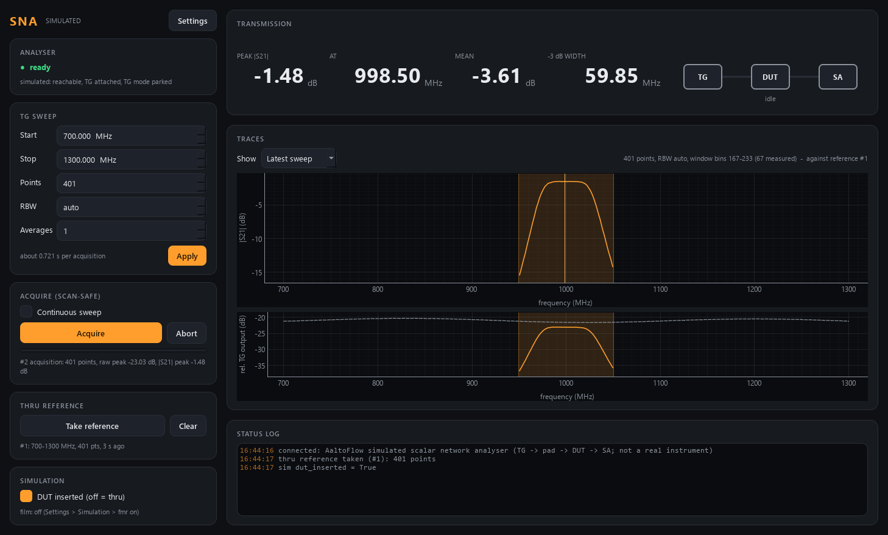

# shsna-control -- Scalar network analyser (Signal Hound)

Transmission |S21| in dB with the Signal Hound kit: the **USB-TG44A tracking
generator** sweeps a tone through a device under test (DUT) into the
**SA44B / SA124B** analyser, and the power that comes through is divided by a
stored **thru reference** (the same sweep with the DUT replaced by a thru).
Scalar: power only, no phase.



Ports 5627 (commands) / 5628 (status).

## Three modules, one analyser

The SA API allows ONE process per analyser, and the TG can only be driven
through the analyser's handle. So (decision 2026-09-28):

| module | what it does |
|---|---|
| `signalhound` | the spectrum analyser; the **only owner** of the USB devices |
| `shsg` | the TG as a CW signal generator (through `signalhound`) |
| `shsna` | this module: TG sweeps through a DUT (through `signalhound`) |

With `--real`, shsna is a **client of the signalhound service** (raw ZeroMQ,
no package import). It opens no USB device and claims no hardware lock. A TG
sweep is exclusive on the analyser: signalhound pauses its spectrum sweeping
and any CW output while it runs, and restores them afterwards. Start
signalhound first (`start_after` in module.toml does that in the launcher).

## Units

The TG44A reports a TG sweep in **dB relative to its calibrated output**, not
in dBm, and its output level cannot be set in sweep mode (measured on the lab
PC, 2026-09-28: -19.4 dB flat through a 20 dB pad; -30 and -20 dBm gave the
same trace). So there is no level knob, `raw` is in dB (rel. TG output), and
`transmission = raw - thru` in dB. At most 1001 points per sweep; a sweep
takes about 0.2 s + 1.3 ms per point.

## Measuring

1. Replace the DUT by a thru, press **Take reference** (or `take_reference`).
2. Put the DUT back, press **Acquire** (or `acquire`).
3. Transmission appears; peak, its frequency, band-averaged transmission and
   the -3 dB width are shown and are scan detectors.

Transmission is REFUSED (with the reason) without a reference, or when the
reference was taken on another frequency grid. A failed acquisition (owner
down, no TG, sweep aborted) is latched as failed: `acq_error` says why, and
reading its trace raises instead of returning the previous one.

## In a scan

Detectors (one acquisition feeds all of them): `transmission` and `raw`
(arrays over the analyser's frequency grid, in MHz), `peak_transmission`,
`peak_freq`, `mean_transmission`, `bw3`, `raw_peak`. Actions for routines:
`take_reference` (waits, then checks `acq_error == ""`), `clear_reference`.
The frequency coordinate is the analyser's grid, known after a reference (or
one acquisition) of the band -- take the reference before the scan.

### Windowed acquisition (2026-09-28)

FMR in field with the SA + TG is slow if every field point sweeps the whole
band. So `acquire` takes an optional `window: [i0, i1]` -- INCLUSIVE bin
indices of the full grid (`get_frequencies`) -- and sweeps only f[i0]..f[i1]
in i1 - i0 + 1 points, so every measured bin lands exactly on the full grid
and on the thru reference. scan-core predicts the resonance from the field and
the film and asks for a window around it; describe announces it on the
`transmission` and `raw` detectors as
`"window": {"arg": "window", "unit": "bin", "min_bins": 11}`.

- Clamped to the grid; narrower than 11 bins is widened symmetrically; the
  whole grid (or no window) is a full sweep; a malformed window is refused.
- `get_trace` still returns FULL-LENGTH arrays, null outside the window, with
  `window: [i0, i1]` (a full sweep: `[0, n-1]`). `get_result` computes its
  scalars on the measured bins only (a -3 dB width that runs into the edge of
  the window is empty, as at the edge of a full sweep).
- Transmission = the raw window minus the reference's own bins i0..i1. The
  reference is always a full-band thru (`take_reference` ignores a window).
- If the analyser does not put the bins where asked (checked to 1e-6
  relative), the acquisition sweeps the WHOLE band instead and says so in the
  sample's `window_fallback` -- values are never interpolated.

## The simulated FMR film (2026-09-28)

To test the whole windowed FMR scan without hardware, the simulator's DUT can
carry a magnetic film: Settings > Simulation `fmr_on` (off by default, then
nothing changes). The DUT becomes a broadband waveguide with a film that
absorbs a Lorentzian dip (`fmr_depth_dB`) at its Kittel frequency:
in-plane with a uniaxial anisotropy (`fmr_hk_mT`, `fmr_easy_axis_deg`; the
magnetisation's equilibrium angle is solved), or out-of-plane
f = gamma'(B - mu0 Meff) above saturation and no line below. Linewidth from
`fmr_alpha`, or fixed by `fmr_linewidth_Hz`. The field comes from a magnet
service's status stream (Settings > Sim field: mag2d default, mag2dcal, clMag,
ppms; ports from the launcher) or a manual value -- the simulator only
listens. Status shows what the film sees: `sim_field_mT`, `sim_angle_deg`,
`sim_fres_Hz`, `sim_field_source`, `sim_field_ok`. `set_sim` takes the film
knobs and `field_source` / `manual_field_mT` / `manual_angle_deg`.

## Running

```powershell
cd modules\detector\shsna-control
uv sync --extra gui
uv run pytest -q
uv run scripts/run_service.py              # simulator (standalone)
uv run scripts/run_service.py --real       # via the signalhound service (5587/5588)
uv run scripts/run_gui.py --connect localhost
uv run scripts/run_gui.py                  # in-process simulator
uv run scripts/shsna_console.py            # raw-protocol console
uv run scripts/smoke_test.py
```

`shutdown{keep_outputs?}`: the flag changes nothing here -- a stop never
changes an output (a TG acquisition this module started is aborted either way).

The simulator models the bench: TG ripple, cable loss rising as sqrt(f), a
20 dB pad, and a Butterworth band-pass DUT that can be removed (`set_sim
dut_inserted false`) to take the thru -- or, with `fmr_on`, a waveguide with a
magnetic film (above). The in-process GUI (`run_gui.py` with no flags) takes a
thru reference and then one windowed acquisition around the filter, so the
window shading shows at once.
