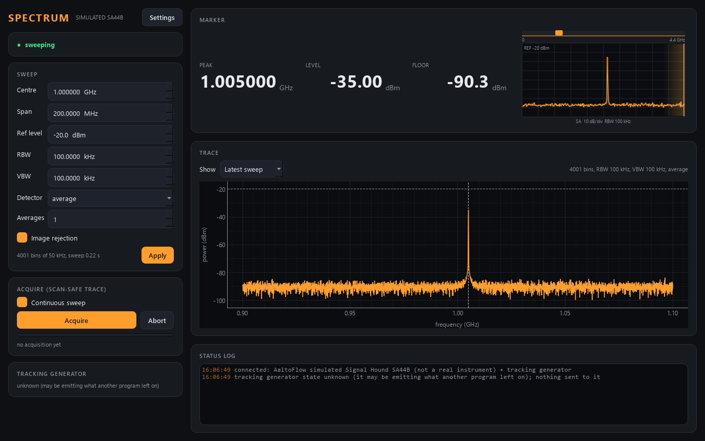

# signalhound-control -- Signal Hound SA44B / SA124B spectrum analyser (owner of the USB-TG44A)

A swept **spectrum analyser** for the suite: power-per-bin traces in dBm, peak,
noise floor, averaged scan-safe acquisitions. It drives whichever analyser is
plugged in: the **SA44B** (1 Hz - 4.4 GHz, RBW up to 250 kHz) or the **SA124B**
(100 kHz - 12.4 GHz, up to 6 MHz); the frequency envelope follows the model it
finds. It talks to Signal Hound's **sa_api.dll** through ctypes (`--real`), or
simulates one: a signal generator with harmonics on a realistic noise floor,
and a band-pass filter behind the tracking generator.

**It is also the only owner of the USB devices**, including the **USB-TG44A
tracking generator**, which can only be driven through the analyser's API
handle. Since 2026-09-28 (Lukas's decision) the Signal Hound kit is three
modules:

| module | what | talks to the hardware |
|---|---|---|
| `signalhound` (this one, 5587/5588) | spectrum analyser | yes -- the only one |
| `shsg` (5625/5626) | the TG as a CW **signal generator** | through this service |
| `shsna` (5627/5628) | **scalar network analyser**: TG sweeps, thru, transmission | through this service |

This panel therefore only SHOWS what the TG is doing; the thru reference and
transmission are shsna's.



*(simulator: an SA44B, 1 GHz +- 100 MHz at 100 kHz RBW, the generator's tone at
1.005 GHz / -35 dBm on a -91 dBm floor.)*

Ports **5587 / 5588**.

> **The real backend was first run on an SA44B + TG44A on 2026-09-28** (lab PC).
> Every call into sa_api.dll that still needs checking is marked `# VERIFY` in
> `src/signalhound/backends/sa_api.py`.

## Run

```powershell
cd modules\detector\signalhound-control
uv sync --extra gui                              # there is no `real` extra: the DLL is loaded with ctypes
uv run scripts/run_service.py                    # simulated SA44B + TG44A
uv run scripts/run_service.py --model SA124B     # simulate the 12.4 GHz one
uv run scripts/run_service.py --real             # the first Signal Hound found
uv run scripts/run_service.py --real --serial 12345678 --model SA124B
uv run scripts/run_gui.py --connect localhost
uv run scripts/signalhound_console.py acquire
```

For `--real`, install Signal Hound's **Spike** software (it brings the USB
driver and `sa_api.dll`), make sure Spike itself is **closed** (it would hold
the device), and either put the DLL on the PATH or name it with `--dll` /
`hardware.dll_path`. The launcher only passes `--real`, so a PC keeps its choice
in `signalhound-control\signalhound.ini` (not in git), read by `run_service.py`:

```ini
[hardware]
model = SA124B
serial = 12345678
dll_path = C:\Program Files\Signal Hound\Spike\sa_api.dll
```

`model = auto` accepts whatever is plugged in; a named model makes the service
**refuse** a different one, so a swapped USB cable is noticed.

## Start-up changes nothing

Starting the service (or a GUI with its own analyser) only READS the analyser:
model (which sets the frequency and RBW envelope), serial, API version and
whether a USB-TG44A is paired. An SA44B/SA124B keeps no settings of its own
and has no call to read the host's settings back, so nothing else can be
adopted -- and nothing is written: no configure, no initiate, no abort, and
nothing to the tracking generator. The panel says "not configured yet" until a
setting is changed, **Continuous** is ticked or an acquisition is started; each
of those configures the analyser with the settings shown.
`acquisition.sweep_on_start = true` in `signalhound.ini` brings back sweeping at
start. (The in-process simulator GUI, `python -m signalhound.apps.gui`, sweeps
at once: it has no instrument to disturb.)

**The service remembers the sweep window.** Because the analyser forgets
everything when it is closed, the service itself keeps centre, span,
reference level, RBW, VBW, image rejection, detector and averages in
`signalhound_sweep.ini` next to `signalhound.ini` (the simulator uses
`signalhound_sweep_sim.ini`, so it cannot overwrite the real analyser's
window). It is rewritten after a change -- at most once a second, and once
more on shutdown -- atomically, so a crash never leaves half a file. At start it
replaces the `[sweep]` defaults of `signalhound.ini`, clamped to the model just
read; it is still not sent to the analyser until the first sweep. `continuous`
and the tracking generator are NOT remembered. A missing or unreadable file
means the config defaults, with one line in the log; delete the file to start
from the defaults on purpose.

What the TG is doing cannot be read either (measured: `saGetTgFreqAmpl` only
echoes what this program set), and a TG44A may be emitting whatever another
program left on -- so at start the TG is reported as **unknown**, never as a
guessed "off".

## The analyser picks its own bins

A Signal Hound decides how many frequency bins a sweep has -- from span and RBW.
The module therefore never assumes a grid: after every settings change it
reconfigures the analyser and uses the bins it reports (`points`, `bin_Hz` in
status; `get_frequencies` for a scan). Every trace carries `start_Hz`, `bin_Hz`
and `points`, and the frequency axis is rebuilt from them exactly.

## Settings

| control | verb | note |
|---|---|---|
| centre, span | `set_center`, `set_span` (or `set_start_stop`) | kept inside the model's range |
| start, stop | `set_start`, `set_stop` (the other end held) | scan parameters too; start must stay below stop |
| reference level | `set_ref_level` | the API chooses gain / attenuation from it; too low = **OVERLOAD** |
| RBW | `set_rbw` | continuous to 100 kHz, then 250 kHz (and 6 MHz on the SA124B) -- snapped |
| VBW | `set_vbw` | at most the RBW (a narrower RBW drags it down) |
| detector | `set_detector` | `average` or `peak` (never misses a tone between coarse bins) |
| averages | `set_averages` | sweeps per acquisition, averaged in **power**, not in dB |

In a scan (scan-core) the detectors are, all from ONE acquisition per point:

| detector | what |
|---|---|
| `signalhound.trace` | power per bin in dBm, dim `signalhound.freq` in GHz |
| `signalhound.peak_freq`, `.peak_level` | the highest bin of the averaged trace |
| `signalhound.noise_floor` | the median of the averaged trace |
| `signalhound.overloaded` | the input compressed during the acquisition |

Changing span or RBW between scan points changes the number of bins, and the
scan engine refuses a ragged trace -- scan the centre or another instrument.

## The tracking generator (what the panel shows)

The TRACKING GENERATOR card and describe's "Tracking generator" indicators show
one of four modes:

| `tg_mode` | meaning |
|---|---|
| `unknown` | nothing has set the TG since start: it may be emitting what another program left on |
| `parked` | at `hardware.tg_park_hz` / `tg_park_dbm` (default 10 kHz, -30 dBm) -- the TG44A has **no off** |
| `cw` | a CW for the shsg module (a diamond marks it on the panel's ruler) |
| `sweep` | a TG sweep for the shsna module; spectrum sweeping is **paused** until it ends |

Measured on the TG44A (2026-09-28): `saAbort`, closing the device, even exiting
the program leave the TG emitting its last frequency and level, and after a TG
sweep it sits at the last swept frequency. So "off" is a **park** (Lukas's
decision): `tg_cw` with `on: false`, the service's shutdown and the end of a TG
sweep without a CW all park it. `shutdown{keep_outputs: true}` (a restart for a
code update) does NOT park it: the TG keeps its tone and the next start adopts it.

## For client modules: the TG contract

This is the contract `shsg` and `shsna` are built against. Every reply is
`{"ok": true, ...}` or `{"ok": false, "error": "..."}`; a refusal's reason is the
error text. These verbs are for CLIENT MODULES, not for scan-core: this
module's `describe` shows the TG only as indicators; shsg / shsna offer the
scan controls and detectors.

### Status keys (in every PUB frame and in the `status` reply)

| key | type | meaning |
|---|---|---|
| `tg_attached` | bool | a TG44A is paired with the analyser |
| `tg_mode` | str | `unknown`, `parked`, `cw` or `sweep` (table above) |
| `tg_cw_on` | bool | a CW is APPLIED (the echo a client settles on) |
| `tg_cw_freq_hz`, `tg_cw_level_dbm` | float | the CW: applied while `tg_cw_on`; while parked, the CW KEPT for the next "on" (null until one was set) |
| `tg_park_hz`, `tg_park_level_dbm` | float | where "off" parks the TG |
| `tg_acq_id` | int | the last TG acquisition ACCEPTED |
| `tg_acquiring` | bool | a TG acquisition is queued or running |
| `tg_sample_id` | int | the last TG acquisition that FINISHED with a trace |
| `tg_error` | str | "" or why the last TG acquisition failed / was aborted |
| `spectrum_paused` | str | "" or why spectrum sweeping is on hold |
| `hw_error` | str | "" or the last hardware failure (values kept from the last good read) |
| `describe_rev` | int | the suite's describe revision |

The echo is stored AFTER the hardware call (gotcha #40), and a TG acquisition's
result, `tg_sample_id` and `tg_acquiring = false` appear in ONE critical
section (gotcha #28) -- after the SA and the CW have been restored.

### `tg_cw` {on?: bool, freq_hz?: float, level_dbm?: float}

-> `{"ok": true, "tg_cw": {"on", "freq_hz", "level_dbm"}, "deferred": bool}`

* `on: true` = CW at `freq_hz` / `level_dbm`; `on: false` = **park** (the TG
  has no off); the reply's freq/level are then the CW kept for the next "on".
* A missing `on` KEEPS on/off as it is: a retune while parked stays parked and
  is remembered for the next "on"; while on, it retunes the CW.
* A missing `freq_hz` / `level_dbm` KEEPS the one in force. When there is none
  (still `unknown` after start) the **park** value is used -- so ANY accepted
  call leaves `tg_mode` known (`cw` or `parked`).
* **Settle on the reply's values**, not on what you sent: the reply carries
  what was applied; status shows the same values once applied.
* While a TG sweep holds the TG the call is **accepted but deferred**
  (`"deferred": true`): it is applied -- instead of the CW remembered at the
  sweep's start -- when the sweep ends; status changes only then. (So shsg can
  shut down cleanly during an shsna sweep, and the owner never restores a CW
  nobody owns.) Aborting a queued sweep applies a deferred CW at once.
* Refused: no TG attached, frequency outside **10 Hz - 4.4 GHz**, level outside
  **-30 ... -10 dBm** (TG44A data sheet, `instruments.py`, # VERIFY), not a number.
* A CW stays on while spectra are swept (measured; `hardware.tg_cw_during_sweep`
  = true). With that flag false a CW **pauses** spectrum sweeping
  (`spectrum_paused` says so) until it is parked.
* A client that disconnects does NOT park its CW: shsg decides that.

### `tg_sweep_acquire` {start_hz, stop_hz, level_dbm?, rbw_hz?, averages?, points?}

-> `{"ok": true, "tg_acq_id": n, "points": used, "averages": n_avg, "level_applied": false}`

ONE TG-sweep acquisition, EXCLUSIVE: the sweep thread pauses spectrum
sweeping, remembers the CW, configures the TG sweep, sweeps `averages` times
(default 1, averaged in **linear power**, all inside this one acquisition),
restores the spectrum configuration (only if it was configured before -- the
start-up rule), then re-issues the CW or **parks** the TG, and only then
publishes. Wait for it like any acquisition: `tg_acq_id == n` first, THEN
`tg_acquiring == false` (gotcha #17).

* `points` default `hardware.tg_sweep_points` (401), **clamped** to 11 ... 1001
  (the API clamps to 1001 silently; here it is announced and reported).
* `level_dbm` is optional and **not applied** (measured: the TG sweep ignores
  it); if given it must still be a TG level.
* `rbw_hz` default the spectrum RBW; snapped like `set_rbw`.
* Refused: no TG; stop <= start; outside the TG44A AND the analyser's range; a
  span below `limits.min_span_Hz`; `averages` outside 1 ... 1000; another TG
  sweep queued or running ("busy").

### `get_tg_trace` {id?: int}

-> `{"ok": true, "id", "start_hz", "bin_hz", "points", "stop_hz", "db": [...], "unit": "dB", "level_dbm": null, "level_applied": false, "rbw_hz", "averages", "overload", "time"}`

The last finished TG acquisition. `db` is the **transmission in dB relative to
the TG's calibrated output** (measured: a 20 dB pad reads ~-19.4 dB), not dBm;
bin i is at `start_hz + i * bin_hz`. With `id` it must be THAT acquisition:
refused if it has not finished, was aborted or failed (the error says which).

### `tg_abort` {id?: int}

-> `{"ok": true, "aborted": bool}`. Aborts the queued / running TG acquisition
-- with `id`, only if that one is queued / running. Latched: `tg_error` says
"aborted", `get_tg_trace` of it is refused. A running sweep stops at its next
chance (a sweep already inside the analyser finishes first) and the SA and the
CW are restored as after any TG sweep.

### `tg_grid` {start_hz, stop_hz, points?, rbw_hz?}

-> `{"ok": true, "start_hz", "bin_hz", "points", "predicted": bool}`. The grid a
TG sweep with these settings WOULD use, without sweeping and without touching
the analyser -- for a scan that needs its frequency axis first. Same validation
and clamps as `tg_sweep_acquire`. Exact in the simulator; on the real analyser
predicted from `start + i * (stop - start) / (points - 1)` (`predicted: true`,
# VERIFY against `get_tg_trace`).

`info` also reports the TG envelope: `tg_freq_min_Hz`, `tg_freq_max_Hz`,
`tg_sweep_min_Hz`, `tg_sweep_max_Hz`, `tg_level_min_dBm`, `tg_level_max_dBm`,
`tg_points_min`, `tg_points_max`, `tg_cw_during_sweep`.

Console (for testing the owner side): `tgcw on 1.2 -15`, `tgcw off`,
`tgsweep 0.9 1.1 4`, `tgabort`.

## The simulator

- **Spectrum mode:** the generator (`scene.tone_Hz`, `tone_dBm`) with 2nd and
  3rd harmonics, seen through a Gaussian RBW filter, with a phase-noise skirt.
  Noise floor = DANL (-150 dBm/Hz) + 10 log10(RBW), raised 1 dB per dB of
  reference level above -30 dBm (more input attenuation). The noise fluctuates
  like real noise; a narrow VBW smooths it without lowering it. Signals above
  ref + 5 dB compress and flag OVERLOAD. The SA44B cannot see beyond 4.4 GHz,
  the SA124B can. A TG **CW** appears as a tone, after the cable and the filter.
- **TG sweeps:** dB relative to the TG output: TG flatness ripple (0.6 dB) +
  cable loss (sqrt f) + a 3rd-order Butterworth band-pass (1 GHz, 60 MHz,
  1.5 dB loss) when `scene.dut_inserted`; switch it off for a thru. Like the
  real one the simulated TG has no off and sits at the last swept frequency.
- Every scene parameter is a live setting (`set_scene`, Settings > Scene), so
  "what does a narrower filter look like" is a scan axis.

## Tests

```powershell
uv run pytest -q          # offline; the real backend against a fake sa_api.dll
uv run scripts/smoke_test.py
python ../../../tools/check_modules.py signalhound --live
```

`tests/test_tg_owner.py` pins down the TG contract above (in the simulator,
against the fake DLL, and over the wire on ports 17600/17601).
`tests/test_remember.py` pins down the remembered sweep window (restart,
corrupt file, throttling, and that start-up still writes nothing).
