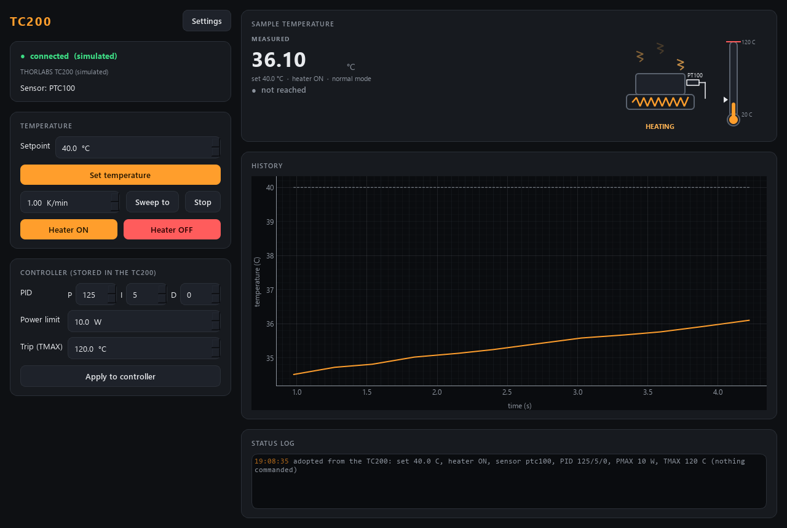

# tc200-control -- Thorlabs TC200 heater controller

One resistive **heater** and one **PT100** sensor, regulated by the TC200's own
PID loop, as an AaltoFlow module -- or fully simulated (a heated block with a
PID) with no controller attached. The setpoint in degC is a scan axis; the
module says honestly when it has been **reached**, and keeps an unattended
heater safe.



*(simulator: the box was left heating a block towards 40 C; the element glows,
heat rises, the thermometer fills towards the setpoint marker; TMAX is the red
line at the top of the scale.)*

Ports **5613 / 5614**.

> **Not yet run on the instrument.** The real backend is tested against a fake
> serial port that answers the way InstrumentKit's transcripts say the TC200
> does; every exchange that needs a look on the real unit is marked `# VERIFY`
> in `src/tc200/backends/serial_tc200.py`.

## Run

```powershell
cd modules\environment\tc200-control
uv sync --extra gui                              # simulator only
uv sync --extra gui --extra real                 # + pyserial, for the real TC200
uv run scripts/run_service.py                    # simulated heater
uv run scripts/run_service.py --real --port COM5 # the real TC200 (USB virtual COM port)
uv run scripts/run_gui.py --connect localhost
uv run scripts/tc200_console.py temp 45
uv run scripts/tc200_console.py on
uv run scripts/smoke_test.py                     # offline sanity check, seconds
```

**`uv sync` removes extras you do not name** -- on the lab PC always sync with
`--extra gui --extra real`. A `tc200.ini` next to this README (not in git) is
loaded by the service when present: put the COM port there
(`[hardware] port = COM5`) and, if the sample takes it, a higher setpoint
ceiling (`[limits] temperature_max_C = 150`).

## How it works, and why

- **The TC200 runs the loop.** You give it a setpoint and enable the output;
  its PID heats. So this is a set-and-forget module whose one subtle job is
  saying when a setpoint is **reached**: output ON, no sensor alarm, and the
  reading within `tolerance_C` (0.2) of the setpoint continuously for
  `stable_time_s` (30 s -- a heated block overshoots and rings). A new
  setpoint clears the flag in the same locked step that stores it, so no
  status can show the new setpoint next to the old point's "reached" -- the
  trap scan-core's `adopt_then_flag` exists for.
- **degC throughout.** The serial interface speaks degC only, whatever the
  front panel displays, so the module never sends `unit=`.
- **Start changes nothing.** The service ADOPTS the box's setpoint, output
  state, sensor type, PID gains, PMAX and TMAX, and sends queries only. A
  sensor setting that is not the wired PT100 is a warning (and enabling is
  refused), never a write. The stored settings are sent only when you change
  them (GUI, set_config, a setter).
- **Stop switches the heater OFF** (`hardware.disable_on_shutdown`, default
  True -- the safer choice for an unattended heater; set False to leave it
  heating). The TC200 regulates on its own, so a *crashed* service leaves it
  heating whatever this says. `shutdown{keep_outputs: true}` is a restart (a
  code update): the heater is left as it is and the next start adopts it.
- **`ens` toggles**, there is no "enable". Switching on and off is therefore
  read status byte -> toggle only if needed -> read again to confirm, under
  one lock, so pressing "Heater ON" twice never switches it off.
- **Sensor interlock.** The manual warns the box cannot detect a *wrong* sensor
  type (only an open or shorted one), and a PT100 read as a PT1000 reads ~10x
  too cold -- the controller would heat without limit. The service warns at
  start if the box is not set to `hardware.expected_sensor` (ptc100) and
  **refuses to enable** until it is; changing the sensor type is refused while
  heating.
- **The setpoint ceiling moves.** It is `min(limits.temperature_max_C (100),
  TMAX - tmax_margin_C (5), 200)`: a setpoint AT TMAX trips the relay on the
  first overshoot. TMAX lives in the box (front panel, `set_tmax`), so the
  ceiling -- and `describe`'s revision -- follow it.
- **Front-panel changes are adopted**, not fought: a setpoint or a gain changed
  on the box shows up in status and in the config within a poll (5 s for the
  stored settings).
- `describe` gives scan-core one settable, `tc200.temperature` (C), with a
  settle **timeout derived from the range** at a pessimistic 2 C/min (a heater
  cannot cool; going down is passive and slow), the output switch
  `tc200.enabled`, the box's gains / PMAX / TMAX / sensor (the last two flagged
  danger), and the action **`heater_off`** for an after-scan routine.
- No power readback: the TC200 has no command for the actual output power, so
  the indicator's glow is an estimate from how far below the setpoint the
  block is.

## Sweep (fly scans over the temperature)

A fly axis in scan-core can fly `tc200.temperature`: the module sweeps the
setpoint over each row at a set pace, the detectors stream, and every sample
is binned by the **measured** temperature (`describe`: a `ramp` block,
`kind: software`, readback `measured: true`).

- **Why a software ramp.** The TC200 has ramps of its own only inside its
  front-panel CYCLE program (a stored temperature profile); no serial command
  to start, pace or stop one is documented. So the service walks the setpoint
  (`softramp.py`, the suite's shared copy) and sends a new `tset` every time
  the walk has moved by the box's **0.1 degC** resolution -- at 1 K/min that is
  one command every 6 s.
- **Verbs:** `ramp_temperature{temperature_C, rate_C_per_s}` -> `{ramp_id}`;
  `ramp_stop` ends it where the setpoint is (a **safety** verb: a viewer may
  send it); `stream_start` / `stream_read` / `stream_stop` hand out the
  temperature readings (group `temperature`). Status: `ramping`, `ramp_id`,
  `ramp_target_C`, `ramp_rate_C_per_s`.
- **Units.** The rate travels as **degC per second** (scan-core reads every
  ramp rate as unit/s); the GUI's Sweep box shows and takes **K/min** and
  converts. Limits `limits.ramp_rate_min_C_per_s` / `ramp_rate_max_C_per_s`
  (0.1 .. 20 K/min; `# VERIFY` how fast the real block follows, both ways).
  A target or rate outside the limits is clamped and warned.
- **The readback.** While a sweep runs or a stream records, the poll thread
  reads the temperature alone every `hardware.ramp_poll_s` (0.1 s) and the
  status byte and setpoint at `poll_s`. The block lags the setpoint by its
  thermal time constant (minutes): the reason the samples are binned by
  measurement, and the reason a heater sweeps DOWN no faster than the room
  cools it.
- **A set takes over:** `set_temperature` (and the shutdown) stops a running
  sweep first. A sweep in CYCLE mode is refused; with the output off it runs
  but warns (nothing heats).
- `# VERIFY` on the unit: the time one `tact?` takes (it bounds
  `ramp_poll_s`), and that a `tset` every few seconds does not upset the box's
  own PID (an integral that winds on every step).

## Layout

```
src/tc200/
  config.py            Temperature / Device (stored in the box) / Limits / Hardware / UI + .ini
  backends/
    base.py            HeaterBackend Protocol + StatusBits (the decoded stat? byte)
    sim.py             SimulatedTC200 -- first-order thermal plant + PID, TMAX trips, alarms
    serial_tc200.py    SerialTC200 -- the USB virtual COM port (lazy pyserial import)
  heater.py            Heater -- clamps, pushes, polls, decides "reached", keeps it safe
  softramp.py          the setpoint sweep (byte-identical copy of suite-common's)
  stream.py            StreamRecorder -- the temperature readings for a fly scan
  net/                 service, client, protocol, describe
  apps/                gui (HotPlateIndicator + history chart), settings dialog, theme
scripts/               run_service.py, run_gui.py, tc200_console.py, smoke_test.py
tests/                 63 tests, offline (the real backend against a fake serial port)
```
