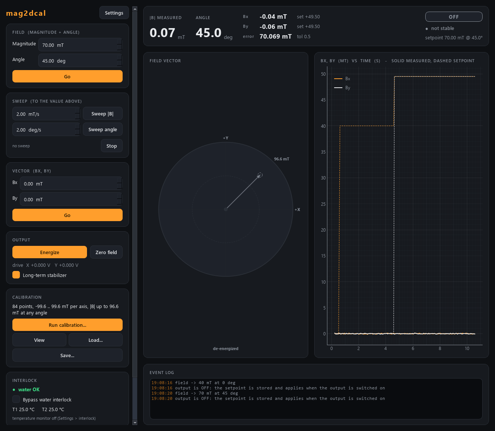

# mag2dcal-control -- 2D vector magnet, calibrated (clMag philosophy)

A **second, parallel** controller for the two-axis electromagnet, next to
[`mag2d-control`](../mag2d-control). Both are usable, both speak the **same wire
contract**, and they can be compared on the real magnet; keep whichever behaves
better.

| | `mag2d-control` | `mag2dcal-control` (this one) |
|---|---|---|
| how a setpoint is reached | a PI that runs continuously | a jump onto a **measured** B(V) curve, then a short one-way trim |
| at the setpoint | the PI keeps correcting | the output **freezes** |
| drift | the PI answers it | a slow, deadbanded **stabilizer** answers it |
| knows the magnet | `ff_mT_per_V`, one number | a measured curve per axis, **per hysteresis leg** |
| ports | 5575 / 5576 | **5577 / 5578** |

The design is clMag-control's, one dimension up: measure the plant, let the
measurement do the coarse work, approach from one side so you know which
hysteresis branch you are on, and then **stop touching the output**.



## Run it

```powershell
cd modules\field\mag2dcal-control
uv sync --extra gui

uv run scripts/run_service.py                 # simulated magnet, ports 5577/5578
uv run scripts/run_gui.py --connect localhost
uv run scripts/mag2dcal_console.py --connect localhost
uv run scripts/smoke_test.py                  # the whole story in a few seconds
uv run pytest -q
```

A GUI started **without** `--connect` runs its own private simulation; to see
the shared magnet, start the service and connect to it.

## Calibrating

```
mag2dcal> calibrate 21 0.5 5     # points per leg, dwell (s), sweep to +-5 V
mag2dcal> watch 60               # progress
mag2dcal> cal                    # what was measured
```

or the GUI's **Calibration** card (Run / View / Load / Save). Each axis is swept
to `+-v_max` and back with the other axis at 0 V, measuring the **up** and
**down** legs separately; the result is auto-saved as JSON in `Calibrations\`
and reloaded at the next start. The measured range then **becomes the field
limit**, and `describe`'s revision changes so every client re-fetches its bounds.

With no calibration the module still runs -- the jump uses the straight line
`B / control.ff_mT_per_V` -- and says so in the log, in `describe` and on the
front panel.

## The one number that matters

`tests/test_freeze.py` holds a field for ten seconds on a simulated magnet with
realistic hysteresis, with the freeze on and off. Same plant, same gains, one
boolean apart:

| | drive travel | setpoint crossings | field wander (peak to peak) |
|---|---|---|---|
| freeze **on** | **0.000 V** | 0 | **0.02 mT** |
| freeze **off** (an always-on PI) | 0.66 V | ~215 | 0.5 mT |

Details, and why it is not a gain problem, in that file's docstring.

## Sweep (fly scans)

The same verbs and status keys as mag2d-control: `ramp_field{field_mT,
rate_mT_per_s}` sweeps the signed magnitude (angle kept), `ramp_angle{angle_deg,
rate_deg_per_s}` rotates the field (magnitude kept) -- the angular FMR scan as
a fly axis -- and `ramp_stop` ends a sweep where it is (a safety verb). The
reply carries `ramp_id`; the status shows `ramping`, `ramp_id`, `ramp_knob`,
`ramp_target`, `ramp_rate`, and the state **SWEEP** while the setpoint moves.
Every Hall reading is streamed (`stream_start` / `_read` / `_stop`: `field`
along the setpoint direction, measured `angle`, `bx`, `by`, the setpoint) and
a fly scan bins by that MEASURED field.

What the calibrated philosophy needs during a sweep:

* the drive follows the moving setpoint with the calibrated feed-forward (the
  leg each axis is moving along, offset to where the drive was at the start)
  plus a two-sided PI on the measured field;
* **the drive never steps back** against the direction an axis's setpoint is
  moving (a reversal flips the iron onto the other branch, gotcha #11); if the
  field runs ahead, the drive waits and the integral does not wind up;
* **the freeze and the stabilizer stand aside** while the setpoint moves (a
  frozen output cannot follow it; a stabilizer nudge against the sweep would
  flip the branch);
* at the end (or on `ramp_stop`) each axis settles as a set_field ends,
  without going back: freeze within tolerance/2, a one-way trim from where the
  drive is if behind, an ordinary seek only if it ran past by more. The drive
  stays monotonic through the endgame (`tests/test_sweep.py`).

Any ordinary set, output off, a calibration, shutdown or a FAULT stops a
sweep; during a calibration or a FAULT a sweep is refused. Targets and rates
are clamped with a warning (`limits.field_rate_*_mT_per_s`,
`angle_rate_*_deg_per_s`, VERIFY on the magnet). The measured angle uses the
setpoint's convention (as mag2d: -B for a negative field, unwrapped to the
setpoint's turn, the setpoint angle below `limits.angle_min_field_mT`). The
GUI's **Sweep** card: a rate per knob, Sweep |B|, Sweep angle, Stop.

## Stopping

`shutdown` ramps the coils to 0 V and drops the enable line, as mag2d does.
`shutdown{keep_outputs: true}` is a restart for a code update: no ramp, the
coils keep their drive (open loop, no stabilizer, nothing watches the water)
until the next start adopts it.

## More

The suite's shared rules -- wire contract, conventions, gotchas -- are in
`..\..\..\docs\DEVELOPER_NOTES.md`; the hardware `# VERIFY` list is in the source.
