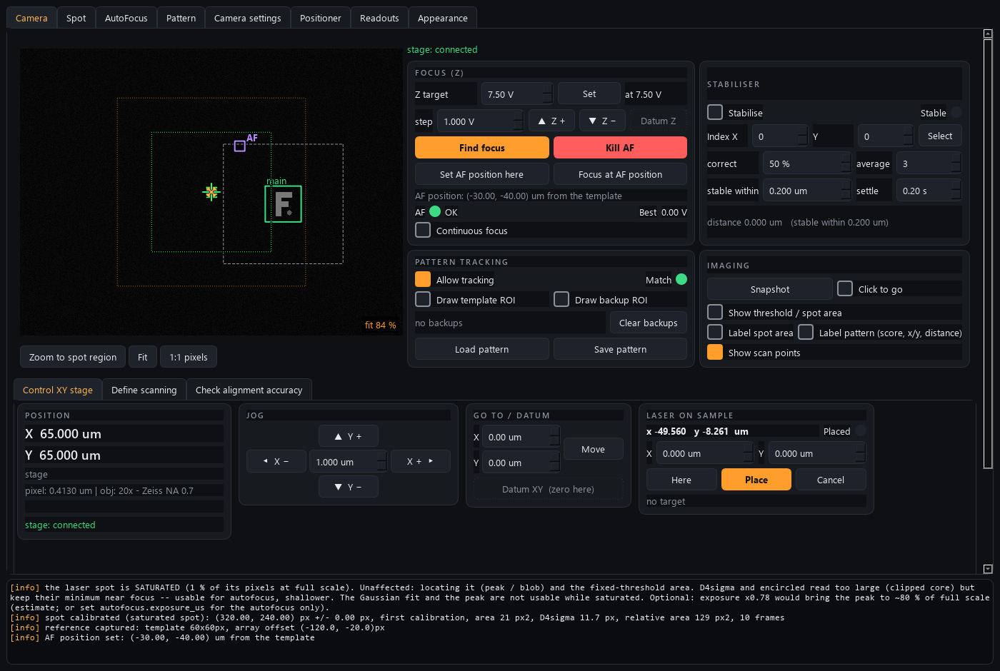

# camera-control

The **vision brain + coordinator** of the AaltoFlow instrument suite — the
Python port of the LabVIEW `CameraTRMOKEV3p6.vi`.

Where the other modules each control one instrument, this one reads a microscope
camera and *ties the rig together*. Every frame it locates a **fixed laser spot**
(threshold + centre of mass) and a **template pattern** (pattern matching), pins a
grid of **scanning points** to the template, and then closes two feedback loops by
**moving the sample**:



*The simulated scene: the laser spot (red crosshair), the tracked template, and the scan-area rectangle pinned to it. Focus (Z) is driven through zpiezo-control and XY through piezo-control -- this module owns no motion hardware.*

- **Stabiliser** — nulls the distance between the laser spot and a chosen scanning
  point by nudging the XY stage (drift compensation / "put this scan point under
  the laser"). Ports `Stabilization_StableAtPixelOrCorrectV2.vi`.
- **Autofocus / continuous focus** — sweeps Z, scores focus (spot area / edge
  sharpness / FFT), and parks Z at best focus; can also hold focus continuously.

It is a **client of the piezo-control service** for XY motion (ports 5561/5562) and
**owns the Z focus piezo** directly. As the 5th instrument it serves its own
commands on **5563** and status on **5564**, with the same ZeroMQ protocol as every
other module, so a coordinator can drive it too.

Templates save/load as annotated PNGs (the image *plus* embedded JSON metadata:
scanning geometry, pixel size, objective, template↔array offset). Pixel size is
calibrated per microscope objective from `objectives.ini`.

## Architecture (same shape as the other modules)

```
camera/
  vision.py       pure OpenCV/NumPy/SciPy engine (spot, match, focus, geometry)
  camera.py       the brain: engine thread + stabiliser + autofocus + verbs
  config.py       dataclass config groups + INI (mirrors the LabVIEW tabs)
  objectives.py   objective -> pixel-size table
  template_io.py  save/load pattern PNG with metadata
  backends/       base.py Protocols; sim.py (closed-loop scene); genicam.py,
                  kcube.py, remote_xy.py (real drivers, lazy-imported)
  net/            protocol.py (ports/helpers), service.py, client.py
  apps/           gui.py (6-tab window) + camera_view.py (live view + overlays)
scripts/          run_service.py, run_gui.py, camera_console.py, smoke_test.py
tests/            config, vision, template_io, camera, net, gui
```

The **simulator** renders a synthetic scene that *responds to motion* (the sample +
template move with the stage, the spot blurs off-focus), so the full stabiliser +
autofocus loop runs and is tested with **no hardware**.

## Running (with `uv`)

```powershell
uv sync --extra gui         # install deps incl. PySide6 for the GUI

# Terminal 1 — the service (simulated closed-loop scene by default)
uv run scripts/run_service.py

# Terminal 2 — the GUI (local sim, or --connect HOST for a remote service)
uv run scripts/run_gui.py
# or drive the running service:
uv run scripts/run_gui.py --connect 127.0.0.1

# Poke the wire by hand (no package import needed):
uv run scripts/camera_console.py status
uv run scripts/camera_console.py autofocus

# Instant offline confidence check:
uv run scripts/smoke_test.py
uv run pytest -q
```

Run the GUI *without* a separate service (`run_gui.py` with no `--connect`) and it
builds the simulated brain in-process.

## Using it (typical flow)

1. Pick your objective (Camera settings tab) so the pixel size is right.
2. Tick **Draw template ROI** and drag a box round the feature to track → the
   scanning array is pinned to it (its centre defaults onto the laser spot).
3. Tick **Allow tracking** — the template box + array follow the sample live.
4. Define the scanning grid (Define scanning tab: points, pitch, angle) and pick a
   **selected index**.
5. Tick **Stabilise** → the stage moves so the selected scan point sits under the
   laser and the **Stable?** light goes green.
6. **Find focus** runs an autofocus sweep; **Continuous focus** holds it.
7. **Save pattern** writes the annotated PNG; **Load pattern** restores everything.

**Looking at the image.** The mouse wheel zooms about the cursor; the middle
button, or Space + left drag, pans (the left button alone keeps click-to-go,
the template ROI and the scan rectangle). **Fit** shows the whole frame, **1:1
pixels** one camera pixel per screen pixel; the level is shown in the image's
corner. An autofocus still zooms to the spot region and gives your view back
when it ends; zooming by hand during the run keeps your view instead. Clicks
on a zoomed, panned image hit the right camera pixel.

**When something else picks the scan point** (scan-core, a script, another
window), the Stabiliser's Index X / Y boxes follow it -- except a box you are
typing in or have changed without pressing Select (outlined) -- and a line
under them says who drives it and where, e.g.
`scan-core ('map'): point (3, 5) of 10 x 10, moving`. On the image a pink ring
marks the point being moved to and small pink dots the points already visited.
Both zoom and these marks are display only, so they work in a viewer window.

## External control (from another program / coordinator)

Every action is a ZeroMQ command (see `scripts/camera_console.py` for the verbs):
`snapshot`, `autofocus`, `set_tracking`, `set_stabilize`, `set_selected_index`,
`move_xy` / `read_xy`, `set_z` / `read_z`, `read_position_px` / `set_position_px`,
`load_pattern` / `save_pattern`, `set_objective`, `get_frame`,
`acquire_image` / `get_image{which, binary}` / `image_coords` (images for
scans, below), plus the universal
`status` / `info` / `get_config` / `set_config` / `describe` / `shutdown{keep_outputs?}`
(shutdown never moves XY or Z; `keep_outputs: true` marks a restart for a code update).

## The laser on the sample, and fly scans in camera coordinates

In the **Control XY stage** tab (under the image), the **Laser on sample** card shows it live (x / y in um), with
a target, **Here** (take the current position), **Place** and **Cancel**, a
"Placed" lamp, and a cyan diamond at the target in the image. Placing uses the
Stabiliser card's settings (correct %, average, settle, stable within): at
100 % and 2-3 frames it is quickest.

`laser_x` / `laser_y` (um) = where the laser is ON THE SAMPLE, measured from the
main template every frame -- the same number as `spot_from_template_x/y`, but
settable: `set_laser_target{x, y}` (either may be left out) moves the sample
until the laser is there, with the stabiliser's own average-then-correct loop,
then lets go of the stage; `laser_settled` says it arrived. Placing the laser
switches the array stabiliser off (and switching the stabiliser on cancels a
placement): one stage cannot hold two targets.

`stream_start` / `stream_read` / `stream_stop` record `laser_x/laser_y` every
frame. That is what a scan-core **fly scan in camera coordinates** bins by:

```yaml
axes:
  - {type: linear, param: camera.laser_y, start: -10, stop: 10, num: 21}   # rows placed by the camera
  - {type: fly, param: camera.laser_x, start: -15, stop: 15, num: 61,     # flown, binned by the camera
     move: kim.position_y, speed: 2, speed_param: kim.velocity_y}
detectors: [pm16.power, camera.laser_y]      # stored as camera.laser_y_measured: how straight each row was
```

The image is then in the SAMPLE's coordinates: KIM's counter drift does not
enter at all. While a fly scan records, the stabiliser and the placement loop
stand down (they would fight the moving stage). Needs what the stabiliser
needs: a tracked template, a calibrated spot, and kim's camera calibration at
the objective in use.

## Images for scans: a frame per point (2026-10-10, simulation only)

`camera.image` is a scan-core detector: one camera frame per scan point, at
the camera's FULL depth (12-bit counts in Mono12; 8-bit on a camera that only
delivers Mono8), stored in the scan's `.nc` file as uint16, one frame per
compression chunk. Tick it on the Scan tab like any detector; the summary
says how big the images will be, and the Measurement tab shows the newest
frame next to the map.

Camera settings -> **Images for scans** (`cfg.image.record_*`):

| setting | meaning |
|---|---|
| `record_roi` | `full` (the whole processed frame), `spot` (record_w x record_h centred on the CALIBRATED laser spot -- the most useful one: the spot and its surroundings, small files; refused while the spot is not calibrated), `rect` (record_w x record_h at record_x, record_y) |
| `record_binning` | 1, 2 or 4: SUMS b x b pixels (a 4x4 bin of 12-bit counts still fits 16 bits) |
| `record_discard_frames` | frames thrown away after a request before one is taken (a real camera may hand out a frame exposed before the request; # VERIFY on the IDS camera) |
| `record_timeout_s` | how long a scan waits for one frame |
| `record_auto_restore_s` | see auto exposure below |

A full 1936 x 1096 frame is 4 MB per point; a 64 x 64 spot crop 8 kB.

How a frame is taken (`src/camera/recording.py`): `acquire_image` replies at
once with a NUMBER; the frame loop takes the first frame whose grab started
AFTER the request (plus the discards) and latches it together with "not
busy"; the scan waits for `image_id == n and not image_acquiring`, then
fetches it with `get_image{which: "sample", binary: true}` -- the pixels as a
raw binary part of the reply (guide 6b, "Binary replies"; base64 JSON for a
client that does not ask for binary). `image_coords` gives the two axes in
px (bin centres, in the processed frame) and in um (the objective's pixel
size); the file gets both.

**Auto exposure / auto gain** (decision 2026-10-10): a map whose brightness
the camera keeps re-adjusting is not a measurement. When a frame is asked for
while ExposureAuto or GainAuto is not Off, it is switched Off (the camera
keeps the value it had reached) and RESTORED when the scan's claim on the
camera ends -- or, for a client that holds no claim, after
`record_auto_restore_s` without another request -- and at shutdown. Status
`image_auto_frozen` says what is held off; every switch is in the log. The
exposure and gain each frame was taken with are in status
(`image_exposure_us`, `image_gain`; tick them as detectors to keep them per
point) and in the scan's instrument snapshot.

Simulator: `sim_bit_depth = 12` (Camera settings -> Simulator) gives real
12-bit frames (every value 0..4095 occurs), so the storage of a real-depth
image is exercised. Tests: `tests/test_image_recording.py`.

## Autofocus at a fixed AF position, then back

Sometimes focus must be found somewhere else than where you measure -- a
feature with contrast, a clean area. **Find focus at AF position**
(`autofocus_at_position`) remembers where the laser is held (the array point
the stabiliser holds, the laser target being placed, or else the point under
the laser now), takes the laser to the **AF position**, waits until it is
there (the stabiliser for an array point, the laser placement for a point in
um -- the same settle rule a scan axis waits on), runs the autofocus, brings
the laser back and waits again, and only then reports done. Z stays where the
autofocus put it: the same focal plane, assuming the sample is flat between
the two places.

- **The AF position** is camera config in the scanning group, saved with the
  pattern and with camera.ini: `af_position` = `index` (`af_index_x/y`, an
  array point: it moves with the array) or `um` (`af_x_um/af_y_um`, from the
  main template, like `set_laser_target`), plus `af_position_set`. Camera tab,
  Focus card: **Set AF position here** (the array point the stabiliser holds,
  else the point under the laser) and **Focus at AF position**; the values
  can be edited in Scan pattern > Scanning. On the image: a violet square
  labelled **AF**. Verbs `set_af_position{position?, ix?, iy?, x_um?, y_um?}`,
  `set_af_position_here{position?}`, `clear_af_position`, `get_af_position`.
- **Arguments** (all optional; a missing one = the camera's own setting):
  `position`, `ix`, `iy`, `x_um`, `y_um`, `go_back` (default true), and for
  THIS run only `routine`, `mechanism`, `exposure_us`, `drive_amplitude_v`,
  `steps`, `averages_per_level`, `approach_from`, `coarse_step_v`,
  `fine_step_v`, `max_travel_v`, `offset_from_found_v` -- put back after the
  run. A wrong name or value is refused before anything moves. In scan-core
  these are the step's **Advanced** options (gear button on the routine step).
- **One numbered run**: the reply is `af_id`, finished when status shows that
  id and `af_running` false -- the same `wait` block as `autofocus`, so a scan
  waits for the whole round trip. `af_trip` says where it is (`to_af`,
  `focus`, `back`); while it MOVES, the stabiliser / placement run (they are
  what moves the laser) and the AF zoom stays off.
- **Failure**: if the move or the autofocus fails, the laser is still taken
  back to the measuring point first, then `af_error` says what went wrong, so
  the scan's wait fails clearly. **Kill AF** stops the trip where it is: the
  stabiliser and the placement are switched off (nothing pulls the stage), and
  the selected index is the measuring point again (switching the stabiliser on
  goes back there).
- Needs tracking (a matched pattern) and a calibrated spot, like the
  stabiliser; refused with the reason otherwise. With backup patterns the
  main template may leave the image on the way: the array and the um position
  hang off its (possibly off-screen) position, so the trip still works.
- `autofocus.af_trip_settle_s` (120 s): the longest wait to arrive at the AF
  position, and again back. Simulation only so far.

## Hardware pass (at the lab PC — later session)

The simulator needs no hardware. To go live:

1. **Camera (IDS U3-38J0XCP)** — install **IDS peak**, then
   `pip install ids-peak ids-peak-ipl` (uncomment in `pyproject.toml`). Confirm
   the camera in IDS peak Cockpit first. `camera.driver = "ids"` (default) uses
   `backends/ids.py`; run the service with `--real`. The GUI's **Camera settings
   → Camera parameters (live)** panel then lists the camera's node-map features
   (exposure, gain, gamma, frame rate, pixel format, ROI, …) to control live.
   (Alternatively `camera.driver = "genicam"` uses the generic Harvester path —
   `pip install harvesters` and set the GenTL `.cti` in `backends/genicam.py`.)
2. **Z focus** — install Thorlabs Kinesis + `pip install pylablib` (uncomment),
   set the KCube serial in config, verify the volt↔device-unit mapping in
   `backends/kcube.py`.
3. **XY** — start the **piezo-control** service; set `hardware.use_remote_xy = true`
   and the piezo host/port in config. `backends/remote_xy.py` drives it over ZeroMQ.

## Troubleshooting

**OneDrive `.venv` gotcha** (this project lives in OneDrive): OneDrive locks files
inside `.venv` as it syncs and `uv` dies with *"Access is denied (os error 5)"*.
Put the venv OFF OneDrive, once per machine:

```powershell
[Environment]::SetEnvironmentVariable('UV_PROJECT_ENVIRONMENT', "$env:LOCALAPPDATA\uv-venvs\camera-control", 'User')
$env:UV_PROJECT_ENVIRONMENT = "$env:LOCALAPPDATA\uv-venvs\camera-control"
uv sync --extra gui
```
