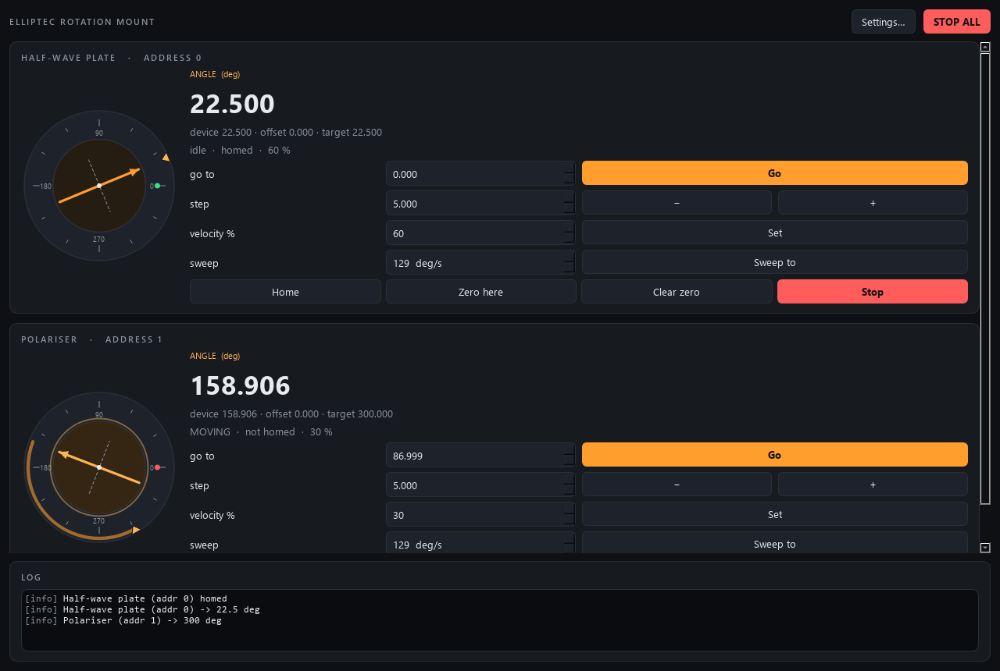

# elliptec-control

Control module for **Thorlabs Elliptec ELL14 rotation mounts** (the ELL14K kit:
ELL14 mount + USB interface board), built to the AaltoFlow instrument blueprint
(`INSTRUMENT_MODULE_GUIDE.md`). It is a *set-and-forget* module: you command
an angle and the mount's own controller drives its resonant piezo motor there
against its encoder; there is no control loop to run on the PC.

Several Elliptec devices can share one serial bus, each on its own address
(one hex digit, 0-F). **Every configured address becomes one rotary axis**, so
one service can drive a half-wave plate and a polariser on the same cable.

Ports **5607** (commands) / **5608** (status), declared in `module.toml`.



*Two simulated mounts on one bus: the half-wave plate homed and parked at
22.5 deg, the polariser turning at 30 % speed towards 300 deg (the arc runs
from the current angle to the target triangle). The arrow is the optic's
axis; the dot at 0 deg is the home mark, green once homed.*

## What it does

- **Absolute and relative moves in degrees**, per mount. Angles wrap: 370 deg
  is taken as 10 deg (the same orientation of the optic).
- **Home** (clockwise or counter-clockwise) to the mount's home mark.
- **Velocity** in percent of the mount's maximum speed (the ELL14's own unit).
- **Stop** one mount, or all of them.
- A per-axis **user zero** ("Zero here", or an explicit offset): user angle =
  device angle - offset. That is how "0 deg = fast axis vertical" is set
  without re-homing.
- An optional **angle window** (`limits.min_angle_deg` / `max_angle_deg`) for a
  mount with a cable or fibre that must not wind up: inside a window every move
  goes to a clamped end point by a step along the user frame, so it can never
  take the long way round (even when the offset puts the home mark inside the
  window). Homing still turns to the home mark.
- A **visual front panel** (PySide6) with one card per mount and the
  `MountIndicator` dial.
- **Remote control** over ZeroMQ, and a `describe` manifest, so scan-core can
  sweep an angle (`elliptec.angle_0`) and run `home_0` as a scan routine.

## Architecture (same as every module in the suite)

One **service** process owns the serial bus (or its simulator) and is the single
source of truth. GUIs, the console and scan-core are **clients**.

```
backends/  base.py (Protocol) · sim.py (default, no hardware) · ell_serial.py (real, lazy pyserial)
mount.py   the "brain": clamps, user frame, ONE worker thread that owns the bus
net/       protocol.py · describe.py · service.py · client.py
apps/      theme.py · gui.py (MainWindow + MountIndicator) · settings_dialog.py
scripts/   run_service.py · run_gui.py · elliptec_console.py · smoke_test.py
```

Why a worker thread: on the real bus a move is answered only when it has
**finished** (the mount replies `PO` with its final position). A command that
waited for that would block the service for seconds, so commands only queue the
move and reply at once; the worker sends it, polls the mounts and rebuilds the
status. Every motion command gets a number (`move_id`), and a mount counts as
moving until the worker has executed its latest command and the mount has
answered -- so a client never mistakes "not started yet" for "arrived".

## Install

Uses **uv** + the **src layout**. The tree lives in OneDrive, so use `dev.ps1`
(it keeps the environment in `%LOCALAPPDATA%\uv-venvs\elliptec-control`).

```powershell
.\dev.ps1 sync --extra gui                  # simulator + front panel
.\dev.ps1 sync --extra gui --extra real     # + pyserial for the real mounts
.\dev.ps1 run pytest -q
```

Always name **both** extras on the lab PC: a later `sync --extra gui` alone
removes pyserial again (gotcha #29). No Thorlabs software is needed: the
interface board is an FTDI USB-serial port (look up its COM number in the
Device Manager).

## Run

```powershell
# 1) the service (simulator by default)
.\dev.ps1 run scripts/run_service.py
.\dev.ps1 run scripts/run_service.py --real --port COM5
.\dev.ps1 run scripts/run_service.py --real --port COM5 --addresses 0,1

# 2) the front panel
.\dev.ps1 run scripts/run_gui.py                        # private local simulator
.\dev.ps1 run scripts/run_gui.py --connect localhost    # attach to the service

# 3) by hand
.\dev.ps1 run scripts/elliptec_console.py
elliptec> move_abs 0 45
elliptec> move_rel 0 -10
elliptec> home 0 ccw
elliptec> set_velocity 0 60
```

## Remote-control quick reference

Commands are JSON on the REQ/REP port; every reply is `{"ok": true, ...}` or
`{"ok": false, "error": ...}` and means **accepted, not arrived** -- watch the
status (published at ~8 Hz). An axis is its index 0..n-1, or `"@<address>"`.

| intent                 | command |
|------------------------|---------|
| read everything        | `{"cmd":"status"}` -> `angle_deg`, `device_deg`, `target_deg`, `moving`, `homed`, `velocity_pct`, `offset_deg`, `error`, `move_id` (lists, one entry per mount) |
| turn to an angle       | `{"cmd":"move_abs","axis":0,"angle_deg":45}` -> `target`, `move_id` |
| turn by an angle       | `{"cmd":"move_rel","axis":0,"delta_deg":-10}` |
| home                   | `{"cmd":"home","axis":0,"direction":"ccw"}` (no axis = all) |
| stop                   | `{"cmd":"stop","axis":0}` (no axis = all) |
| speed                  | `{"cmd":"set_velocity","axis":0,"value":60}` (percent) |
| sweep (fly scans)      | `{"cmd":"ramp_angle","axis":0,"angle_deg":300,"rate_deg_per_s":129}` -> `ramp_id`, `target`, `rate` · `{"cmd":"ramp_stop"}` |
| the polled angles      | `stream_start` / `stream_read` / `stream_stop` (group `angle`, channel `angle_<addr>`) |
| user zero              | `set_zero` / `clear_zero` `{axis}` · `set_offset` `{axis, value}` |
| identity, pulses/rev   | `{"cmd":"info"}` |
| describe actions       | `home_<addr>`, `set_zero_<addr>`, `stop` (bare verbs) |
| clean stop / restart   | `{"cmd":"shutdown"}` · `shutdown{keep_outputs?}`: `true` = restart for a code update (mounts stopped, nothing moved, the next start adopts the angles) |

Arrived = `target_deg[i]` equals what you sent **and** `moving[i]` is false;
that is exactly the settle policy `describe` declares for scan-core.

## Sweep (fly scans over an angle)

A fly axis in scan-core can fly `elliptec.angle_<addr>`: the mount turns over
each row at a set speed by itself (a **hardware** ramp, "move to at
velocity"), the detectors stream, and every sample is binned by the
**measured** encoder angle (`describe`: a `ramp` block, readback
`measured: true`).

- **The rate is deg/s** on the wire (scan-core's unit) and becomes the ELL14's
  own unit, a velocity percent of `hardware.max_speed_deg_s` (430 deg/s),
  rounded to a whole percent. The user's velocity is put back when the sweep
  ends -- done, stopped, taken over, or at shutdown.
- **Fly rows over an angle are FAST.** The ELL14 is a resonant piezo motor
  that stalls below ~30 % (`limits.min_velocity_pct`), so the slowest sweep
  is ~30 % of ~430 deg/s = **~129 deg/s** (a full turn in under 3 s) and the
  fastest 430 deg/s. A rate outside 129..430 deg/s is clamped and warned. Use
  a detector that streams fast enough, or step the angle instead.
- **The readback** is the encoder angle the worker polls (`hardware.poll_hz`,
  20 Hz: one reading per ~6 deg at 129 deg/s), stamped at the middle of each
  read and UNWRAPPED (a sweep to 360 ends at 360, not 0). The sweep turns
  along the user frame, so 300 -> 360 goes up through 330, never the short
  way back.
- **One sweep at a time** (one `ramp_id`): a new sweep, on any mount, ends
  the running one. Status: `ramping`, `ramp_id`, `ramp_axis`,
  `ramp_target_deg`, `ramp_rate_deg_per_s`.
- **A command takes over:** `move_abs` / `move_rel` / `home` / `stop` of the
  swept mount end the sweep first. A `set_velocity` during a sweep is kept
  and applied when it ends. `ramp_stop` is a **safety** verb (a viewer may
  send it).
- `# VERIFY` on the ELL14: the deg/s per percent (linear? 430 at 100 %?), the
  stall floor, and that the mount answers `gp` WHILE it moves. On the real
  bus a tracked move is followed by a `gp` on every poll, and ends when the
  position reaches its target (or stops changing for three replies), because
  a `gp` answer looks exactly like the `PO` that ends a move. If the mount
  does not answer while moving, the readback only shows where the sweep
  ended -- then the stream is not usable for a fly row.

## Things to know

- **360 vs 0.** A move to 360 deg reports `target_deg` 360 (so a scan sees its
  own setpoint) but the mount turns to 0 deg, the same orientation. A sweep
  0..360 therefore ends with a turn back to 0.
- **A second motion command to a mount that is still turning replaces the
  first**, as on the hardware. Wait for `moving` to go false in scripts.
- The `offsets` group lives in the config: a coordinator's `set_config` push of
  that group overwrites a "Zero here" done on the panel (gotcha #5).
- A changed address list takes effect after a restart of the service.
