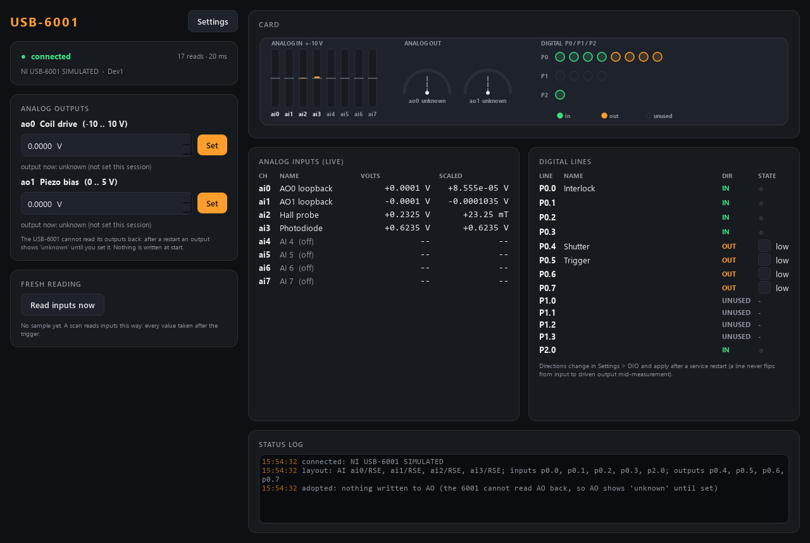

# usb6001-control -- General DAQ (NI USB-6001)

A general-purpose National Instruments **USB-6001** as an AaltoFlow module:
analog inputs, the two analog outputs, and the 13 digital lines -- each one set
up as an **input**, an **output** or **unused** in the config. Ports 5629 / 5630.



*Simulation (demo layout). Built 2026-09-28; not yet run on a real card.*

## What it does

| | |
|---|---|
| **AI** ai0..ai7 | per channel: on/off, name, terminal RSE / NRSE / DIFF (DIFF pairs ai0/ai4 ... ai3/ai7), and an optional straight-line scale `value = slope x V + offset` so a channel reads mT, K, ... One reading = the mean of `samples_per_read` samples at `rate_Hz` (one converter: 20 kS/s shared by all enabled channels). |
| **AO** ao0, ao1 | `set_ao` clamped to per-channel limits inside +-10 V. |
| **DIO** p0.0..p0.7, p1.0..p1.3, p2.0 | direction `in` / `out` / `unused` per line. Outputs: `set_do`; inputs are read by the poll thread. |
| scans | AO and output lines are **controls** (settle = the value was written); AI and input lines are **detectors** read FRESH after the scan point is set (`acquire`, numbered). |

## Directions apply at service start

The direction of a digital line (and which AI channels are on, and their
terminal configuration) decides which DAQmx tasks exist. It is read from the
config **when the service starts**. To change it: Settings > DIO (the service
saves `usb6001.ini`), then restart the service. There is deliberately no live
switch: a line must never go from "input" to "driven output" in the middle of a
measurement. Until the restart the panel says *restart pending*.

## Nothing is written at start

Like every AaltoFlow module, starting the service changes nothing on the card.
The USB-6001 cannot read its analog outputs back, so **AO shows "unknown" until
you set it** in this session. Output lines are read back where the card allows
it. Two opt-in exceptions, per output line: `initial = low|high` (written once
at start) and `safe_state = low|high` (written on a clean stop).

## Run

```powershell
cd modules\other\usb6001-control
uv sync --extra gui                    # simulator + GUI
uv sync --extra gui --extra real       # on the lab PC: + nidaqmx (name BOTH extras)
uv run pytest -q
uv run scripts/run_service.py          # simulated card
uv run scripts/run_service.py --real   # the real card (NI-DAQmx driver + nidaqmx)
uv run scripts/run_gui.py --connect localhost
uv run scripts/usb6001_console.py ao 0 1.25
uv run scripts/smoke_test.py
```

The service loads `usb6001.ini` from this folder if it exists (not in git: it
is this PC's wiring). The card is claimed by its **serial number** (and its NI
MAX name): a second service on the same card exits with code 4.

## Verbs

`set_ao{channel, volts}`, `set_do{line, state}`, `read_ai{channel?}` and
`read_di{line?}` (fresh readings, reply at once with the values), `acquire`
(returns `acq_id`; the sample appears in status), `get_sample`, `save_config`,
plus the universal `status`, `info`, `get_config`, `set_config`, `describe`,
`shutdown`.
