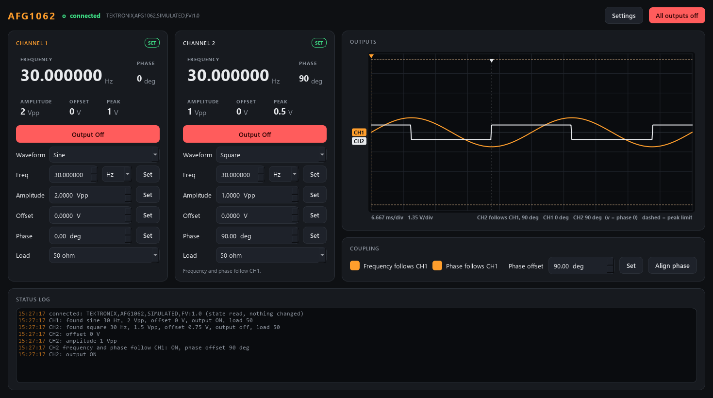

# afg-control -- Function generator (Tektronix AFG1062)

Two-channel arbitrary function generator, 60 MHz, 300 MS/s, USB (USB-TMC,
SCPI). Per channel: sine, square, pulse, ramp, noise or DC; frequency,
amplitude, offset, start phase, pulse duty, ramp symmetry and the load setting.
Plus a coupling with two switches: **frequency follows CH1** (CH2 takes CH1's
frequency; the two are re-aligned after every change) and **phase follows
CH1** (CH2's phase = CH1's + an offset; off = CH2's phase is its own). That is
the bench use it was written for: CH1 drives the experiment (e.g. a magnet
amplifier at 30 Hz), CH2 is a synchronous square for the scope's trigger input.



**Read-only contact so far** -- the real backend (`backends/tek_afg.py`) has
been checked against the lab's unit with QUERIES only (2026-10-06, see
[Measured on the instrument](#measured-on-the-instrument)); no setting has been
written to it yet. Every unconfirmed command is marked `# VERIFY`, and
[First run on the instrument](#first-run-on-the-instrument) below is the
checklist.

## Ports

5631 (commands) / 5632 (status), declared in `module.toml`.

**Reaching it from another PC:** the lab network lets the office reach TCP
ports 5555-5600 only, so 5631/5632 are NOT reachable from there today. If the
service must be reached from another PC, give it a per-PC port override inside
that range in Mission Control (the card's **Ports** button, on the PC that runs
the service) and add it on the other PC with the same ports (**Add remote...**).
The defaults stay 5631/5632.

## Layout

```
src/afg/
  config.py          every tunable: channel_1/2, limits_1/2, coupling, hardware, ui
  waveforms.py       the waveform arithmetic (shape, peak voltage, load factor)
  generator.py       the brain: desired state, safety clamps, one worker thread
                     that owns the instrument, pushes in a SAFE ORDER and reads back
  backends/
    base.py          the WaveGen interface -- generic, N channels (the scope module
                     will drive the Analog Discovery's two generator outputs with it)
    sim.py           a fake AFG1062 that clips and complains like the real one
    tek_afg.py       the real AFG1062 (pyvisa) -- the ONLY file that imports it
  net/               service, client, describe
  apps/              the front panel (Qt)
scripts/             run_service.py, run_gui.py, afg_console.py, smoke_test.py
tests/               offline; fake_visa.py is a fake SCPI instrument
```

## The rules it keeps

- **Start changes nothing.** The service READS both channels (waveform, numbers,
  load, output on/off) and adopts them; a sine left driving the magnet keeps
  driving it. Burst / sweep / modulation left on at the instrument are reported
  and left alone (this module sets only the continuous-wave parameters).
- **Safety clamps.** Every request is clamped to the lab's ceiling (Settings >
  Limits, per channel: amplitude, PEAK voltage, frequency) AND to the
  instrument's range for the chosen waveform and load. The lab ceiling's
  defaults are the FULL range (Lukas, 2026-10-06: also for CH1 on the magnet
  amplifier), so out of the box only the instrument's range applies; lower them
  when a setup needs it. The peak rule:
  `|offset| + amplitude/2 <= peak_max_V`, always. When amplitude and offset
  together would pass it, the knob you just SET is the one that stops
  (sweep the amplitude -> it stops at the limit; your offset stays).
- **Safe order.** An output switched off goes off first; one switched on gets its
  whole setting before it opens. Of amplitude and offset, the change that lowers
  the peak goes first, so the output never passes the limit between two settings
  that are both inside it. A waveform change goes before a rising frequency and
  after a falling one (a ramp stops at 1 MHz).
- **Settled means read back.** After every change the worker reads the
  instrument; a channel is `settled` only when the read-back agrees with the
  request. If the instrument coerces a value, `<ch>_mismatch` says which, and a
  scan waiting on it times out with that reason instead of recording at a
  setting nobody chose. A change made at the front panel is noticed and adopted.
- **Stop = outputs off.** Shutdown (window close, `shutdown` verb, Ctrl-C)
  switches both outputs off. `shutdown{keep_outputs: true}` is a restart (a
  code update): the service closes and exits but leaves the outputs as they
  are, and the next start adopts them. `outputs_off` is the safety verb: a viewer may
  always send it.

## Volts and the load setting

The AFG is a 50-ohm source and has a "Load" setting (50 ohm, high-Z, or a
value). Amplitude and offset are quoted **into that load**. With the load at 50
ohm, "1 Vpp" is 1 Vpp across a 50-ohm termination -- and **2 Vpp on an open
input** (a scope at 1 Mohm, most amplifier inputs). On the bench (CH1 -> scope
CH1, CH2 -> scope CH2 + EXT TRIG, no terminators) the scope therefore shows
twice the number on the panel unless the load is set to high-Z.

**The bench runs at high-Z on both channels** (Lukas, 2026-10-06): then the
panel's volts are the volts on the cable. Set it once (panel: Load > High-Z,
or `afg_console.py load 1 highz` and `load 2 highz`); the module does not set it
at start, it reads whatever the AFG holds -- which is why step 9 of the
first run checks that the AFG keeps it over a power cycle.

This module never changes the load by itself. When you change it (panel, verb
`set_load`), the AFG rescales the volts it shows; the module reads them back
and adopts them, so the actual output does not change. The instrument's range
doubles at high-Z; the lab limits (Settings) stay where they are.

## Verbs

| verb | arguments | |
|---|---|---|
| `set_output` | `channel` ("ch1"/"ch2"), `on` | |
| `set_waveform` | `channel`, `waveform` | sine square pulse ramp noise dc |
| `set_frequency` | `channel`, `frequency_Hz` | refused on CH2 while it follows CH1 |
| `set_amplitude` | `channel`, `amplitude_Vpp` | into the load setting |
| `set_offset` | `channel`, `offset_V` | the level, for dc |
| `set_phase` | `channel`, `phase_deg` | kept as asked; sent as 0..360 in whole degrees; refused on CH2 while its phase follows |
| `set_duty` / `set_symmetry` | `channel`, `duty_pct` / `symmetry_pct` | pulse / ramp |
| `set_load` | `channel`, `load` | "50", "high-Z" or ohms |
| `set_follow` | `on`, `phase_offset_deg?`, `phase?` | CH2's frequency (and optionally phase) follows CH1 |
| `set_phase_follow` | `on` | CH2's phase follows CH1 (+ offset) |
| `set_phase_offset` | `deg` | scannable |
| `align_phase` | -- | reply `op_id`; restarts both outputs together |
| `outputs_off` | -- | reply `op_id`; the safety verb |

Plus the universal `status`, `info`, `get_config`, `set_config`, `describe`,
`shutdown{keep_outputs?}` (true = restart, outputs left as they are).

## What a scan sees (`describe`)

Controls per channel: `ch1_output`, `ch1_waveform` (enum: listed, not scanned),
`ch1_frequency` (Hz), `ch1_amplitude` (Vpp), `ch1_offset` (V), `ch1_phase` (deg),
`ch1_duty` (pulse only), `ch1_symmetry` (ramp only), `ch1_load` (enum); and
`phase_offset` while CH2 follows CH1. Each settles on "echo, then settled", so a
scan of `afg.ch1_amplitude` (minor loops) waits until the AFG has really taken
each value. Ranges are live: they follow the waveform, the load and the
Settings, and the manifest revision moves with them. Actions `outputs_off` and
`align_phase` (usable as scan routine steps) wait for their own operation
number.

## Measured on the instrument

The lab's AFG1062 (firmware FV:V1.0.2, USB-TMC via NI-VISA) was asked every
query below on 2026-10-06, each followed by `SYST:ERR?`, nothing written:

| query | on FV:V1.0.2 | what the module does |
|---|---|---|
| `OUTPn:STAT?`, `SOURn:FUNC:SHAP?`, `SOURn:FREQ:FIX?`, `...:AMPL?`, `...:OFFS?`, `SOURn:PHAS:ADJ?` | answer | polled |
| `SOURn:BURS:STAT?`, `SOURn:FREQ:MODE?` (CW), `SOURn:AM/FM/PM/FSK/PWM:STAT?` | answer | polled (mode detection) |
| `OUTPn:IMP?` | `9.9E+37` + an Ohm sign in the GBK code page | decoded tolerantly; >= 1 Mohm = high-Z |
| `SOURn:PULS:DCYC?` | answers, but ALSO logs -102 "Syntax error" | read ONCE at start, then never polled |
| `SOURn:FUNC:RAMP:SYMM?` (every spelling), `SOURn:VOLT:UNIT?` | empty answer + -102 | never sent after the start-up probe |
| `*IDN?` | empty the first time after `*CLS`, complete the second | asked twice |

So, on this firmware:

- At start the backend **probes** every optional query once (query, then
  `SYST:ERR?`, the errors it causes drained there). A query that fails is
  never sent again -- the old poll sent them twice a second and filled the
  instrument's error log with -102.
- **Duty cycle and ramp symmetry are not read back.** The panel shows the duty
  the AFG reported at start (symmetry: the config value), and after that the
  value last SET from here. Status `chN_not_read_back` names them, the
  describe help says so, the panel marks them with `*`. A change made at the
  AFG's front panel to these two is NOT noticed, and `settled` does not check
  them. (Choice for `PULS:DCYC?`: its one answer is used, because it is the
  only way to learn the duty without writing; polling it would log an error
  every time.)
- **The amplitude is taken as Vpp** (there is no `VOLT:UNIT?` to ask). # VERIFY
  with the AFG's amplitude unit set to Vrms.
- **Checked on the scope (2026-10-07, lab):**
  - `PULS:DCYC <pct>` is APPLIED (20/50/80 % -> 20.3/49.7/79.3 % on the scope)
    but the unit logs a -102 for it all the same: the backend drops that one
    expected -102 after a duty write.
  - `FUNC:RAMP:SYMM <pct>` is NOT a command of this firmware (-102, the ramp
    stayed symmetric): ramp symmetry is not offered for the AFG1062
    (capabilities `ramp_symmetry: False`; refused, not described, not shown).
  - levels within ~2-3 % from 10 mVpp to 20 Vpp, offsets -3..+9.5 V right,
    the limits and their warnings work.
  - OPEN (need a raw SCPI test, see below): NOISE is not applied (the status
    said "noise", the scope still showed the previous ramp), and the DC LEVEL
    came out ~2.0 V for an offset of 1.5 V with 2 Vpp still set.

## SCPI commands used (real backend)

`OUTPut<n>:STATe`, `OUTPut<n>:IMPedance`, `SOURce<n>:FUNCtion:SHAPe`,
`SOURce<n>:FREQuency:FIXed`, `SOURce<n>:VOLTage:LEVel:IMMediate:AMPLitude`
(sent with a `VPP` suffix; read in `VOLTage:UNIT` where the firmware has it,
else as Vpp), `...:OFFSet`,
`SOURce<n>:PHASe:ADJust`, `SOURce1:PHASe:INITiate`, `SOURce<n>:PULSe:DCYCle`,
`SOURce<n>:FUNCtion:RAMP:SYMMetry`, read-only `BURSt:STATe?`, `FREQuency:MODE?`,
`AM|FM|PM|FSK|PWM:STATe?`, and `*CLS`, `*IDN?`, `SYSTem:ERRor?`. Short forms
in the code. Source: the Tektronix AFG1000 Series Programmer Manual (a subset
of the AFG3000 command set).

## Setup (lab PC)

1. A VISA library for USB-TMC: NI-VISA or Tektronix TekVISA. The AFG shows up
   as `USB0::0x0699::0x....::<serial>::INSTR` (NI MAX or `python -m pyvisa info`).
2. `cd modules\source\afg-control` then `uv sync --extra gui --extra real`
   (name both extras, gotcha #29).
3. Mission Control > Instruments on this PC offers the found address to this
   module (passed as `--visa`), or set it in Settings > Hardware.

## Run

```powershell
cd modules\source\afg-control
uv run scripts/run_service.py                     # simulated
uv run scripts/run_service.py --real --visa "USB0::0x0699::0x0353::C012345::INSTR"
uv run scripts/run_gui.py --connect localhost     # the panel on the service
uv run scripts/run_gui.py                         # a private local simulator
uv run scripts/afg_console.py status              # one-shot console command
uv run scripts/smoke_test.py
```

## First run on the instrument

Do it with nothing that matters connected (the scope only), CH1 and CH2 as on
the bench. In order; each step names the `# VERIFY` it settles.

1. **Start-up reads only.** Set something recognisable on the front panel
   (CH1 sine 1 kHz 0.5 Vpp, output on). Start the service `--real`. The log must
   list exactly that, the output must stay on, and nothing on the AFG may change.
   If a channel line says "could not read ...", note which query failed.
2. **Phase** -- MEASURED 2026-10-07 (raw SCPI): `PHAS:ADJ 31DEG` is exact, a
   bare number is RADIANS and is TRUNCATED to whole degrees (31 deg sent as
   0.54105207 rad came back as 30), a NEGATIVE phase is rejected with -201
   "Invalid while in local", the query answers in radians. So the module
   keeps your setpoint as asked (-90 stays -90), sends the same angle in
   0..360 rounded to whole degrees with `DEG`, compares modulo 360 at 1 deg,
   and declares `resolution: 1` so a scan rounds its phases to whole degrees.
   Re-check: phases -180..180 from a scan settle; the panel shows 270 for -90.
3. **Amplitude suffix.** Set 1 Vpp with the AFG's own unit switched to Vrms:
   the read-back must be 1 Vpp (no "not as asked" note).
4. **Load.** Switch CH1 load to high-Z from the panel: the AFG display should
   show the volts doubled, the scope trace must NOT change (if the trace
   doubles instead, the AFG keeps the number and changes the output: the
   module still reads it back correctly, but README and set_load's comment
   need correcting).
5. **Waveform names and limits.** Each waveform from the combo; ramp at 5 MHz
   must stop at 1 MHz with a warn, no "not as asked". Try 10 Vpp sine at 50 MHz:
   if the AFG coerces it (a high-frequency amplitude limit we do not know), the
   panel says "Instrument differs" -- then put that limit into
   `AFG1062_ENVELOPE` (`tek_afg.py`).
6. **Pulse duty** works (measured); **ramp symmetry** is not available on
   FV:V1.0.2 (see "Measured on the instrument"). Still open, raw SCPI with the
   service stopped (a keep-outputs Restart afterwards), each followed by
   `SOUR1:FUNC:SHAP?` / the scope and `SYST:ERR?`:
   - noise: `SOUR1:FUNC:SHAP PRN`, `SOUR1:FUNC:SHAP PRNoise`,
     `SOUR1:FUNC:SHAP NOIS`, `SOUR1:FUNC:SHAP NOISe` -- which one makes noise,
     and what does `FUNC:SHAP?` answer then?
   - DC: `SOUR1:FUNC:SHAP DC`, then `SOUR1:VOLT:LEV:IMM:OFFS 1.5` with the
     amplitude at 2 Vpp and again at its minimum (`...:AMPL 0.001VPP`): the
     scope's DC level each time, and `OFFS?` / `AMPL?`.
7. **CH2 follows CH1, Align phase** (`SOUR1:PHAS:INIT`): CH2 square at +90 deg;
   on the scope the CH2 edge must sit a quarter period after the CH1 zero
   crossing, and stay there after a CH1 frequency change. Note whether the
   align makes a visible glitch on CH1 (it matters when CH1 drives the magnet).
8. **Error queue form** (`SYST:ERR?` reply), **burst/sweep detection** (switch
   burst on at the panel: the module must say "burst"), **Go To Local** on close
   (the AFG's front panel works again after the service stops).
9. **High-Z survives a power cycle.** Set both loads to high-Z, switch the AFG
   off and on, start the service: both channels must read "high-Z". If the AFG
   comes back at 50 ohm (its power-on setting), either set its power-on state
   to "last" in the AFG's Utility menu, or ask for a "load at start" option
   (it would be the one setting written at start -- a deliberate exception).
10. Stop the service: both outputs off.

Then record the result in `docs/VERIFIED_INSTRUMENTS.md`.

## Tests

```powershell
uv run pytest -q          # 83 tests, offline: sim + a fake SCPI instrument
                          # (two profiles: the manual's, and FV:V1.0.2 as measured)
python ..\..\..\tools\check_modules.py afg --live
```

## Using it from Python

```python
from afg.net.client import AfgClient
afg = AfgClient("localhost", kind="script", name="loop script")
afg.start()
afg.take_control()                     # if a GUI holds control
afg.set_waveform("ch1", "sine")
afg.set_frequency("ch1", 30.0)
afg.set_amplitude("ch1", 2.0)
afg.set_follow(True, 90.0)             # CH2: trigger square, a quarter period later
afg.set_output("ch1", True); afg.set_output("ch2", True)
print(afg.status()["ch1_settled"])
afg.outputs_off()
afg.shutdown()                         # closes the client, not the service
```
