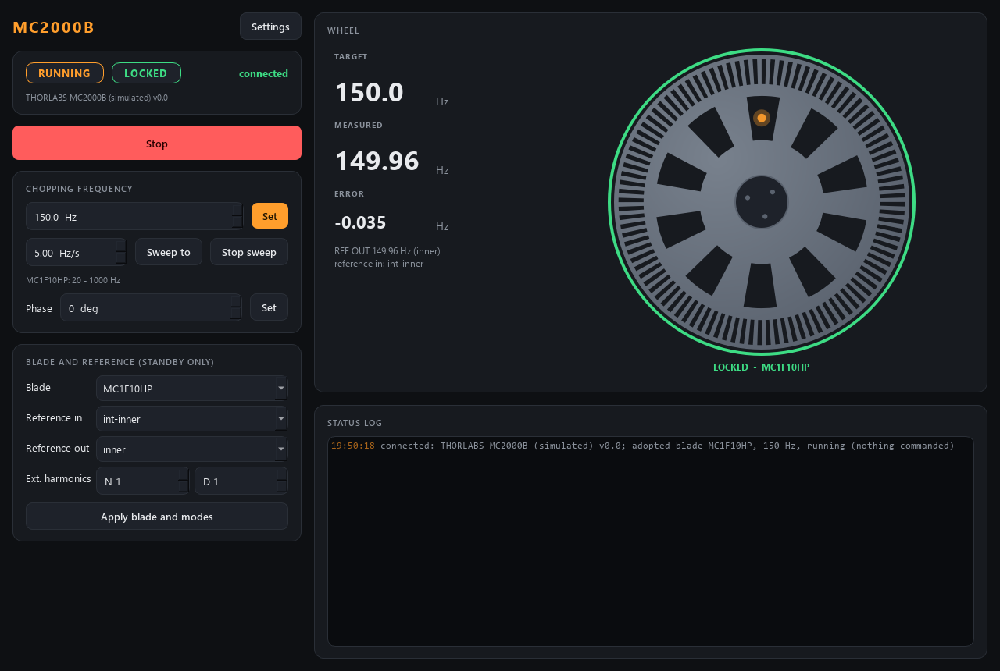

# chopper-control

Control for a **Thorlabs MC2000B(-EC)** optical chopper: chopping **frequency**,
**phase**, run / standby, the **blade** and the **reference in / out** modes --
over the controller's USB virtual COM port, or fully simulated with no hardware.



*The 10/100-slot blade (MC1F10HP) running on its inner ring at 150 Hz, locked.
The wheel turns while the motor runs, the beam spot flickers as slots pass, and
the rim turns green when the measured frequency has held within tolerance.*

An optical chopper is a set-and-forget instrument with one thing that takes
time: after a new frequency the wheel has to spin up and the controller's PLL
has to lock ("within a few seconds", manual 5.1). A scan that steps the
chopping frequency must wait for that, or the lock-in measures while its
reference is still sliding. So the module's real job is to say honestly **when
the wheel is locked**, and `describe` hands that to scan-core as the settle rule.

## Ports

| service            | commands (REP) | status (PUB) |
|--------------------|----------------|--------------|
| **chopper**        | **5609**       | **5610**     |

## Blades

| blade      | slots          | chopping range                               | ref in modes                                 | ref out modes            |
|------------|----------------|----------------------------------------------|----------------------------------------------|--------------------------|
| MC1F10HP   | 10 inner / 100 outer | inner 20 Hz - 1 kHz, outer 200 Hz - 10 kHz | int-outer, int-inner, ext-outer, ext-inner | target, outer, inner     |
| MC1F60     | 60             | 120 Hz - 6 kHz                               | internal, external                           | target, actual           |

`blades.owned` in the config lists what is in the lab; the other 13 blades the
controller knows are in `blades.py` and can be added there. **The frequency
range in `describe` follows the mounted blade and, on the 10/100 blade, the ring
the reference locks to** -- so `describe_rev` changes on a blade or mode change
and every client re-fetches.

Blade, reference modes and harmonics can only be changed in **standby**
(manual 5.2); the module refuses them while the wheel runs, with that reason.

## When is it "locked"?

The MC2000B has no lock query over USB (the lock indicator is on its LCD only),
so the module decides from what it can read:

* **REF OUT on a sensor** (`actual`, `outer`, `inner`): `refoutfreq?` is the
  MEASURED wheel. Locked = running and |measured - target| <=
  max(`settle.tolerance_Hz`, `settle.tolerance_rel` x f) for `settle.hold_s`.
  If REF OUT follows the other ring of the 10/100 blade the reading is scaled
  by the slot ratio.
* **REF OUT on `target`** (the synthesiser): the wheel is invisible, so the
  module waits `settle.blind_lock_s` after the last change and says so
  (`lock_source = "timer"`, measured frequency `null`).

On **external** reference the frequency is EXT REF IN x N / D; `frequency`
then becomes an indicator in `describe`.

## Start-up and shutdown

The module **adopts** the controller's state: blade, modes, frequency, phase and
whether the wheel runs. Nothing is commanded or written at start (queries only;
even a value outside the config safety envelope is adopted, not clamped) -- a spinning chopper is
harmless and somebody's lock-in may be using it. At shutdown the wheel is left
as it is, unless `hardware.stop_on_exit = True`. The verb is
`shutdown{keep_outputs?}`: `keep_outputs: true` (a restart for a code update)
leaves the wheel running even with `stop_on_exit` set.

## Layout

```
src/chopper/
  config.py              Blades / Limits / Settle / Hardware / Sim / UI + .ini save/load
  blades.py              the blade table: indices, slots, ranges, ref/output modes
  backends/
    base.py              ChopperBackend Protocol -- the interface everything depends on
    sim.py               SimulatedMC2000B -- first-order spin-up, jitter, standby rules
    mc2000b.py           SerialMC2000B -- the real controller (lazy pyserial import)
  chopper.py             Chopper -- adopts, clamps, polls, decides "locked", sweeps
  softramp.py            the frequency sweep's walk (a byte-identical copy of suite-common's)
  stream.py              the record of every REF OUT reading, for fly scans
  sim_system.py          build_sim_system(cfg) -- the simulator wired into a Chopper
  net/
    protocol.py          wire shapes + default ports (5609/5610)
    service.py           ChopperService -- owns the brain, serves it over ZeroMQ
    client.py            ChopperClient -- Chopper-compatible facade over the socket
    describe.py          the manifest: live limits, settle rules, actions
  apps/                  gui.py (WheelIndicator), settings_dialog.py, theme.py
scripts/
  run_service.py         start the service (simulated by default, --real for the MC2000B)
  run_gui.py             the GUI (local simulator, or --connect HOST)
  chopper_console.py     standalone raw-protocol console (only needs pyzmq)
  smoke_test.py          quick offline check
tests/                   pytest: config, blades, brain (manual clock), net, describe, GUI
```

## Wire verbs

| verb              | arguments                 | notes                                         |
|-------------------|---------------------------|-----------------------------------------------|
| `set_frequency`   | `frequency_Hz`            | internal reference only; clamped; reply echoes the value set |
| `set_phase`       | `phase_deg`               | 0..360                                        |
| `set_enable`      | `on`                      | reply carries `lock_gen`                      |
| `start` / `stop`  | --                        | actions; `start` waits (in scan-core) for the lock |
| `set_blade`       | `blade` (e.g. `MC1F60`)   | standby only, owned blades only               |
| `set_ref_mode`    | `mode`                    | standby only                                  |
| `set_output_mode` | `mode`                    | standby only                                  |
| `set_harmonics`   | `n`, `d` (1..15)          | standby only; external reference              |

plus the universal `status`, `info`, `get_config`, `set_config`, `describe`,
`shutdown`. A reply means *accepted*; the wheel being there is `locked`.

## Sweep (fly scans)

The chopping frequency (internal reference) can be swept continuously at a
set pace, so a scan-core fly axis can fly it: the chopper sweeps over each
row, the detectors stream, and every sample is binned by the wheel frequency
the module **measures** on the slot sensor.

| verb | args | |
|---|---|---|
| `ramp_frequency` | `frequency_Hz`, `rate_Hz_per_s` | sweep to the target at this pace; reply `{"ramp_id": n}` |
| `ramp_stop` | | end it where it is (safety verb, also a describe action) |
| `stream_start` / `stream_read` / `stream_stop` | | every REF OUT reading with its time (`frequency` on the referenced ring, `refout`), plus `commanded` (every value the sweep sent, on its own stamps `t_ch`) |

* The service walks the synthesiser (`softramp.py`, a copy of
  `suite-common/src/suite_common/softramp.py`); a `freq=` write goes out only
  when the value on the blade's grid changes (at most every
  `hardware.ramp_dt_s`). While it runs (or a stream records) the poll reads at
  `hardware.stream_poll_hz` (10 Hz; VERIFY the serial budget).
* **Measured, or honestly commanded.** With REF OUT on a sensor (`actual`,
  `outer`, `inner`) the ramp's readback is the measured wheel frequency -- the
  wheel lags a fast sweep through its PLL and inertia, and the data says so.
  With REF OUT on `target` the wheel is invisible: describe then declares the
  readback as the commanded frequency (`measured: false`).
* While the setpoint moves the wheel is never `locked`; at the end the lock is
  judged afresh (a new `lock_gen`). A front-panel change is not adopted during
  a sweep (the unit legitimately lags the setpoint by a step).
* A frequency set, standby (the `stop` verb), a blade or reference-mode change
  stop a sweep; on external reference a sweep is refused. Targets are clamped
  to the live range (blade ring and envelope), rates to
  `limits.sweep_rate_*_Hz_per_s` (VERIFY on the wheel), each with a warning.
  It does not start the wheel: in standby only the setpoint walks.
* Status: `ramping`, `ramp_id` (the newest sweep), `ramp_target_Hz`,
  `ramp_rate_Hz_per_s`.

The GUI's frequency card has the pace, **Sweep to** (the value above) and
**Stop sweep** (the wheel keeps running; the motor **Stop** is above it).

## Controller commands used (real backend)

`id?`, `freq=` / `freq?`, `phase=` / `phase?`, `enable=` /
`enable?`, `blade=` / `blade?`, `ref=` / `ref?`, `output=` / `output?`,
`nharmonic=` / `nharmonic?`, `dharmonic=` / `dharmonic?`, `refoutfreq?`,
`input?` -- CR-terminated, 115200 8N1, the unit echoes the command and ends
with the prompt `> ` (MC2000B user guide, chapters 7 and 8). At connect the
backend sends QUERIES ONLY; `verbose=0` is sent only if
`hardware.quiet_on_open = True` (default False). Every call is
marked `# VERIFY` in `backends/mc2000b.py` until checked on the unit.

## Run it

```powershell
cd modules\source\chopper-control
.\dev.ps1 sync --extra gui                 # add --extra real on the lab PC (pyserial)
.\dev.ps1 run pytest -q
.\dev.ps1 run scripts/run_service.py       # simulated; --real [--port COM5] for the MC2000B
.\dev.ps1 run scripts/run_gui.py --connect localhost
.\dev.ps1 run scripts/chopper_console.py freq 500
```

Without `--connect` the GUI runs its own private simulator.
