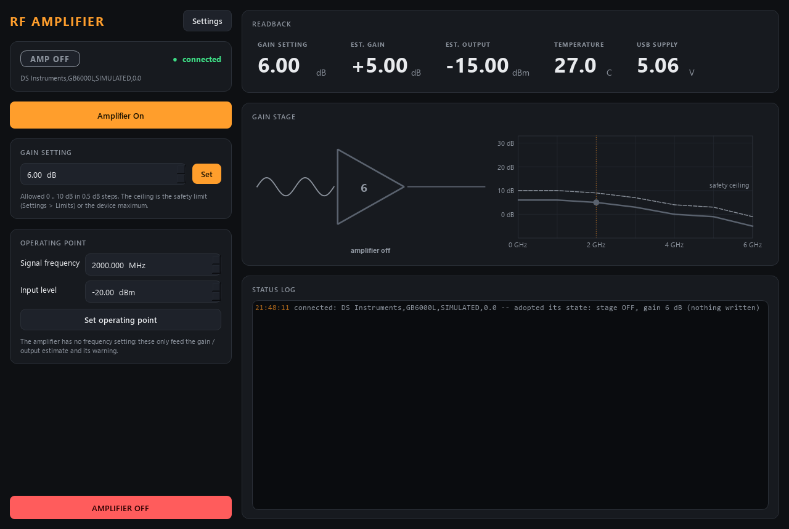

# dsamp-control

Control for a **DS Instruments GB6000L** smart variable-gain RF amplifier
(10 MHz - 6 GHz, gain 0 - 31 dB in 0.5 dB steps): switch the
amplifier stage on/off and set its **gain** -- over its USB virtual COM port
(SCPI-like text commands), or fully simulated with no hardware.



*Straight after start, simulated: the module has READ the amplifier (the
simulator's leftover 6 dB, stage off) and shows exactly that -- it never changes
the amplifier when it starts. The gain-stage indicator shows a small sine going
in and (when on) a bigger one coming out, next to the estimated gain-vs-frequency
curve of the current setting and, dashed, of the safety ceiling. Light theme:
[dsamp-light.png](../../../front-panels/dsamp-light.png).*

Like the RF generator module it is **set-and-forget**: no loop, no ramp. What it
adds is **danger downstream**: +30 dB into a mixer, a detector or a thin-film
sample is how they get destroyed. So the module is built around three rules:

1. **A safety ceiling on the gain.** `limits.gain_max_dB` (default **10 dB**) is
   intersected with the device range; every request is clamped to it (a warn
   event says so) and snapped to the device step. `describe` publishes that
   live envelope, and its revision moves when you change it.
2. **Read at start, off on the way out.** At start the module only QUERIES the
   amplifier (`*IDN?`, `OUTP:STAT?`, `GAIN?`) and adopts what it finds -- a
   stage left on stays on, a gain above the ceiling stays there (a warn event
   says so; the next gain you set is clamped). Nothing is written, so
   restarting the software never disturbs a running experiment. On shutdown,
   Ctrl-C, the launcher's Stop or the `shutdown` verb the stage is switched off
   and the gain goes back to the minimum -- except `shutdown{keep_outputs: true}`
   (a restart for a code update), which leaves stage and gain as they are for
   the next start to adopt.
3. **Turning it on is a dangerous action.** `amp_on` is flagged `danger` in
   `describe`, and switching on logs a reminder: the vendor manual warns that a
   power amplifier driving an unterminated port can die within seconds.

The amplifier has no frequency input. You tell the module the **operating
point** (signal frequency, input level) and it estimates the real gain from the
datasheet's typical roll-off (31 dB at 1 GHz down to 20 dB at 6 GHz at the
maximum setting) and the output power with a soft compression at P1dB, and warns
when the estimate exceeds `limits.output_warn_dBm`. An estimate, not a
calibration: measure S21 of your own unit if the number matters.

## Ports

| service            | commands (REP) | status (PUB) |
|--------------------|----------------|--------------|
| **dsamp**          | **5593**       | **5594**     |

## Run it

```powershell
cd modules\source\dsamp-control
.\dev.ps1 sync --extra gui                  # + --extra real on the lab PC (pyserial)
.\dev.ps1 run pytest -q
.\dev.ps1 run scripts/run_service.py         # simulated; --real --port COM7 for hardware
.\dev.ps1 run scripts/run_gui.py --connect localhost
.\dev.ps1 run scripts/dsamp_console.py gain 6
```

`dev.ps1` keeps the virtual environment in `%LOCALAPPDATA%\uv-venvs\dsamp-control`,
off OneDrive (docs/DEVELOPER_NOTES.md gotcha #8). Sync with **both** extras on
the lab PC -- `uv sync` removes every extra you do not name (gotcha #29).

## Layout

```
src/dsamp/
  config.py              Amp / Limits / Hardware / UI + .ini save/load
  model.py               datasheet roll-off + soft compression: the gain/output ESTIMATE
  backends/
    base.py              AmpBackend Protocol -- the interface everything depends on
    sim.py               SimulatedGB6000L -- quantised gain, thermal drift, USB sag
    dsi_serial.py        DsiSerialAmp -- the real amplifier (lazy pyserial import)
  amplifier.py           Amplifier -- clamps + snaps, owns the poll thread, safe start/stop
  sim_system.py          build_sim_system(cfg)
  net/
    protocol.py          wire shapes + default ports (5593/5594)
    service.py           DsampService -- owns the amplifier, serves it over ZeroMQ
    client.py            DsampClient -- Amplifier-compatible facade over the socket
    describe.py          the manifest: controls, indicators, the amp_off action
  apps/                  gui.py (GainStageIndicator), settings_dialog.py, theme.py
scripts/
  run_service.py         start the service (simulated by default, --real for USB)
  run_gui.py             the front panel (local sim, or --connect HOST)
  dsamp_console.py       standalone raw-protocol console (only needs pyzmq)
  smoke_test.py          quick offline check
tests/                   pytest, all offline: config, brain, describe, net, GUI, serial backend on a fake port
```

## Wire verbs

| verb              | arguments              | effect |
|-------------------|------------------------|--------|
| `set_amp`         | `on` (bool)            | amplifier stage on/off |
| `amp_off`         | --                     | stage off (the panic button; also a scan-routine action) |
| `set_gain`        | `gain_dB`              | clamped to the envelope, snapped to the step |
| `set_frequency`   | `frequency_Hz`         | operating point, for the estimate only |
| `set_input_power` | `input_dBm`            | operating point, for the estimate only |

plus the universal `status`, `info`, `get_config`, `set_config`, `describe`,
`shutdown{keep_outputs?}`. A reply means **accepted**: the new gain appears in `status` after
the brain's next hardware poll (4 Hz), and the `gain` control declares an
`echoes` settle on the read-back `gain_dB` (tolerance half a step) so scan-core
waits for the device to confirm it. Gain is therefore a scan axis like any other.

## Commands used (real backend)

From DS Instruments' "PA/GB Amplifier SCPI Command List" (v3.1, Sept 2022):
115200 bps 8N1, no flow control, linefeed terminator.

| function        | set                    | query        |
|-----------------|------------------------|--------------|
| amplifier stage | `OUTP:STAT ON` / `OFF` | `OUTP:STAT?` |
| gain            | `GAIN <dB>`            | `GAIN?`      |
| temperature     |                        | `*TEMP?`     |
| USB supply      |                        | `*SYSVOLTS?` |
| identity        |                        | `*IDN?`      |
| front panel     | `*BUTTONS ON` (on close) |            |

The reply formats are not documented; every query is marked `# VERIFY` in
`backends/dsi_serial.py`, and the parsers accept a number with or without a unit.
The unit in the lab is a GB6000L (confirmed); the **older GB6000** used a
different command set (`AMP ON|OFF`, `VATT 0-1000`) and is not supported.
