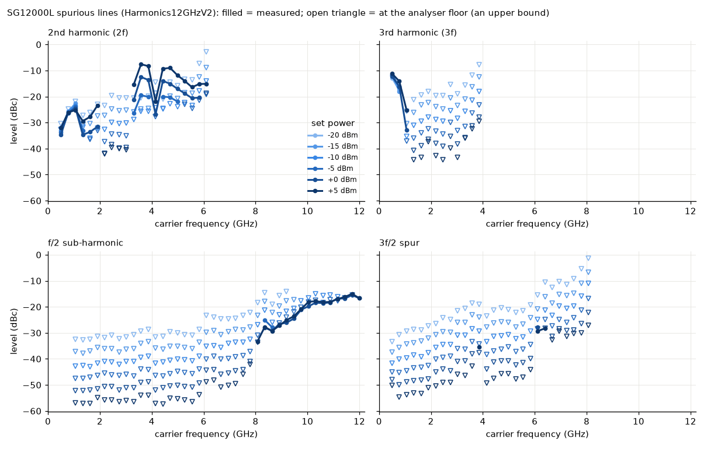

# dssg-control

Control for a **DS Instruments SG12000L** microwave signal generator
(25 MHz - 12 GHz, USB powered): RF output on/off, **frequency**, **power**,
**phase** and the **10 MHz reference** -- over USB (a virtual COM port) or the
Ethernet option (a TCP socket), or fully simulated with no hardware.


*The simulator as the service starts it: it adopts the simulated box's own state
(RF off, 2.45 GHz at -10 dBm, internal reference -- `[sim] state_*`). The spectrum
screen shades the band this unit can reach; with RF on the carrier stands up out
of the noise floor at its frequency and power, with the harmonic and
sub-harmonic lines measured on this model at that frequency and power (see
[Spurious lines](#spurious-lines-measured)), and the dial in the corner shows the phase.*

A **set-and-forget** instrument: no control loop, no state machine (only the
**sweeps** below walk a knob over time, for fly scans). The
`Synthesizer` brain holds the desired signal, clamps it, pushes it to the unit,
and a poll thread reads the unit BACK, so what the status reports (and what a
scan waits for) is the instrument's own answer, not our memory of the request.

## Two envelopes

The SG12000L reports its own range (`FREQ:MIN?`/`FREQ:MAX?`,
`POWER:MIN?`/`POWER:MAX?`). The `[limits]` in the config are your safety
envelope on top of it. Every setpoint is clamped to the **intersection**, with a
warning event when it clamps. The default power ceiling is +5 dBm, below the
unit's calibrated +10 dBm: raise it on purpose.

`describe` publishes that intersection, so its revision changes when the service
connects and learns the unit's real range, and again when you edit the limits.

## Spurious lines (measured)

The spectrum screen draws the harmonics the SG12000L really emits, from a
spectrum-analyser measurement, not from the datasheet (which gives one "typical"
figure, < -25 dBc, for the whole band). Scan `Harmonics12GHzV2` (2026-10-06):
generator -> 30 dB attenuator -> Signal Hound SA124B (0.48 .. 12.4 GHz, RBW
6 MHz), set power -20 .. +5 dBm x carrier 0.5 .. 12 GHz.



| carrier | what comes out | power dependence |
|---|---|---|
| 0.5 .. 1.1 GHz | 3rd harmonic -11 .. -25 dBc, 2nd -25 .. -33 dBc (frequency-divider square wave) | none: constant dBc |
| 1.3 .. 1.9 GHz | 2nd harmonic ~ -24 .. -30 dBc at +5 dBm | grows with power |
| 2.2 .. 3.0 GHz | clean: 2nd < ~-40 dBc, 3rd < ~-35 dBc | -- |
| 3.3 .. 6.1 GHz | **strong 2nd harmonic, up to -8 dBc at +5 dBm** (3.6 .. 4.7 GHz) | **+1 dBc per dB** (2nd-order distortion in the output amplifier) |
| 6.1 .. 6.4 GHz | 3f/2 ~ -29 dBc | none |
| 8 .. 12 GHz | f/2 leakage of the doubler, -33 dBc rising to -15 dBc | none |

If a harmonic matters to your experiment, filter it or stay at low power.
Not measured: carriers below 500 MHz, and any line above 12.4 GHz (2f of carriers
above 6.2 GHz, 3f above 4.1 GHz); the GUI says so instead of drawing nothing.

The reduced data live in `src/dssg/sg12000l_spurs.json` (every point, plus the
fitted per-frequency model the GUI uses; `spurs.py` reads it). The raw scan is
in the lab archive, not in git. To re-measure, run the same scan and:

```
uv run --with xarray --with netcdf4 --with numpy --with matplotlib python scripts/extract_spurs.py SCAN.nc --plot docs/sg12000l_spurs.png
```

## Ports

| service         | commands (REP) | status (PUB) |
|-----------------|----------------|--------------|
| **dssg**        | **5591**       | **5592**     |

## Layout

```
src/dssg/
  config.py              Signal / Limits / Hardware / Sim / UI + .ini save/load
  backends/
    base.py              MicrowaveSource Protocol -- the interface everything depends on
    sim.py               SimulatedSG12000L -- 0.5 dB attenuator steps, USB sag, ext-ref jack
    dsi_scpi.py          DsiSG12000L -- the real unit, USB serial (pyserial) or TCP (stdlib)
  synthesizer.py         Synthesizer -- clamps, pushes, and a read-back poll thread
  sim_system.py          build_sim_system(cfg) / build_real_backend(cfg)
  net/
    protocol.py          wire shapes + default ports (5591/5592)
    describe.py          the parameter manifest (limits live, settle = echoes)
    service.py           DssgService -- owns the brain, serves it over ZeroMQ
    client.py            DssgClient -- Synthesizer-compatible facade over the socket
  spurs.py               measured harmonics/sub-harmonics for the GUI (reads sg12000l_spurs.json)
  vernier_cal.py         fine power: attenuator + vernier split, the power Calibration, build_calibration
  apps/                  gui.py (SpectrumIndicator), settings_dialog.py, theme.py
scripts/
  run_service.py         start the service (simulated by default, --real for the unit)
  run_gui.py             the GUI, local sim or --connect HOST
  dssg_console.py        standalone raw-protocol console (only needs pyzmq)
  smoke_test.py          quick offline check
  extract_spurs.py       harmonics scan (.nc) -> src/dssg/sg12000l_spurs.json (+ docs plot)
  calibrate_power.py     bench scans with the Signal Hound -> dssg_power_calibration.json (scan-core env)
tests/                   pytest: config, brain, real backend vs a fake link, net, describe, GUI
```

## Verbs

`set_rf{on}`, `set_frequency{frequency_Hz}`, `set_power{power_dBm}`,
`set_phase{phase_deg}`, `set_vernier{vernier}`, `set_reference{mode: internal|external|auto}`,
the sweeps `ramp_frequency`, `ramp_power`, `ramp_phase`, `ramp_stop{knob?}` with
`stream_start` / `stream_read` / `stream_stop` (section "Sweeps"), plus the
universal `status`, `info`, `get_config`, `set_config`, `describe`,
`shutdown{keep_outputs?}` (plain: RF off; `keep_outputs: true` = a restart for a
code update, RF left as it is and adopted by the next start).
A reply means *accepted*; the read-back in `status` means *done*.

Status keys: `rf_on, frequency_Hz, power_dBm, phase_deg, vernier, reference,
ext_ref_detected, usb_volts, connected, has_phase, has_vernier, idn, hw_error,
freq_min_Hz, freq_max_Hz, power_min_dBm, power_max_dBm, polls, describe_rev`,
and the sweeps' keys (next section).

## Sweeps (fly scans over frequency, power or phase)

A fly scan (scan-core, `type: fly` axis) records the detectors while a knob
moves CONTINUOUSLY and bins every sample by the value the knob had at that
moment. The SG12000L jumps to the value it is told, so the **service walks the
knob** in small steps (`softramp.py`, the suite's software ramp, copied byte
for byte from suite-common): one command every `hardware.ramp_dt_s` (50 ms),
each value computed from the elapsed time, so a late step does not slow the
sweep down.

| verb | arguments | pace limits (config `[limits]`) |
|---|---|---|
| `ramp_frequency` | `frequency_Hz`, `rate_Hz_per_s` | `ramp_rate_min/max_Hz_per_s` (1 kHz/s .. 10 GHz/s) |
| `ramp_power` | `power_dBm`, `rate_dB_per_s` | `ramp_rate_min/max_dB_per_s` (0.01 .. 100 dB/s) |
| `ramp_phase` | `phase_deg`, `rate_deg_per_s` | `ramp_rate_min/max_deg_per_s` (0.01 .. 3600 deg/s) |
| `ramp_stop` | `knob` (optional; none = every sweep) | a stop: a viewer may send it |

- The reply carries the sweep's number (`ramp_id`); status shows
  `<knob>_ramping`, `<knob>_ramp_id`, the target and the pace
  (`frequency_ramp_target_Hz`, `power_ramp_rate_dB_per_s`, ...) and `ramping`
  (any knob). The sweep is over when `<knob>_ramp_id` is yours and
  `<knob>_ramping` is false. (The frequency-only pilot of 2026-10-09 called
  these `ramp_id` / `ramp_target_Hz`; they are per knob now.)
- A target or pace outside the limits (the EFFECTIVE envelope: config AND the
  unit) is clamped, with a warning.
- An ordinary set of a knob takes that knob over (stops its sweep); a set of
  another knob does not. **The RF output is never switched by a sweep.**
- **Frequency**: one `FREQ:CW` per step; with fine power the attenuator /
  vernier split is redone too, so the LEVEL stays what was asked while the
  frequency moves (the vernier's dB per count changes with frequency).
- **Power** needs **fine power**: every step re-splits the asked level into
  the nearest attenuator step plus vernier counts, with the power calibration
  applied, so the DELIVERED level follows the ramp (to the ~0.05 dB of the
  model). Only what changed is sent: mostly the vernier, the attenuator when
  the level crosses into its next 0.5 dB step. Without fine power the level
  could only take 0.5 dB steps, so a power sweep is refused and describe
  offers none.
- **Phase**: one `PHASE` per step; refused on a unit without phase control.
- The record: the stream verbs hand out every value each sweep SENT, one
  channel per knob (`frequency`, `power`, `phase`, each with its own time
  stamps in `t_ch`). describe declares a `ramp` block on each knob with
  `readback.measured: false` -- **binned by command**: reading the unit back
  on every step would halve the step rate on the serial link and only echo
  the setting.
- **VERIFY on the unit:** how long one command takes on the serial link
  (bounds `ramp_dt_s`); whether the output relocks / dips on every frequency
  step or attenuator switch; whether a phase change is smooth.

The GUI's **Sweep** card does the same by hand: pick the knob, set the pace,
"Sweep to" walks it to the value in that knob's box, "Stop" ends it.

## SCPI used (real backend)

From the DSI "SG6000L & SG12000L SCPI Command List" v2.1 (2022) and the DSI
"Ethernet Remote Operation Programming Guide" V1.2. Items marked VERIFY have not
been checked against the unit.

| function      | set                          | query                         |
|---------------|------------------------------|-------------------------------|
| RF output     | `OUTP:STAT ON` / `OFF`       | `OUTP:STAT?` (format VERIFY)  |
| frequency     | `FREQ:CW 2450.000000MHZ`     | `FREQ:CW?` (format VERIFY)    |
| power         | `POWER -12.50`               | `POWER?`                      |
| phase         | `PHASE 90.00` (VERIFY)       | `PHASE?` (VERIFY)             |
| vernier       | `VERNIER -3` (-800..+100)    | `VERNIER?`                    |
| reference     | `*INTERNALREF 1/0/A` + `*REFUPDATE` | `*REFMODE?`, `*EXTREF?` |
| range         |                              | `FREQ:MIN?/MAX?`, `POWER:MIN?/MAX?` |
| health        |                              | `*SYSVOLTS?`, `SYST:ERR?`     |

On connect the module ADOPTS the unit's state and changes nothing (rule of
2026-09-27): `*CLS` (empties the error queue only), `*IDN?`, the range queries,
`OUTP:STAT?`, `FREQ:CW?`, `POWER?`, `PHASE?`, `*REFMODE?`. The config's
`[signal]` preset and `mute_buzzer` / `display_off` are sent only when you CHANGE
them. RF is switched OFF when the service stops. There is also a `PHASE?`
probe -- the 2022 SG12000L list has no phase command, the shop page advertises 0-360 deg phase control, so the module asks the firmware. A unit
without it simply has no phase control in `describe`, and `set_phase` is refused.

**Power vernier.** The attenuator moves in 0.5 dB steps; the unit's `VERNIER`
command trims the level in between. The vendor documents neither its range nor
its dB per count, so the module offers it as RAW integer counts ("Power
vernier", `set_vernier{vernier}`), clamped to `[limits] vernier_min/max`. It is
probed at connect (`VERNIER?`) and adopted like everything else; a unit that
does not answer has no vernier in `describe` and `set_vernier` is refused.

Measured on an SG12000L (firmware V7.84) against a spectrum analyser:

- the unit accepts **-800 .. +100** and clamps anything outside SILENTLY (no
  error in `SYST:ERR?`), so these are the default limits;
- **+ = more power**; `POWER` and `FREQ` changes keep the vernier, and
  `POWER?` reports the attenuator setting WITHOUT it (so a power scan's echo is
  not disturbed);
- near 0 the slope is about **0.045 dB/count at 1-4 GHz** (-10 and 0 dBm),
  ~0.06 at 10 GHz or at -20 dBm, and irregular around 6 GHz;
- the curve is not linear far out: +100 = about +4 dB, -200 = -9 to -17 dB,
  -800 = -11 to -25 dB, depending on frequency.

| counts | 1 GHz | 2 GHz | 4 GHz | 6 GHz | 10 GHz | (dB vs 0, at -10 dBm) |
|-------:|------:|------:|------:|------:|-------:|---|
| -800   | -15.5 | -17.7 | -10.9 | -19.7 | -24.6 | |
| -200   | -12.1 | -12.0 |  -9.4 |  -9.6 | -17.0 | |
| -100   |  -5.8 |  -5.2 |  -5.2 |  -4.7 |  -9.5 | |
| -30    |  -1.5 |  -1.4 |  -1.4 |  -1.8 |  -2.3 | |
| +30    |  +1.4 |  +1.3 |  +1.3 |  +2.3 |  +1.4 | |
| +100   |  +4.1 |  +4.0 |  +4.0 |  +3.1 |  +3.9 | |

**Fine power (default since 2026-10-07).** You never touch the vernier: a
power request is split into the NEAREST attenuator step plus a few vernier
counts for the remainder (at most half a step, ~+-6 counts, where the vernier
is close to linear), using the dB per count measured above, interpolated in
frequency (`src/dssg/vernier_cal.py`). So -13.73 dBm at 2 GHz becomes
attenuator -13.5 dBm + vernier -5, and the module reports -13.73 dBm (the
attenuator alone is in the status as `attenuator_dBm`). A frequency change
re-splits the same power. Scans can ask for any 0.01 dB. `[hardware]
fine_power = False` brings back the 0.5 dB steps with the vernier as a manual
control in raw counts.

Accuracy WITHOUT a power calibration: within ~0.05 dB of the model at 1-2 GHz,
but the model takes the attenuator steps as exact, and above ~4 GHz they are
not (bench, 2026-10-07: at 10 GHz "-10.5 dBm" is only 0.32 dB below "-10.0",
"-13.5" is 0.56 dB short of its nominal 3.5 dB), and the vernier slope also
depends on power (~0.044 dB/count at -10/0 dBm, ~0.059 at -20 dBm, 2 GHz).

**Power calibration (per unit, measured once).** `dssg_power_calibration.json`
in the module folder holds, per frequency, the measured deviation of every
attenuator step from nominal -- RELATIVE to the -10 dBm step, so the pad,
cables and the analyser's flatness cancel and the absolute level stays the
unit's factory calibration -- and the vernier's dB per count per frequency and
power. With it, fine power picks the step whose REAL level is nearest the
request (at 10 GHz, -13.5 dBm is made from the -14.0 step) and fills the rest
with the measured slope. Between the measured frequencies both tables are
interpolated linearly; outside them the end values are used (the log says so
once).

**Honest accuracy: ~0.2-0.3 dB after calibration; the steps themselves repeat
only to ~0.1-0.2 dB** from one run to the next (bench, 2026-10-08), so no table
can do much better. What it is for: removing the big step errors -- 0.5-2 dB
above ~4 GHz (worst step: +0.9 dB at 4 GHz, +1.6 at 10, +2.0 at 12). The file
keeps, per entry, the mean over several passes and its pass-to-pass spread; the
module uses a deviation only as far as it stands above its spread (`shrink()` in
`vernier_cal.py`: an entry within the noise is pulled towards 0, the nominal
step), so the table does not "correct" noise.

The service loads it at start (`[hardware] power_calibration`, a path relative
to the module folder) and PRINTS one line about it (file, date, frequency range,
passes, worst spread -- or "no file"); the status says `power_calibrated`. A
missing file = the behaviour above; a broken one = a warning and no
calibration, never a failed start. The file is lab data of ONE unit: gitignored
(`*calibration*.json`), kept by the installer and by Mission Control's settings
export.

Measure it on the bench with the Signal Hound (both services running, the
generator into the analyser through a pad), from scan-core's environment:

```powershell
cd scan-core
uv run python ..\modules\source\dssg-control\scripts\calibrate_power.py --quick         # the plan only
uv run python ..\modules\source\dssg-control\scripts\calibrate_power.py --quick --yes   # 1, 4, 10 GHz
uv run python ..\modules\source\dssg-control\scripts\calibrate_power.py --yes           # 22 frequencies, 2 passes, ~30 min
```

It switches the generator to step mode, warms it up with RF on at -10 dBm
(`--warmup-s`, default 60; the drift is printed), then measures `--passes`
times (default 2, the power swept up, then down): scan A, every 0.5 dB step at
vernier 0 with the -10 dBm reference measured again every 10 points (each
reading is taken relative to the reference interpolated to its moment, so a
slow drift cancels); scan B, vernier -8..+8 at -20/-10/0 dBm. Every scan is
kept as .nc next to the JSON. At the end -- also after an error or Ctrl+C -- it
switches the RF OFF and puts back fine power, frequency, power, vernier and the
analyser's settings (`--restore-rf` switches the RF back on if it was on), and
prints per frequency the worst deviation and the worst spread. `--max-power`
(default +5 dBm) caps the power, `--ref-level` (default -10 dBm) suits a 30 dB
pad. Restart the dssg service to load the new file.

USB: 115200 baud, 8N1, linefeed terminator. Ethernet: TCP port 10001 (fixed for
all DSI models); the unit uses DHCP unless given a static address.

## Run it

Uses [uv](https://docs.astral.sh/uv/). The tree lives in OneDrive, so keep the
venv outside it with `dev.ps1` (gotcha #8):

```powershell
cd modules\source\dssg-control
.\dev.ps1 sync --extra gui                  # add --extra real on the lab PC (pyserial)
.\dev.ps1 run pytest -q
.\dev.ps1 run python scripts/smoke_test.py
.\dev.ps1 run scripts/run_service.py                          # simulated
.\dev.ps1 run scripts/run_service.py --real --com COM7        # the unit over USB
.\dev.ps1 run scripts/run_service.py --real --ip 10.0.0.23    # the unit over Ethernet
.\dev.ps1 run scripts/run_gui.py --connect localhost
.\dev.ps1 run scripts/dssg_console.py status
```

Sync `--extra gui --extra real` together: a later sync naming only `gui` removes
pyserial again (gotcha #29). A `dssg.ini` in this folder is loaded automatically
by the service.

Without `--connect` the GUI runs its own PRIVATE simulator, not the service.
