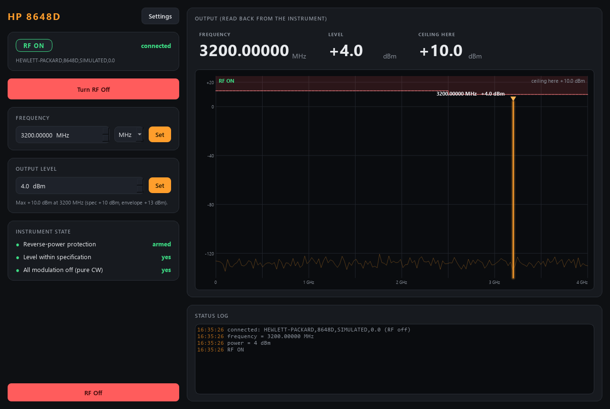

# hp8648-control

Control for an **HP / Agilent 8648D** RF signal generator (9 kHz - 4 GHz):
switch the RF output on/off and set the CW **frequency** and **output level** --
over GPIB (SCPI), or fully simulated with no hardware. An AaltoFlow module on
ports **5619 / 5620**.



*RF on at 3200 MHz / +4 dBm. The spectrum screen shows the carrier as one line;
the red staircase is the power ceiling, which drops from +13 to +10 dBm above
2500 MHz, so +12 dBm is allowed at 2 GHz but not at 3 GHz.*

It is a **set-and-forget** instrument: no control loop, no ramp, no state
machine. The brain (`SignalSource`) holds the desired signal, clamps it to the
safety limits, and lets one worker thread write it to the box, wait for the
synthesiser to switch, and read everything back. Three things make it more than
a setter:

- **The power ceiling depends on frequency.** The 8648D is specified to
  +13 dBm up to 2500 MHz and +10 dBm above (option 1EA raises it). The brain
  clamps to the tighter of that and your own envelope, and `describe` publishes
  the ceiling as the LIVE maximum of `power`, so its revision changes when the
  frequency crosses 2500 MHz. Moving to a higher band with a level that no
  longer fits lowers the level FIRST, then moves the frequency.
- **Reverse-power protection (RPP).** If power arrives at the RF output the box
  trips and switches its RF off. The module notices (status `rpp_tripped`, an
  error event, a red lamp) and makes "off" the desired state too, so nothing
  switches it back on behind your back. Remove the source, then switch RF on:
  that is also how the instrument re-arms.
- **Adopt at connect, change nothing.** When the service starts it READS the
  generator -- RF on/off, frequency, level, modulation, reverse-power state,
  reference and attenuator modes -- and shows exactly that; it writes nothing
  but `*CLS` (clears the error queue). A generator left running keeps running.
  RF found ON, a modulation found ON, a level outside your envelope or a
  reference mode found ON are each reported as a `warn` event and left as they
  are (reference modes are converted in software). The `signal` values in the
  config are defaults, sent only when you change them in Settings.
- **Pure CW is assumed, not forced.** Status reports `modulation_off` and the
  AM/FM/PM state; the module never switches a modulation. There is no phase
  control on the 8648.

The RF output is switched **only by an explicit command** (there is no config
switch for it) and is switched **off at shutdown** (Ctrl-C, the `shutdown`
verb, the launcher's Stop, or closing a local GUI).

## Layout

```
src/hp8648/
  config.py              Signal / Limits / Hardware / UI + .ini save/load
  spec.py                the 8648D's ranges, resolution and freq-dependent max level
  backends/
    base.py              SigGenBackend Protocol -- the interface everything depends on
    sim.py               SimulatedHP8648 -- resolution, RPP, unspecified-level flag, power-on state
    visa_8648.py         Visa8648 -- the real box over GPIB (SCPI, lazy pyvisa import)
  source.py              SignalSource -- clamps, worker thread, safe write order, RPP
  sim_system.py          build_sim_system(cfg)
  net/
    protocol.py          wire shapes + default ports (5619/5620)
    describe.py          the self-description (live power ceiling)
    service.py           Hp8648Service -- owns the brain, serves it over ZeroMQ
    client.py            Hp8648Client -- SignalSource-compatible facade over the socket
  apps/                  gui.py (SpectrumIndicator), settings_dialog.py, theme.py
scripts/
  run_service.py         start the service (simulated by default, --real for GPIB)
  run_gui.py             the GUI (local simulator, or --connect HOST)
  hp8648_console.py      standalone raw-protocol console (only needs pyzmq)
  smoke_test.py          quick offline check
tests/                   pytest: config, brain, describe, network, GUI (all offline)
```

## Verbs

| verb | arguments | effect |
|---|---|---|
| `set_rf` | `on` (bool) | RF output on/off; on also re-arms a tripped RPP |
| `set_frequency` | `frequency_Hz` | CW frequency, clamped to the envelope |
| `set_power` | `power_dBm` | level, clamped to the live ceiling |
| `status` `info` `get_config` `set_config` `describe` `shutdown` | | the universal verbs |
| `shutdown` | `keep_outputs?` (bool) | plain: RF off; `true` = a restart for a code update, RF left as it is (the next start adopts it) |

A reply means **accepted**, not done. Status carries the read-back values
(`rf_on`, `frequency_Hz`, `power_dBm`), the setpoints (`*_set`),
`power_ceiling_dBm`, `rpp_tripped`, `level_unspecified`, `modulation_off`,
`hw_error` and `describe_rev`. A scan waits with the `echoes` policy; the
tolerances are the instrument's resolution (10 Hz, 0.1 dB), so a request for
-12.34 dBm counts as settled at -12.3.

## SCPI commands used (real backend)

| function | set | query |
|---|---|---|
| RF output | `OUTP:STAT ON` / `OFF` | `OUTP:STAT?` |
| level | `POW:AMPL <v> DBM` | `POW:AMPL?` |
| frequency | `FREQ:CW <v> MHZ` | `FREQ:CW?` |
| modulation off | `AM:STAT OFF` `FM:STAT OFF` `PM:STAT OFF` `PULM:STAT OFF` | `AM:STAT?` ... |
| absolute units | `POW:REF:STAT OFF` `FREQ:REF:STAT OFF` `POW:ATT:AUTO ON` | |
| RPP / spec | | `STAT:QUES:POW:COND?` (bit 0 RPP, bit 1 unspecified level) |
| errors | | `SYST:ERR?` |

Source: *HP 8648A/B/C/D Operation and Service Guide*, chapter 2 (HP-IB
programming). The default address is `GPIB0::19::INSTR` (the factory HP-IB
address). The rear-panel language switch must be on **SCPI**. Every call not
yet confirmed on the instrument is marked `# VERIFY` in `backends/visa_8648.py`.

## Run

```powershell
cd modules\source\hp8648-control
.\dev.ps1 sync --extra gui                     # venv outside OneDrive (gotcha #8)
.\dev.ps1 run pytest -q
.\dev.ps1 run python scripts/smoke_test.py
.\dev.ps1 run python scripts/run_service.py    # simulated
.\dev.ps1 run python scripts/run_gui.py --connect localhost
.\dev.ps1 run python scripts/hp8648_console.py
    rf> freq 1.5 GHz
    rf> power -10
    rf> rf on
    rf> status
```

Real hardware (lab PC, NI-VISA installed):

```powershell
.\dev.ps1 sync --extra gui --extra real        # name BOTH extras (gotcha #29)
.\dev.ps1 run python scripts/run_service.py --real
.\dev.ps1 run python scripts/run_service.py --real --visa GPIB0::19::INSTR
```

## Using it from Python

```python
from hp8648.net.client import Hp8648Client

rf = Hp8648Client(host="localhost")
rf.start()
rf.set_frequency(2.45e9)
rf.set_power(-10.0)
rf.set_rf(True)
print(rf.status().rf_on, rf.status().power_ceiling_dBm)
rf.shutdown()          # closes the client; the service keeps running
```
