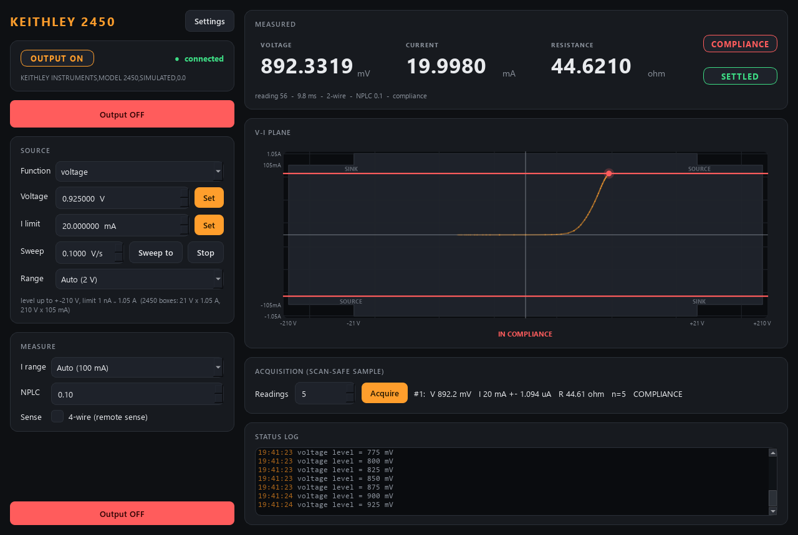

# k2450-control

Control for a **Keithley 2450 SourceMeter** (SMU): source a voltage or a
current, measure the other one, with a compliance limit so the sample is never
pushed harder than you allow -- over VISA (SCPI; USB-TMC, GPIB or LAN), or fully
simulated with a pretend sample (resistor, diode, open circuit) and no hardware.



*Simulator, diode sample: a voltage sweep from -0.5 V up into the 20 mA current
limit. The V-I plane draws the 2450's output envelope, the compliance lines
(red once the limit is reached) and the operating point's trail -- the sweep
draws its own IV curve.*

An SMU is two instruments in one box, and the module treats it that way:

* **Source** -- set-and-forget, like the RF generator: function, level,
  compliance, range, output relay. Every request is clamped to the safety
  envelope, and a clamp is announced as a warn event.
* **Measure** -- a detector, like the pm16 power meter: a polling thread takes
  readings while the output is on, and `acquire` averages N readings that all
  started **after the trigger and after the source settled**, so a scan never
  files a reading from the previous point.

## Safety, in one list

* **Start-up changes nothing.** The service only *reads* the 2450 and adopts
  what it finds (function, levels, limits, ranges, NPLC, 2/4-wire, terminals,
  output on/off); an output that was ON stays ON and is reported as such. The
  `.ini` source/measure values are defaults applied only when you set them.
* The output is switched **OFF** on shutdown (also on the launcher's
  `shutdown` verb) and before a source-function change. The module never
  switches it ON by itself. `shutdown{keep_outputs: true}` (a restart for a
  code update) leaves the output as it is; the next start adopts it.
* The **compliance limit is always written before the level** and re-sent
  before `OUTP ON`.
* The 2450's output is two boxes, **21 V x 1.05 A** and **210 V x 105 mA**.
  A combination outside both is clamped: a current limit above 105 mA confines
  the voltage to +-21 V, a voltage above 21 V confines the current limit to
  105 mA (and the mirror image when sourcing current). `describe` publishes
  these live bounds, so a scan cannot even ask for an impossible point.
* A lower personal envelope (`limits.voltage_max_V`, `current_max_A`) is one
  Settings field away.

## Ports

| service | commands (REP) | status (PUB) |
|---------|----------------|--------------|
| k2450   | 5623           | 5624         |

## Layout

```
src/k2450/
  config.py              Source / Measure / Acquisition / Limits / Hardware / Sim / UI + .ini save/load
  backends/
    base.py              SourceMeterBackend Protocol, the range tables, Reading
    sim.py               SimulatedK2450 -- fake 2450 + pretend sample (compliance, 2/4-wire, noise, NPLC timing)
    scpi_2450.py         VisaK2450 -- the real instrument, SCPI over VISA (lazy pyvisa import)
  smu.py                 SourceMeter -- clamps, safety, settling, polling thread, acquire
  sim_system.py          build_sim_system(cfg) -- wire the simulator into a SourceMeter
  net/
    protocol.py          wire shapes + default ports (5623/5624)
    describe.py          the self-description (controls, detectors, settle + acquire policies)
    service.py           K2450Service -- owns the SMU, serves it over ZeroMQ
    client.py            K2450Client -- SourceMeter-compatible facade (+ blocking helpers)
  apps/                  gui.py (IVPlaneIndicator), settings_dialog.py, theme.py
scripts/
  run_service.py         start the service (simulated by default, --real for the instrument)
  run_gui.py             the GUI (local simulator, or --connect HOST)
  k2450_console.py       standalone raw-protocol console (only needs pyzmq)
  smoke_test.py          quick offline check
tests/                   pytest: config, brain + physics, describe, network, GUI smoke
```

## Verbs

`set_output{on}`, `output_off`, `set_source_function{function}`,
`set_voltage{voltage_V}`, `set_current{current_A | current_uA}`,
`set_current_limit{current_limit_A}`, `set_voltage_limit{voltage_limit_V}`,
`set_source_auto_range{on}`, `set_source_range{range}`,
`set_measure_auto_range{on}`, `set_measure_range{range}`, `set_nplc{nplc}`,
`set_four_wire{on}`, `set_acquisition{readings}`, `acquire` (-> `acq_id`),
`get_sample`, plus the universal `status`, `info`, `get_config`, `set_config`,
`describe`, `shutdown{keep_outputs?}`.

## In a scan

* **Axes:** `k2450.source_voltage` (V) or `k2450.source_current` (uA -- so the
  settle check resolves 1 pA; see `net/describe.py`). Which one is a control
  depends on the source function; the other is shown read-only. The settle
  rule is *adopted, then `settled`* (the level has held `source.settle_s` with
  the output on).
* **Detectors:** `voltage`, `current`, `resistance` (+ `_std`) and
  `sample_tripped`, all from ONE acquisition per point.
* **Routine action:** `output_off` (e.g. `after_scan`).

Switch the output on before the scan (the `output` control, or by hand):
`acquire` refuses with the output off, so a forgotten output fails loudly
instead of recording zeros.

## SCPI commands used (real backend)

| function | command |
|---|---|
| command set check | `*LANG?` must answer `SCPI` (front panel: MENU > System > Settings) |
| source function | `:SOUR:FUNC VOLT\|CURR`, `:SENS:FUNC "CURR"\|"VOLT"` |
| level | `:SOUR:VOLT <V>` / `:SOUR:CURR <A>` |
| compliance | `:SOUR:VOLT:ILIM <A>` / `:SOUR:CURR:VLIM <V>` |
| in compliance? | `:SOUR:VOLT:ILIM:TRIP?` / `:SOUR:CURR:VLIM:TRIP?` |
| ranges | `:SOUR:<f>:RANG:AUTO ON\|OFF`, `:SOUR:<f>:RANG <r>`, `:SENS:<f>:RANG...` |
| integration | `:SENS:<f>:NPLC <n>` |
| 4-wire | `:SENS:<f>:RSEN ON\|OFF` |
| output | `:OUTP ON\|OFF`, `:OUTP?` |
| reading | `:READ? "defbuffer1", READ, SOUR` (measured value, source readback) |
| errors | `:SYST:ERR:NEXT?` after every group of settings |

None of it has run on a real 2450 yet: every call is marked `# VERIFY` in
`backends/scpi_2450.py`.

## Setup and run

```powershell
cd modules\source\k2450-control
.\dev.ps1 sync --extra gui               # simulator + GUI
.\dev.ps1 sync --extra gui --extra real  # + pyvisa / pyvisa-py for the instrument
.\dev.ps1 run pytest -q
.\dev.ps1 run python scripts\smoke_test.py
.\dev.ps1 run python scripts\run_service.py              # add --real (and --visa ...) for hardware
.\dev.ps1 run python scripts\run_gui.py --connect localhost
.\dev.ps1 run python scripts\k2450_console.py status
```

`dev.ps1` keeps the virtual environment off OneDrive
(`%LOCALAPPDATA%\uv-venvs\k2450-control`); see the suite's developer notes,
gotcha #8. Name every extra on each sync: a sync without `--extra real`
uninstalls pyvisa again (gotcha #29).
