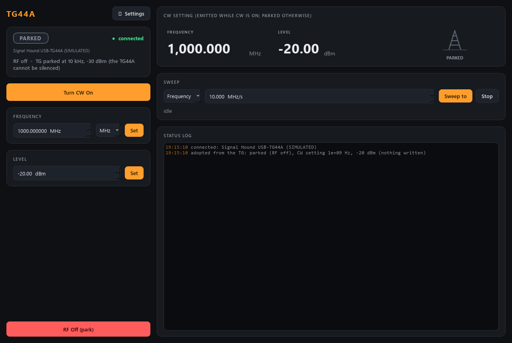

# shsg-control -- Signal generator (Signal Hound TG)

The Signal Hound **USB-TG44A tracking generator used as a plain CW source**:
output on/off, frequency (10 Hz - 4.4 GHz) and level (-30 to -10 dBm), and
continuous **sweeps** of frequency or level for fly scans (below). No phase,
no modulation -- the TG has neither. Ports 5625 / 5626.

**The TG44A cannot be switched off.** It keeps emitting its last frequency and
level even after every program has exited. So "RF off" here means **parked**:
moved to a park frequency (the signalhound service's setting, default 10 kHz)
at the minimum level (-30 dBm). The GUI says so ("RF off - TG parked at 10 kHz,
-30 dBm (the TG44A cannot be silenced)") and status carries `parked`,
`park_Hz`, `park_dBm`; `rf_on` is false while parked.



## How it relates to the other Signal Hound modules

The Signal Hound API drives the TG **through the spectrum analyser's USB
handle**, and a USB device can be opened by one process only. So the kit is
split into three modules (decision 2026-09-28):

| module | what it is | touches USB? |
|---|---|---|
| `signalhound` | spectrum analyser; the **owner** of both USB devices | yes, the only one |
| `shsg` (this) | the TG as a signal generator (CW) | no -- a client of `signalhound` |
| `shsna` | scalar network analyser (TG sweep + analyser) | no -- a client of `signalhound` |

With `--real`, shsg sends `tg_cw {on?, freq_hz?, level_dbm?}` to the
signalhound service and shows what that service **publishes as applied**
(`tg_cw_on`, `tg_cw_freq_hz`, `tg_cw_level_dbm`) -- never its own request, so a
scan waiting for the frequency cannot be fooled by a value that was only asked
for. The launcher starts `signalhound` first (`start_after` in module.toml) and
passes its address in `AALTOFLOW_ENDPOINTS`; started by hand, shsg uses
`[hardware] owner_host / owner_cmd_port / owner_pub_port` (default
127.0.0.1:5587/5588).

The CW output may stay on while the analyser sweeps a spectrum. A **network
analyser sweep takes the TG** for its duration: shsg then shows `tg_busy`
(amber "TG BUSY" in the GUI) and refuses commands with a clear message; the
signalhound service restores the CW afterwards.

## Behaviour worth knowing

- **Adopt on start:** the service only READS the TG's state at start; nothing is
  written. The analyser usually cannot read the TG (`tg_mode` "unknown" -- it may
  still be emitting whatever another program left it at): then nothing is
  adopted and the GUI says "TG state unknown -- it may be emitting"; set
  frequency, level and CW (or park) explicitly.
- **Stop:** a clean stop (launcher Stop, `shutdown` verb, closing the local
  GUI) **parks** the TG (`[hardware] off_on_shutdown`, default on);
  `shutdown{keep_outputs: true}` (a restart for a code update) leaves the TG as
  it is whatever that setting says, and the next start adopts it. A killed
  service leaves the TG as it is; the signalhound service parks it when it
  stops itself.
- **signalhound not running:** shsg still starts; status `hw_error` says
  "signalhound service not reachable (...)" (red in the GUI) and commands are
  refused at once. When the owner comes up, shsg picks it up by itself.
- **Status keys** besides `rf_on`, `frequency_Hz`, `power_dBm`: `parked`,
  `park_Hz`, `park_dBm`, `tg_busy`,
  `tg_unknown`, `tg_ready` (connected, no error, not busy, state known),
  `hw_error`, `connected`, `idn`, and the sweep keys (section "Sweeps").
- **Scans:** `frequency`, `power` and `rf_on` settle when the echo matches the
  requested value (within `echo_tol_Hz` / `echo_tol_dB`) **and** `tg_ready` is
  true -- so no point is measured while a network-analyser sweep holds the TG.

## Sweeps (fly scans over frequency or level)

A fly scan (scan-core, `type: fly` axis) records the detectors while a knob
moves CONTINUOUSLY and bins every sample by the value the knob had at that
moment. The TG jumps to the value it is told, so the **service walks the
knob** in small steps (`softramp.py`, the suite's software ramp, copied byte
for byte from suite-common): one `tg_cw` to the signalhound service every
`[hardware] ramp_dt_s` (100 ms), each value computed from the elapsed time, so
a late step does not slow the sweep down. There is no phase sweep: the TG has
no phase control.

| verb | arguments | pace limits (config `[limits]`) |
|---|---|---|
| `ramp_frequency` | `frequency_Hz`, `rate_Hz_per_s` | `ramp_rate_min/max_Hz_per_s` (1 kHz/s .. 1 GHz/s) |
| `ramp_power` | `power_dBm`, `rate_dB_per_s` | `ramp_rate_min/max_dB_per_s` (0.01 .. 20 dB/s) |
| `ramp_stop` | `knob` (optional; none = every sweep) | a stop: a viewer may send it |

- The reply carries the sweep's number (`ramp_id`); status shows
  `<knob>_ramping`, `<knob>_ramp_id`, the target and the pace
  (`frequency_ramp_target_Hz`, `power_ramp_rate_dB_per_s`, ...) and `ramping`
  (any knob). The sweep is over when `<knob>_ramp_id` is yours and
  `<knob>_ramping` is false.
- A target or pace outside the limits is clamped, with a warning.
- An ordinary `set_frequency` / `set_power` takes that knob over (stops its
  sweep); a set of the other knob does not. `set_rf` / `rf_off` (switching the
  output) and a clean stop end every sweep.
- **Why 100 ms per step (twice smb's 50 ms):** every step is a ZeroMQ round
  trip to the signalhound service plus that service's USB call -- `saSetTg`
  took ~0.03 s on the lab's SA44B + TG44A (measured 2026-09-28) -- and the
  owner first waits up to 0.2 s for its hardware lock if it is fetching a
  spectrum just then. 100 ms leaves about 3x headroom over the measured call.
- **A step the owner refuses or does not answer ends the sweep** with an error
  event (busy with a network-analyser sweep, no TG, out of range, timeout after
  `owner_timeout_ms`, owner gone) -- it never hangs. A step the owner accepted
  but DEFERRED (its hardware was busy) is counted, and a warning at the end
  says how many: those values reached the TG later than the record says.
- **Never switches the CW, never unparks.** A sweep while the TG is parked is
  allowed but only walks the STORED CW setting (what the TG will emit when CW
  is switched on), exactly like an ordinary set while parked; a warning says
  so. The steps are then not sent one by one (each would make the owner
  re-park the TG for nothing); the value the walk ends at is sent once. A
  sweep is REFUSED while the TG is busy (`tg_busy`), its state is unknown
  (`tg_unknown`: there is no honest place to start from -- set it first), or
  `hw_error` is set.
- **Binned by command.** The stream verbs (`stream_start` / `stream_read` /
  `stream_stop`) hand out every value each sweep SENT, one channel per knob
  (`frequency`, `power`, each with its own time stamps in `t_ch`). describe
  declares a `ramp` block on both knobs with `readback.measured: false`. Why
  not read back: the only read-back is the owner's status echo, which is the
  setting it stored after `saSetTg` returned, not a measurement of the tone --
  it would only echo the number just sent, ~10 times a second.
- **VERIFY on the rig:** that the steps keep the 100 ms pace while the analyser
  also sweeps spectra (the stream's time stamps show it); how the TG44A changes
  level (an attenuator switching at fixed points would make the tone jump);
  the smallest frequency step `saSetTg` honours. The signalhound service logs
  one line per applied `tg_cw`, so a sweep fills its log at 10 lines a second.

The GUI's **Sweep** card does the same by hand: pick the knob, set the pace,
"Sweep to" walks it to the value in that knob's box, "Stop" ends it.

Tests: `tests/test_sweep.py` (each knob to its end at the pace, stop, a set
taking over, the CW never switched and a parked TG never unparked, the record,
refusing / silent owner, the verbs over the wire; ports 17670..17673).

## Run

```powershell
cd modules\source\shsg-control
uv sync --extra gui
uv run pytest -q
uv run scripts/smoke_test.py                   # offline sanity check
uv run scripts/run_service.py                  # standalone SIMULATED TG
uv run scripts/run_service.py --real           # the real TG, via the signalhound service
uv run scripts/run_gui.py                      # GUI with its own private simulator
uv run scripts/run_gui.py --connect localhost  # GUI of a running service
uv run scripts/shsg_console.py status          # raw-protocol console
```
