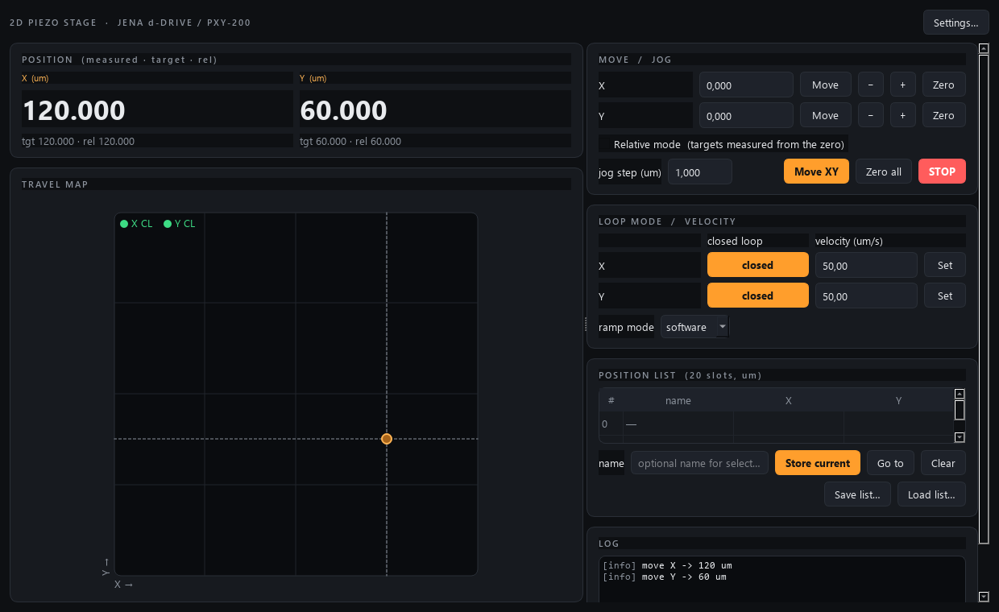

# piezo-control

Control module for a **2D piezo stage** — a [piezosystem jena **d-Drive**](https://www.piezosystem.com/)
digital controller driving a **PXY-200** XY piezo flexure stage — in the
AaltoFlow instrument suite. It is the fourth module, built to the same
pattern as `clMag-control`, `smb-control` and `stage-control`
(see `INSTRUMENT_MODULE_GUIDE.md`): one **service** process owns the hardware
(or its simulator) and speaks ZeroMQ; **GUIs**, a console and a future
coordinator are **clients**.



*Arrived at (120, 60) um in closed loop, with the software velocity ramp. Both axes show a green CL badge; the travel map envelope is sized to the closed-loop travel, which is smaller than open-loop.*

## What it does

- **XY positioning** — move each axis to an absolute position (µm), move both at
  once, jog by a step, or move relative to a "zero here" origin.
- **Closed-loop / open-loop switching per axis** — closed loop uses the PXY-200
  strain-gauge sensor (hysteresis-free, ~160 µm travel); open loop is fast and
  high-resolution (~200 µm travel). The usable travel limit follows the mode
  automatically, and switching to closed loop re-clamps a standing target that
  no longer fits.
- **Velocity control** — a piezo normally snaps to a setpoint. To move at a
  chosen speed you pick a **ramp mode**:
  - `hardware` — push the speed to the controller's native **slew-rate**
    limiter, then write the setpoint once; the hardware rate-limits.
  - `software` — the module walks the setpoint to the target in small timed
    steps (the "ramp" fallback), which works even if you don't trust the
    hardware slew rate and behaves identically in the simulator.
  - `off` — go as fast as the piezo allows.
- **Remote read/write** — every command and the live position are available over
  ZeroMQ, so another PC (or the coordinator) can read and set positions.
- Plus a **20-slot named position list** (save/load to JSON) and a GUI with a
  live XY **travel map**.

## Ports

Instrument #3 in the suite → **command (REP) 5561**, **status (PUB) 5562**
(rule: `cmd = 5555 + 2n`, `pub = cmd + 1`). Distinct from magnet (5555/6),
RF (5557/8) and the coarse stage (5559/60), so all services coexist.

## Install & run

This module uses [uv](https://docs.astral.sh/uv/) and a `src/` layout. The
simulator needs no hardware drivers, so you can run everything on any PC.

```powershell
# one-time, per machine — keep the venv OFF OneDrive (see Troubleshooting)
[Environment]::SetEnvironmentVariable('UV_PROJECT_ENVIRONMENT', "$env:LOCALAPPDATA\uv-venvs\piezo-control", 'User')
$env:UV_PROJECT_ENVIRONMENT = "$env:LOCALAPPDATA\uv-venvs\piezo-control"

uv sync --extra gui        # install (GUI extra pulls in PySide6)
```

Then:

```powershell
uv run scripts/run_gui.py               # GUI, local simulator (no service needed)
uv run scripts/run_service.py           # start the simulator service on 5561/5562
uv run scripts/run_gui.py --connect 127.0.0.1   # GUI as a remote client
uv run python scripts/smoke_test.py     # instant offline sanity check
uv run pytest -q                        # the test suite (offline)
```

Talk to a running service by hand with the standalone console (only needs
pyzmq, no package import — copy it anywhere):

```powershell
uv run python scripts/piezo_console.py            # interactive REPL
uv run python scripts/piezo_console.py status     # one-shot
```

### Going live on the lab PC (the d-Drive)

1. In `pyproject.toml`, **uncomment** `"pyserial>=3.5"` and re-run `uv sync`.
2. Open `src/piezo/backends/ddrive.py` and **verify the command strings** in the
   `_CMD` block against your d-Drive manual — the verb spellings, whether a
   channel index is sent, the value **units** (µm vs % stroke vs volts) and the
   slew-rate unit vary across piezosystem jena controller generations. This is
   the module's one "hardware pass" (everything else is backend-agnostic).
3. Set the COM port and channel map in Settings (or an INI file):
   `port = COM3`, `ch_x = 0`, `ch_y = 1`.
4. Start against real hardware: `uv run scripts/run_service.py --real`
   (or `uv run scripts/run_gui.py --real`).

## Command reference (wire protocol)

Every reply is `{"ok": true, ...}` or `{"ok": false, "error": "..."}`.
Commands are fire-and-forget: `ok` means *accepted*, poll `status` for the
effect.

| command | args | effect |
|---|---|---|
| `status` / `info` / `get_config` / `set_config` | — / `config` | universal verbs |
| `move_axis` | `axis`, `position` | absolute move, one axis (µm) |
| `move_xy` | `x`, `y` | absolute move, both axes |
| `move_relative` | `axis`, `value` | move relative to the axis' zero |
| `stop` | `axis?` | freeze one axis (or all) where it is |
| `set_closed_loop` | `axis`, `enabled` | closed-loop (servo) on/off |
| `set_velocity` | `axis`, `value` | motion speed, µm/s |
| `set_ramp_mode` | `mode` | `hardware` \| `software` \| `off` |
| `set_zero` / `clear_zero` | `axis?` | define / drop the relative origin |
| `store_position` / `goto_position` / `clear_position` | `slot`, `name?` | position list |
| `get_positions` / `save_positions` / `load_positions` | `path?` | position list files |

`axis` accepts `"X"`/`"Y"` or `0`/`1`.

## Troubleshooting

**`uv sync` fails with "Access is denied (os error 5)"** — this project lives in
OneDrive, which locks files inside `.venv` as it syncs. Put the venv **off**
OneDrive with the `UV_PROJECT_ENVIRONMENT` step above (once per machine).

## Layout

```
piezo-control/
  src/piezo/
    config.py            # dataclasses + INI (Motion/Limits/Relative/Hardware)
    piezo.py             # the brain: clamp, CL/OL switch, velocity, ramp thread
    positions.py         # 20-slot XY position list
    sim_system.py        # build_sim_system / build_real_system
    backends/
      base.py            # PiezoBackend Protocol
      sim.py             # simulator (default): slew-limited + OL hysteresis model
      ddrive.py          # REAL d-Drive over serial (lazy pyserial; verify _CMD)
    net/
      protocol.py        # ports 5561/5562, (de)serialisation
      service.py         # PiezoService: PUB status + REP commands
      client.py          # PiezoClient: brain-compatible facade
    apps/
      theme.py           # shared dark/amber theme
      gui.py             # MainWindow + PiezoIndicator (XY travel map)
      settings_dialog.py # per-group config editor
  scripts/               # run_service, run_gui, piezo_console, smoke_test
  tests/                 # config / brain / net / gui smoke
```
