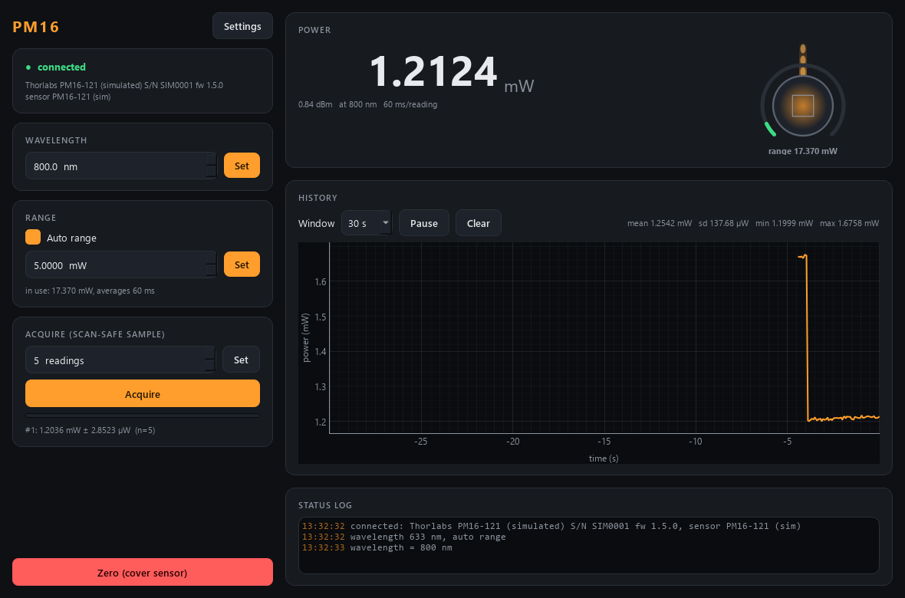

# pm16-control — Thorlabs PM16 USB power meter

Optical power meter module of the TR-MOKE suite, for the Thorlabs **PM16**
series (the lab's unit: **PM16-121**, Si photodiode, 400–1100 nm). The first
module in the suite **tested on real hardware** (2026-09-15).



| control / reading | |
|---|---|
| wavelength | sets the responsivity the meter uses; a wrong wavelength gives a wrong power, not an error |
| auto range / manual range | manual range snaps **up** to the meter's next range (0.174 mW, 17.4 mW, 1.74 W on the PM16-121) |
| power | live, ~17 readings/s (each a fixed 60 ms average) |
| acquire | the scan-safe sample: mean ± sd of N readings that all **started after** the trigger |
| zero | dark adjustment — **cover the sensor first** |

Service ports **5571 / 5572** (instrument #8). Runs in simulation unless `--real`.

## Run it

```powershell
cd pm16-control
uv sync --extra gui
uv run scripts/list_devices.py                 # which meters this PC sees (changes nothing)
uv run scripts/run_gui.py --real               # GUI on the real meter, no service
uv run scripts/run_service.py --real           # the service on the real meter
uv run scripts/run_gui.py --connect localhost  # GUI on the running service
uv run scripts/pm16_console.py                 # raw-protocol console: power, acquire, wl 633
uv run pytest -q
```

Close **Thorlabs OPM** first: while it runs it holds the meter.

Stop the service with Ctrl+C, the launcher's Stop, or the `shutdown` verb —
**never taskkill it**: a killed service can leave the PM16 answering "I/O error"
until it is unplugged and plugged back in.

## How it talks to the meter

Through **TLPMX**, Thorlabs' C driver library (`TLPMX_64.dll`, installed with
OPM), called with Python's built-in `ctypes`, so there is no extra package to
install. Why not pyvisa/SCPI like smb: Thorlabs gives the PM16 its own USB
driver by default, and NI-VISA cannot see a device on it; TLPMX works with
either driver.

At start the module **adopts** the meter's stored wavelength and range instead of
pushing its config (the meter remembers them across power cycles). Set
`hardware.push_on_start = true` to push the config instead.

## Commands (wire verbs)

`set_wavelength{wavelength_nm}` · `set_auto_range{on}` · `set_range{range_W}`
(switches auto off) · `set_acquisition{readings}` · `acquire` → `{acq_id}` ·
`get_sample` · `zero` · `cancel_zero` · `shutdown` (close the meter and exit) · plus the universal `status`, `info`,
`describe`, `get_config`, `set_config`.

In scan-core: settable `wavelength` (and `range` when auto-range is off),
detectors `power` / `power_std` (mW, acquired) and `live_power`.
