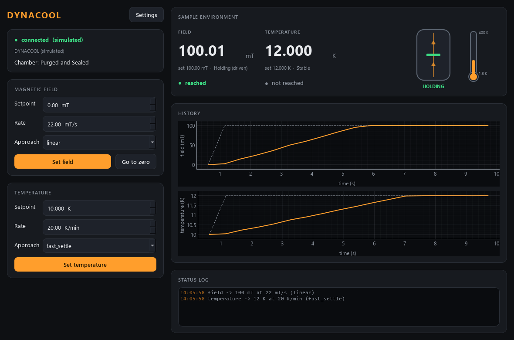

# ppms-control -- Quantum Design DynaCool (PPMS family)

The cryostat's **magnetic field**, **temperature** and **chamber** as an
AaltoFlow module, driven through MultiVu -- or fully simulated with no cryostat.
It is the Python successor of the DynaCool half of the old LabVIEW
"QD_VNA_Integration" program (`QDInstrument_ControlField.vi`), and together with
`vna-control` (the Copper Mountain C1209) it runs the VNA-FMR measurement in the
DynaCool.



*(simulator: a 100 mT ramp reached and held; a 2 K step at its setpoint, still inside its 5 s hold.)*

Ports **5579 / 5580**.

> **Not yet run on the instrument.** The real backend has been exercised against
> Quantum Design's own MultiPyVu in its simulation mode (the real code path, no
> MultiVu) and against a fake of it; the lines that still need a look on the
> DynaCool are marked `# VERIFY` in `src/ppms/backends/multivu.py` and `config.py`.

## Run

```powershell
cd ppms-control
uv sync --extra gui                              # simulator only
uv sync --extra gui --extra real                 # + MultiPyVu, for the real DynaCool
uv run scripts/run_service.py                    # simulated DynaCool
uv run scripts/run_service.py --real --scaffold  # real backend, MultiPyVu's own simulation
uv run scripts/run_service.py --real             # MultiVu must be running on this PC
uv run scripts/run_gui.py --connect localhost
uv run scripts/ppms_console.py field 500
```

**`uv sync` removes extras you do not name** -- on the DynaCool PC always sync
with `--extra gui --extra real`. A `ppms.ini` next to this README (not in git) is
loaded by the service when present: put the magnet's real limit there
(`[limits] field_max_mT = 9000` for a 9 T magnet).

## How it works, and why

- **MultiVu owns the DynaCool**; nothing talks to the hardware directly.
  Quantum Design's supported Python route is **MultiPyVu**: a small socket server
  that sits next to MultiVu (COM, pywin32) plus a client. The service starts that
  server *inside its own process*, bound to 127.0.0.1 only, and is its one
  client -- nothing else to launch, nothing listening on the network.
- **Units are the suite's.** MultiVu speaks oersted; 1 mT = 10 Oe, converted in
  `backends/multivu.py` and nowhere else (the old VI divided GET FIELD by 10).
- **MultiVu runs the loops**, so this is a set-and-forget module whose one subtle
  job is saying honestly when a setpoint is **reached**, with the old program's
  rule made explicit and configurable:
  - field: within `tolerance_mT` (0.1) of the setpoint AND MultiVu reports the
    magnet holding (`Holding (driven)` -- the LabVIEW driver's "StableDriven"),
    continuously for `stable_time_s` (3 s, the old fixed wait);
  - temperature: within `tolerance_K` (0.5) AND MultiVu says `Stable`, for 5 s.
  A new setpoint clears the flag in the same locked step that stores it, so no
  status can show the new setpoint next to the old point's "reached" -- the trap
  scan-core's `adopt_then_flag` exists for.
- **Start and stop never move anything.** At start the brain ADOPTS MultiVu's
  current setpoints; at stop it just disconnects. A Kepco electromagnet is ramped
  down when its service dies; a DynaCool left at 5 T and 2 K on purpose stays
  there. Returning the field to 0 after a scan is a scan routine, as the old
  "Switch off field after sweep?" was.
- **Driven only.** The DynaCool magnet has no persistent mode (MultiPyVu: "the
  PPMS is the only flavor which can run persistent"), so there is no mode choice.
- Rate and approach (linear / no overshoot / oscillate; fast settle / no
  overshoot) are settings that go out with the next setpoint.
- `describe` gives scan-core two settables, `ppms.field` (mT) and
  `ppms.temperature` (K), with a settle **timeout derived from range and rate**
  (a full 9 T sweep at 22 mT/s takes ~14 min; scan-core's default 60 s would
  abort it). The chamber is shown, not commanded (purge/seal/vent are left to
  MultiVu for now).
- The status key `measured_field_mT` is the one clMag uses, so `vna-control`
  reads the DynaCool's field with the same code (field source `ppms`).

## Layout

```
src/ppms/
  config.py            Field / Temperature / Limits / Hardware / UI + .ini save/load
  backends/
    base.py            CryostatBackend Protocol (mT, K; MultiVu's status words)
    sim.py             SimulatedDynaCool -- ramps, "Holding (driven)", "Chasing/Near/Stable"
    multivu.py         MultiVuDynaCool -- MultiPyVu server + client in-process (lazy import)
  cryostat.py          Cryostat -- clamps, pushes, polls, decides field/temperature reached
  net/                 service, client, protocol, describe
  apps/                gui (CryostatIndicator + history charts), settings dialog, theme
scripts/               run_service.py, run_gui.py, ppms_console.py, smoke_test.py
tests/                 43 tests, offline (the real backend against a fake MultiPyVu)
```
