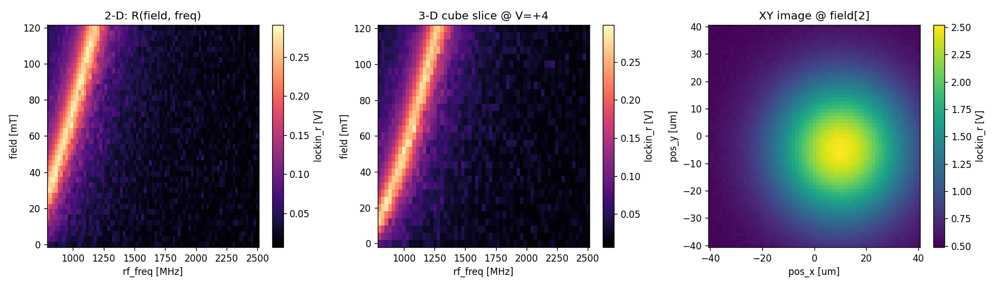
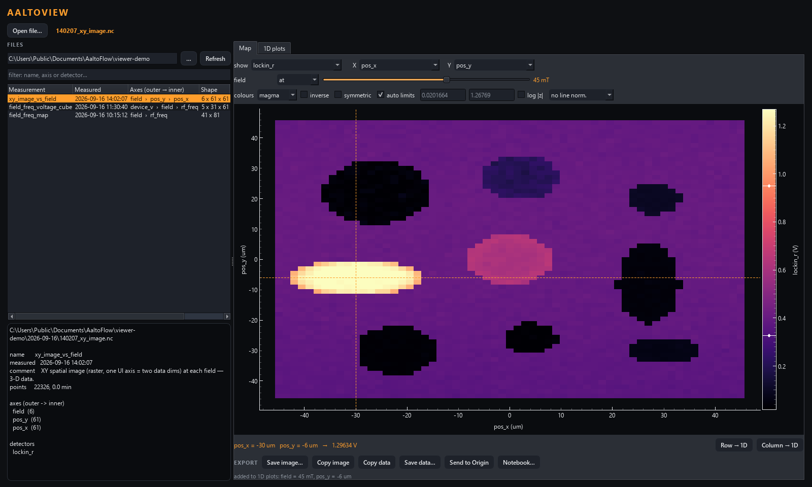
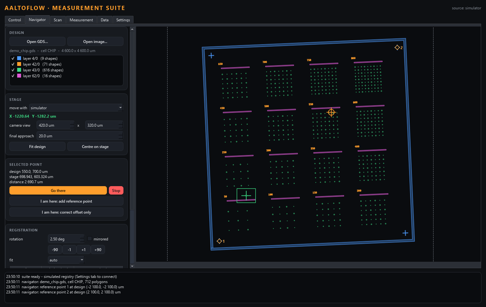

# scan-core

Data-first, **N-dimensional** scan engine + a **Scan Builder** GUI for the AaltoFlow
suite. A scan is a serializable *recipe*; every knob is a registered *Parameter*.
That's what removes the old system's 2-loop ceiling and hardcoding. See
`DESIGN.md` for the full data model.


*A 2-D scan of the simulated system: field (outer) x RF frequency (inner), 41 x 81 = 3,321 points, with the field-dependent resonance line curving across the live heatmap. The axis stack is ordered outer to inner and has no length limit.*

## Run it

```bash
cd scan-core
uv sync --extra gui

# headless proof: 2-D, 3-D and XY-raster scans on the sim -> netCDF + a figure
uv run python run_demo.py            # writes out/*.nc and out/scan_demo.png

# the Scan Builder GUI
uv run python apps/scan_builder.py
```

`run_demo.py` writes this, headless, in well under a second:



Three scans through one engine and one code path: a 2-D field x frequency map,
a slice of a 3-D cube (device voltage x field x frequency), and an XY raster
image at one field. The odometer does not care how many dimensions it is
driving.

In the builder: double-click a parameter (left) to add it as an axis, reorder the
stack outer→inner (↑/↓), tick detectors, watch the dimensions/points/ETA update,
then **Run** — the result heatmap is the innermost two dims (outer dims sliced at
0). Load/Save recipe is YAML; Save data is netCDF.

## Data viewer (the AaltoView successor)

Its own private repository since 2026-09-16:
[FlashLukas/AaltoView](https://github.com/FlashLukas/AaltoView).
scan-core installs it as a dependency (pinned in `uv.lock`) and uses it for the
suite's Data tab, the live result pane's reduction, and reading `.nc` files back.
After a change there: `uv lock --upgrade-package aaltoview; uv sync --extra gui`.

```bash
uv sync --extra gui --extra origin      # "origin" only for the live push into Origin
uv run python apps/viewer.py [file.nc] [--folder DIR] [--theme light]
```



*A 3-D cube (field x Y x X): an FMR image of a patterned sample -- discs and bars,
each resonating at its own frequency -- held at 45 mT, where one bar is on
resonance and the rest are dark. The cursor sits on it and the row through it has
been sent to 1D plots. Move the field slider and a different element lights up.*

- **Files**: the data folder (the suite's data directory by default, day
  sub-folders included), newest first, with each file's axes, shape and
  detectors; the selected file's header underneath. Double-click to open.
- **Map**: any two dims as X/Y; every other dim is held at a value or averaged
  (all or a range). Colour map, inverse, symmetric limits, auto (percentile) or
  typed limits (or drag the colour bar), log, normalise each row/column. Click
  to place a cursor; **Row -> 1D** / **Column -> 1D** send the line through it.
- **1D plots**: a dashed preview of the current selection; **Add current**, or
  pick a dim and select several values -> **Add selected** (one curve per value).
  Curves are frozen copies with their file attached, so curves from different
  measurements overlay. Normalise (peak, 0...1, first point, zero mean), stack
  (waterfall), log Y, rename, hide, remove.
- **Export** (both tabs): Save image (publication-style PNG/PDF/SVG), Copy image,
  Copy data (tab-separated), Save data (.dat/.csv; a map as matrix or XYZ),
  **Send to Origin** (worksheet + graph, or matrix + colour map; attaches to a
  running Origin), **Notebook** (a .ipynb that recomputes the view from the .nc
  files with plain numpy/xarray/matplotlib).


The arithmetic is in the package's `view.py` (reduction), `export.py` (curves,
maps, files, figures, notebooks) and `origin.py` (Origin), all tested there
without a screen; `scan_core.view` / `scan_core.data` re-export it. Not yet: AaltoView's TR-MOKE corrections (laser
repetition rate, harmonic, demodulation-frequency folding, correction file,
phase autocorrect).

## Layout

```
scan_core/
  recipe.py     # the recipe schema: load/save/validate/compile  (the data model)
  registry.py   # Parameter/Settable/Gettable + build_sim_registry (toy physics)
  engine.py     # N-D odometer -> xarray.Dataset
  hooks.py      # named per-level actions (autofocus, wait, call = routines, …)
  errors.py     # ScanAborted, RoutineError
  view.py       # re-exports aaltoview.view (N-D cube -> map / line)
  data.py       # re-exports aaltoview.data (read measurements back)
apps/
  scan_builder.py  # PySide6 cockpit
  suite.py         # the measurement suite (Control / Scan / Measurement / Data / Settings)
  viewer.py        # starts the data viewer (aaltoview)
  theme.py
recipes/        # example YAML recipes (2-D, 3-D, XY-raster)
schema/scan.schema.json
run_demo.py
```

## Running against real instruments

`build_lab_registry()` is the real counterpart of `build_sim_registry()`. Start
the services you need, then:

```bash
uv run python run_lab_demo.py            # 1-D field sweep on the live magnet
```

```python
from scan_core.lab import build_lab_registry
reg, lab = build_lab_registry(include=("clMag", "smb"))
try:
    ds = run(recipe, reg)          # identical engine, identical recipe
finally:
    lab.close()
```

**scan-core knows the protocol, not the instruments.** Every service in the
suite speaks one wire contract, so there is a single generic `Instrument` client
(`scan_core/instrument.py`) and no instrument package is ever imported. Adding a
knob is therefore a *declaration* in `scan_core/lab.py`, not new code:

```python
remote_settable(
    reg, inst,
    id="field", label="Magnetic field", unit="mT",
    limits=(lo, hi),                        # read from the service's own info block
    verb="set_field", arg="field_mT", read_key="measured_field_mT",
    settle=adopt_then_flag("setpoint_field_mT", "field_stable"),
)
```

The `settle` policy is the part worth understanding. Commands are
fire-and-forget, so `{"ok": true}` means *accepted*, not *arrived* — and for a
moment afterwards the service is still reporting the **previous** point,
including its `field_stable=True`. Watching that flag alone returns instantly at
the old value and silently measures the whole grid one step behind.
`adopt_then_flag` waits for the service to adopt the new setpoint before it
believes the flag. For set-and-forget instruments with nothing to converge,
`echoes("power_dBm")` waits for the value to be reported back.

Declared so far: **clMag** (field; measured field, magnet current, AUX AI
detectors) and **smb** (RF frequency, power, phase). The other five services
speak the same contract — each needs one `_build_*` function once its settle
signal has been confirmed against the running service.

## Detectors that return arrays (a VNA)

Not every detector gives you a number. A VNA gives you a whole trace per scan
point, because **the frequency sweep happens in hardware**, on the instrument —
far faster than the engine could ever step it. That frequency axis is a real
dimension of the measurement; it is simply *hardware-swept* rather than
*software-swept*, and it lands in the dataset after the scan's own axes:

```python
reg.add(Gettable("s21", "S21", "", vna.read_trace,
                 axes=[AxisSpec("vna_freq", "Frequency", "Hz",
                                values_fn=vna.frequencies)],
                 dtype="complex"))
```

A 31-point field sweep then produces a `(31, 401)` cube, and **the recipe format
does not change** — `detectors: [s21]` is still just an id:

```python
ds.sizes                      # {'field': 31, 'vna_freq': 401}
s21 = as_complex(ds, "s21")   # complex DataArray
abs(s21).plot()               # the FMR map
abs(s21).sel(field=40, method="nearest").plot()   # one trace
```

Detectors sharing an axis *name* share one coordinate, which is what you want
for `s11`/`s21`/`s12`/`s22` off a single sweep.

**Complex is stored as `<id>_real` and `<id>_imag`.** h5netcdf will write a
complex array and it round-trips through Python perfectly — but it then warns
the file is not conforming netCDF-4 and "might not be readable by other netcdf
tools". Lab data gets opened in MATLAB and Igor too, so the pair is the default
and `scan_core.data.as_complex` puts it back together.

**A sweep that changes mid-scan stops the run.** The array would stop being
rectangular, and padding it with NaN would hand you a file that looks fine and
is wrong.

## Routines: before, during and after a scan

Hooks fire at a moment of the scan: `before_scan`, `after_scan`, `before_point`,
`after_point`, `every_n_points`, `each_sweep`, `before_axis`, `after_axis`. The `call` action
makes a hook a **routine** -- set some parameters (each set waits until
settled), then run one instrument action (waits until finished):

```yaml
hooks:
  - {when: before_scan, action: call,
     args: {set: {mag2d.field: 150, mag2d.angle: 45}, action: vna.take_reference}}
  - {when: after_scan, action: call, args: {set: {mag2d.field: 0}}}
```

- `before_scan` runs after the conditions (`fixed`) are applied, before the
  first point. `after_scan` runs after the last point, **also after Abort**
  (commands are still sent, but not waited for), and not after an error.
- A routine puts back every parameter it moved that the scan already holds (a
  condition, an axis at its value), so a reference at 150 mT cannot leave the
  scan at 150 mT. Not at `after_scan` -- field -> 0 at the end stays at 0.
- Actions come from `registry.actions()`. A module offers one to scans by giving
  it a `wait` block in `describe`; the simulator offers `vna_reference` and a
  `u = (S21 - ref)/ref` detector (`recipes/fmr_reference_field_scan.yaml`).
- In the Scan Builder: select a parameter, **+ Before** / **+ After**,
  and pick the action in the ROUTINES card. Other hooks in a loaded file are
  kept when it is saved again.

**During the scan** (the THROUGHOUT column, **+ New**): autofocus at the start of
every row, a reference every 100 points.

```yaml
  - {when: each_sweep, axis: pos_x, edge: start, every: 1, on_error: continue,
     action: call, args: {action: camera.autofocus}}
  - {when: every_n_points, n: 100, action: call, args: {action: vna.take_reference}}
```

- A **sweep** of an axis is one pass of it from first to last value while the
  axes outside it stand still. "Start of each sweep of x" is therefore "before
  every row", at any depth and with zig-zag too; it fires after the row's new
  values are set. `edge: end` fires after each sweep except the scan's last;
  `every: 3` only on every third sweep.
- The card shows how often each routine will fire ("fires 732×").
- `on_error: continue` ("carry on if it fails", ticked by default for these):
  a failure is logged and the scan goes on. A failed camera autofocus puts Z back
  where it started.

## Navigator: find your way on a large sample

The **Navigator** tab of the measurement suite puts the sample's design file
under the stage. Open a **GDS/OASIS** layout (drawn as vectors, exact
micrometres; read with `gdstk`, no KLayout needed) or an **image** whose real
width you type in. Then register it:

1. Put a feature under the laser, click it on the design, **I am here**. With
   one point the rotation is the one you set by eye (+/-1, +/-90 buttons).
2. A second point far from the first **fits** the rotation and the stage's
   scale (the design's scale is exact, so a fitted scale that is not 1.000 is
   the stage's error). From three points the residuals say how good it is and a
   mirrored sample is detected; from four, X and Y may scale differently.
3. Click anywhere: the stage coordinates are shown, **Go there** moves.
4. An open-loop stage drifts: click the feature you actually see and
   **correct offset only** -- rotation and scale are kept.

It moves whichever stage is connected through the same parameters a scan uses
(`position_x`/`position_y` from the module's `describe`): KIM in um, the BSC203
in mm, or the simulator. **Final approach** makes every move end in +X/+Y over
that distance, so an inertia stage arrives from the same side every time. A
session (design path + reference points) saves next to the design as
`.nav.json`.



*A made-up 4.6 mm test chip registered with two reference points (diamonds),
the stage position with the camera's field of view (green) and the selected
target (amber). Simulated stage.*

## A queue of scans

**Load scan…** with several files selected (recipes, `.nc` files, or a saved
queue) opens the queue dialog: rename, reorder, remove. Every entry is validated
against the current instruments before anything runs; **Save queue…** writes
one `.yaml` with the definitions inside it.


Each scan gets its own file. **Abort** ends the current scan and the next one
starts; **Stop queue** ends all of it; an error stops the queue.


## Tests

```bash
uv run pytest -q        # 308 tests, all offline
```

`tests/conftest.py` holds a small fake service that speaks the wire contract, so
the whole engine and client layer is testable with no hardware and no instrument
package installed.

## Status

Built: schema, registry + sim, N-D engine, headless demo, Scan Builder, the
generic instrument client, and a real registry for clMag and smb.
Next: the remaining five instruments, an auto-generated Raw control panel,
adaptive sampling, live fitting, and a Coordinator card in Mission Control.
