# scan-core

Data-first, **N-dimensional** scan engine + a **Scan Builder** GUI for the AaltoFlow
suite. A scan is a serializable *recipe*; every knob is a registered *Parameter*.
That's what removes the old system's 2-loop ceiling and hardcoding. See
`DESIGN.md` for the full data model.

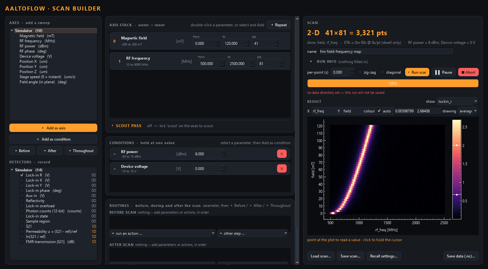

*A 2-D scan of the simulated system: field (outer) x RF frequency (inner), 41 x 81 = 3,321 points, with the field-dependent resonance line curving across the live heatmap. The axis stack is ordered outer to inner and has no length limit.*

## Run it

```bash
cd scan-core
uv sync --extra gui

# headless proof: 2-D, 3-D and XY-raster scans on the sim -> netCDF + a figure
uv run python run_demo.py            # writes out/*.nc and out/scan_demo.png

# the Scan Builder GUI
uv run python apps/scan_builder.py
```

`run_demo.py` writes this, headless, in well under a second:

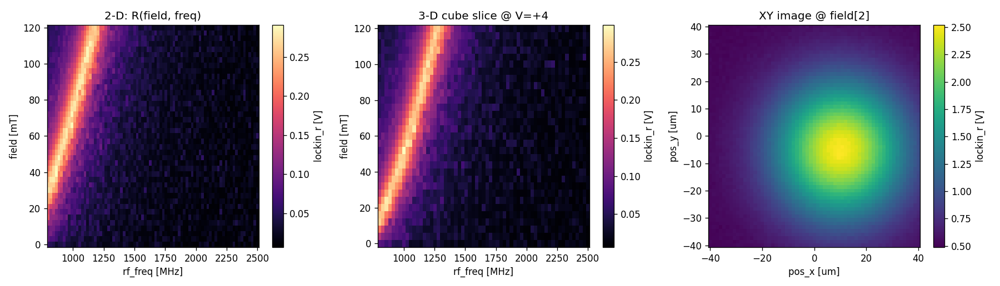

Three scans through one engine and one code path: a 2-D field x frequency map,
a slice of a 3-D cube (device voltage x field x frequency), and an XY raster
image at one field. The odometer does not care how many dimensions it is
driving.

In the builder: double-click a parameter (left) to add it as an axis, reorder the
stack outer→inner (↑/↓), tick detectors, watch the dimensions/points/ETA update,
then **Run**. Load/Save recipe is YAML; Save data is netCDF.

The ETA before a run counts the per-point dwell only (it says so): settling and
routines such as an autofocus cannot be known in advance. While the scan runs it
is replaced by the MEASURED remaining time, and the suite's Measurement tab says
where the scan is: point n / N, each axis's value with (i/len), the routine step
in progress ("now: ...") and, in a queue, "scan x of y". The engine hands the
grid index and the axis values to `on_progress` as a `where=` keyword
(`engine.where_of`; zig-zag already applied, once per row for a fly scan); a
callback with the old `(done, total, eta)` signature is still called that way.
The live map outlines the point just measured (a vertical line on a 1-D plot).

The live map is AaltoView's `MapImage`: with more points than pixels, each pixel
shows a block of points by their average, max (keeps peaks -- a one-point tone
in a 21 000-point spectrum) or min (keeps dips), picked with **drawing** next to
the colour controls. A detector in dBm starts on max. Only the drawing changes;
the data never does.

## Data viewer (the AaltoView successor)

Its own private repository since 2026-09-16:
[FlashLukas/AaltoView](https://github.com/FlashLukas/AaltoView).
scan-core installs it as a dependency (pinned in `uv.lock`) and uses it for the
suite's Data tab, the live result pane's reduction, and reading `.nc` files back.
After a change there: `uv lock --upgrade-package aaltoview; uv sync --extra gui`.

```bash
uv sync --extra gui --extra origin      # "origin" only for the live push into Origin
uv run python apps/viewer.py [file.nc] [--folder DIR] [--theme light]
```

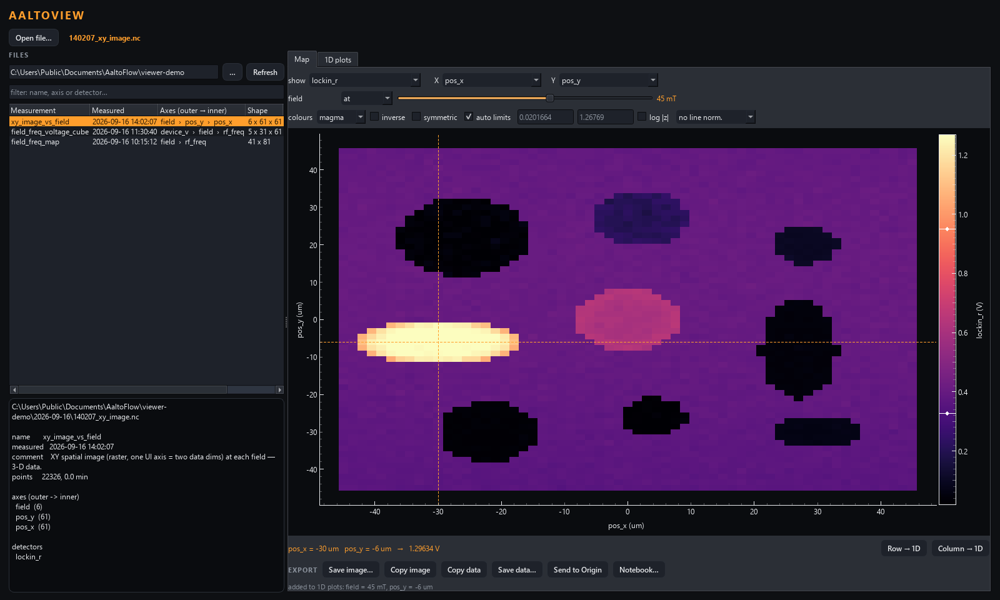

*A 3-D cube (field x Y x X): an FMR image of a patterned sample -- discs and bars,
each resonating at its own frequency -- held at 45 mT, where one bar is on
resonance and the rest are dark. The cursor sits on it and the row through it has
been sent to 1D plots. Move the field slider and a different element lights up.*

- **Files**: the data folder (the suite's data directory by default, day
  sub-folders included), newest first, with each file's axes, shape and
  detectors; the selected file's header underneath. Double-click to open.
- **Map**: any two dims as X/Y; every other dim is held at a value or averaged
  (all or a range). Colour map, inverse, symmetric limits, auto (percentile) or
  typed limits (or drag the colour bar), log, normalise each row/column. Click
  to place a cursor; **Row -> 1D** / **Column -> 1D** send the line through it.
- **1D plots**: a dashed preview of the current selection; **Add current**, or
  pick a dim and select several values -> **Add selected** (one curve per value).
  Curves are frozen copies with their file attached, so curves from different
  measurements overlay. Normalise (peak, 0...1, first point, zero mean), stack
  (waterfall), log Y, rename, hide, remove.
- **Export** (both tabs): Save image (publication-style PNG/PDF/SVG), Copy image,
  Copy data (tab-separated), Save data (.dat/.csv; a map as matrix or XYZ),
  **Send to Origin** (worksheet + graph, or matrix + colour map; attaches to a
  running Origin), **Notebook** (a .ipynb that recomputes the view from the .nc
  files with plain numpy/xarray/matplotlib).

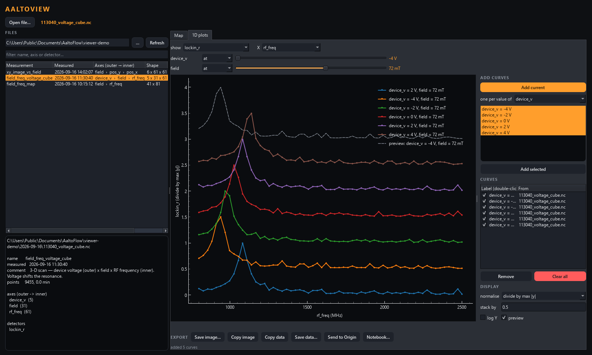

The arithmetic is in the package's `view.py` (reduction), `export.py` (curves,
maps, files, figures, notebooks) and `origin.py` (Origin), all tested there
without a screen; `scan_core.view` / `scan_core.data` re-export it. Not yet: AaltoView's TR-MOKE corrections (laser
repetition rate, harmonic, demodulation-frequency folding, correction file,
phase autocorrect).

## Catalogue: find a run

The suite's **Catalogue** tab searches every run in the data folder -- "the
scans on sample B7 at 5 K last week" -- and opens the one you double-click in
the Data tab.

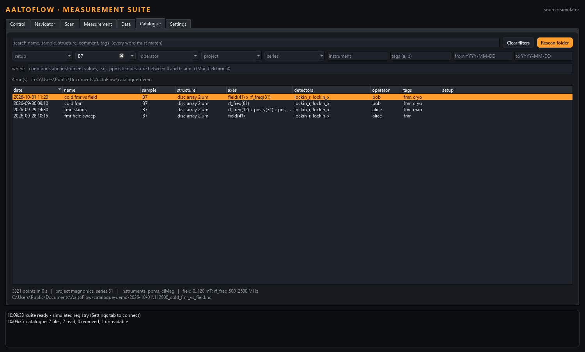

- **Search bar**: free text over name, sample, structure, comment and tags.
  Every word must match, case does not matter.
- **Filters**: sample, operator, project, series ("contains"), instrument (a
  module key such as `ppms`), tags (`fmr, cryo`: the run must carry all of
  them), a date range (`YYYY-MM-DD`; the "to" day is included).
- **where**: conditions of the scan and instrument values from the snapshot
  the suite stores in every file, joined by `and` or `,`:

  ```
  ppms.temperature between 4 and 6
  clMag.field == 50 and rf_power > 0
  ppms.mode == persistent
  n_points >= 100
  ```

  Operators: `== != < <= > >=`, `between A and B` (inclusive), `contains`.
  A key is a fixed condition (`rf_power`), `n_points` / `duration` / `size`,
  or `<module>.<value>`: `ppms.temperature` finds `ppms.status.temperature`
  too, so you do not need to know how the module nests its snapshot. `==`
  on numbers allows a relative 1e-6, so `field == 50` finds 49.9999999.
- **Results**: newest first, sortable by any column; a file that could not be
  read is red, with the reason as its tooltip. Selecting a run shows its
  comment, duration, instruments, axis ranges and full path underneath.
- **Rescan folder** brings the index up to date (it also does that by itself
  whenever the tab is opened). It runs in the background with a progress bar,
  so the suite stays usable.

**What is indexed**: only the HEADER of each `.nc` file -- its attributes, axis
names, lengths, ranges and units, detector names, units and stored type, the
fixed conditions, the run info (sample, structure, operator, comment, project,
tags, series, setup name, AaltoFlow version) and the instrument snapshots,
flattened into searchable values. The measured arrays are never loaded, so a
large folder indexes quickly. Files from before the run info existed are
indexed too (they just have no sample or operator); their instruments are
guessed from the parameter ids (`clMag.field` -> `clMag`).

**The index is disposable.** It is one file, `catalogue.sqlite`, in the data
folder. Everything in it comes from the data files; nothing is written into
them. Delete it any time -- the next rescan rebuilds it. A rescan only re-reads
files whose size or date changed, and forgets files that were deleted.

From a script or a terminal:

```bash
uv run python -m scan_core.catalogue scan  [DATA_DIR]          # default: the suite's data folder
uv run python -m scan_core.catalogue search [DATA_DIR] --sample B7 \
    --where "ppms.temperature between 4 and 6" [--paths | --json]
```

or in Python: `from scan_core import catalogue; catalogue.scan(d);
rows = catalogue.search(d, sample="B7", tags="fmr")` (each row has `path`).

## Layout

```
scan_core/
  recipe.py     # the recipe schema: load/save/validate/compile  (the data model)
  registry.py   # Parameter/Settable/Gettable + build_sim_registry (toy physics)
  engine.py     # N-D odometer -> xarray.Dataset
  hooks.py      # named per-level actions (autofocus, wait, call = routines, …)
                # + the generic steps wait_until/abort_if/skip_if/pause/comment/compute_set
  expr.py       # the restricted (no-eval) language of their conditions and formulas
  flyscan.py    # the fly axis: continuous rows binned by the measured position
  repeat.py     # the repeat axis: N times, keep every repeat or store the average
  sim_stream.py # the simulator's streams (a lagging lock-in, a moving stage)
  errors.py     # ScanAborted, ScanStopped (a step stopped it), RoutineError
  api.py        # the scripting API: connect / set / get / run / wait_until / scan
  autosave.py   # where a scan's file goes (<dir>/<date>/<time>_<name>.nc), atomic write
  expr.py       # the restricted evaluator for routine conditions / formulas
  snapshot.py   # instrument snapshots in every file + diff / recall helpers
  run_info.py   # sample, operator, project ... remembered and written to files
  view.py       # re-exports aaltoview.view (N-D cube -> map / line)
  data.py       # re-exports aaltoview.data (read measurements back)
  catalogue.py  # the run catalogue: SQLite index of the data folder + search + CLI
apps/
  scan_builder.py  # PySide6 cockpit
  suite.py         # the measurement suite (Control / Navigator / Scan / Measurement / Data / Catalogue / Settings)
  catalogue_view.py # the suite's Catalogue tab

  suite.py         # the measurement suite (Control / Scan / Measurement / Data / Settings)
  recall.py        # "Recall settings...": file snapshot vs instruments now
  run_info_card.py # the RUN INFO card of the run pane
  viewer.py        # starts the data viewer (aaltoview)
  theme.py
recipes/        # example YAML recipes (2-D, 3-D, XY-raster, repeat)
examples/       # scripts using scan_core.api (run on the simulator as delivered)
schema/scan.schema.json
run_demo.py
run_fly_demo.py # fly scan: sim (lag corrected vs not) or --lab (kim + pm16 or hf2)
```

## Running against real instruments

`build_lab_registry()` is the real counterpart of `build_sim_registry()`. Start
the services you need, then:

```bash
uv run python run_lab_demo.py            # 1-D field sweep on the live magnet
```

```python
from scan_core.lab import build_lab_registry
reg, lab = build_lab_registry(include=("clMag", "smb"))
try:
    ds = run(recipe, reg)          # identical engine, identical recipe
finally:
    lab.close()
```

**scan-core knows the protocol, not the instruments.** Every service in the
suite speaks one wire contract, so there is a single generic `Instrument` client
(`scan_core/instrument.py`) and no instrument package is ever imported. Adding a
knob is therefore a *declaration* in `scan_core/lab.py`, not new code:

```python
remote_settable(
    reg, inst,
    id="field", label="Magnetic field", unit="mT",
    limits=(lo, hi),                        # read from the service's own info block
    verb="set_field", arg="field_mT", read_key="measured_field_mT",
    settle=adopt_then_flag("setpoint_field_mT", "field_stable"),
)
```

The `settle` policy is the part worth understanding. Commands are
fire-and-forget, so `{"ok": true}` means *accepted*, not *arrived* — and for a
moment afterwards the service is still reporting the **previous** point,
including its `field_stable=True`. Watching that flag alone returns instantly at
the old value and silently measures the whole grid one step behind.
`adopt_then_flag` waits for the service to adopt the new setpoint before it
believes the flag. For set-and-forget instruments with nothing to converge,
`echoes("power_dBm")` waits for the value to be reported back.

Declared so far: **clMag** (field; measured field, magnet current, AUX AI
detectors) and **smb** (RF frequency, power, phase). The other five services
speak the same contract — each needs one `_build_*` function once its settle
signal has been confirmed against the running service.

## Detectors that return arrays (a VNA)

Not every detector gives you a number. A VNA gives you a whole trace per scan
point, because **the frequency sweep happens in hardware**, on the instrument —
far faster than the engine could ever step it. That frequency axis is a real
dimension of the measurement; it is simply *hardware-swept* rather than
*software-swept*, and it lands in the dataset after the scan's own axes:

```python
reg.add(Gettable("s21", "S21", "", vna.read_trace,
                 axes=[AxisSpec("vna_freq", "Frequency", "Hz",
                                values_fn=vna.frequencies)],
                 dtype="complex"))
```

A 31-point field sweep then produces a `(31, 401)` cube, and **the recipe format
does not change** — `detectors: [s21]` is still just an id:

```python
ds.sizes                      # {'field': 31, 'vna_freq': 401}
s21 = as_complex(ds, "s21")   # complex DataArray
abs(s21).plot()               # the FMR map
abs(s21).sel(field=40, method="nearest").plot()   # one trace
```

Detectors sharing an axis *name* share one coordinate, which is what you want
for `s11`/`s21`/`s12`/`s22` off a single sweep.

**Complex is stored as `<id>_real` and `<id>_imag`.** h5netcdf will write a
complex array and it round-trips through Python perfectly — but it then warns
the file is not conforming netCDF-4 and "might not be readable by other netcdf
tools". Lab data gets opened in MATLAB and Igor too, so the pair is the default
and `scan_core.data.as_complex` puts it back together.

**A sweep that changes mid-scan stops the run.** The array would stop being
rectangular, and padding it with NaN would hand you a file that looks fine and
is wrong.

## Routines: before, during and after a scan

Hooks fire at a moment of the scan: `before_scan`, `after_scan`, `before_point`,
`after_point`, `every_n_points`, `each_sweep`, `before_axis`, `after_axis`. The `call` action
makes a hook a **routine** -- set some parameters (each set waits until
settled), then run one instrument action (waits until finished):

```yaml
hooks:
  - {when: before_scan, action: call,
     args: {set: {mag2d.field: 150, mag2d.angle: 45}, action: vna.take_reference}}
  - {when: after_scan, action: call, args: {set: {mag2d.field: 0}}}
```

- `before_scan` runs after the conditions (`fixed`) are applied, before the
  first point. `after_scan` runs after the last point, **also after Abort**
  (commands are still sent, but not waited for), and **also after an error**
  (every step is tried, a failing one is logged, and the original error is
  still reported) -- it is what switches the RF off. An error also keeps the
  points measured before it: they are saved like an aborted scan's.
- A routine puts back every parameter it moved that the scan already holds (a
  condition, an axis at its value), so a reference at 150 mT cannot leave the
  scan at 150 mT. Not at `after_scan` -- field -> 0 at the end stays at 0.
- Actions come from `registry.actions()`. A module offers one to scans by giving
  it a `wait` block in `describe`; the simulator offers `vna_reference` and a
  `u = (S21 - ref)/ref` detector (`recipes/fmr_reference_field_scan.yaml`).
- In the Scan Builder: select a parameter, **+ Before** / **+ After**,
  and pick the action in the ROUTINES card. Other hooks in a loaded file are
  kept when it is saved again.

**During the scan** (the THROUGHOUT column, **+ New**): autofocus at the start of
every row, a reference every 100 points.

```yaml
  - {when: each_sweep, axis: pos_x, edge: start, every: 1, on_error: continue,
     action: call, args: {action: camera.autofocus}}
  - {when: every_n_points, n: 100, action: call, args: {action: vna.take_reference}}
```

- A **sweep** of an axis is one pass of it from first to last value while the
  axes outside it stand still. "Start of each sweep of x" is therefore "before
  every row", at any depth and with zig-zag too; it fires after the row's new
  values are set. `edge: end` fires after each sweep except the scan's last;
  `every: 3` only on every third sweep.
- The card shows how often each routine will fire ("fires 732×").
- `on_error: continue` ("carry on if it fails", ticked by default for these):
  a failure is logged and the scan goes on. A failed camera autofocus puts Z back
  where it started.
- THROUGHOUT also offers **before each point** / **after each point**
  (`before_point` / `after_point`), which is where `abort_if` and `skip_if`
  usually sit.

### Five generic steps: wait, check, pause, comment, compute

Besides "set" and "run an action", a routine's steps can be one of five
generic steps (the **＋ other step ...** list under every routine). They are
deliberately simple -- no loops, no if/else; several dies are a queue of scans.
Each sits in a routine's `steps` list, in order with the sets and actions (or,
on its own, as a hook: `{when: before_point, action: abort_if, args: {condition: ...}}`).

**`wait_until`** -- wait until a condition has been TRUE without a break for
`hold_s` seconds (0 = true once). `timeout_s` is required; then
`on_timeout: stop` (default) ends the scan cleanly, `continue` logs and goes on.
Abort works during the wait; the log shows progress every 30 s
("waiting: ppms.temperature = 10.03 (want ...), held 120/600 s").

```yaml
  - {when: before_scan, action: call, args: {steps: [
      {set: {ppms.temperature: 10}},
      {wait_until: {condition: "abs(ppms.temperature - 10) < 0.05",
                    hold_s: 600, timeout_s: 7200, on_timeout: stop}}]}}
```

**`abort_if`** -- stop the scan if the condition is true: like Abort (the
after-scan routine runs, the points so far are saved), and the file's
`stopped_by` attribute says why. Anywhere except `after_scan`.
`scope: scan` (default, "abort scan") ends only this scan -- a queue goes on
with the next one; `scope: all` ("abort all") ends this scan AND the rest of
the queue, the choice for a safety condition. The file's `stopped_scope`
says which. The same two choices exist for a `wait_until` that times out
(`on_timeout: stop` / `stop_all`) and on the pause banner (Abort scan / Abort
all); the queue's own buttons are Abort and Stop queue.

```yaml
  - {when: before_point, action: call, args: {steps: [
      {abort_if: {condition: "ppms.temperature > 15", scope: all}}]}}
```

**`skip_if`** -- leave the CURRENT point out: it is stored as not measured
(NaN) and the scan goes on with the next one. At `before_point` (and
`every_n_points`, `each_sweep` start) the point is not measured at all; at
`after_point` (`each_sweep` end) its values are thrown away. Refused before /
after the scan and in a fly scan. The file lists the skipped grid indices in
`skipped_points` (and `skipped_count`), so a skipped NaN is not mistaken for an
unfinished scan.

```yaml
  - {when: after_point, action: call, args: {steps: [
      {skip_if: {condition: "hf2.r1 < 1e-6"}}]}}
```

**`pause`** -- wait for you: the Scan tab shows an amber banner with the
message and **Continue** / **Abort scan** (Abort scan stops like `abort_if`).
A run without the GUI (a script) fails at the step with a clear message, or
with `headless: continue` only logs it.

```yaml
  - {when: before_scan, action: call, args: {steps: [
      {pause: {message: "Insert the polariser, then Continue"}}]}}
```

**`comment`** -- add a timestamped line to the file's comment log (attribute
`comments`, a JSON list of `{time, point, index, text}`; point is null before /
after the scan). `{parameter.id}` is filled with the current value (`%.6g`);
an unknown one is left as written, with a warning in the log.

```yaml
  - {when: before_scan, action: call, args: {steps: [
      {comment: {text: "sample rotated 90 deg; T = {ppms.temperature} K"}}]}}
```

**`compute_set`** -- set a parameter to the value of a formula, with the same
blocking set (and the same restore) as a plain set. A value outside the
parameter's limits makes the step FAIL (it is never clamped), and `on_error`
decides.

```yaml
  - {when: before_point, action: call, args: {steps: [
      {compute_set: {set: {smb.frequency: "2800 + 28 * clMag.field"}}}]}}
```

**Conditions and formulas** use a small restricted language
(`scan_core/expr.py`, parsed, never `eval`): numbers, `'text'`, `True`/`False`,
parameter ids as in the palette (`ppms.temperature`), `+ - * / **`, unary `-`,
`< <= > >= == !=` (chained: `9.95 < ppms.temperature < 10.05`), `and or not`,
parentheses, `abs min max round`. Anything else (other calls, indexing,
attributes, lambdas, ...) and unknown ids are refused when the definition is
VALIDATED -- the builder shows a red border and the reason as you type.
**A parameter id reads the status cache**: a settable's readback, a detector's
current value (a lock-in's last acquired sample) -- never a new acquisition.
Array detectors (a VNA trace) cannot be used. `==` on measured numbers is
exact: write `abs(a - b) < 0.01`.

## Navigator: find your way on a large sample

The **Navigator** tab of the measurement suite puts the sample's design file
under the stage. Open a **GDS/OASIS** layout (drawn as vectors, exact
micrometres; read with `gdstk`, no KLayout needed) or an **image** whose real
width you type in. Then register it:

1. Put a feature under the laser, click it on the design, **I am here**. With
   one point the rotation is the one you set by eye (+/-1, +/-90 buttons).
2. A second point far from the first **fits** the rotation and the stage's
   scale (the design's scale is exact, so a fitted scale that is not 1.000 is
   the stage's error). From three points the residuals say how good it is and a
   mirrored sample is detected; from four, X and Y may scale differently.
3. Click anywhere: the stage coordinates are shown, **Go there** moves.
4. An open-loop stage drifts: click the feature you actually see and
   **correct offset only** -- rotation and scale are kept.

It moves whichever stage is connected through the same parameters a scan uses
(`position_x`/`position_y` from the module's `describe`): KIM in um, the BSC203
in mm, or the simulator. **Final approach** makes every move end in +X/+Y over
that distance, so an inertia stage arrives from the same side every time. A
session (design path + reference points) saves next to the design as
`.nav.json`.

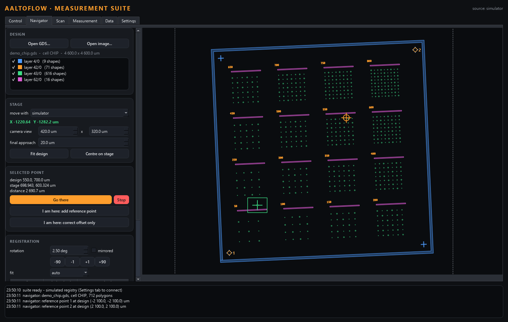

*A made-up 4.6 mm test chip registered with two reference points (diamonds),
the stage position with the camera's field of view (green) and the selected
target (amber). Simulated stage.*

## Fly scans: move without stopping, bin by the measured position

A stepped scan visits every point: set, wait until settled, measure. For an
image that is mostly waiting. A **fly scan** moves the stage slowly and
continuously across each row while the detectors AND the stage position are
recorded all the way (a *stream*: every reading with its time stamp). Each
detector sample is then given the position the stage had at that moment, and
the samples are averaged per pixel. The result is the same regular grid a
stepped scan gives -- same coordinates, same file -- built from where the stage
really was.

In the Scan Builder, open **Advanced** on the innermost axis row and tick
**fly this axis** in its FLY group; give a speed, and `pts` become pixels. The
same group holds the speed knob, the direction (one-way or zig-zag), the row
timeout, the lag correction and the readback. In a recipe:

```yaml
axes:
  - {type: linear, param: kim.position_y, start: 0, stop: 20, num: 21}   # stepped
  - {type: fly, param: kim.position_x, start: 0, stop: 50, num: 101,     # flown
     speed: 5, speed_param: kim.velocity_x}
detectors: [hf2.x1, hf2.y1]
zigzag: true            # every other row flown backwards
```

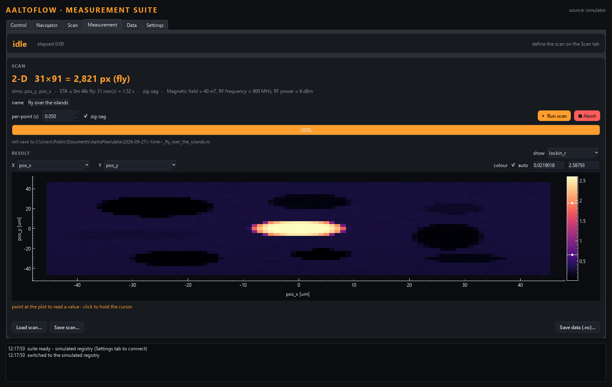

*A zig-zag fly scan over the simulated islands: Y stepped, X flown at 60 um/s,
31 x 91 pixels in under a minute.*

What it takes care of:

* **The lock-in lag.** A lock-in's output describes where the stage was a few
  time constants ago, so a flown image is shifted by speed x delay -- in
  opposite directions on forward and backward rows. Each module states the lag
  of every channel it streams (a lock-in: order x tau, the filter's group
  delay), and every sample is moved back by it before its position is looked
  up. `run_fly_demo.py` shows the difference:

  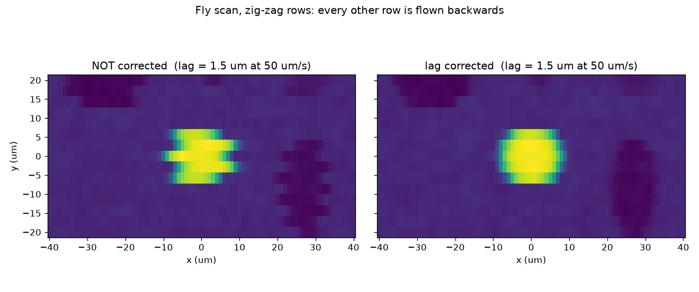

  The correction removes the SHIFT; features finer than speed x delay are still
  smeared, and the run log says so after the first row.
* **Only streamable parameters.** Every detector, and the position, must be one
  its module can record continuously (a `stream` block in `describe`; hf2's scan
  detectors, the PM16's power and kim's positions so far). Anything else is refused before the
  stage moves.
* **Samples per pixel** (`<det>_n`) and their spread (`<det>_std`) are stored
  next to every detector; a pixel no sample fell into is NaN, never 0.
* **Rows end on the measured position**, not on the settle rule: a stage that
  reports "not moving" from a stale status frame cannot cut a row short.
* **The speed is put back** for the approach to each row and at the end; an
  Abort mid-row stops the stage where it is and keeps what was measured.
* Routines: `start/end of each sweep` works (a sweep of the fly axis is one
  row); per-point routines are refused -- the stage never stops at a point.

```bash
uv run python run_fly_demo.py                          # the simulator, the figure above
uv run python run_fly_demo.py --lab --from 0 --to 20   # the running kim + pm16 (or --det hf2)
```

On the kim stage "measured position" means the step counter; it drifts from
the true position over long scans just as a stepped scan's does. To get rid of
that, fly in the **camera's** coordinates:

```yaml
axes:
  - {type: linear, param: camera.laser_y, start: -10, stop: 10, num: 21}
  - {type: fly, param: camera.laser_x, start: -15, stop: 15, num: 61,
     move: kim.position_y, speed: 2, speed_param: kim.velocity_y}
```

`camera.laser_x/y` is where the laser is on the sample, measured from the
tracked template. The grid, the placement of every row (the camera puts the
laser there, closed loop) and the binning are all in those coordinates; `move`
names the stage that flies the row (in the builder: "move with"). How stage and
camera relate is not assumed: the stage is sent well past the end, the row ends
when the camera sees the far edge, and the direction is learned on the first
row (logged). A stage axis that does not move the camera coordinate stops the
scan with "does not move ... the other axis?" -- on the KIM rig the camera is
mounted 90 deg to the stage, so camera x is kim Y.

## Scripts: set, wait, scan in a loop

For what a fixed recipe cannot say -- "at each temperature, wait until it has
been stable for ten minutes, focus, then map" -- there is a Python API,
`scan_core.api`. Full guide: [docs/SCRIPTING.md](../docs/SCRIPTING.md).

```python
from scan_core import api

with api.connect() as lab:                  # the services Mission Control runs
    for t in [5, 10, 20, 50]:
        lab.set("ppms.temperature", t)      # blocks until settled
        lab.wait_until("ppms.temperature_stable", hold_s=600, timeout_s=7200)
        lab.run("camera.autofocus")         # raises if the focus failed
        lab.scan("recipes/field_map.yaml", name=f"map_{t}K", temperature_K=t)
```

```bash
uv run python examples/temperature_series.py   # runs on the simulator as delivered
uv run python examples/wait_then_scan.py
uv run python examples/sample_positions.py     # one scan per die
```

A script is treated like a scan: it claims every instrument it changes (refused
while another PC holds control, or another scan uses it), its scans are saved
with the suite's names in the suite's data folder, and Ctrl+C aborts a scan
cleanly with the measured points saved.

## Smart sampling: measure only where something happens

Two features skip the parts of a scan where nothing happens and still hand
back the full grid, with NaN (or a baseline) where nothing was measured and a
mask in the file that says which is which:

- the **scout pass** (below): take a quick look along any axes first, then
  measure in detail only where the scout saw something. This covers the
  patterned sample (elements on a substrate) and the FMR line in field x
  frequency.
- the **resonance window** (`window:`, `scan_core/window.py`): a slow array
  detector (a spectrum analyser trace) sweeps only a band around the FMR line
  that a Kittel model predicts at each point. Spec: `docs/DEVELOPER_NOTES.md`
  and `INSTRUMENT_MODULE_GUIDE.md`, "Resonance window".

### The scout pass

*Take a quick look first, then measure in detail only where something is
happening.* It works for any scan with something to measure:

1. **The scout** reads ONE quick, scalar detector (a reflectivity, a power
   meter, a lock-in R) at every k-th point of the axes ticked **scout** (k per
   axis, default 3; the last point of each axis is always included, so 30
   points give 0, 3, ..., 27, 29). Scouting two axes at every 3rd point costs
   1/9 of the points.
2. **The mask:** the scout's readings are interpolated onto the full grid and
   a point is kept where the reading is
   - `above` / `below` a threshold (`auto` = Otsu's method, which finds the
     level between two groups such as substrate and elements; a number; or
     `{fraction: f}` of the range), or
   - `deviates` from the background: |value - median| > k x noise, with
     noise = 1.4826 x the median absolute deviation (a robust estimate) and
     k = 4 by default. This finds peaks AND dips without being told the sign,
     and works on a sample with several levels or a gradient. It assumes the
     background is most of what the scout sees.

   The kept area is grown by a `margin` in **grid points** (default `auto` =
   half the coarse step: 1.5 points for every 3rd), so edges are measured too.
3. **The scan** then visits only the kept points. The others are never moved to
   (no travel, no settle) and stay NaN, so the result is still the full matrix.

```yaml
axes:
  - {type: raster, x: {param: pos_x, start: -45, stop: 45, num: 61},
                   y: {param: pos_y, start: -45, stop: 45, num: 61}}
detectors: [lockin_r]
scout: {axes: {pos_x: 3, pos_y: 3}, detector: reflectivity, keep: above}
```

```yaml
# not XY: an FMR map measured only around the line (recipes/scout_field_freq.yaml)
axes:
  - {type: linear, param: field,   start: 0,   stop: 120,  num: 41}
  - {type: linear, param: rf_freq, start: 600, stop: 2000, num: 81}
detectors: [lockin_r, lockin_phi]
scout: {axes: {field: 2, rf_freq: 3}, detector: lockin_r, keep: deviates, k: 4,
        settings: {rf_power: 10}}
```

**The other axes.** Unscouted axes OUTSIDE the scouted ones follow
`per_outer`: `once` (default) scouts once at their first values and uses the
same mask for all of them, because a patterned sample does not move with the
field. `each` scouts again at every step of them, right before that step is
measured, for a feature that moves with them (an FMR line drifting with the
angle). Unscouted axes INSIDE a scouted one are held at their **first value**
during the scout, and the mask then holds for all their values. For example,
an XY scout on reflectivity with a field sweep at every point measures the
whole field sweep on the elements and none of it on the substrate. If the
feature depends on such an axis, scout that axis too.

**Scout-only settings.** `settings: {hf2.tc1: 0.001}` holds those values only
during the scout and puts the old ones back for the real scan, also after an
Abort or an error. A short lock-in time constant or one scope average makes the
scout fast even on the same instrument.

**Your own mask.** `from:` takes a file instead of the scout:
- an **image** (.png .tif .bmp .jpg; a colour image is read as its
  brightness) or a number **matrix** (.csv, .txt/.dat, .npy). This needs
  exactly two scouted axes: columns run along the FIRST axis in `axes` (X),
  rows along the second (Y). With `keep: above`, bright pixels or large
  numbers mean *measure*. Without `extent` the picture covers exactly the
  scan's area, with its first row at the start of Y.
  `extent: {x: [x0, x1], y: [y0, y1]}` places it elsewhere (give y as
  [y1, y0] to flip it).
- an **earlier scan**: `from: {file: run1.nc, detector: lockin_r}`. Its
  detector is interpolated onto the new grid of the scouted axes. Each axis
  is matched by coordinate NAME (or by the parameter it swept), and a missing
  one is an error.

Points outside the file's range are measured. Matching is by coordinate value,
never by index, so a mask works in camera coordinates (`camera.laser_x/y`,
which follow the sample) as well as in absolute stage µm. A stage-µm scan used
on a camera-coordinate scan is refused, because the two differ by the stage's
drift.

**In the file:** `scan_mask` (int8, 1 = measured) on the scouted axes, plus
the outer ones with `per_outer: each`; the scout's own readings `mask_<detector>`
on coarse axes `mask_<axis>`; and the attributes `mask_json` (the block, also as
`scout_json`), `mask_threshold`, `mask_points`, `mask_source`,
`mask_margin_points` and `mask_margin` (in the axes' unit, when that is one
length). These are the names the XY mask of 2026-10-07 used, so old and new files
read the same way. An old recipe's `mask:` block still loads: it is translated
to `scout:` (its margin in the axes' unit becomes grid points), and only
`scout:` is written.

**In the Scan Builder:** open **Advanced** on each axis row to scout and tick
**scout this axis** in its SCOUT group, with its coarse step and its own
margin (auto = half that step). The **SCOUT PASS** line at the bottom of the axis stack is
always there. Click it to open the options and a preview of the points the
scout will visit (or, for a file, **Preview mask**). The summary shows the
scout's points and its time. How many points follow is "decided by the
scout", and the estimate becomes the measured remaining time once it has run.
During the run the scout's map fills in the live plot, the progress bar counts
its points, and afterwards the threshold used and the number of points kept
stay in the status line.

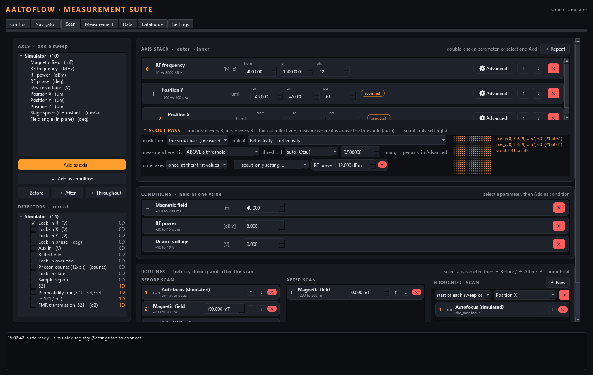

### Advanced axis settings

Each axis row shows only what you edit all the time: the parameter, from, to
and pts. Everything else about the axis sits behind its **Advanced** button,
which opens a panel under the row (one row at a time):

- **FLY**: fly this axis, its speed and speed knob, the stage that moves it
  (for a measured coordinate), the direction, the row timeout, the lag
  correction and the readback;
- **SCOUT**: scout this axis, its coarse step and its margin in grid points;
- **POINT**: the axis's name in the data file, and the routines bound to it
  (edited under ROUTINES > THROUGHOUT).

**Copy from axis...** takes the fly and scout settings of another row, except
what does not fit (a speed in um/s onto an axis in deg, fly onto an axis that
is not streamed); the skipped parts are named in the panel and in the log.
**Reset** goes back to plain stepping. Anything that is not the default shows
as an amber tag on the row ("fly 60 um/s", "zig-zag", "scout x3"), so a closed
panel hides nothing.

The data file carries these settings on each axis's coordinate as well as in
`recipe_json`: `fly`, `fly_speed`, `fly_speed_units`, `fly_speed_param`,
`fly_move`, `fly_readback`, `fly_lag_correction`, `fly_timeout_s`,
`fly_zigzag`, `scout_every`, `scout_margin` (`auto`) and
`scout_margin_points`. Only what is set is written.

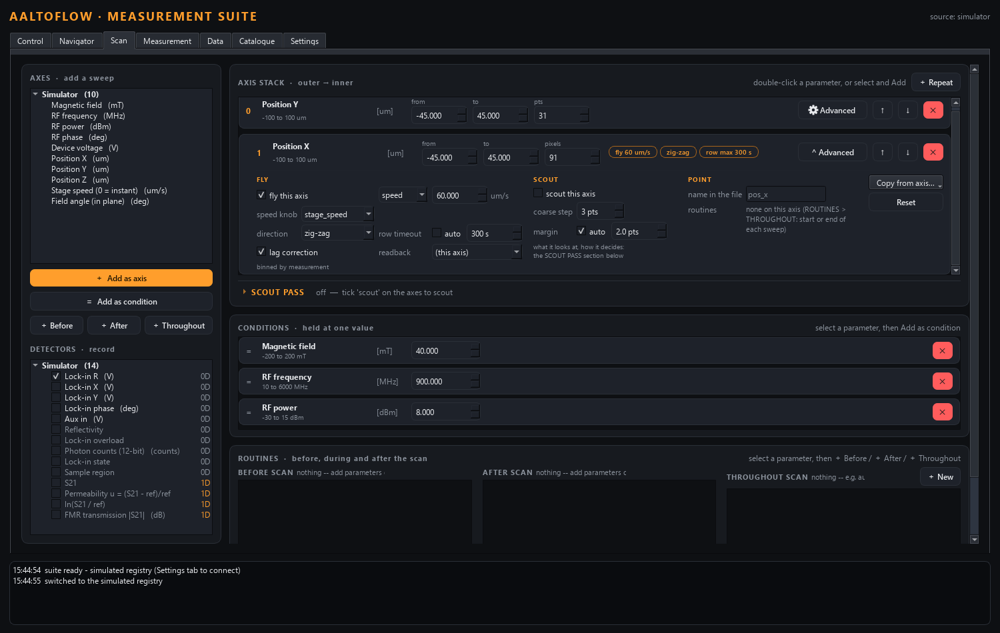

**Limits:** something narrower than about one coarse step can fall between the
scout's points, so use a smaller step for it. A fly axis cannot be combined
with a scout, because a row is one continuous move. A repeat axis cannot be
scouted, and `per_outer: each` cannot sit inside an averaging repeat.
Routines "at the start of each row" run at the first *measured* point of the
row, and "every n points" counts measured points. Examples:
`recipes/scout_xy.yaml`, `recipes/scout_field_freq.yaml`.

**Diagonal row change** (`diagonal: true`, the "diagonal" box next to
zig-zag): at a point where several axes change at once (a new row), every new
setpoint is sent first and only then are they all waited for. Without it the
outer axis moves first, so a camera scan settles at (last column, next row)
before going to the first column. The first rig test of the mask measured that
as one wasted ~3 s settle per row. It is off by default because two moves at
once must be allowed by the hardware: this is fine for the camera's array
point, but a KIM101 moving two channels together is not verified yet. It
applies to the scout too. A knob that cannot be sent without waiting is set
the old way.

## Repeating and averaging: the `repeat` axis

A `repeat` axis sets nothing: everything INSIDE it is done N times. Where it
sits in the axis stack decides what is repeated (in the Scan Builder:
**＋ Repeat** in the axis-stack header, then move the row up or down -- its
caption says what it repeats):

| stack (outer -> inner) | repeats |
|---|---|
| `repeat`, field, freq | the whole scan N times ("runs") |
| field, `repeat`, freq | every frequency sweep N times |
| field, freq, `repeat` | every point N times in a row (the stage does not move) |

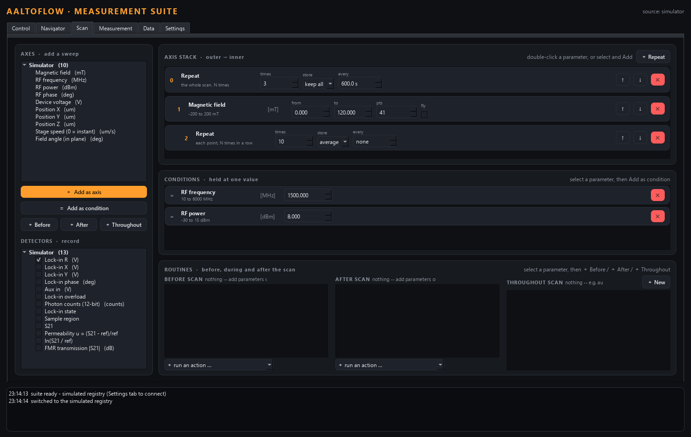

```yaml
- {type: repeat, num: 5}                       # keep (default)
- {type: repeat, num: 10, mode: average}       # only mean, _std, _n stored
- {type: repeat, num: 30, interval_s: 60}      # a run at most once a minute
- {type: repeat, num: 3, name: run}            # own dimension name
```

**keep** (the default) makes the repeat a real dimension `repeat` (or
`repeat_1`, `repeat_2`, ... with several), coordinate 0..N-1. Every run is in
the file; the viewer shows one run (hold the repeat slider) or their average
(average over it). **Use it whenever in doubt**: drift between runs, one run
spoiled by a bump in the lab, a sample that changes -- all still visible.

**average** collapses the dimension while measuring and stores, per
detector, `<det>` = the mean (float64, NaN ignored), `<det>_std` = the sample
standard deviation over the repeats (NaN with fewer than 2) and `<det>_n` =
how many repeats gave a value (uint32) -- the same trio as a fly pixel. Use it
for long averaging runs where the individual repeats are of no interest and
would make the file N times bigger. The live plot shows the running mean; an
aborted scan keeps the mean of the repeats done so far (`_n` says how many).
Details: the mean of a bool is the fraction of True and of an int a float
(attr `declared_type` keeps the declared type); a complex detector (a VNA
trace) is averaged coherently and its `_std` is the spread of |z|; traces
average element-wise. Not allowed with `average`: enum/string detectors
(there is no mean of two states), a fly axis, the resonance window -- use
`keep` there. Only one `average` repeat per scan.

**interval_s** (optional) paces the repeats: repeat k of a pass starts no
earlier than k x interval after repeat 0 began -- a time series ("a sweep
every 10 minutes"). A pass that takes longer starts the next one at once; the
wait can be aborted. The builder's ETA counts the repeats and the interval.

A repeat may sit OUTSIDE a fly axis (N fly images), never inside it. Routines
see it like any axis: "start of each sweep of field" with the repeat outermost
runs once per run. Examples: `recipes/repeat_runs_keep.yaml`,
`recipes/repeat_point_average.yaml`, `recipes/repeat_time_series.yaml`.

## A queue of scans

**Load scan…** with several files selected (recipes, `.nc` files, or a saved
queue) opens the queue dialog: rename, reorder, remove. Every entry is validated
against the current instruments before anything runs; **Save queue…** writes
one `.yaml` with the definitions inside it.

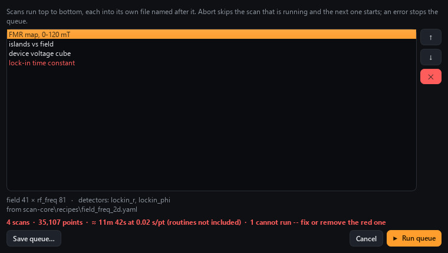

Each scan gets its own file. **Abort** ends the current scan and the next one
starts; **Stop queue** ends all of it; an error stops the queue.

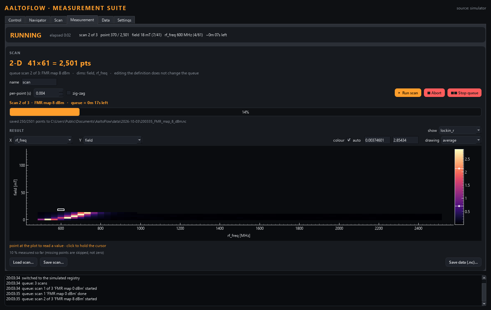

## The scan server: start on the lab PC, watch from the office

Normally a scan runs inside the measurement suite's window: close the window
and it stops, sit at another PC and you see nothing. The **scan server** runs
scans in a service of their own (`scan_core/scan_server.py`), with the same
wire contract as an instrument module, and every suite -- on the lab PC or in
the office -- becomes a client of it. Closing a suite never stops its scan.

**On the lab PC**

1. Mission Control: start the **Scan server** card (ports 5551/5552). It
   connects to the instrument modules running on that PC by itself (as the
   suite's "Follow the launcher" does) and reconnects when that changes and
   no scan runs.
2. Measurement suite, Settings tab, **SCAN SERVER**: tick *Run scans on this
   PC's scan server*. From now on **Run** (and a loaded queue) go to the
   server; the Measurement tab shows the server's scan. Files go to the data
   folder of that PC, named and checkpointed exactly as before, with the run
   info you typed.

**In the office**

1. Mission Control, **Add remote...**: the lab PC's name, port 5551 (pub
   5552). A "Scan server" card for the lab PC appears; its **GUI** button
   opens the measurement suite watching it. (Or: Settings tab > *Watch scan
   server* > pick it, or type `lab-pc:5551`.) The instruments start at port 5555;
   if your network opens only the instruments' range, either have 5551-5552
   opened too or give the server a free pair inside it (its card's **Ports**).
2. The Measurement tab then says *watching scan server on lab-pc (setup ...)*
   and shows the scan live: progress, ETA, where it is, the live map, the
   server's log (lines marked `[server ...]`), the PAUSED fault banner with
   *Clear fault on ...*, the operator banner (*Continue / Abort scan / Abort
   all*), **Abort** and **Stop queue**. The data stays on the lab PC: the pane
   shows the file's path there.
3. The card **ON THE SCAN SERVER** lists the queue (running / waiting / done
   / aborted); open a scan to read its run info (sample, operator, ...) and
   its definition (axes, conditions, routines, detectors). **Copy to Scan
   tab** loads it here to reuse. With **show what the lab shows** ticked the
   plot follows the lab's choice of detector, X / Y, held slices and colour
   range; untick it to look at something else -- the lab's screen never
   changes either way.

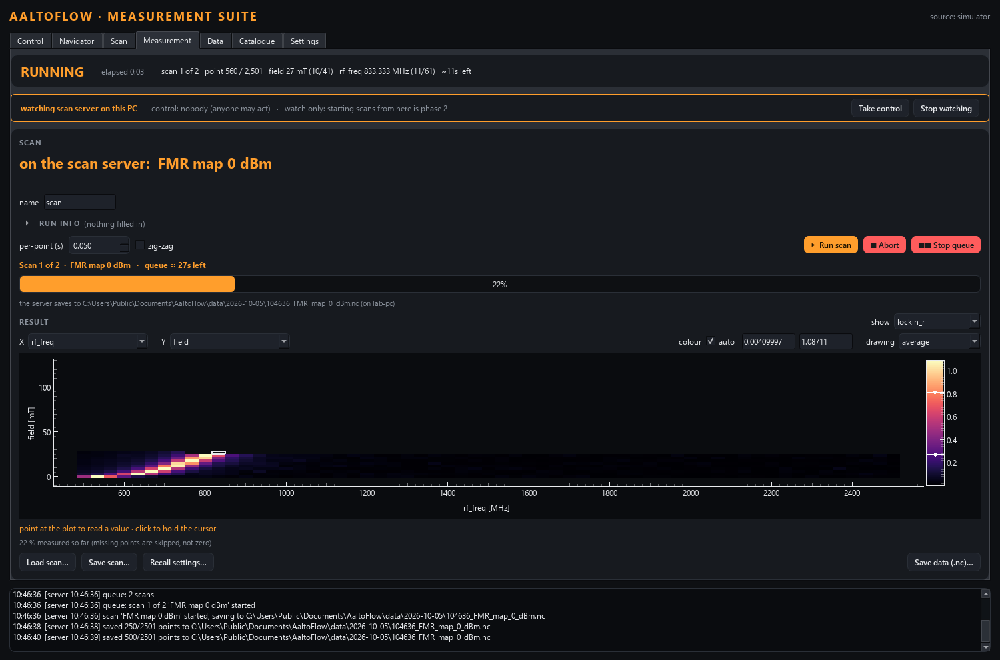

**Who may do what.** Watching is free for everyone. **Abort** and **Stop
queue** are always allowed, from every PC (safety -- like a stage's STOP).
Answering a pause, clearing a fault and starting scans follow control: when
another PC holds control of the server they are refused; the header's
**Take control** takes it (asking first if someone else has it). Starting a
scan is possible from the server's own PC only -- that is phase 2 (see
docs/ROADMAP.md), as is editing a running queue. Stopping the Scan server card
while it runs a scan asks first, then aborts the scan (the points so far are
saved, the after-scan routine runs) and exits.

From a script or a console the same works with
`scan_core.scan_server_client.ScanServerClient` (`submit`, `status`,
`get_live`, `abort`, ...). Details: docs/DEVELOPER_NOTES.md, section 4f.

## Run info, instrument snapshots, and recalling settings

**Run info.** The **RUN INFO** line under the scan name (click the arrow to
open it) holds sample, structure, operator, project, series, tags
(comma-separated keywords) and comment. They are remembered on this PC between
scans and launches, and written into every data file as attributes with
exactly those names (empty ones are left out; the comment is the scan
definition's comment, one field). `setup_name`, `aaltoflow_version` (the git
commit), `software_scan_core`, `software_python` and `created` are added by
themselves.

**Snapshots.** Right before the first point, every instrument the suite is
connected to -- not only the ones the scan uses -- is asked for its settings
(`get_config`), its state (`status`) and its `info`. Each lands in the file as
one JSON attribute, `snapshot_<prefix>` (`snapshot_kim`, `snapshot_hf2_lab2`),
with `snapshot_modules` and `snapshot_time`. Big arrays in a status (a trace,
a frame) are stored as `"<array n=...>"`. At the end, `snapshot_end` lists
the settings that changed during the scan (`{}` = none). An instrument that
does not answer gets an `"error"` entry; the scan never stops for it.
Reading it back in Python:

```python
from scan_core.snapshot import read_snapshot
snap = read_snapshot("101205_fmr map.nc")     # {prefix: {...}}
snap["kim"]["config"]["motion"]               # what kim was set to
```

The instrument's idn may contain its serial number. Data files are the lab's
own, so it is kept; untick *Store each instrument's identity* on the Settings
tab (suite setting `snapshot_include_idn`) to leave idn / serial out, e.g.
before sharing files.

**Recall settings...** (Measurement tab, next to Load scan, and on the Data
tab for the file shown there): pick a measured `.nc`; the dialog lists, per
instrument in the file, every setting whose value NOW differs from the file
(*Show all settings* for the rest). Nothing is ticked by default: tick what
you want back, or *Select all differences of this instrument*. *Apply
selected* lists the changes, asks, then sends each instrument ONE
`set_config` with only the ticked keys. Instruments that are not connected,
or are a different module under the same name, are greyed out; the state at
scan time is shown for information and cannot be ticked. If another PC holds
control of an instrument the change is refused and reported -- take control
on the Control tab first; the dialog never forces. Settings that depend on a
calibration or on the hardware's state (camera spot calibration, kim step
sizes, a stage's zero) are sent as plain values: check the instrument after
recalling.

## Tests

```bash
uv run pytest -q        # 990 pass + 5 skipped (2026-10-08), all offline
```

`tests/conftest.py` holds a small fake service that speaks the wire contract, so
the whole engine and client layer is testable with no hardware and no instrument
package installed.

## Status

Built: schema, registry + sim, N-D engine, headless demo, Scan Builder, the
generic instrument client, and a real registry for clMag and smb.
Next: the remaining five instruments, an auto-generated Raw control panel,
adaptive sampling, live fitting, and a Coordinator card in Mission Control.
