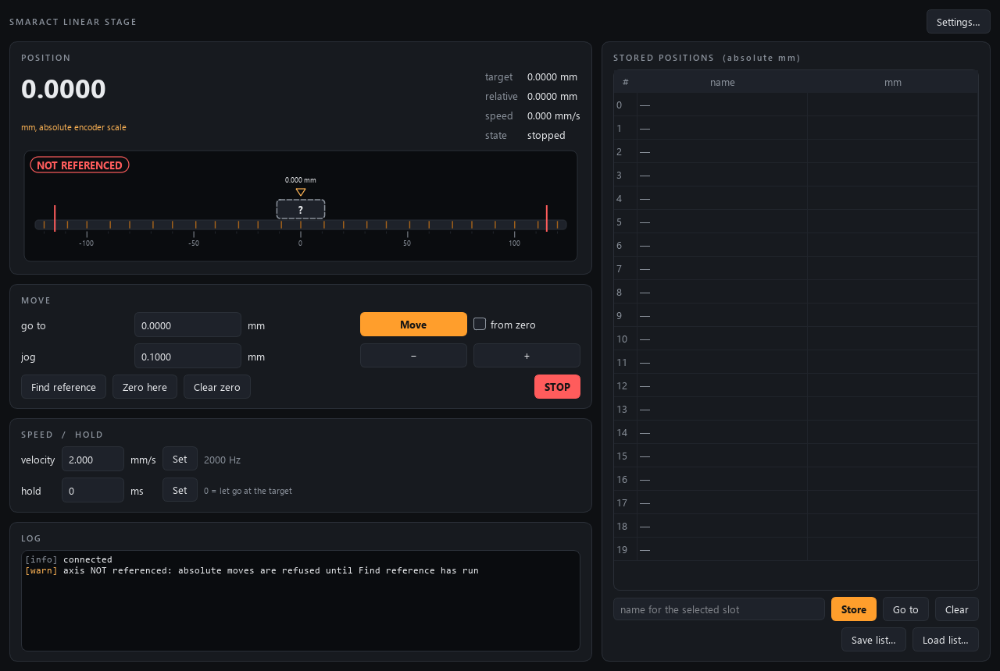

# smaract-control

Control module for a **SmarAct CLL42 linear positioner** — a stick-slip piezo
carriage on a 360 mm rail with an integrated optical encoder — driven by a
SmarAct **SCU** controller, built to the AaltoFlow instrument blueprint
(`INSTRUMENT_MODULE_GUIDE.md`). ONE closed-loop axis: the controller steps the
piezo until its encoder reads the target, so this module sends targets and
watches them being reached.

Ports **5597** (commands) / **5598** (status), declared in `module.toml`.



*The simulator at start-up: connected, nothing moving, and NOT referenced — the
carriage is drawn dashed with a "?" because its number is still counted from
wherever the stage was switched on. The red bars on the rail are the soft
limits, the small ticks the distance-coded reference marks.*

## What it does

- **Absolute moves** in mm on the referenced scale, clamped to the soft limits
  (with a warning in the log).
- **Relative steps** (jog), also before referencing — then capped at
  `motion.max_unreferenced_step_mm`, because the soft limits cannot protect an
  axis whose absolute position is unknown.
- **Find reference**: drives over two distance-coded reference marks (a few mm,
  possibly backwards) so the encoder knows the absolute position. Until then
  absolute moves and stored positions are **refused** (`motion.require_reference`).
- **Velocity** in mm/s, applied as the SCU's closed-loop max step frequency
  (`f = v / hardware.um_per_step`), and a **hold time** (how long the controller
  keeps actively holding a reached target; 0 = let go).
- **STOP** — always allowed, never asks for confirmation.
- **Zero here** — a relative origin for the read-out and for "move from zero".
- **20 stored positions** (absolute mm), saved to / loaded from JSON.
- **Fly-scan stream**: the measured encoder position, recorded at the poll rate
  (50 Hz default), so scan-core can move the stage without stopping and bin
  detectors by where the carriage really was.
- `describe` for the control screen and scan-core: `position` settles on
  "target adopted, then not moving", `velocity` on its echo, and
  `find_reference` is a scan-routine action that waits for the reference search
  it started and fails loudly if the marks were not found.

## Architecture (same as every module in the suite)

One **service** process owns the positioner (or its simulator) and is the single
source of truth. GUIs, the console and scan-core are **clients** over ZeroMQ.

```
backends/  base.py (Protocol) · sim.py (default: rail, end stops, reference marks)
           scu.py (real: the SmarAct SCU DLL through ctypes, loaded in open())
smaract.py the brain `Positioner`: one poll thread reads the controller and
           builds the status snapshot; setters clamp, guard and command
stream.py  the fly-scan position record
net/       protocol.py · describe.py · service.py · client.py
apps/      theme.py · gui.py (MainWindow + RailIndicator) · settings_dialog.py
scripts/   run_service.py · run_gui.py · smaract_console.py · smoke_test.py
```

## Install

```powershell
cd smaract-control
.\dev.ps1 sync --extra gui      # venv kept outside OneDrive (see dev.ps1)
.\dev.ps1 run pytest -q
```

The real hardware needs **no pip package**: the SCU software (from the
controller's CD) installs the SmarAct library, which `backends/scu.py` loads with
`ctypes`. If it is not on PATH, set `hardware.dll_path` in the INI.

## Run

```powershell
.\dev.ps1 run scripts/run_service.py                   # simulator; --real for the SCU
.\dev.ps1 run scripts/run_gui.py --connect localhost   # panel on the running service
.\dev.ps1 run scripts/run_gui.py                       # panel on its own private simulator
.\dev.ps1 run scripts/smaract_console.py               # raw protocol REPL
.\dev.ps1 run python scripts/smoke_test.py             # offline sanity check
```

A first session on the real stage: `find_reference`, then look at the position
it reports, then move gently towards each end and set `limits.min_mm` /
`limits.max_mm` a little inside what you can reach.

## Commands (JSON over REQ/REP)

| verb | args | reply |
|---|---|---|
| `move_to` | `position` (mm) | `target` (clamped) |
| `move_by` | `delta` (mm) | `target` |
| `move_from_zero` | `value` (mm) | `target` |
| `find_reference` | — | `ref_id` |
| `stop` | — | |
| `set_velocity` | `value` (mm/s) | `value` (clamped) |
| `set_hold_time` | `value` (ms) | `value` |
| `set_zero` / `clear_zero` | — | `rel_origin_mm` |
| `store_position` / `goto_position` / `clear_position` | `slot` (+ `name`) | |
| `get_positions` / `save_positions` / `load_positions` | (`path`) | `positions` |
| `stream_start` / `stream_read` / `stream_stop` | — | `stream_id` / `stream` |
| universal | `status`, `info`, `get_config`, `set_config`, `describe`, `shutdown` | |

A reply means **accepted**, not arrived: watch `status` (`target_mm`, `moving`,
`on_target`, `referenced`, `referencing`, `ref_id`).

## Tests

All offline, on this module's own ports (17180–17183): config round-trip incl.
bools, brain (referencing, clamps both ends, end stop, stop, shutdown stops a
move, hold, snapshot consistency, hardware-read failure), wire round-trip,
`describe` contents and revision, GUI smoke in both themes.
