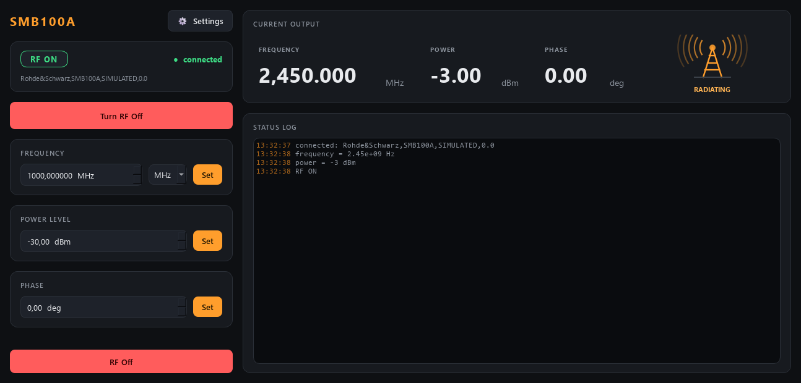

# smb-control

Control for a **Rohde & Schwarz SMB100A** RF signal generator: turn the RF
output on/off and set the output **power**, **frequency**, and **phase** — over
GPIB (SCPI), or fully simulated with no hardware.



*RF on at 2.45 GHz / -3 dBm. The antenna indicator radiates while the output is live, and its brightness tracks the power.*

It is a sibling to `clMag-control` (the Kepco magnet controller) and copies its
shape on purpose: a thin hardware backend behind a `Protocol` interface, a
dataclass `Config` with plain-text save/load, and a ZeroMQ service + client so a
GUI, a console, or a coordinator can drive it over localhost or the lab network.

The one big difference: the SMB100A is a **set-and-forget** instrument. There is
no control loop, so there is no ramp, no PID, no calibration, and no state
machine here — the `Generator` just holds the desired signal, clamps it to the
safety limits, and pushes it to the box.

## Ports (why they differ from the magnet)

| service        | commands (REP) | status (PUB) |
|----------------|----------------|--------------|
| magnet (clMag)  | 5555           | 5556         |
| **RF (smb)**   | **5557**       | **5558**     |

Different defaults mean **both services run on the same PC at once**, which is
exactly what the planned coordinator needs (“set field → wait stable → set RF →
measure”).

## Layout

```
src/smb/
  config.py              all tunable numbers (Signal / Limits / Hardware) + .ini save/load
  backends/
    base.py              RFSource Protocol — the interface everything depends on
    sim.py               SimulatedSMB100A — fake generator, runs offline
    visa_scpi.py         VisaSMB100A — the real box over GPIB (SCPI, lazy pyvisa import)
  generator.py           Generator — holds desired signal, clamps to limits, drives a backend
  sim_system.py          build_sim_system(cfg) — wire the simulator into a Generator
  net/
    protocol.py          wire shapes + default ports (5557/5558)
    service.py           SmbService — owns the generator, serves it over ZeroMQ
    client.py            SmbClient — Generator-compatible facade over the socket
scripts/
  run_service.py         start the service (simulated by default, --real for GPIB)
  rf_console.py          standalone raw-protocol console (only needs pyzmq)
  smoke_test.py          quick offline check (imports + clamp behaviour)
tests/                   pytest: config, generator, and a full network round-trip
```

## SCPI commands used (real backend)

| function   | set                       | query        |
|------------|---------------------------|--------------|
| RF output  | `OUTP:STAT ON` / `OFF`    | `OUTP:STAT?` |
| power      | `POW <dBm>`               | `POW?`       |
| frequency  | `FREQ <Hz>`               | `FREQ?`      |
| phase      | `PHAS <deg> DEG`          | `PHAS?`      |

On connect the backend sends `*CLS`, `UNIT:ANGL DEG` (so phase is always in
degrees), and `OUTP:STAT OFF`. The default GPIB address is `GPIB0::28::INSTR`
(the SMB100A’s factory address) — change it in the `.ini` or with `--visa`.

## Setup

Uses [uv](https://docs.astral.sh/uv/). From this folder:

```powershell
uv sync                     # core (pyzmq)
uv sync --extra gui         # later, if/when a GUI is added
```

### ⚠ OneDrive + venv gotcha (same as clMag-control)

This project lives under OneDrive, which locks files in `.venv` as it syncs and
makes `uv` fail with *“Access is denied (os error 5)”*. Put the virtual
environment **off** OneDrive, once per machine:

```powershell
[Environment]::SetEnvironmentVariable('UV_PROJECT_ENVIRONMENT', "$env:LOCALAPPDATA\uv-venvs\smb-control", 'User')
$env:UV_PROJECT_ENVIRONMENT = "$env:LOCALAPPDATA\uv-venvs\smb-control"
uv sync
```

## Run

Simulated (no hardware):

```powershell
uv run scripts/smoke_test.py                 # instant offline sanity check
uv run scripts/run_service.py                # start the service (simulated)
```

Then, in another terminal, drive it:

```powershell
uv run scripts/rf_console.py                 # interactive
    rf> freq 1.5 GHz
    rf> power -10
    rf> rf on
    rf> status
    rf> watch 5
    rf> quit

uv run scripts/rf_console.py freq 1e9        # one-shot, then exit
uv run scripts/rf_console.py rf on
```

Real hardware (lab PC): uncomment `pyvisa` in `pyproject.toml`, `uv sync`, then:

```powershell
uv run scripts/run_service.py --real                       # uses GPIB0::28::INSTR
uv run scripts/run_service.py --real --visa GPIB0::28::INSTR
```

Point a client (the console or the GUI) at another machine with `--connect <host>`.

## GUI

A dark, amber-on-dark window in the same style as the magnet GUI, with a
transmitter-tower indicator that **radiates animated waves whenever the RF is
on** (brighter the higher the power). Install the optional GUI extra and run it:

```powershell
uv sync --extra gui
uv run scripts/run_gui.py                     # local simulator
uv run scripts/run_gui.py --connect <host>    # drive a running service
```

The window sends `set_rf` / `set_power` / `set_frequency` / `set_phase` and reads
a status snapshot on a timer — driving a local `Generator` or a remote `SmbClient`
identically. Files live under `src/smb/apps/` (`theme.py`, `gui.py`,
`settings_dialog.py`); the antenna glyph is `AntennaIndicator` in `gui.py`.

## Tests

```powershell
uv run pytest            # or: uv run pytest -v
```

Covers the config round-trip (including the `rf_on` bool), the generator’s
set/read and safety clamping, and a full service⇄client round-trip over ZeroMQ.

## Using it from Python (e.g. a coordinator)

```python
from smb.net.client import SmbClient

rf = SmbClient(host="localhost")     # or the lab PC's address
rf.start()
rf.set_frequency(1.5e9)
rf.set_power(-10.0)
rf.set_phase(0.0)
rf.set_rf(True)
print(rf.status().rf_on)             # True
rf.shutdown()
```

`SmbClient` mirrors the `Generator` API, so the same code drives an in-process
generator or a remote one — only the address changes.
