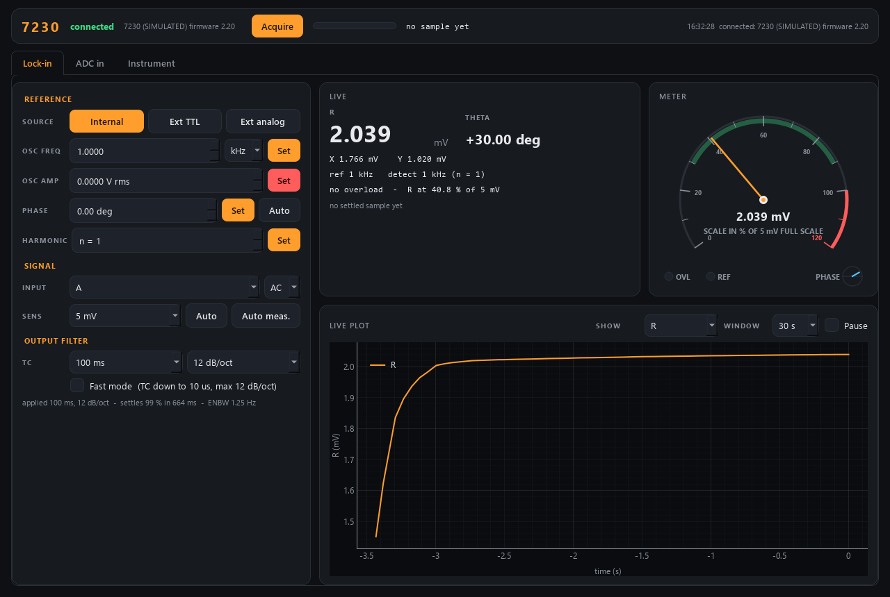

# sr7230-control — Signal Recovery 7230 DSP lock-in

Lock-in module of the AaltoFlow suite for the **Signal Recovery (Ametek) Model
7230** DSP lock-in amplifier: a single-reference instrument up to **120 kHz**
(250 kHz with the 7230/99 option) with its own oscillator (**OSC OUT**),
voltage and current inputs and rear-panel **ADC** inputs. It is driven over
**Ethernet** with Signal Recovery's own ASCII commands (`TC`, `SEN`, `XY.` …,
not SCPI) — no vendor library needed.



The window has three tabs under a shared strip (connection, **Acquire** and the
last settled sample, the latest message):

| tab | what is on it |
|---|---|
| **Lock-in** | reference source, oscillator frequency / amplitude, phase (+ auto-phase), harmonic; input, coupling, sensitivity (+ auto-sensitivity, auto-measure); time constant, slope, fast mode; live R, θ, X, Y, reference and detection frequency, overload; the **meter**; a live plot of R, X & Y, θ or R / full scale |
| **ADC in** | ADC1 and ADC2: live values, min/max/mean over the plot window, the settled sample, a live plot each |
| **Instrument** | connection and state, every setting (Apply / Revert / Load / Save), the log |

The **meter** is an analog panel meter whose needle reads R as a fraction of the
full-scale **sensitivity**: green where auto-sensitivity aims (30–90 %), red
beyond full scale, an **OVL** lamp for any input or output overload, a **REF**
lamp for the external-reference lock, and a small phase dial.

| setting | values |
|---|---|
| reference | `internal` (detect at OSC OUT's frequency — default), `ext_ttl`, `ext_analog` (follow REF IN) |
| oscillator | frequency (the limit is 120 kHz ÷ harmonic on an internal reference), amplitude 0 … `amplitude_max_V` V rms |
| input | `A`, `-B`, `A-B`, `ground`, `I high-BW`, `I low-noise` (current modes measure in **amps**) |
| sensitivity | 10 nV … 1 V (current: 10 fA … 1 µA, or 2 fA … 10 nA low-noise), by label or `SEN` index |
| time constant | any value in s; the instrument uses the nearest of its 1-2-5 steps, 10 µs … 100 ks |
| slope | 6 / 12 / 18 / 24 dB/oct; **fast mode** allows τ below 5 ms but only 6 / 12 dB/oct |

Service ports **5621 / 5622**. Runs in **simulation** by default.

## Run it

```powershell
cd sr7230-control
.\dev.ps1 sync --extra gui                          # venv outside OneDrive (see dev.ps1)
.\dev.ps1 run scripts/run_gui.py                    # GUI with its own simulated 7230
.\dev.ps1 run scripts/run_service.py                # the service (simulated)
.\dev.ps1 run scripts/run_gui.py --connect localhost
.\dev.ps1 run scripts/sr7230_console.py             # raw-protocol console: tc 30 ms, sens 10 mV, auto measure, acquire
.\dev.ps1 run scripts/smoke_test.py
.\dev.ps1 run pytest -q
```

## Live reading vs. acquired sample

A lock-in output is low-pass filtered, so after anything changes (field,
position, the time constant itself) it needs several time constants to settle:
99 % takes 4.6 τ at 6 dB/oct but 10 τ at 24 dB/oct.

* **live** values update continuously — right for watching, **wrong for a scan point**.
* **`acquire`** returns an id at once, waits the settling time computed from the
  applied τ and the slope, optionally averages over `average_tc` time
  constants, and latches a **sample**. Scan detectors (`x`, `y`, `r`, `theta`,
  `adc1`, `adc2`) read that sample; scan-core triggers and waits automatically.
* Every sample also says whether **any** reading in its window was
  **overloaded** or taken on an **unlocked** reference (`sample_overload`,
  `sample_locked` — record them next to the data).

The wait checks the acquisition **id** before the "done" flag, because right
after the trigger the status can still describe the previous sample.

## OSC OUT safety

The oscillator output can drive a coil or a sample, so it is treated as an
output: it goes to **0 V when the service starts** (whatever the .ini says) and
**back to 0 V when it stops**, and a setpoint above `limits.amplitude_max_V`
(1 V rms by default; the instrument can do 5) is clamped with a warning. If the
oscillator IS your experiment's modulation and must survive a restart, switch
off `hardware.osc_zero_on_start` / `osc_off_on_shutdown`.

## Commands (wire verbs)

`set_reference{source}` · `set_frequency{frequency_Hz}` ·
`set_amplitude{amplitude_V}` · `set_phase{phase_deg}` · `set_harmonic{harmonic}` ·
`set_input{mode}` · `set_coupling{coupling}` · `set_sensitivity{sensitivity}`
(label or index) · `set_full_scale{full_scale}` (smallest range that holds it) ·
`set_time_constant{time_constant_s}` · `set_slope{slope}` ·
`set_fast_mode{enabled}` · `auto_phase` / `auto_sensitivity` / `auto_measure`
→ `{auto_id}` · `acquire` → `{acq_id}` · `get_sample` ·
`stream_start` / `stream_read` / `stream_stop` ·
plus the universal `status`, `info`, `describe`, `get_config`, `set_config`, `shutdown`.

The auto operations take real time on the instrument; they are queued and run
by the polling thread, and `describe` gives them a `wait` block, so a scan
routine can run "auto-phase, then measure".

## Streaming, for a fly scan

In a **fly scan** the poll thread's readings (X, Y, R, θ, ADC1, ADC2,
`poll_hz` times a second) are recorded with time stamps between `stream_start`
and `stream_stop`, and scan-core bins them by the stage's measured position.
Each reply states the lag, **order × τ** (order = slope / 6 dB) with the τ
actually applied.

## Real hardware (not yet tested)

1. Give the 7230 an IP address (manual section 5.2) and open it in a browser.
2. Put the address in the config (`hardware.host`, Instrument tab) or pass it:
   `.\dev.ps1 run scripts/run_service.py --real --address <ip>`.
   To start it from Mission Control's "real" tick (which passes only `--real`),
   save the config as `sr7230.ini` in this folder: the service loads that file
   whenever no `--config` is given. It is gitignored (it is this PC's setting).
3. Exercise it from `sr7230_console.py`, comparing with the instrument's web
   panel, and resolve every `# VERIFY` in `src/sr7230/backends/tcp7230.py`.

The module talks to **port 50000**, where every reply ends in a NUL byte
followed by the **status** and **overload** bytes — so overloads and
reference-unlock come with every reading at no extra cost. USB and RS-232 are
not implemented (RS-232 uses a different framing; see the backend docstring).

## Troubleshooting

* Venv in OneDrive → `Access is denied`: use `dev.ps1` (`docs/DEVELOPER_NOTES.md` section 2).
* `--real` says "no IP address": set `hardware.host` in `sr7230.ini` or pass `--address`.
* A setting is refused with "auto-... is still running": auto-sensitivity /
  auto-measure hold the instrument for several time constants. Wait until the
  panel shows it finished, then retry. (OSC OUT amplitude is never refused.)
* Panel shows a red hardware error: the polling thread's last read failed; the
  message is the socket or instrument error. A refused command (status byte
  bit 1 or 2) is reported with the command that caused it.
