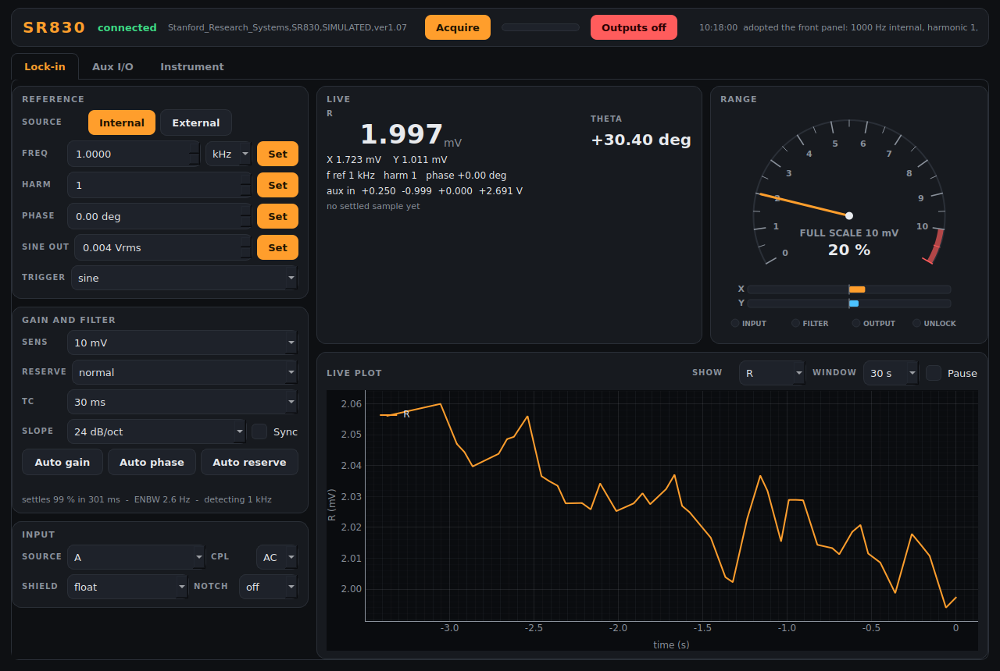

# sr830-control — Stanford Research SR830 lock-in

Lock-in module of the AaltoFlow suite for the **Stanford Research SR830 DSP
lock-in amplifier** (1 mHz – 102 kHz, GPIB). One demodulator gives **X, Y, R,
θ**; the rear panel adds **AUX IN 1–4** and **AUX OUT 1–4**, the front panel
the **SINE OUT** reference output.



The window has three tabs under a shared strip (connection, **Acquire** and
the last settled sample, the latest message):

| tab | what is on it |
|---|---|
| **Lock-in** | reference (internal / external, frequency, harmonic, phase, sine out, trigger), gain and filter (sensitivity, reserve, time constant, slope, sync filter, **Auto gain / phase / reserve**), input; live R, θ, X, Y; the **range meter**; a live plot of R, X & Y or θ |
| **Aux I/O** | AUX IN 1–4: live values, min/max/mean over the plot window, the settled sample, one plot; AUX OUT 1–4 setpoints |
| **Instrument** | connection, every setting (Apply / Revert / Load / Save), the log |

The **range meter** is an analogue needle showing R as a fraction of the
sensitivity, with a red band above full scale, the SR830's two X / Y bar
graphs and its INPUT / FILTER / OUTPUT overload and UNLOCK lamps: "is my range
right?" at a glance.

Service ports **5599 / 5600**. Runs in **simulation** by default; the real
instrument needs `--real` (below).

## Run it

```powershell
cd sr830-control
.\dev.ps1 sync --extra gui                   # add --extra real on the lab PC
.\dev.ps1 run scripts/run_gui.py             # GUI with its own simulated SR830
.\dev.ps1 run scripts/run_service.py         # the service (simulated)
.\dev.ps1 run scripts/run_gui.py --connect localhost
.\dev.ps1 run scripts/sr830_console.py       # raw-protocol console: tc 30 ms, sens 10 mV, autogain, acquire
.\dev.ps1 run scripts/smoke_test.py
.\dev.ps1 run pytest -q
```

(`dev.ps1` keeps the environment out of OneDrive; plain `uv` works the same on
a local disk.)

## Live reading vs. acquired sample — the one idea to understand

A lock-in output is low-pass filtered, so after anything changes (field,
position, the time constant itself) it needs several time constants to settle:
99 % takes 5 τ at 6 dB/oct but 10 τ at 24 dB/oct (the manual's "wait time").

* **live** values update continuously (`poll_hz`, default 20 Hz) — right for
  watching the panel, **wrong for a scan point**.
* **`acquire`** returns an id at once, waits the settling time computed from
  the **applied** time constant and slope (plus one period of the detection
  frequency when the synchronous filter is on), optionally averages over
  `average_tc` time constants, and latches a **sample** — including whether
  anything **overloaded** meanwhile. Scan detectors (`r`, `theta`, `aux1`, …,
  `overload`) read that sample; scan-core triggers and waits automatically.

The wait checks the acquisition **id** before the "done" flag, because right
after the trigger the status can still describe the previous sample.

## Discrete settings, and settings that change by themselves

Sensitivity (2 nV … 1 V, 27 ranges) and time constant (10 µs … 30 ks, 20
steps) are the SR830's fixed steps. They take their front-panel labels
(`"10 mV"`, `"30 ms"`) or a number: a time constant snaps to the nearest step,
a sensitivity **up** to the next range (so 3 mV gets 5 mV, not an overload).
In current mode (input `I1M` / `I100M`) X, Y, R are in **amps** and the ranges
read `"10 nA"`.

The SR830 also changes settings **on its own**: above 200 Hz detection
frequency it allows at most 30 s, and it cuts the time constant when the
frequency, reserve or slope change; Auto Gain and Auto Phase change the range
and the phase. The module reads the settings back after every change and when
the status byte says so, so the panel and `describe` always show what the
instrument really applied.

## Auto functions

`auto_gain`, `auto_reserve`, `auto_phase` return a run number at once; status
shows `auto_busy` until that run is finished. While one runs the SR830 executes
nothing else, so every setter is refused meanwhile, and the module only
serial-polls the instrument. Auto Phase counts as finished once the outputs
have settled on the new phase. All three can run as **scan routines**
("auto phase before the scan").

## Start-up: the front panel wins

The service changes nothing when it starts. It reads every setting (reference,
frequency, harmonic, phase, trigger, SINE OUT, input, sensitivity, reserve,
time constant, slope, sync filter, AUX OUT) and ADOPTS it: the GUI, `status`
and `describe` show what the SR830 is doing. The only commands it sends are
`OUTX 1` (replies to GPIB -- without it nothing can be read), `OVRM 1` (keep
the front panel usable) and `*CLS`. The `[reference]`, `[input]`, `[demod]`
and `[aux_out]` values of the .ini are applied only on Settings > Apply /
`set_config`, and then only the settings that differ from the instrument.

## Safety

SINE OUT cannot be switched off on an SR830; its minimum is 4 mV. When the service stops cleanly (Stop in the launcher, `shutdown`),
SINE OUT goes back to 4 mV and every AUX OUT to 0 V (`[safety]` in the config;
switch off if a setup must keep driving). A hard kill cannot do this.
`[limits]` narrows the sine and aux ranges to protect what is connected.

## Commands (wire verbs)

`set_reference_source{source}` · `set_frequency{frequency_Hz}` (internal only) ·
`set_harmonic{harmonic}` · `set_phase{phase_deg}` · `set_trigger{trigger}` ·
`set_sine_out{sine_out_V}` · `set_input_source{source}` · `set_input_ground{ground}` ·
`set_input_coupling{coupling}` · `set_line_filter{line_filter}` ·
`set_sensitivity{sensitivity}` · `set_reserve{reserve}` ·
`set_time_constant{time_constant}` · `set_slope{slope}` ·
`set_sync_filter{enabled}` · `set_aux_out{channel, volts}` ·
`auto_gain` / `auto_reserve` / `auto_phase` → `{auto_id}` ·
`acquire` → `{acq_id}` · `get_sample` ·
`stream_start` / `stream_read` / `stream_stop` (fly scans: X, Y, R, θ and the
four aux inputs, with each channel's lag order × τ) ·
plus the universal `status`, `info`, `describe`, `get_config`, `set_config`,
`shutdown`.

## The real instrument

`--real` drives it over GPIB through **pyvisa** (`uv sync --extra gui --extra
real`) and needs a VISA library with a GPIB driver on the PC (NI-VISA +
NI-488.2). Default resource `GPIB0::8::INSTR` (the SR830's factory address);
override with `--resource` or `hardware.resource`. Every command is from the
manual's chapter 5; what the manual leaves open is marked `# VERIFY` in
`src/sr830/backends/visa_sr830.py`. Not yet run on the instrument.
