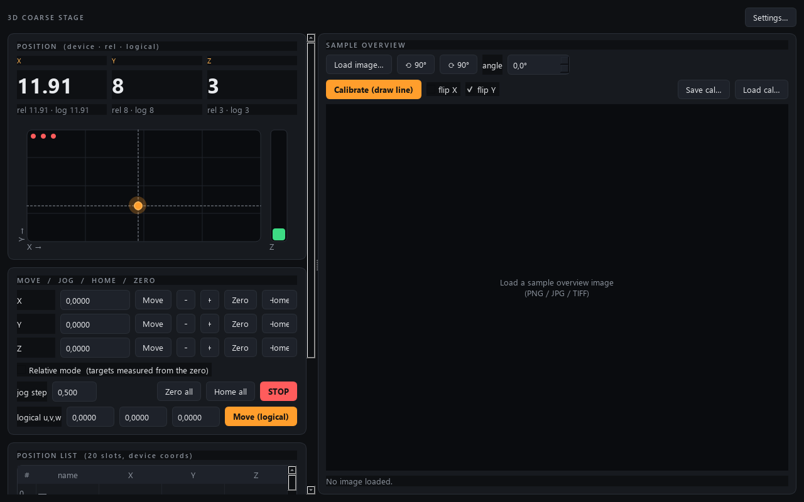

# stage-control

Control module for a **3D coarse stage** — three stepper motors driven by a
Thorlabs **BSC203** benchtop controller — built to the AaltoFlow
instrument blueprint (`INSTRUMENT_MODULE_GUIDE.md`). It is the *set-and-forget*
sibling of `smb-control`: you command target positions and the BSC203 servos
the motors there; there is no control loop.

It is instrument **#2** in the suite, so it uses **command port 5559** and
**status port 5560** (rule: `cmd = 5555 + 2n`, `pub = cmd + 1`).



*Three axes driven to (12, 8, 3) mm. The travel map on the left is the device frame; the sample-overview pane on the right is the separate pixel-to-stage image calibration.*

## What it does

- Control 3 motors (X, Y, Z). Coarse motion only — no scanning.
- **Home** each axis (or all).
- Set per-axis **velocity** and **acceleration**.
- A **20-slot position list**: capture the current position into a slot, jump
  back to it, and **save/load** the whole list to a JSON file.
- A **visual front panel** (PySide6) with live read-outs and a top-down XY map
  + Z bar indicator.
- Per-axis user **offsets** and a user-defined **2×2 coordinate transform** on
  the XY plane (logical ↔ device coordinates).
- **Relative movement mode**: "Zero" sets the current position as a per-axis
  origin; the panel then shows a relative read-out and a relative move targets a
  value measured from that zero (independent of the offset/transform frame).
- **Sample-overview navigation**: load an overview image (PNG/JPG/TIFF), rotate
  it to align with the stage, draw a line of known length to set the scale (the
  line's start point is pinned to the current stage position), then **click the
  picture to drive the stage there** — clamped to the travel limits, which are
  drawn on the image as a rectangle.
- **Settings live in a separate window** (a "Settings…" button), including the
  travel limits; changes are pushed to the controller on OK.
- **Remote control** over ZeroMQ: read/set individual motor positions and
  read/set the transform matrix (plus everything else the GUI can do).

## Architecture (same as every module in the suite)

One **service** process owns the stage (or its simulator) and is the single
source of truth. GUIs, the console, and a coordinator are **clients** that talk
to it over ZeroMQ — identical code whether local or across the lab Ethernet.

```
backends/  base.py (Protocol) · sim.py (default, no hardware) · kinesis.py (real, lazy pylablib)
stage.py   the "brain": clamps to limits, coordinate math, position list
net/       protocol.py (ports/topics/serialisation) · service.py · client.py
apps/      theme.py · gui.py (MainWindow + StageIndicator) · settings_dialog.py
scripts/   run_service.py · run_gui.py · stage_console.py · smoke_test.py
```

## Install

Uses **uv** + the **src layout**.

```bash
uv sync                 # core (pyzmq)
uv sync --extra gui     # add PySide6 for the front panel
```

The Thorlabs driver (`pylablib`) is **commented out** in `pyproject.toml` until
you are on the lab PC — the simulator needs none of it. Uncomment it there and
`uv sync` again.

## Run

The GUI has two panes: operation controls on the left (read-outs, move/jog/home/
zero, position list, log) and the sample-overview image on the right. All
configuration — velocities, **travel limits**, offsets, the 2×2 transform,
hardware — is in the **Settings…** window, not the main panel.

```bash
# 1) start the service (simulator by default)
uv run python scripts/run_service.py            # --real for the BSC203

# 2) open the front panel
uv run python scripts/run_gui.py                # local sim brain, no service needed
uv run python scripts/run_gui.py --connect 127.0.0.1   # attach to the service
uv run python scripts/run_gui.py --real         # local, drive the real BSC203

# 3) poke it by hand
uv run python scripts/stage_console.py
stage> move_axis X 5
stage> set_matrix 0 -1 1 0
stage> get_matrix
```

## Remote-control quick reference

Commands are JSON over a REQ/REP socket on port 5559; every reply is
`{"ok": true, ...}` or `{"ok": false, "error": ...}`. Status is published on
5560 at ~8 Hz.

| intent                         | command |
|--------------------------------|---------|
| read all positions/state       | `{"cmd":"status"}` → `status.position` (device) + `status.logical` |
| set one motor position         | `{"cmd":"move_axis","axis":"X","position":5.0}` |
| read the transform matrix      | `{"cmd":"get_matrix"}` → `[m00,m01,m10,m11]` |
| set the transform matrix       | `{"cmd":"set_matrix","matrix":[0,-1,1,0]}` |
| set offset / velocity / accel  | `set_offset` / `set_velocity` / `set_acceleration` (each `{axis,value}`) |
| zero here / clear zero         | `{"cmd":"set_zero"}` (all) or `{"axis":"X"}` · `clear_zero` |
| relative move (from the zero)  | `{"cmd":"move_relative","axis":"X","value":5.0}` |
| home / stop                    | `{"cmd":"home"}` (all) or `{"axis":"Y"}` |
| position list                  | `store_position` / `goto_position` / `save_positions` / `load_positions` |

Axes accept `"X"/"Y"/"Z"` or `0/1/2`.

## Coordinate model

- **device** coordinates = raw motor positions the controller uses (authoritative).
- **logical** coordinates = a user frame: `device_xy = M · [u,v] + offset`,
  `device_z = w + off_z`. Identity `M` (the default) means logical == device
  minus offsets. Saved positions store **device** coordinates, so "go to" is
  deterministic regardless of the current offset/transform.
The transform matrix is **validated everywhere**: `set_matrix` refuses a
singular / non-invertible matrix (and keeps the previous one), a matrix arriving
from an INI file or a remote `set_config` is sanitised back to identity on
apply, and the device→logical inversion has a final identity fallback — so no
code path can divide by zero. The test uses a *relative* determinant floor, so
legitimate small-scale matrices like `diag(1e-3, 1e-3)` are accepted while
`[[1,1],[1,1]]` is rejected.

- **relative** coordinates = `device − rel_origin`, a quick "zero here" working
  frame kept separate from the logical frame. `Zero` sets `rel_origin` to the
  current position; a relative move to `V` goes to `rel_origin + V` (clamped).

## Tests

All offline — no hardware, no display needed.

```bash
uv run --extra gui pytest -q
uv run python scripts/smoke_test.py
```

## Hardware notes (read before first real run)

`backends/kinesis.py` is the **only** file that touches pylablib, and it imports
it lazily inside `open()`. Two things to confirm against your installed pylablib
version, both marked in that file:

1. **Serial + channels.** Set `Hardware.serial` to your BSC203's Kinesis serial
   (`70…`) and map `ch_x/ch_y/ch_z` to the bays. The code opens one
   `KinesisMotor((serial, channel), scale="stage")` per axis; if your pylablib
   wants a single multi-channel handle instead, switch to "style B" (sketched in
   the file).
2. **Units.** `scale="stage"` makes pylablib load the mounted actuator's
   calibration so positions are in mm. Verify travel limits in `config.py`
   (`Limits`) match your actuators before enabling motion.

## Troubleshooting

**OneDrive venv gotcha.** This project lives in OneDrive, which locks files
inside `.venv` as it syncs and makes `uv` die with *"Access is denied (os error
5)"*. Fix once per machine by putting the venv **off** OneDrive:

```powershell
[Environment]::SetEnvironmentVariable('UV_PROJECT_ENVIRONMENT', "$env:LOCALAPPDATA\uv-venvs\stage-control", 'User')
$env:UV_PROJECT_ENVIRONMENT = "$env:LOCALAPPDATA\uv-venvs\stage-control"
uv sync
```
