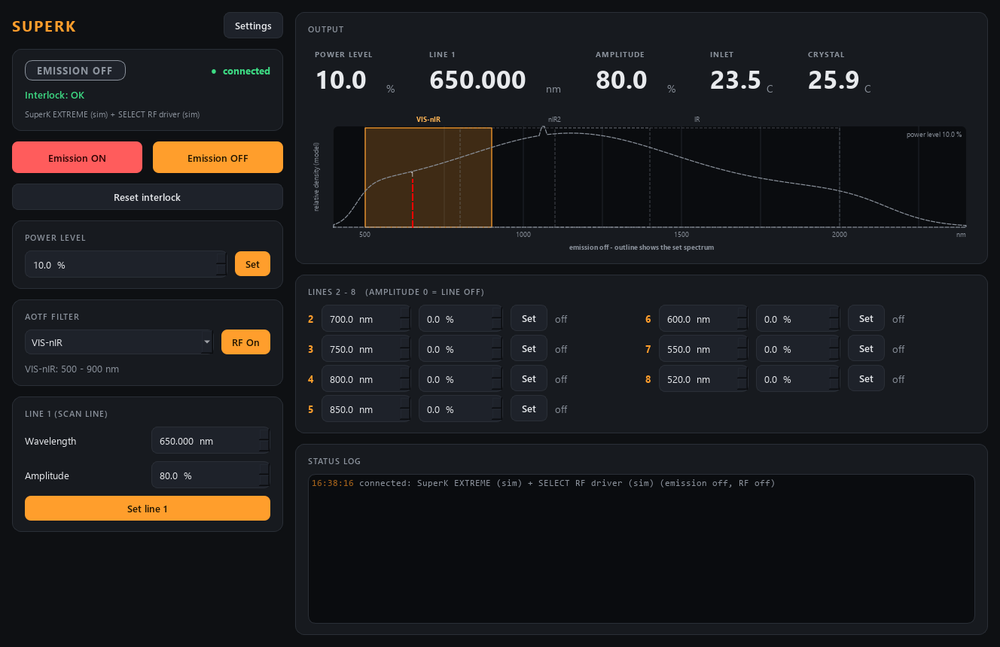

# superk-control

Control for an **NKT Photonics SuperK EXTREME** supercontinuum (white-light)
laser with **SuperK SELECT** acousto-optic tunable filters (AOTF): switch the
emission, set the power level, choose the AOTF crystal, and tune up to **8
lines** (wavelength + RF amplitude each) -- through NKT's SDK (`NKTPDLL.dll`),
or fully simulated with no hardware.



*The simulated laser as it is left: emission off, RF off. The spectrum indicator shows the
white-light envelope (dashed = not emitting), the tuning windows of the three
crystals (the active one lit) and each line at its wavelength, in its own
colour, as tall as the model says it is bright.*

> **CLASS 4 LASER.** Starting the service or a GUI never switches emission on.
> Starting it changes nothing at all: the service READS the laser (emission,
> interlock, RF, power level, crystal, all 8 lines) and adopts that state --
> a laser left emitting is shown as emitting, not switched off. The one
> possible start-up write is arming the laser's watchdog, and only if its
> value differs from `hardware.watchdog_s`.
> **Lost client:** a remote GUI that switches emission on owns it and pings
> every second; if it falls silent for `hardware.client_timeout_s` (5 s), the
> service switches emission off. A scan routine (no owner) is never cut.
> `Emission ON` asks for confirmation (GUI, console) or is flagged `danger`
> (describe), and is **refused while the interlock is not OK**. Stopping the
> service switches RF and emission off; the laser's own watchdog switches
> emission off if the service is killed.

## The lab system

| part | what it does |
|---|---|
| SuperK EXTREME EXW-12 | the white-light source, ~400-2400 nm |
| SuperK SELECT (VIS-nIR / nIR2) | two AOTF crystals, 500-900 nm and 800-1400 nm |
| SuperK SELECT2 (- / IR) | one AOTF crystal, 1100-2000 nm |
| one SELECT RF driver | drives ONE crystal at a time, 8 RF channels = 8 lines |

Because there is one RF driver, the crystal is a **selection**: the allowed
wavelength of every line is the active crystal's range, and it changes when you
switch (the `describe` manifest's revision moves with it, so a control panel or
scan-core re-reads the limits).

## Ports

| service | commands (REP) | status (PUB) |
|---|---|---|
| **superk** | **5611** | **5612** |

## Run it

```powershell
cd superk-control
.\dev.ps1 sync --extra gui
.\dev.ps1 run pytest -q
.\dev.ps1 run scripts/run_service.py                 # simulated
.\dev.ps1 run scripts/run_service.py --real --port COM5
.\dev.ps1 run scripts/run_gui.py --connect localhost
.\dev.ps1 run scripts/superk_console.py status
.\dev.ps1 run scripts/smoke_test.py
```

The real backend needs **no pip package**: install the NKT SDK (it sets
`NKTP_SDK_PATH`) or point `hardware.dll_path` at `NKTPDLL.dll`. A
`superk.ini` next to this README is loaded by the service automatically (it is
gitignored: it holds this PC's COM port).

## Verbs

Universal: `status`, `info`, `get_config`, `set_config`, `describe`, `shutdown`.

| verb | arguments | notes |
|---|---|---|
| `set_emission` | `on`, `owner` (optional) | on is refused unless the interlock reads OK; `owner` = a client id arms the lost-client guard |
| `emission_on` / `emission_off` | -- | the describe actions (on = danger); no owner = no guard |
| `ping` | -- | heartbeat; every message may carry `client` (id) |
| `reset_interlock` | -- | acknowledge a closed interlock; never switches emission on |
| `set_power` | `power_pct` | clamped to `limits.power_max_pct` (default 50 %) |
| `set_rf` | `on` | AOTF RF drive |
| `set_filter` | `filter` | crystal name; RF paused while switching, lines re-clamped |
| `set_wavelength` | `line` (1..8), `wavelength_nm` | clamped to the crystal |
| `set_amplitude` | `line`, `amplitude_pct` | 0 % = line off |
| `set_line` | `line`, `wavelength_nm`, `amplitude_pct` | both at once |

A reply means **accepted**; the status stream shows the hardware's readback
(`wavelength_nm[i]`, `power_pct`, `emission_on`, ...), which is what a scan waits
for (settle policy `echoes`, with an `index` for the per-line lists).

## In a scan

`superk.wavelength_1` is the natural scan axis (a wavelength sweep within the
active crystal); `amplitude_n`, `power` and the other lines are controls too.
`emission_on` / `emission_off` can run in a scan routine: their `wait` block
waits until the laser *reports* emission (or its absence).

## Layout

```
src/superk/
  config.py          Startup / Limits / Filters / Hardware / UI + .ini save/load
  model.py           supercontinuum envelope + AOTF passband/efficiency (sim, GUI)
  backends/
    base.py          SupercontinuumBackend Protocol
    sim.py           SimulatedSuperK -- registers, interlock, warm-up, quantisation
    nktp.py          NktpSuperK -- NKTPDLL.dll via ctypes (the ONLY vendor file)
  laser.py           SuperK brain: safety, clamps, crystal selection, poll thread
  net/               protocol, service, client, describe
  apps/              gui (SpectrumIndicator), settings_dialog, theme
scripts/             run_service, run_gui, superk_console (raw pyzmq), smoke_test
tests/               config, brain, describe, network, GUI smoke (offline)
```

## Registers used (real backend, all `# VERIFY`)

Checked against NKT's *SDK Instruction manual* (sections 6.8-6.10) and the
SDK's register files 60/66/67; still unconfirmed on OUR laser, hence `# VERIFY`.

| module | register | meaning |
|---|---|---|
| EXTREME | 0x30 | emission, U8: 0 off / 3 on |
| EXTREME | 0x32 | interlock, U16: write 1 = reset, read LSB = state |
| EXTREME | 0x36 | watchdog, U8 seconds |
| EXTREME | 0x37 | power level, U16 in 0.1 % |
| EXTREME | 0x66 / 0x11 | status bits / inlet temperature (0.1 C) |
| RF driver | 0x30 | RF power on/off |
| RF driver | 0x75 | connected crystal, READ-ONLY (1, 2 = first SELECT; 3, 4 = second) |
| SELECT housing | 0x34 | RF switch: which of its two crystals the RF reaches (RF must be off) |
| RF driver | 0x34 / 0x35 | min / max wavelength of the crystal (pm) |
| RF driver | 0x90-0x97 | wavelength of line 1-8 (pm) |
| RF driver | 0xB0-0xB7 | amplitude of line 1-8 (0.1 %) |

**Choosing a crystal.** The one RF driver cannot be told "drive crystal N":
inside a SELECT housing the crystal is chosen with that housing's RF switch,
and a crystal in the OTHER housing is reached only by moving the RF cable by
hand. `set_filter` switches RF off, uses the RF switch, and checks the
driver's "connected crystal" readback; if the wanted crystal is still not
connected it refuses with "move the RF cable to SuperK SELECT #n" and leaves
the RF off. The crystal table (`filters.crystal`, default `1,2,4`) uses NKT's
numbering: VIS-nIR = 1, nIR2 = 2 (SELECT), IR = 4 (slot 2 of SELECT2).
