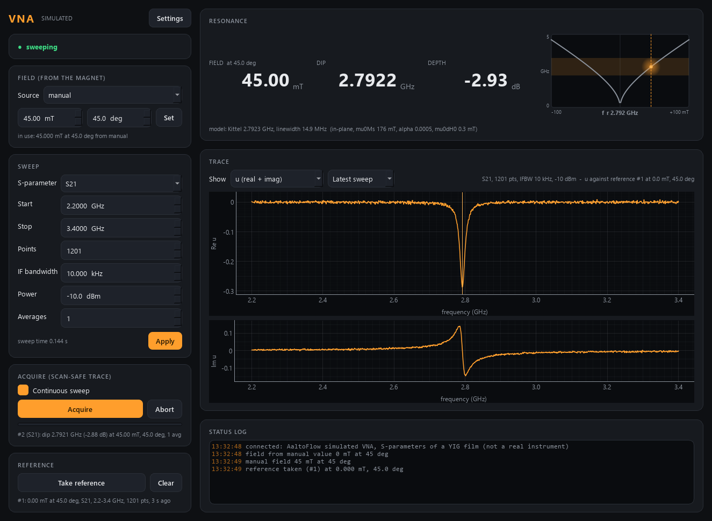

# vna-control -- Keysight PNA-X N5222A (or a simulator of one)

A two-port vector network analyser for **VNA-FMR**: complex S-parameter traces
against the field of a magnet service, and the permeability-like quantity

    u = (S - S_ref) / S_ref

relative to a **reference** trace taken where the sample does not resonate in
the band. It drives the real **Keysight PNA-X N5222A** over VISA (`--real`), or
simulates one: S-parameters through a coplanar waveguide with a YIG film whose
FMR follows the field the magnet service measures.



*(simulator: reference at 0 mT, then 45 mT at 45 deg -- Re u shows the absorption
line, Im u the dispersion.)*

Ports **5573 / 5574**.

> **The real backend has not run on the instrument yet.** Every SCPI line that
> still needs checking on the N5222A is marked `# VERIFY` in
> `src/vna/backends/pna.py`.

## Run

```powershell
cd vna-control
uv sync --extra gui                              # simulator only
uv sync --extra gui --extra real                 # + pyvisa, for the PNA-X
uv run scripts/run_service.py                    # simulator, field from mag2d on this PC
uv run scripts/run_service.py --real             # the PNA-X at VISA alias "N5222A"
uv run scripts/run_gui.py --connect localhost
uv run scripts/vna_console.py acquire
```

**`uv sync` removes extras you do not name.** On the PC with the analyser always
sync with `--extra gui --extra real`; otherwise `--real` stops with "pyvisa is
not installed". pyvisa also needs a VISA library (Keysight IO Libraries or
NI-VISA) -- `--visa "TCPIP0::<ip>::hislip0::INSTR"` if the alias is not set up.

The field is **read** (never commanded) from a magnet service, in both modes:

| `--field` | reads | angle |
|---|---|---|
| `mag2d` (default) | the vector magnet's `measured_bx_mT`, `measured_by_mT` | atan2(By, Bx) |
| `clMag` | `measured_field_mT` | 0 |
| `manual` | `--field-mT`, `--angle-deg` | as given |

A magnet that is silent (or never heard) is not trusted: the sample says
`field_ok = False`, shown in red.

## The reference and u

1. Go to a field where the line is out of the band (for example 150 mT at 45 deg).
2. **Take reference** (GUI REFERENCE card, console `ref`, verb `take_reference`):
   an acquisition exactly like `acquire`, whose result is also kept as the reference.
3. Measure: every trace can now be shown as **Divided by reference** (S/S_ref)
   or as **u** (real and imaginary).

u is **refused** -- with a message saying what differs -- when there is no
reference, or it was taken with another S-parameter, start, stop or point count.
Aborting a reference also clears the old one, so a scan never divides by a stale
reference by accident.

In a scan (scan-core), `take_reference` and `clear_reference` are **actions** a
routine can run before the scan, and the detectors are:

| detector | what |
|---|---|
| `vna.s` | the complex S-parameter (`s_real`/`s_imag`), dim `vna.freq` in GHz |
| `vna.u` | u against the reference, same dim |
| `vna.dip_freq`, `vna.dip_depth` | the dip in the averaged trace |
| `vna.sweep_field`, `vna.sweep_angle`, `vna.sweep_field_ok` | the field the sweep saw |

All from ONE sweep per scan point (one acquire group).

A field map from two live services (start clMag and vna first):

```powershell
cd ..\scan-core
uv run python run_vna_demo.py                    # -90..90 mT x 801 points -> out/vna_fmr_map.nc + .png
```

## The simulator's data

- `s` is **raw**: line loss rising as sqrt(f), connector ripple, 2.5 ns of
  electrical delay (the phase wraps a dozen times), noise that follows IFBW,
  source power and averaging -- plus the FMR line. S12 = S21; S11/S22 are small
  reflections that also see the film.
- Resonance: Kittel, in-plane `f = (gamma/2pi) sqrt((H + Hk cos 2d)(H + Ms + Hk cos^2 d))`
  with `d` the angle between field and easy axis (`hk_mT = 0` by default: plain
  `sqrt(H (H + Ms))`), or out-of-plane `f = (gamma/2pi)(H - Ms)`;
  mu0 Ms = 176 mT, gamma/2pi = 28 GHz/T.
- Linewidth: Gilbert `alpha` (5e-4) plus inhomogeneous `mu0 dH0` (0.3 mT): about
  15 MHz at 3 GHz. Use enough points (the default 1601 over 1-6 GHz is 3 MHz).
- Every sample and line parameter is a live setting (Settings, or `set_sample`),
  so "what does twice the damping look like" is a scan axis.

## Tests

```powershell
uv run pytest -q          # 93 tests, offline (the PNA-X backend against a fake VISA resource)
uv run scripts/smoke_test.py
python ../tools/check_modules.py vna --live
```
