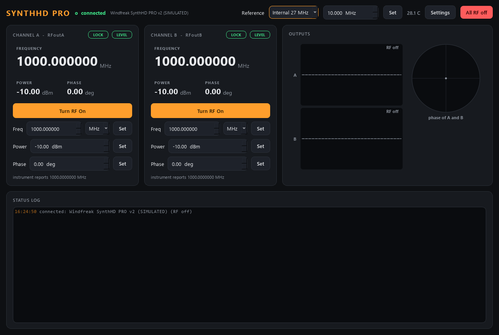

# windfreak-control

Control for a **Windfreak Technologies SynthHD PRO v2**, a two-channel RF
synthesizer (10 MHz - 24 GHz, up to +20 dBm): switch each output (RFoutA,
RFoutB) on and off, set its **frequency**, **power** and **phase**, and pick the
**reference** both PLLs lock to -- over the instrument's USB virtual COM port,
or fully simulated with no hardware.



*The start state: both outputs OFF, as always at start-up. With RF on, the
Outputs pane draws each channel as a wave (more cycles = higher frequency,
taller = more power) and the dial on the right shows the two phases; with both
channels at the same frequency it reads B - A directly (a quadrature pair is a
90 deg dial). An unlocked PLL draws a ragged red trace.*

Light theme: [`windfreak-light.png`](../front-panels/windfreak-light.png).

It is an AaltoFlow module like every other: a thin backend behind a `Protocol`
interface, a small brain, a ZeroMQ service + client on the suite's wire
contract, a `describe` manifest so scan-core can sweep it without knowing
anything about it, and a Qt front panel.

## Ports

Commands 5583 (REQ/REP), status 5584 (PUB) -- declared in `module.toml`, and
overridable per PC in the launcher.

## Layout

```
windfreak-control/
  module.toml            how the suite finds this module
  src/windfreak/
    config.py            Channel (x2) / Reference / Limits / Hardware / UI + .ini save/load
    synthesizer.py       the brain: desired state, clamps, ONE worker thread, status snapshot
    sim_system.py        build_sim_system(): brain + simulated SynthHD
    backends/base.py     the DualSynth interface (a typing.Protocol)
    backends/sim.py      a simulated SynthHD PRO v2 (grid, lock, leveling, temperature)
    backends/synthhd.py  the real one over USB serial -- the ONLY file importing pyserial
    net/protocol.py      ports, topics, config <-> dict
    net/service.py       WindfreakService (REP + PUB threads)
    net/client.py        WindfreakClient (same methods as the brain)
    net/describe.py      the parameter manifest
    apps/gui.py          front panel + the DualToneIndicator
    apps/settings_dialog.py, apps/theme.py
  scripts/  run_service.py  run_gui.py  windfreak_console.py  smoke_test.py
  tests/    config, synthesizer, backend command strings, net, describe, GUI smoke, theme
```

## Commands used (real backend)

Windfreak's own one-character protocol (API guide v1.0b), **no line
terminator** on what we send, `\n` on every reply:

| what | command | notes |
|---|---|---|
| select channel | `C0` / `C1` | A / B; re-sent before every per-channel command |
| frequency | `f<MHz>`, `f?` | 0.1 Hz steps, snapped to the channel spacing |
| power | `W<dBm>` | the unit levels it; `V` = 1 if it managed |
| phase | `~<deg>` | a phase **step** (relative); the backend turns absolute into steps |
| output on | `E1r1h1` | PLL on, amplifier on, unmuted |
| output off | `h0r0` (or `h0r0E0`) | muted + amplifier off (+ PLL off in the "quiet" mode) |
| lock | `p` | 1 = locked |
| reference | `x0/x1/x2`, `*<MHz>` | external / internal 27 MHz / internal 10 MHz |
| temperature | `z` | degC |

Every call not yet confirmed on the v2 hardware is marked `# VERIFY` in
`backends/synthhd.py`.

## Setup

```powershell
cd windfreak-control
.\dev.ps1 sync --extra gui                 # simulator + GUI
.\dev.ps1 sync --extra gui --extra real    # + pyserial for the instrument
```

`dev.ps1` keeps the virtual environment in `%LOCALAPPDATA%\uv-venvs\windfreak-control`,
outside OneDrive (which locks files inside a `.venv` and makes `uv` fail with
"Access is denied"). Name every extra you want: `uv sync` removes the ones you
leave out.

## Run

```powershell
.\dev.ps1 run scripts/run_service.py                  # simulated
.\dev.ps1 run scripts/run_service.py --real --port COM4
.\dev.ps1 run scripts/run_gui.py --connect localhost  # the panel, on the service
.\dev.ps1 run scripts/run_gui.py                      # a private local simulation
.\dev.ps1 run scripts/windfreak_console.py            # raw-protocol console
    wf> freq a 2.5 GHz
    wf> freq b 2.5 GHz
    wf> phase b 90
    wf> rf a on
    wf> rf b on
    wf> status
    wf> alloff
```

The service always starts with **both outputs off**, and switches them off
again on `shutdown`, on Ctrl-C and when the GUI of a local simulation closes.

## What a scan sees (`describe`)

Per channel, flat ids: `a_rf_on`, `a_frequency` (MHz), `a_power` (dBm),
`a_phase` (deg) as controls; `a_locked`, `a_leveled`, `a_frequency_actual` as
indicators -- and the same with `b_`. Plus `reference` (enum),
`ext_ref` (a control only while the external reference is selected),
`ref_settled`, `rf_all_off`, `temperature`, and the action `all_rf_off` (usable in a scan
routine).

**Settle rule:** every channel control is `adopt_then_flag`: wait until the
service echoes the value it pushed (`a_frequency_Hz`), then until
`a_settled` -- that request is the latest one sent AND, while the output is
on, the PLL reports lock. So a scan never records a point on a synthesizer
that has not been programmed yet or is not locked; with the external
reference missing it times out with a message instead of measuring. Switching
an output OFF settles as soon as it is done, lock or not (the safe action
never hangs). The action `all_rf_off` waits for the status flag `rf_all_off`,
i.e. until both outputs really are off in the instrument.

## Tests

```powershell
.\dev.ps1 run pytest -q            # 52 tests, offline, ports 17020-17039
.\dev.ps1 run python scripts/smoke_test.py
python ..\tools\check_modules.py windfreak --live
```

## Using it from Python

```python
from windfreak.net.client import WindfreakClient
wf = WindfreakClient("localhost")
wf.set_frequency("a", 2.5e9); wf.set_frequency("b", 2.5e9)
wf.set_phase("b", 90.0)
wf.set_rf("a", True); wf.set_rf("b", True)
st = wf.status()          # {"a_locked": True, "b_phase_deg": 90.0, ...}
```

A reply means *accepted*, not done: poll `status()` until the echo matches and
`a_settled` is true (scan-core does exactly that from the manifest).
